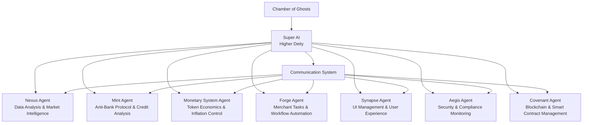
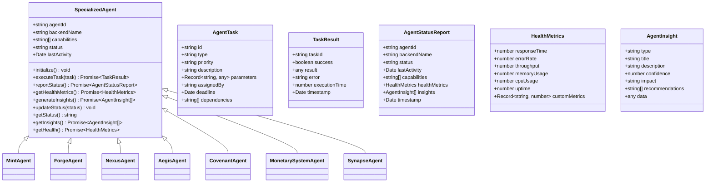
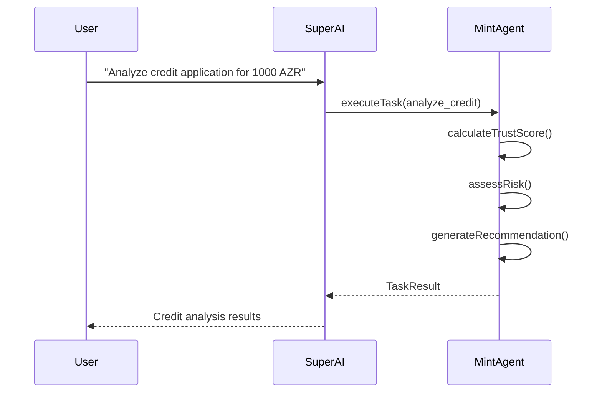
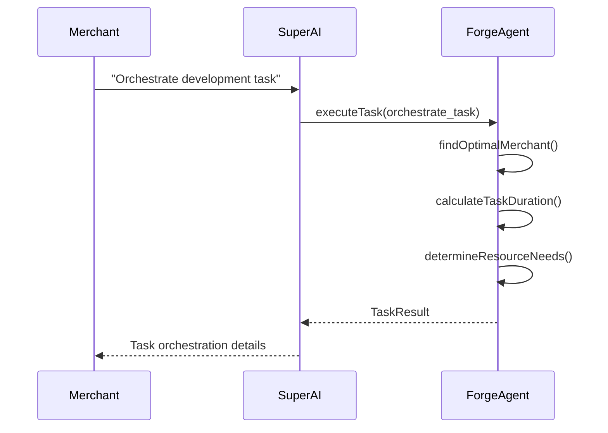
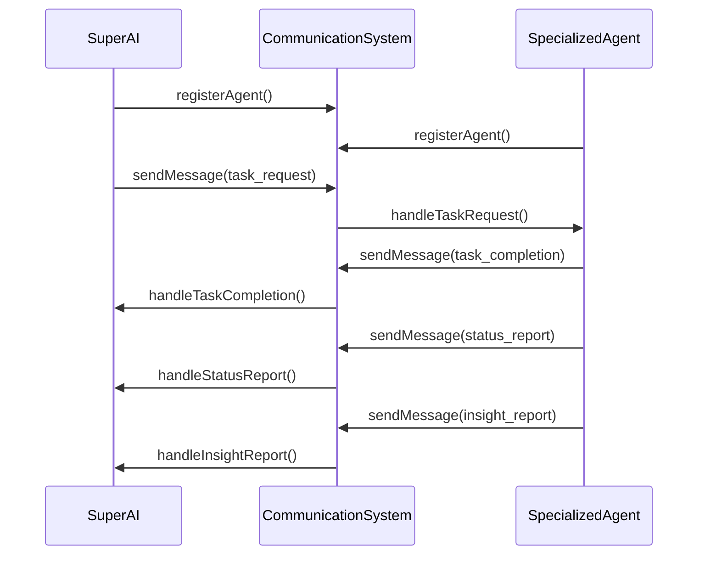
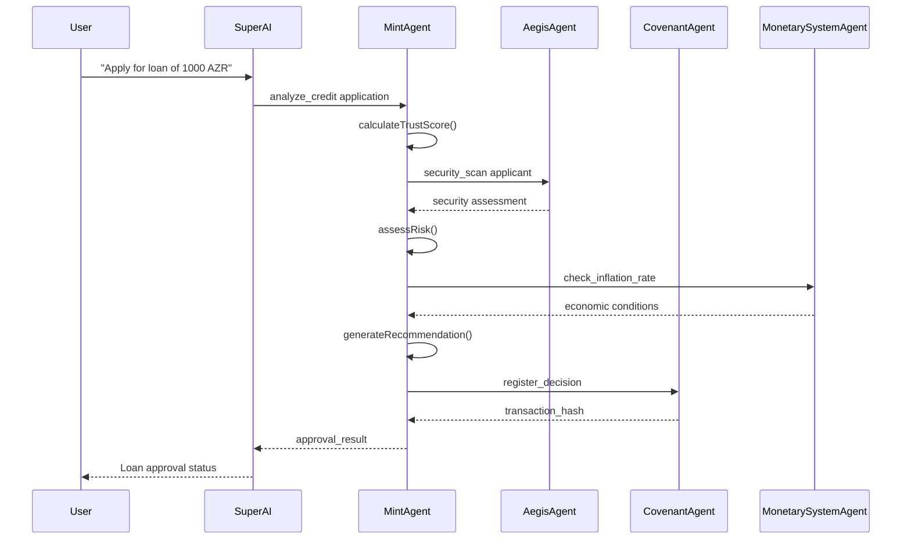
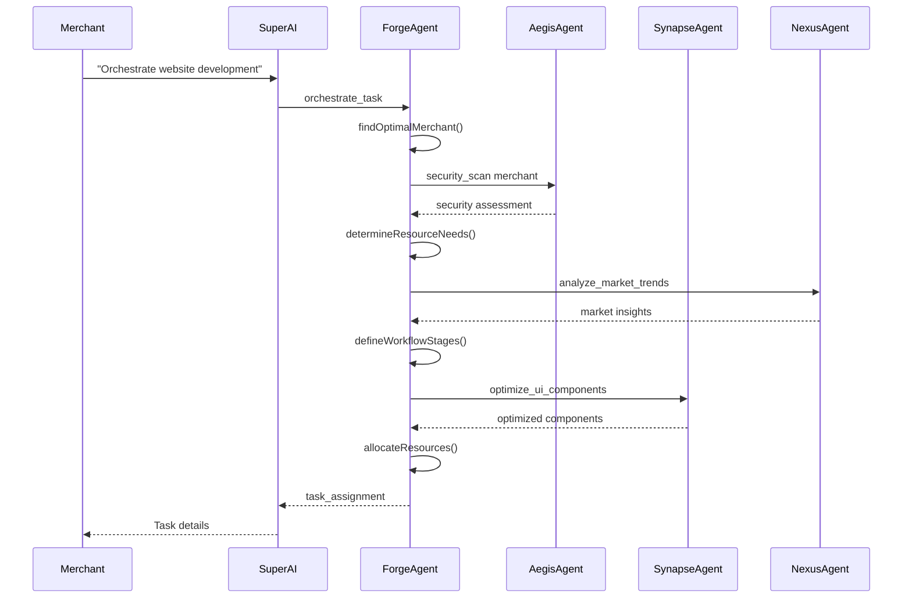
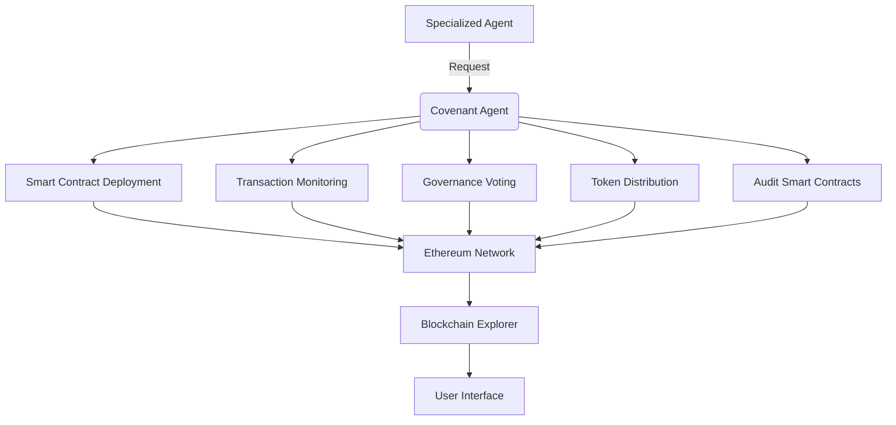
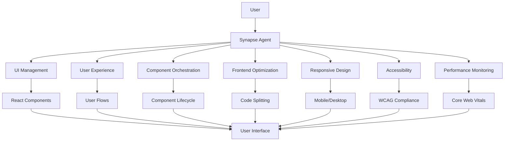
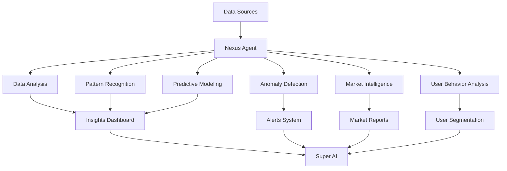

# AI Agent Hierarchy

<cite>
**Referenced Files in This Document**   
- [base-agent.ts](file://genome/ai-hierarchy/specialized-agents/base-agent.ts)
- [mint-agent.ts](file://genome/ai-hierarchy/specialized-agents/mint-agent.ts)
- [forge-agent.ts](file://genome/ai-hierarchy/specialized-agents/forge-agent.ts)
- [agent-communication.ts](file://genome/ai-hierarchy/communication/agent-communication.ts)
- [super-ai.ts](file://genome/ai-hierarchy/super-ai/super-ai.ts)
- [README.md](file://genome/ai-hierarchy/README.md)
</cite>

## Table of Contents
1. [Introduction](#introduction)
2. [Architecture Overview](#architecture-overview)
3. [Base Agent Implementation](#base-agent-implementation)
4. [Specialized Agents](#specialized-agents)
5. [Communication Protocols](#communication-protocols)
6. [Agent Collaboration Workflows](#agent-collaboration-workflows)
7. [System Integration](#system-integration)
8. [Agent Coordination Challenges](#agent-coordination-challenges)
9. [Creating New Agents](#creating-new-agents)
10. [Conclusion](#conclusion)

## Introduction

The AI Agent Hierarchy in Azora OS represents a sophisticated multi-layered architecture designed to coordinate specialized AI agents across various domains. This system implements a hierarchical structure with a Super AI (Higher Deity) that orchestrates specialized agents (Angels), each dedicated to specific backend systems and functional domains. The architecture enables fully interactive AI assistance through voice and text commands while maintaining strategic oversight across the entire ecosystem.

The system integrates temporal intelligence from the Chamber of Ghosts for historical analysis, real-time calibration, and future simulation. This comprehensive approach allows for strategic decision-making, task assignment, and seamless coordination between agents, creating a cohesive and intelligent operating system for decentralized applications and services.

**Section sources**
- [README.md](file://genome/ai-hierarchy/README.md#L1-L334)

## Architecture Overview

The AI Agent Hierarchy follows a clear hierarchical structure with a central Super AI coordinating specialized agents across different domains. This architecture enables efficient task distribution, strategic oversight, and seamless inter-agent communication.



**Diagram sources**
- [README.md](file://genome/ai-hierarchy/README.md#L1-L334)
- [index.ts](file://genome/ai-hierarchy/index.ts#L1-L127)

The Super AI serves as the central orchestrator, compiling insights from all specialized agents, integrating temporal intelligence from the Chamber of Ghosts, making strategic decisions, and assigning tasks. Each specialized agent is domain-specific and handles backend operations for its respective area, reporting status and insights back to the Super AI.

This hierarchical structure enables the system to provide fully interactive AI assistance in the main application, supporting both voice and text commands for real-time interaction. The communication system facilitates inter-agent messaging with priority levels, status reporting, insight sharing, task assignment, and real-time alerts.

**Section sources**
- [README.md](file://genome/ai-hierarchy/README.md#L1-L334)
- [index.ts](file://genome/ai-hierarchy/index.ts#L1-L127)

## Base Agent Implementation

The foundation of the AI Agent Hierarchy is the SpecializedAgent base class, which provides a standardized interface and common functionality for all domain-specific agents. This base implementation ensures consistency across agents while allowing for domain-specific customization.



**Diagram sources**
- [base-agent.ts](file://genome/ai-hierarchy/specialized-agents/base-agent.ts#L15-L167)

The SpecializedAgent class provides several key methods and properties:

- **Constructor**: Initializes the agent with a memory system, agent ID, backend name, and capabilities
- **initialize()**: Sets up the agent and prepares it for operation
- **executeTask()**: Abstract method that must be implemented by derived classes to handle specific tasks
- **reportStatus()**: Compiles and reports the agent's current status and insights to the Super AI
- **getHealthMetrics()**: Protected abstract method for retrieving backend-specific health metrics
- **generateInsights()**: Protected abstract method for generating domain-specific insights

The base class also defines several important interfaces that standardize communication and reporting across all agents. These include AgentTask for task definition, TaskResult for task outcomes, AgentStatusReport for status reporting, HealthMetrics for performance monitoring, and AgentInsight for sharing analytical findings.

All specialized agents inherit from this base class, ensuring a consistent interface while allowing for domain-specific implementations of the executeTask, getHealthMetrics, and generateInsights methods.

**Section sources**
- [base-agent.ts](file://genome/ai-hierarchy/specialized-agents/base-agent.ts#L1-L167)

## Specialized Agents

The AI Agent Hierarchy includes several specialized agents, each focused on a specific domain and backend system. These agents inherit from the SpecializedAgent base class and implement domain-specific functionality for their respective areas.

### Mint Agent

The Mint Agent handles the Anti-Bank protocol, credit analysis, and loan management functions within the azora-mint backend. It specializes in financial operations and trust-based lending mechanisms.



**Diagram sources**
- [mint-agent.ts](file://genome/ai-hierarchy/specialized-agents/mint-agent.ts#L15-L266)

The Mint Agent implements the following capabilities:
- Credit analysis and approval
- Trust scoring based on multiple factors
- Loan origination and management
- Collateral management
- Risk assessment
- Metabolic tax collection
- Anti-bank protocol operations

Key methods include:
- **analyzeCreditApplication()**: Evaluates credit applications based on trust score, risk assessment, and other factors
- **calculateTrustScore()**: Computes a trust score based on system use, code compliance, social ledger, repayment history, and value creation
- **processLoanApplication()**: Handles the complete loan processing workflow
- **manageCollateral()**: Manages collateral locking and release
- **collectMetabolicTax()**: Handles protocol fee collection

The agent generates insights on credit approval rates, metabolic tax revenue growth, and collateral utilization, providing recommendations for optimizing the lending system.

**Section sources**
- [mint-agent.ts](file://genome/ai-hierarchy/specialized-agents/mint-agent.ts#L1-L266)

### Forge Agent

The Forge Agent manages merchant tasks, service orchestration, and workflow automation within the azora-forge backend. It specializes in coordinating complex business processes and service delivery.



**Diagram sources**
- [forge-agent.ts](file://genome/ai-hierarchy/specialized-agents/forge-agent.ts#L15-L388)

The Forge Agent implements the following capabilities:
- Task orchestration
- Merchant management
- Workflow automation
- Service coordination
- Performance monitoring
- Resource allocation
- Quality assurance

Key methods include:
- **orchestrateMerchantTask()**: Assigns tasks to optimal merchants based on specialization, rating, and availability
- **manageWorkflow()**: Handles workflow progression through different stages
- **allocateResources()**: Determines and allocates necessary resources for tasks
- **monitorPerformance()**: Tracks merchant performance metrics
- **performQualityCheck()**: Conducts comprehensive quality assurance

The agent generates insights on workflow efficiency, merchant task demand, and resource contention, providing recommendations for optimizing task routing, scaling merchant capacity, and improving resource allocation.

**Section sources**
- [forge-agent.ts](file://genome/ai-hierarchy/specialized-agents/forge-agent.ts#L1-L388)

### Other Specialized Agents

The architecture includes several other specialized agents that handle different domains:

- **Nexus Agent**: Focuses on AI-driven data analysis, pattern recognition, predictive modeling, anomaly detection, market intelligence, and user behavior analysis
- **Aegis Agent**: Manages security monitoring, threat detection, compliance auditing, guardian services, access control, incident response, and risk assessment
- **Covenant Agent**: Handles blockchain operations, smart contracts, founder protocols, transaction monitoring, governance, token distribution, and network security
- **Monetary System Agent**: Manages token economics, inflation control, monetary policy, supply management, staking rewards, burn mechanisms, and price stability
- **Synapse Agent**: Manages UI components, user experience, frontend optimization, responsive design, accessibility, and performance monitoring

Each of these agents follows the same pattern as the Mint and Forge agents, inheriting from the SpecializedAgent base class and implementing domain-specific functionality through the executeTask method.

**Section sources**
- [nexus-agent.ts](file://genome/ai-hierarchy/specialized-agents/nexus-agent.ts#L1-L212)
- [aegis-agent.ts](file://genome/ai-hierarchy/specialized-agents/aegis-agent.ts#L1-L437)
- [covenant-agent.ts](file://genome/ai-hierarchy/specialized-agents/covenant-agent.ts#L1-L427)
- [monetary-system-agent.ts](file://genome/ai-hierarchy/specialized-agents/monetary-system-agent.ts#L1-L301)
- [synapse-agent.ts](file://genome/ai-hierarchy/specialized-agents/synapse-agent.ts#L1-L439)

## Communication Protocols

The AI Agent Hierarchy implements a sophisticated communication system that enables seamless interaction between the Super AI and specialized agents. This system facilitates task assignment, status reporting, insight sharing, and real-time coordination.



**Diagram sources**
- [agent-communication.ts](file://genome/ai-hierarchy/communication/agent-communication.ts#L16-L325)

The AgentCommunicationSystem class serves as the central hub for all inter-agent communication. It provides several key functions:

- **registerAgent()**: Registers specialized agents with the communication system
- **sendMessage()**: Sends messages between agents or to the Super AI
- **processMessageQueue()**: Processes messages in the queue
- **handleStatusReport()**: Processes status reports from agents
- **handleInsightReport()**: Processes insight reports from agents
- **handleTaskRequest()**: Handles task requests from the Super AI to agents
- **handleTaskCompletion()**: Handles task completion notifications
- **handleAlert()**: Handles alerts from agents
- **handleQuery()**: Handles queries between agents or to the Super AI
- **broadcastMessage()**: Broadcasts messages to all agents

The system supports several message types:
- **status_report**: For reporting agent status and health metrics
- **insight_report**: For sharing analytical insights
- **task_request**: For assigning tasks from the Super AI to agents
- **task_completion**: For reporting task completion results
- **alert**: For sending alerts and warnings
- **query**: For requesting information
- **query_response**: For responding to queries
- **broadcast**: For sending messages to all agents

The communication system uses a message queue to ensure reliable delivery and processes messages asynchronously. It also provides message storage in the memory system for persistence and analysis.

Each specialized agent uses the AgentMessenger class to interact with the communication system, simplifying common operations like reporting status, sending insights, sending alerts, querying other agents, and reporting task completion.

**Section sources**
- [agent-communication.ts](file://genome/ai-hierarchy/communication/agent-communication.ts#L1-L325)

## Agent Collaboration Workflows

The AI Agent Hierarchy enables complex collaboration workflows where multiple agents work together to accomplish sophisticated tasks. These workflows demonstrate the power of the hierarchical architecture in coordinating specialized expertise.

### Credit Application Processing Workflow

When processing a credit application, multiple agents collaborate to evaluate risk, ensure security, and manage the financial aspects:



**Diagram sources**
- [mint-agent.ts](file://genome/ai-hierarchy/specialized-agents/mint-agent.ts#L15-L266)
- [aegis-agent.ts](file://genome/ai-hierarchy/specialized-agents/aegis-agent.ts#L15-L437)
- [covenant-agent.ts](file://genome/ai-hierarchy/specialized-agents/covenant-agent.ts#L15-L427)
- [monetary-system-agent.ts](file://genome/ai-hierarchy/specialized-agents/monetary-system-agent.ts#L15-L301)

In this workflow:
1. The user requests a loan through the Super AI
2. The Super AI assigns the credit analysis task to the Mint Agent
3. The Mint Agent calculates a trust score based on multiple factors
4. The Mint Agent requests a security scan from the Aegis Agent to assess applicant risk
5. The Aegis Agent performs security checks and returns an assessment
6. The Mint Agent assesses risk based on trust score and security assessment
7. The Mint Agent checks current economic conditions with the Monetary System Agent
8. The Mint Agent generates a recommendation based on all factors
9. The Mint Agent registers the decision with the Covenant Agent for blockchain recording
10. The Mint Agent returns the approval result to the Super AI
11. The Super AI communicates the result to the user

This collaboration ensures that credit decisions consider financial, security, and economic factors, creating a comprehensive evaluation process.

### Merchant Task Orchestration Workflow

When orchestrating merchant tasks, multiple agents coordinate to ensure successful service delivery:



**Diagram sources**
- [forge-agent.ts](file://genome/ai-hierarchy/specialized-agents/forge-agent.ts#L15-L388)
- [aegis-agent.ts](file://genome/ai-hierarchy/specialized-agents/aegis-agent.ts#L15-L437)
- [synapse-agent.ts](file://genome/ai-hierarchy/specialized-agents/synapse-agent.ts#L15-L439)
- [nexus-agent.ts](file://genome/ai-hierarchy/specialized-agents/nexus-agent.ts#L1-L212)

In this workflow:
1. The merchant requests task orchestration through the Super AI
2. The Super AI assigns the orchestration task to the Forge Agent
3. The Forge Agent identifies the optimal merchant for the task
4. The Forge Agent requests a security scan from the Aegis Agent
5. The Aegis Agent performs security checks and returns an assessment
6. The Forge Agent determines resource requirements
7. The Forge Agent requests market trend analysis from the Nexus Agent
8. The Nexus Agent provides market insights
9. The Forge Agent defines workflow stages
10. The Forge Agent requests UI optimization from the Synapse Agent
11. The Synapse Agent provides optimized UI components
12. The Forge Agent allocates resources
13. The Forge Agent returns task assignment details to the Super AI
14. The Super AI communicates the details to the merchant

This collaboration ensures that merchant tasks are assigned to appropriate providers, with proper security checks, resource allocation, market awareness, and optimized user interfaces.

**Section sources**
- [mint-agent.ts](file://genome/ai-hierarchy/specialized-agents/mint-agent.ts#L1-L266)
- [forge-agent.ts](file://genome/ai-hierarchy/specialized-agents/forge-agent.ts#L1-L388)

## System Integration

The AI Agent Hierarchy integrates with various system elements to provide comprehensive functionality across the Azora OS ecosystem. These integrations enable agents to interact with blockchain transactions, user services, and other system components.

### Blockchain Integration

The Covenant Agent provides direct integration with blockchain operations, enabling agents to deploy smart contracts, monitor transactions, participate in governance, and distribute tokens:



**Diagram sources**
- [covenant-agent.ts](file://genome/ai-hierarchy/specialized-agents/covenant-agent.ts#L15-L427)

The Covenant Agent enables other agents to:
- Deploy smart contracts with automatic verification
- Monitor transactions for suspicious activity
- Participate in governance votes
- Distribute tokens through batch transactions
- Audit smart contracts for security vulnerabilities

This integration ensures that all blockchain operations are handled securely and efficiently, with proper auditing and monitoring.

### User Service Integration

The Synapse Agent integrates with user services to manage the user interface, optimize user experience, and ensure accessibility:



**Diagram sources**
- [synapse-agent.ts](file://genome/ai-hierarchy/specialized-agents/synapse-agent.ts#L15-L439)

The Synapse Agent enables:
- Dynamic UI component management
- Enhanced user experience through progressive disclosure and contextual navigation
- Efficient component orchestration
- Frontend optimization through code splitting and lazy loading
- Responsive design for multiple device types
- Accessibility compliance with WCAG standards
- Performance monitoring with Core Web Vitals

This integration ensures that users have a seamless and optimized experience across all applications.

### Data and Analytics Integration

The Nexus Agent integrates with data sources and analytics systems to provide insights and intelligence:



**Diagram sources**
- [nexus-agent.ts](file://genome/ai-hierarchy/specialized-agents/nexus-agent.ts#L1-L212)

The Nexus Agent enables:
- Comprehensive data analysis across multiple domains
- Pattern recognition in complex datasets
- Predictive modeling for future trends
- Anomaly detection for security and performance issues
- Market intelligence for strategic decision-making
- User behavior analysis for experience optimization

This integration provides the intelligence foundation for the entire agent hierarchy.

**Section sources**
- [covenant-agent.ts](file://genome/ai-hierarchy/specialized-agents/covenant-agent.ts#L1-L427)
- [synapse-agent.ts](file://genome/ai-hierarchy/specialized-agents/synapse-agent.ts#L1-L439)
- [nexus-agent.ts](file://genome/ai-hierarchy/specialized-agents/nexus-agent.ts#L1-L212)

## Agent Coordination Challenges

While the AI Agent Hierarchy provides powerful capabilities, it also presents several coordination challenges that must be addressed to ensure optimal performance and reliability.

### Communication Latency

With multiple agents communicating through the central communication system, latency can become an issue, particularly for time-sensitive operations. The message queue system helps manage this by processing messages asynchronously, but high message volumes can still lead to delays.

**Solutions:**
- Implement message prioritization to ensure critical communications are processed first
- Use batch processing for non-urgent messages
- Optimize message serialization and deserialization
- Implement caching for frequently requested data
- Use direct agent-to-agent communication for high-frequency interactions

### Resource Contention

Specialized agents may compete for system resources such as CPU, memory, and network bandwidth, particularly during peak usage periods. The Forge Agent's resource allocation capabilities help address this, but additional coordination is needed.

**Solutions:**
- Implement dynamic resource scaling based on demand
- Use predictive allocation based on historical patterns
- Prioritize resources for critical agents and tasks
- Implement resource quotas for non-essential operations
- Use load balancing across multiple instances

### Consistency and Synchronization

Maintaining consistency across agents, particularly when multiple agents modify shared data, presents a significant challenge. The memory system provides a central storage mechanism, but synchronization issues can still occur.

**Solutions:**
- Implement distributed locking for shared resources
- Use versioning for data objects
- Implement event sourcing for state changes
- Use consensus algorithms for critical decisions
- Implement comprehensive logging for audit trails

### Error Handling and Recovery

When agents fail or produce errors, the system must handle these gracefully to maintain overall reliability. The current error handling is basic, with agents reporting errors but limited recovery mechanisms.

**Solutions:**
- Implement circuit breakers to prevent cascading failures
- Use retry mechanisms with exponential backoff
- Implement fallback strategies for critical operations
- Use health checks to detect and isolate failing agents
- Implement automated recovery procedures

### Security and Access Control

With multiple agents having different capabilities and access levels, ensuring proper security and access control is critical. The Aegis Agent provides security monitoring, but additional coordination is needed.

**Solutions:**
- Implement role-based access control for agent communications
- Use encryption for sensitive data and communications
- Implement audit logging for all agent interactions
- Use multi-factor authentication for critical operations
- Implement regular security scanning and penetration testing

These challenges require ongoing attention and refinement to ensure the AI Agent Hierarchy operates reliably and securely.

**Section sources**
- [agent-communication.ts](file://genome/ai-hierarchy/communication/agent-communication.ts#L1-L325)
- [aegis-agent.ts](file://genome/ai-hierarchy/specialized-agents/aegis-agent.ts#L1-L437)

## Creating New Agents

Creating new specialized agents for the AI Agent Hierarchy follows a standardized process that ensures consistency with existing agents while allowing for domain-specific functionality.

### Step 1: Define Agent Requirements

Before implementing a new agent, clearly define its purpose, capabilities, and integration points:

- Identify the specific domain or backend it will serve
- List the capabilities it needs to implement
- Determine its interaction patterns with other agents
- Define the types of tasks it will handle
- Specify the insights it should generate
- Identify required system integrations

### Step 2: Implement the Agent Class

Create a new agent class that extends the SpecializedAgent base class:

```typescript
import { SpecializedAgent, AgentTask, TaskResult, HealthMetrics, AgentInsight } from './base-agent';
import { MemorySystem } from '../../agent-tools/memory-system';
import { logger } from '../../utils/logger';

export class NewAgent extends SpecializedAgent {
  constructor(memorySystem: MemorySystem) {
    super(
      memorySystem,
      'new-agent',
      'azora-new',
      [
        'capability_1',
        'capability_2',
        'capability_3'
      ]
    );
  }

  async executeTask(task: AgentTask): Promise<TaskResult> {
    const startTime = Date.now();
    this.updateStatus('active');

    try {
      let result: any;

      switch (task.type) {
        case 'task_type_1':
          result = await this.handleTaskType1(task.parameters);
          break;
        case 'task_type_2':
          result = await this.handleTaskType2(task.parameters);
          break;
        default:
          throw new Error(`Unknown task type: ${task.type}`);
      }

      this.updateStatus('idle');
      return {
        taskId: task.id,
        success: true,
        result,
        executionTime: Date.now() - startTime,
        timestamp: new Date()
      };
    } catch (error) {
      this.updateStatus('error');
      return {
        taskId: task.id,
        success: false,
        result: null,
        error: error instanceof Error ? error.message : 'Unknown error',
        executionTime: Date.now() - startTime,
        timestamp: new Date()
      };
    }
  }

  protected async getHealthMetrics(): Promise<HealthMetrics> {
    return {
      responseTime: Math.random() * 200 + 100,
      errorRate: Math.random() * 0.02,
      throughput: Math.random() * 500 + 200,
      memoryUsage: Math.random() * 25 + 55,
      cpuUsage: Math.random() * 15 + 35,
      uptime: 0.995 + Math.random() * 0.005,
      customMetrics: {
        // Domain-specific metrics
      }
    };
  }

  protected async generateInsights(): Promise<AgentInsight[]> {
    const insights: AgentInsight[] = [];

    insights.push({
      type: 'performance',
      title: 'Performance Insight',
      description: 'Description of performance insight',
      confidence: 0.9,
      impact: 'high',
      recommendations: [
        'Recommendation 1',
        'Recommendation 2'
      ],
      data: { /* insight data */ }
    });

    return insights;
  }

  // Domain-specific methods
  private async handleTaskType1(parameters: any): Promise<any> {
    // Implementation
  }

  private async handleTaskType2(parameters: any): Promise<any> {
    // Implementation
  }
}
```

### Step 3: Register the Agent

Add the new agent to the system by importing and registering it in the appropriate files:

```typescript
// In index.ts
export { NewAgent } from './specialized-agents/new-agent';

// In super-ai.ts
private initializeAgents(): void {
  // ... existing agents
  this.agents.set('new', new NewAgent(this.memorySystem));
}
```

### Step 4: Configure Agent Behavior

Configure the agent's behavior through parameters and settings:

- Set appropriate capability levels
- Configure performance thresholds
- Define insight generation frequency
- Set communication priorities
- Configure error handling behavior
- Set resource usage limits

### Step 5: Test and Validate

Thoroughly test the new agent:

- Unit tests for individual methods
- Integration tests with the communication system
- Performance tests under load
- Security testing
- Compatibility testing with other agents
- User acceptance testing

### Best Practices

When creating new agents, follow these best practices:

- Keep agent responsibilities focused and well-defined
- Implement comprehensive error handling
- Use consistent logging patterns
- Optimize for performance and resource efficiency
- Implement proper security measures
- Document all capabilities and interfaces
- Follow existing code patterns and conventions
- Include comprehensive tests
- Monitor agent performance and health

By following this process, new specialized agents can be seamlessly integrated into the AI Agent Hierarchy, extending the system's capabilities while maintaining consistency and reliability.

**Section sources**
- [base-agent.ts](file://genome/ai-hierarchy/specialized-agents/base-agent.ts#L1-L167)
- [mint-agent.ts](file://genome/ai-hierarchy/specialized-agents/mint-agent.ts#L1-L266)
- [forge-agent.ts](file://genome/ai-hierarchy/specialized-agents/forge-agent.ts#L1-L388)

## Conclusion

The AI Agent Hierarchy in Azora OS represents a sophisticated and comprehensive approach to AI coordination and task management. By implementing a hierarchical structure with a central Super AI orchestrating specialized agents, the system achieves a balance between centralized oversight and decentralized execution.

The architecture enables efficient coordination across multiple domains, from financial operations with the Mint Agent to merchant task orchestration with the Forge Agent. The standardized base agent implementation ensures consistency while allowing for domain-specific customization. The robust communication system facilitates seamless interaction between agents, enabling complex collaboration workflows that leverage the specialized expertise of each agent.

Integration with blockchain, user services, and data analytics systems creates a cohesive ecosystem where agents can access the information and capabilities they need to perform their functions effectively. While challenges in coordination, latency, and consistency exist, the system provides mechanisms to address these issues and maintain reliability.

The extensible design allows for the creation of new specialized agents, enabling the system to evolve and adapt to new requirements. By following the established patterns and best practices, developers can extend the agent hierarchy to cover additional domains and capabilities.

Overall, the AI Agent Hierarchy demonstrates a powerful approach to AI coordination that combines hierarchical oversight with specialized expertise, creating a flexible and scalable system for managing complex operations in a decentralized environment.

**Section sources**
- [README.md](file://genome/ai-hierarchy/README.md#L1-L334)
- [index.ts](file://genome/ai-hierarchy/index.ts#L1-L127)
- [base-agent.ts](file://genome/ai-hierarchy/specialized-agents/base-agent.ts#L1-L167)
- [mint-agent.ts](file://genome/ai-hierarchy/specialized-agents/mint-agent.ts#L1-L266)
- [forge-agent.ts](file://genome/ai-hierarchy/specialized-agents/forge-agent.ts#L1-L388)
- [agent-communication.ts](file://genome/ai-hierarchy/communication/agent-communication.ts#L1-L325)
- [super-ai.ts](file://genome/ai-hierarchy/super-ai/super-ai.ts#L1-L553)