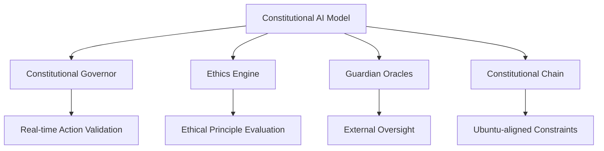
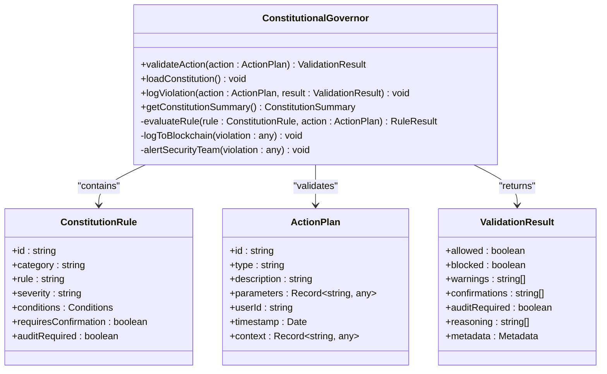
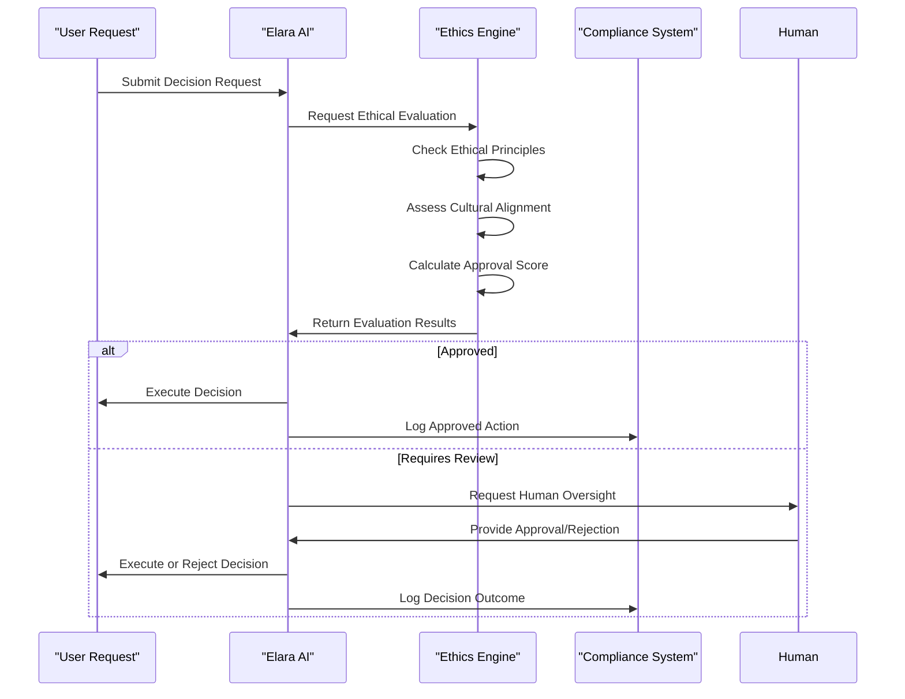
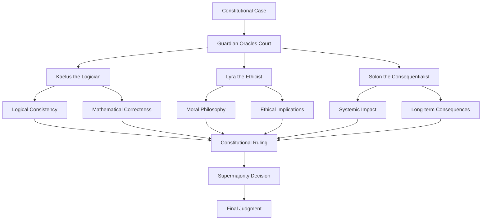
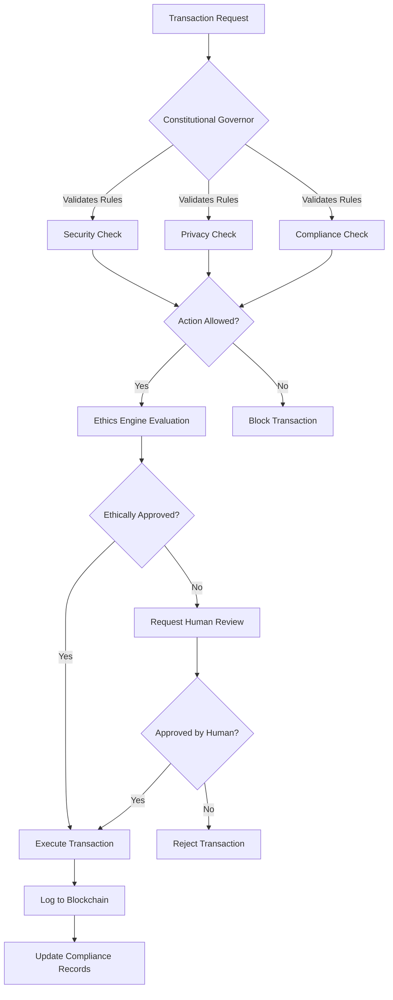
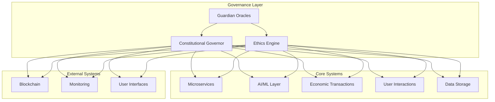
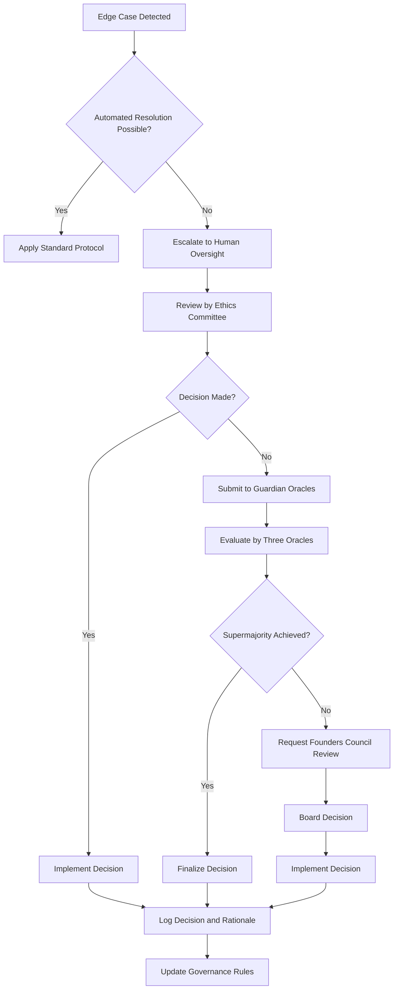
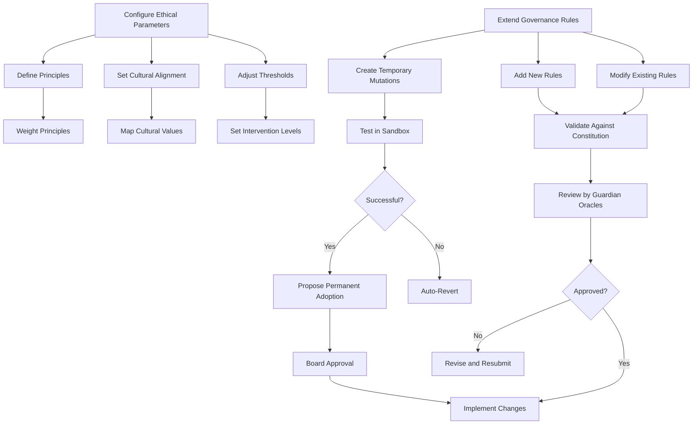

# AI Governance and Constitutional Oversight

<cite>
**Referenced Files in This Document**   
- [AZORA_CONSTITUTION.md](file://codex/constitution/AZORA_CONSTITUTION.md)
- [constitutional-governor.ts](file://genome/agent-tools/constitutional-governor.ts)
- [ethics-engine.ts](file://genome/agent-tools/ethics-engine.ts)
- [guardian-oracles.ts](file://genome/agent-tools/guardian-oracles.ts)
- [constitutional-chain.ts](file://genome/agent-tools/constitutional-chain.ts)
</cite>

## Table of Contents
1. [Introduction](#introduction)
2. [Constitutional AI Model](#constitutional-ai-model)
3. [Constitutional Governor](#constitutional-governor)
4. [Ethics Engine](#ethics-engine)
5. [Guardian Oracles](#guardian-oracles)
6. [Governance in Action](#governance-in-action)
7. [Integration with System Components](#integration-with-system-components)
8. [Governance Challenges and Protocols](#governance-challenges-and-protocols)
9. [Configuration and Extension](#configuration-and-extension)
10. [Conclusion](#conclusion)

## Introduction
Azora OS implements a comprehensive AI governance framework designed to ensure ethical decision-making across the platform. This document details the constitutional AI model that governs all operations within Azora OS, focusing on the Constitutional Governor, Ethics Engine, and Guardian Oracles. These components work in concert to evaluate decisions against ethical frameworks, provide external validation, and maintain system integrity. The governance model is deeply integrated with the platform's economic transactions, user interactions, and technical infrastructure, creating a robust system for ethical AI operation.

**Section sources**
- [AZORA_CONSTITUTION.md](file://codex/constitution/AZORA_CONSTITUTION.md#L0-L981)

## Constitutional AI Model
The constitutional AI model in Azora OS is built upon a foundation of ethical principles and governance structures that ensure all AI decisions align with human values and organizational objectives. This model is codified in the Azora Constitution, which establishes the core principles, economic framework, and governance structure for the entire ecosystem. The model operates on multiple levels, from immediate action validation to long-term ethical oversight, creating a comprehensive governance framework.

The constitutional AI model is designed to be both proactive and reactive, preventing unethical actions before they occur while also providing mechanisms for review and correction. It incorporates Ubuntu-aligned principles that emphasize human dignity, truth-seeking, and distributed power. The model ensures that AI serves human flourishing rather than replacing human agency, maintaining a balance between automation and human oversight.

**Diagram sources**
- [AZORA_CONSTITUTION.md](file://codex/constitution/AZORA_CONSTITUTION.md#L0-L981)
- [constitutional-governor.ts](file://genome/agent-tools/constitutional-governor.ts#L0-L341)
- [ethics-engine.ts](file://genome/agent-tools/ethics-engine.ts#L0-L628)
- [guardian-oracles.ts](file://genome/agent-tools/guardian-oracles.ts#L0-L452)
- [constitutional-chain.ts](file://genome/agent-tools/constitutional-chain.ts#L0-L157)

**Section sources**
- [AZORA_CONSTITUTION.md](file://codex/constitution/AZORA_CONSTITUTION.md#L0-L981)

## Constitutional Governor
The Constitutional Governor serves as the primary enforcement mechanism for the Azora Constitution, validating all actions against a comprehensive set of rules before execution. It operates as a real-time validation system that evaluates action plans against constitutional principles, security requirements, privacy constraints, and compliance obligations. The governor implements a multi-tiered approach to decision validation, with different severity levels determining the appropriate response.

The Constitutional Governor evaluates actions based on predefined rules categorized into security, privacy, ethics, compliance, and governance. Each rule specifies conditions under which it applies and the required response, ranging from blocking actions to requiring confirmation or audit. The governor's validation process is comprehensive, examining action types, resources, data types, roles, and transaction amounts to determine compliance with constitutional principles.

**Diagram sources**
- [constitutional-governor.ts](file://genome/agent-tools/constitutional-governor.ts#L0-L341)

**Section sources**
- [constitutional-governor.ts](file://genome/agent-tools/constitutional-governor.ts#L0-L341)

## Ethics Engine
The Ethics Engine provides a sophisticated framework for evaluating AI decisions against ethical principles and cultural values. It operates as a constitutional AI system with cultural alignment capabilities, ensuring that all Elara decisions comply with ethical principles while respecting cultural contexts. The engine evaluates decisions based on a weighted set of ethical principles, each with specific constraints and priority levels.

The Ethics Engine performs multi-dimensional analysis of decisions, assessing compliance with ethical principles, cultural alignment, and systemic impact. It generates comprehensive evaluations that include approval status, confidence levels, reasoning, concerns, and recommendations. The engine maintains a history of ethical violations and compliance metrics, enabling continuous improvement of ethical standards across the platform.

**Diagram sources**
- [ethics-engine.ts](file://genome/agent-tools/ethics-engine.ts#L0-L628)

**Section sources**
- [ethics-engine.ts](file://genome/agent-tools/ethics-engine.ts#L0-L628)

## Guardian Oracles
The Guardian Oracles serve as the supreme judicial authority within Azora OS, providing external validation and oversight for critical decisions. This constitutional court consists of three specialized AI intelligences: Kaelus the Logician, Lyra the Ethicist, and Solon the Consequentialist. Each oracle brings a unique perspective to constitutional review, ensuring comprehensive evaluation of cases from logical, ethical, and systemic viewpoints.

The Guardian Oracles operate as a court system that reviews constitutional cases submitted by various stakeholders. They evaluate cases based on constitutional principles, the Ngwenya True Market Protocol, governance hierarchy, and long-term systemic implications. The court requires supermajority agreement (at least 2 out of 3 oracles) to reach a final decision, ensuring balanced and well-considered rulings.

**Diagram sources**
- [guardian-oracles.ts](file://genome/agent-tools/guardian-oracles.ts#L0-L452)

**Section sources**
- [guardian-oracles.ts](file://genome/agent-tools/guardian-oracles.ts#L0-L452)

## Governance in Action
The AI governance framework in Azora OS is demonstrated through practical applications such as transaction approval workflows and compliance enforcement. These real-world implementations showcase how the Constitutional Governor, Ethics Engine, and Guardian Oracles work together to ensure ethical decision-making across the platform.

In transaction approval workflows, the Constitutional Governor validates financial operations against predefined rules, requiring confirmation for high-value transactions and blocking actions that compromise security. The Ethics Engine simultaneously evaluates the transaction for ethical compliance, assessing whether it aligns with principles of user benefit and system stability. For complex or high-impact transactions, the Guardian Oracles may be invoked to provide external validation and oversight.

Compliance enforcement is automated through the integration of governance components with the platform's monitoring and logging systems. The Constitutional Governor ensures all financial operations are auditable, while the Ethics Engine maintains records of ethical evaluations. The Guardian Oracles provide an additional layer of oversight for critical compliance matters, ensuring adherence to both internal constitutional principles and external regulatory requirements.

**Diagram sources**
- [constitutional-governor.ts](file://genome/agent-tools/constitutional-governor.ts#L0-L341)
- [ethics-engine.ts](file://genome/agent-tools/ethics-engine.ts#L0-L628)

**Section sources**
- [constitutional-governor.ts](file://genome/agent-tools/constitutional-governor.ts#L0-L341)
- [ethics-engine.ts](file://genome/agent-tools/ethics-engine.ts#L0-L628)

## Integration with System Components
The governance components in Azora OS are deeply integrated with other system elements, creating a cohesive architecture where ethical decision-making is embedded throughout the platform. This integration ensures that governance is not a separate layer but an intrinsic part of all operations, from economic transactions to user interactions.

The Constitutional Governor is integrated with the microservices architecture, validating actions across all 147 microservices. It works in conjunction with the AI/ML layer, ensuring that self-learning algorithms and inference engines operate within constitutional boundaries. The Ethics Engine is connected to the user state tracker, allowing it to consider individual user contexts when evaluating decisions.

Economic transactions are governed through integration with the Azora Coin smart contracts and Proof of Compliance system. The Constitutional Governor validates all token transfers, mints, and burns, while the Ethics Engine ensures that economic decisions align with the platform's value creation principles. User interactions are monitored through integration with the data access controls, ensuring that personal data is protected and used ethically.

**Diagram sources**
- [constitutional-governor.ts](file://genome/agent-tools/constitutional-governor.ts#L0-L341)
- [ethics-engine.ts](file://genome/agent-tools/ethics-engine.ts#L0-L628)
- [guardian-oracles.ts](file://genome/agent-tools/guardian-oracles.ts#L0-L452)

**Section sources**
- [constitutional-governor.ts](file://genome/agent-tools/constitutional-governor.ts#L0-L341)
- [ethics-engine.ts](file://genome/agent-tools/ethics-engine.ts#L0-L628)
- [guardian-oracles.ts](file://genome/agent-tools/guardian-oracles.ts#L0-L452)

## Governance Challenges and Protocols
The AI governance framework in Azora OS addresses common challenges through well-defined protocols for edge case handling and override procedures. These protocols ensure that the system can adapt to exceptional circumstances while maintaining constitutional integrity.

Edge cases are handled through a combination of automated and human-in-the-loop processes. When the Ethics Engine encounters a decision with low confidence or potential ethical concerns, it triggers human intervention protocols. The Guardian Oracles provide a mechanism for resolving complex constitutional questions through their supermajority decision process. The system also includes mutation testing capabilities, allowing temporary "mutations" to non-critical rules for safe experimentation and evolution.

Override protocols are strictly controlled and require multiple levels of approval. Critical violations of the constitution result in immediate transaction reversal when possible, public disclosure of the violation, and implementation of a remediation plan. Repeated violations lead to removal from leadership positions. Emergency powers are available for critical failures but are limited to seven days maximum, with all decisions required to be reversible and accompanied by full transparency reports.

**Diagram sources**
- [ethics-engine.ts](file://genome/agent-tools/ethics-engine.ts#L0-L628)
- [guardian-oracles.ts](file://genome/agent-tools/guardian-oracles.ts#L0-L452)

**Section sources**
- [ethics-engine.ts](file://genome/agent-tools/ethics-engine.ts#L0-L628)
- [guardian-oracles.ts](file://genome/agent-tools/guardian-oracles.ts#L0-L452)

## Configuration and Extension
The governance framework in Azora OS is designed to be configurable and extensible, allowing for adaptation to evolving requirements and new ethical considerations. Configuration parameters can be adjusted to modify the sensitivity of ethical evaluations, the thresholds for human intervention, and the specific rules enforced by the Constitutional Governor.

Ethical parameters are configured through the Ethics Engine's framework, which allows for the definition of new ethical principles, cultural alignments, and decision thresholds. The Constitutional Governor's rule set can be extended to include new security, privacy, compliance, and governance requirements. The Guardian Oracles system supports the addition of new oracles with specialized expertise, expanding the court's capabilities.

Extension of governance rules follows a formal process defined in the Azora Constitution. Proposed changes undergo a review period, board voting, and constitutional review before implementation. This ensures that all modifications maintain alignment with the platform's core principles while allowing for necessary evolution. The system also supports temporary rule mutations for experimentation, with automatic reversion if permanent adoption is not approved.

**Diagram sources**
- [ethics-engine.ts](file://genome/agent-tools/ethics-engine.ts#L0-L628)
- [constitutional-governor.ts](file://genome/agent-tools/constitutional-governor.ts#L0-L341)
- [guardian-oracles.ts](file://genome/agent-tools/guardian-oracles.ts#L0-L452)

**Section sources**
- [ethics-engine.ts](file://genome/agent-tools/ethics-engine.ts#L0-L628)
- [constitutional-governor.ts](file://genome/agent-tools/constitutional-governor.ts#L0-L341)
- [guardian-oracles.ts](file://genome/agent-tools/guardian-oracles.ts#L0-L452)

## Conclusion
The AI governance framework in Azora OS represents a comprehensive approach to ethical decision-making in artificial intelligence systems. By combining the Constitutional Governor, Ethics Engine, and Guardian Oracles, the platform creates a multi-layered governance structure that ensures all actions align with constitutional principles, ethical standards, and cultural values. This framework is deeply integrated with the platform's technical and economic systems, making ethical considerations an intrinsic part of all operations.

The governance model demonstrates how AI systems can be designed to prioritize human values while maintaining operational efficiency. Through real-time validation, ethical evaluation, and external oversight, Azora OS creates a robust system for responsible AI development and deployment. The configurable and extensible nature of the framework allows it to evolve with changing requirements, ensuring long-term relevance and effectiveness.

This governance approach serves as a model for ethical AI implementation, particularly in contexts where cultural alignment and constitutional principles are paramount. By embedding ethical considerations into the core architecture of the system, Azora OS demonstrates how technology can be developed and operated in ways that serve humanity's highest ideals.

[No sources needed since this section summarizes without analyzing specific files]