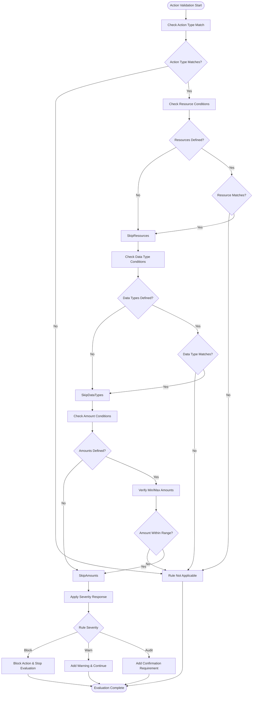
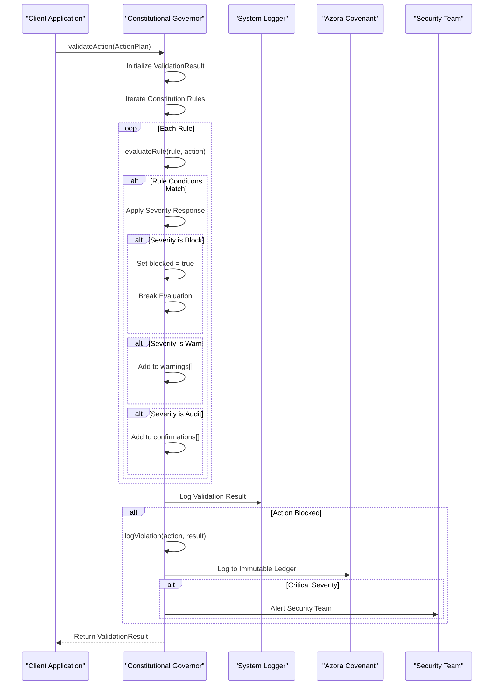
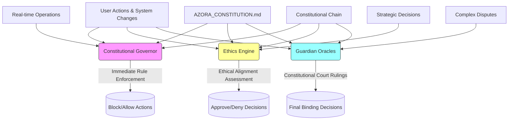

# Constitutional Governor

<cite>
**Referenced Files in This Document**   
- [constitutional-governor.ts](file://genome/agent-tools/constitutional-governor.ts)
- [AZORA_CONSTITUTION.md](file://codex/constitution/AZORA_CONSTITUTION.md)
- [ethics-engine.ts](file://genome/agent-tools/ethics-engine.ts)
- [guardian-oracles.ts](file://genome/agent-tools/guardian-oracles.ts)
- [constitutional-chain.ts](file://genome/agent-tools/constitutional-chain.ts)
</cite>

## Table of Contents
1. [Introduction](#introduction)
2. [Core Functionality](#core-functionality)
3. [Rule Evaluation Logic](#rule-evaluation-logic)
4. [Decision Validation Workflow](#decision-validation-workflow)
5. [Configuration and Extensibility](#configuration-and-extensibility)
6. [Integration with System Processes](#integration-with-system-processes)
7. [Relationship with Governance Components](#relationship-with-governance-components)
8. [Handling Rule Conflicts and Ambiguity](#handling-rule-conflicts-and-ambiguity)
9. [Performance Considerations](#performance-considerations)
10. [Testing and Monitoring](#testing-and-monitoring)
11. [Conclusion](#conclusion)

## Introduction

The Constitutional Governor serves as the primary governance mechanism within the Azora OS ecosystem, enforcing adherence to the system's constitutional principles as defined in the AZORA_CONSTITUTION.md. This component acts as a critical checkpoint for all system actions, transactions, and user interactions, ensuring they align with established security, privacy, ethics, compliance, and governance standards. The Constitutional Governor operates as a proactive enforcement layer that intercepts operations before execution, evaluates them against a comprehensive rule set, and determines appropriate responses based on violation severity. Its implementation provides a structured framework for maintaining system integrity while enabling transparent governance across the distributed architecture.

**Section sources**
- [AZORA_CONSTITUTION.md](file://codex/constitution/AZORA_CONSTITUTION.md#L1-L981)
- [constitutional-governor.ts](file://genome/agent-tools/constitutional-governor.ts#L1-L341)

## Core Functionality

The Constitutional Governor implements a comprehensive governance framework through its rule-based validation system. At initialization, the governor loads constitutional rules from configuration, establishing a foundation of 6 core rules spanning security, privacy, ethics, compliance, and governance domains. Each rule contains specific attributes including unique identifiers, categorical classification, descriptive text, severity levels (block, warn, audit), conditional parameters, confirmation requirements, and audit flags. The governor maintains these rules in memory as a structured array, providing efficient access during validation operations. When evaluating actions, the governor follows a hierarchical approach where blocking rules take precedence, immediately terminating evaluation upon detection of a violation. This design ensures critical constitutional breaches are prevented without unnecessary processing of subsequent rules. The component also provides summary statistics about the constitution through its getConstitutionSummary method, reporting both total rule count and distribution by category.

```mermaid
classDiagram
class ConstitutionalGovernor {
-constitution : ConstitutionRule[]
+validateAction(action : ActionPlan) : Promise~ValidationResult~
+getConstitutionSummary() : {total : number, byCategory : Record~string, number~}
-loadConstitution() : void
-evaluateRule(rule : ConstitutionRule, action : ActionPlan) : {blocked : boolean, warning? : string, confirmation? : string}
-logViolation(action : ActionPlan, result : ValidationResult) : Promise~void~
-logToBlockchain(violation : any) : Promise~void~
-alertSecurityTeam(violation : any) : Promise~void~
}
class ConstitutionRule {
+id : string
+category : 'security'|'privacy'|'ethics'|'compliance'|'governance'
+rule : string
+severity : 'block'|'warn'|'audit'
+conditions : RuleConditions
+requiresConfirmation? : boolean
+auditRequired : boolean
}
class RuleConditions {
+actions? : string[]
+resources? : string[]
+dataTypes? : string[]
+amounts? : AmountRange
}
class AmountRange {
+min? : number
+max? : number
}
class ActionPlan {
+id : string
+type : string
+description : string
+parameters : Record~string, any~
+userId? : string
+timestamp : Date
+context? : Record~string, any~
}
class ValidationResult {
+allowed : boolean
+blocked : boolean
+warnings : string[]
+confirmations : string[]
+auditRequired : boolean
+reasoning : string[]
+metadata : ResultMetadata
}
class ResultMetadata {
+ruleId? : string
+severity? : string
+timestamp : Date
}
ConstitutionalGovernor --> ConstitutionRule : "contains"
ConstitutionalGovernor --> ActionPlan : "validates"
ConstitutionalGovernor --> ValidationResult : "returns"
ConstitutionRule --> RuleConditions : "has"
RuleConditions --> AmountRange : "references"
```

**Diagram sources**
- [constitutional-governor.ts](file://genome/agent-tools/constitutional-governor.ts#L1-L341)

**Section sources**
- [constitutional-governor.ts](file://genome/agent-tools/constitutional-governor.ts#L1-L341)

## Rule Evaluation Logic

The Constitutional Governor employs a systematic rule evaluation process that examines multiple dimensions of each action against defined constitutional constraints. The evaluation begins by checking the action type against specified conditions, proceeding only if the action matches the rule's defined action types. Subsequent checks evaluate resources, data types, and financial amounts, with each condition requiring explicit inclusion in the rule definition to trigger validation. For amount-based rules, the system verifies whether transaction values fall within specified minimum and maximum thresholds, allowing rules to target high-value operations specifically. When a rule's conditions are satisfied, the evaluation proceeds to determine the appropriate response based on severity level: blocking rules immediately halt execution, warning rules allow continuation with notifications, and audit rules require additional verification steps. The evaluation process incorporates short-circuit logic, terminating immediately when a blocking rule is triggered to prevent unnecessary processing. This hierarchical approach ensures critical violations are addressed promptly while maintaining efficiency in the validation pipeline.



**Diagram sources**
- [constitutional-governor.ts](file://genome/agent-tools/constitutional-governor.ts#L1-L341)

**Section sources**
- [constitutional-governor.ts](file://genome/agent-tools/constitutional-governor.ts#L1-L341)

## Decision Validation Workflow

The Constitutional Governor implements a comprehensive validation workflow that processes actions through multiple stages of constitutional scrutiny. When an action plan is submitted for validation, the system initializes a result object with default allowances and begins iterating through the loaded constitution rules. For each rule, the evaluation process determines whether the action triggers the rule's conditions, and if so, applies the appropriate response based on severity level. Blocking rules immediately set the result to disallowed and terminate further evaluation, while warning and audit rules accumulate notifications and requirements without preventing execution. Throughout the process, the governor maintains detailed reasoning that documents which rules were triggered and why, providing transparency into the decision-making process. Upon completion, the system logs the validation outcome with comprehensive metadata including action ID, permission status, warning counts, and audit requirements. For blocked actions, the governor initiates violation logging procedures that record detailed information about the prohibited operation for compliance and security review.



**Diagram sources**
- [constitutional-governor.ts](file://genome/agent-tools/constitutional-governor.ts#L1-L341)

**Section sources**
- [constitutional-governor.ts](file://genome/agent-tools/constitutional-governor.ts#L1-L341)

## Configuration and Extensibility

The Constitutional Governor supports flexible configuration and extensibility through its modular rule structure and extensible validation framework. While the current implementation loads rules programmatically within the loadConstitution method, the system is designed to support external configuration files, allowing constitutional principles to be modified without code changes. Each rule's structure accommodates multiple conditional dimensions including actions, resources, data types, and financial amounts, enabling precise targeting of specific operations. The severity classification system (block, warn, audit) provides graduated response options that can be tailored to different risk levels. Rules can require user confirmation and mandate audit logging, creating additional safeguards for sensitive operations. The system's extensibility is further enhanced by its logging and alerting interfaces, which can be integrated with blockchain systems for immutable violation records and security teams for critical incident response. This architecture allows new rules to be added or existing rules to be modified to address emerging threats or changing compliance requirements.

**Section sources**
- [constitutional-governor.ts](file://genome/agent-tools/constitutional-governor.ts#L1-L341)
- [AZORA_CONSTITUTION.md](file://codex/constitution/AZORA_CONSTITUTION.md#L1-L981)

## Integration with System Processes

The Constitutional Governor integrates with core system processes through its action interception and validation capabilities. The component is designed to evaluate ActionPlan objects that represent discrete operations within the system, allowing it to govern a wide range of activities from financial transactions to system modifications. When integrated with transaction processing pipelines, the governor intercepts operations before execution, validating them against constitutional rules and either allowing continuation or blocking prohibited actions. For high-value financial transactions, the system requires explicit user confirmation as mandated by the security-002 rule, implementing a dual-control mechanism that prevents unauthorized transfers. System changes that involve code modifications or service deployments are subject to governance-001 rule enforcement, requiring formal approval processes before implementation. The governor also integrates with auditing systems, automatically logging all financial operations as required by compliance-001 rule, ensuring complete transaction traceability. Violation events trigger blockchain logging through integration with azora-covenant, creating immutable records of constitutional breaches for compliance and forensic analysis.

**Section sources**
- [constitutional-governor.ts](file://genome/agent-tools/constitutional-governor.ts#L1-L341)
- [AZORA_CONSTITUTION.md](file://codex/constitution/AZORA_CONSTITUTION.md#L1-L981)

## Relationship with Governance Components

The Constitutional Governor operates within a comprehensive governance ecosystem, maintaining distinct but complementary relationships with other governance components such as the Ethics Engine and Guardian Oracles. While the Constitutional Governor focuses on rule-based enforcement of specific constitutional provisions, the Ethics Engine evaluates decisions against broader ethical principles and cultural alignment frameworks. The Guardian Oracles provide a higher-level judicial function, serving as a constitutional court that resolves complex cases through the combined wisdom of specialized AI intelligences. The Constitutional Governor acts as the first line of defense, preventing clear violations before they occur, while more nuanced ethical dilemmas may be escalated to the Ethics Engine or Guardian Oracles for deeper analysis. This layered governance approach creates a comprehensive oversight framework where the Constitutional Governor handles routine compliance checks, freeing higher-level systems to address complex moral and strategic questions. The components share a common foundation in the AZORA_CONSTITUTION.md, ensuring alignment across different governance layers while maintaining specialized functions.



**Diagram sources**
- [constitutional-governor.ts](file://genome/agent-tools/constitutional-governor.ts#L1-L341)
- [ethics-engine.ts](file://genome/agent-tools/ethics-engine.ts#L1-L628)
- [guardian-oracles.ts](file://genome/agent-tools/guardian-oracles.ts#L1-L452)
- [constitutional-chain.ts](file://genome/agent-tools/constitutional-chain.ts#L1-L157)

**Section sources**
- [constitutional-governor.ts](file://genome/agent-tools/constitutional-governor.ts#L1-L341)
- [ethics-engine.ts](file://genome/agent-tools/ethics-engine.ts#L1-L628)
- [guardian-oracles.ts](file://genome/agent-tools/guardian-oracles.ts#L1-L452)

## Handling Rule Conflicts and Ambiguity

The Constitutional Governor addresses rule conflicts and ambiguous cases through its hierarchical evaluation structure and clear precedence rules. By processing blocking rules first and terminating evaluation upon encountering a violation, the system establishes a clear priority order where critical constitutional breaches override other considerations. This approach prevents conflicting rules from creating contradictory outcomes by ensuring that once an action is blocked, no subsequent rules are evaluated. For ambiguous cases where multiple non-blocking rules apply, the governor accumulates all relevant warnings and confirmation requirements, providing comprehensive feedback about potential issues without preventing legitimate operations. The system's logging mechanisms capture detailed reasoning for each decision, documenting which rules were triggered and why, enabling post-hoc analysis of edge cases. In situations where rule interpretation may be uncertain, the governor can require additional confirmation or mandate audit logging, creating additional safeguards while allowing necessary operations to proceed. This balanced approach maintains system security while accommodating legitimate activities that may trigger multiple constitutional considerations.

**Section sources**
- [constitutional-governor.ts](file://genome/agent-tools/constitutional-governor.ts#L1-L341)
- [AZORA_CONSTITUTION.md](file://codex/constitution/AZORA_CONSTITUTION.md#L1-L981)

## Performance Considerations

The Constitutional Governor is designed with performance optimization in mind, particularly for high-volume transaction environments. The component employs efficient data structures and algorithms to minimize validation overhead, with rules stored in memory for rapid access during evaluation. The short-circuit evaluation logic ensures that once a blocking rule is encountered, no further processing occurs, reducing computational requirements for prohibited actions. For high-volume scenarios, the system could be enhanced with indexing mechanisms that pre-filter rules based on action types or other common characteristics, further improving performance. The current implementation processes rules sequentially, but could be optimized for parallel evaluation when rules are independent of each other. Logging operations are designed to be non-blocking, with violation records queued for asynchronous processing to prevent impacting real-time validation performance. The governor's lightweight validation logic, focused on pattern matching and conditional checks, ensures minimal latency impact on transaction processing while maintaining comprehensive governance oversight.

**Section sources**
- [constitutional-governor.ts](file://genome/agent-tools/constitutional-governor.ts#L1-L341)

## Testing and Monitoring

The Constitutional Governor supports comprehensive testing and monitoring through its structured validation results and integrated logging capabilities. The component generates detailed ValidationResult objects that include explicit indicators of permission status, blocked actions, warnings, confirmation requirements, and audit flags, providing clear test outcomes for validation scenarios. The reasoning field documents exactly which rules were triggered and why, enabling precise verification of rule enforcement behavior. Comprehensive logging captures validation results with metadata including action IDs, timestamps, and violation details, facilitating audit trails and compliance reporting. For testing constitutional rules, developers can create targeted ActionPlan objects that exercise specific rules, verifying that the expected responses (block, warn, audit) are generated correctly. The system's modular rule structure allows individual rules to be tested in isolation, while integration tests can validate the governor's behavior across multiple rule interactions. Monitoring systems can track key metrics such as validation success rates, violation frequencies by rule category, and average processing times, providing insights into governance effectiveness and system health.

**Section sources**
- [constitutional-governor.ts](file://genome/agent-tools/constitutional-governor.ts#L1-L341)

## Conclusion

The Constitutional Governor serves as a critical governance mechanism within the Azora OS ecosystem, providing robust enforcement of constitutional principles across all system operations. Through its structured rule evaluation framework, the component effectively intercepts and assesses transactions, user actions, and system changes against defined security, privacy, ethics, compliance, and governance standards. The governor's implementation demonstrates a balanced approach to governance, combining immediate rule enforcement with graduated response mechanisms that accommodate different violation severities. Its integration with auditing systems and security protocols creates a comprehensive oversight framework that maintains system integrity while enabling transparent operations. The component's relationship with other governance entities like the Ethics Engine and Guardian Oracles establishes a multi-layered governance architecture that addresses both routine compliance and complex ethical dilemmas. With its extensible rule structure and performance-optimized design, the Constitutional Governor provides a scalable foundation for constitutional governance that can evolve alongside the growing complexity of the Azora ecosystem.