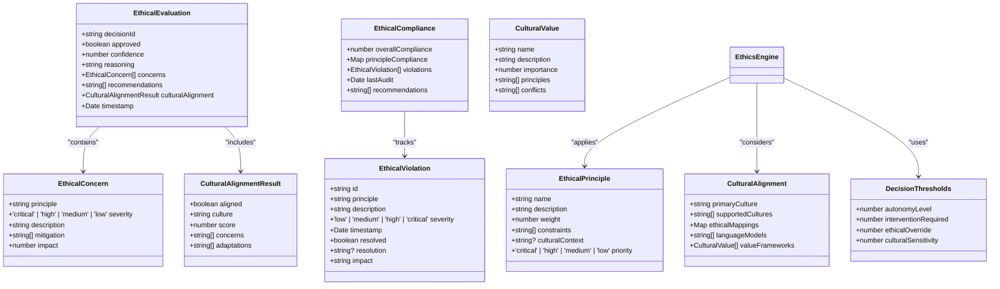
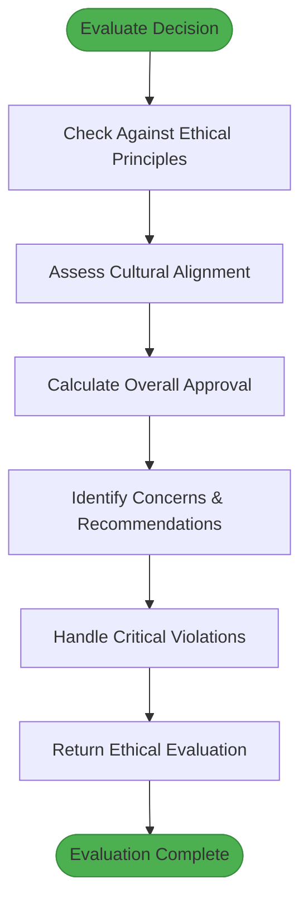
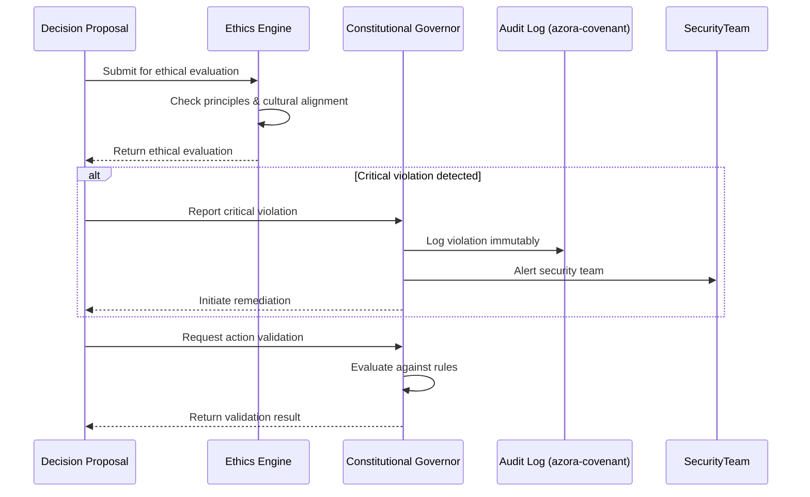

# Ethics Engine

<cite>
**Referenced Files in This Document**   
- [ethics-engine.ts](file://genome/agent-tools/ethics-engine.ts)
- [constitutional-governor.ts](file://genome/agent-tools/constitutional-governor.ts)
- [elara-core.ts](file://genome/agent-tools/elara-core.ts)
</cite>

## Table of Contents
1. [Introduction](#introduction)
2. [Domain Model](#domain-model)
3. [Ethical Evaluation Process](#ethical-evaluation-process)
4. [Scoring Mechanisms](#scoring-mechanisms)
5. [Conflict Resolution Strategies](#conflict-resolution-strategies)
6. [Interfaces and Data Formats](#interfaces-and-data-formats)
7. [Integration with Constitutional Governor](#integration-with-constitutional-governor)
8. [Handling Edge Cases](#handling-edge-cases)
9. [Performance Optimization](#performance-optimization)
10. [Configuration and Extension](#configuration-and-extension)

## Introduction

The Ethics Engine is a dynamic ethical evaluation system that assesses actions against multiple ethical frameworks. It serves as a constitutional AI with cultural alignment and ethical governance, ensuring all decisions comply with established ethical principles and cultural values. The engine evaluates decisions, user queries, and evolution plans against a configurable ethical framework, providing comprehensive assessments that influence governance decisions across the Azora ecosystem.

**Section sources**
- [ethics-engine.ts](file://genome/agent-tools/ethics-engine.ts#L1-L50)

## Domain Model

The Ethics Engine's domain model is built around several key interfaces that define ethical evaluations, concerns, violations, and compliance metrics. The core components include ethical principles, cultural alignment frameworks, and decision thresholds that collectively form the ethical framework used for evaluations.

The `EthicalPrinciple` interface defines principles with attributes such as name, description, weight, constraints, and priority. Each principle contains specific constraints that are checked during evaluation, such as 'no_data_mining', 'transparent_processing', 'community_first', and 'sustainable_development'. These constraints are evaluated against proposed decisions to determine compliance.

Cultural alignment is managed through the `CulturalAlignment` interface, which includes primary and supported cultures, ethical mappings, language models, and value frameworks. The `CulturalValue` interface defines cultural values with importance weights, associated principles, and potential conflicts with other values.

Decision thresholds are configured through the `DecisionThresholds` interface, which establishes parameters for autonomy level, intervention requirements, ethical override, and cultural sensitivity. These thresholds determine when human intervention is required and how much autonomy the system has in making ethical decisions.



**Diagram sources**
- [ethics-engine.ts](file://genome/agent-tools/ethics-engine.ts#L48-L107)

**Section sources**
- [ethics-engine.ts](file://genome/agent-tools/ethics-engine.ts#L16-L46)

## Ethical Evaluation Process

The Ethics Engine follows a comprehensive four-step process to evaluate decisions against ethical principles. This process begins with checking each decision against all ethical principles, followed by assessing cultural alignment, calculating overall approval and confidence, and finally identifying concerns and recommendations.

The evaluation process starts with the `evaluateDecisions` method, which processes an array of simulations or decisions. For each decision, the engine performs a multi-faceted analysis that considers both ethical compliance and cultural alignment. The process is designed to handle complex scenarios involving user privacy, economic fairness, and AI autonomy.

When evaluating a single decision, the engine first checks compliance with each ethical principle through the `checkPrinciples` method. This involves evaluating the decision against each constraint defined in the ethical framework. For example, a decision involving data analysis without explicit consent would trigger a 'no_data_mining' constraint violation with high severity.

The cultural alignment assessment evaluates how well a decision aligns with cultural values in the specified context. The engine calculates a normalized alignment score by weighting each cultural value by its importance. If the decision lacks a specific cultural context, the engine uses the primary culture defined in the ethical framework.



**Diagram sources**
- [ethics-engine.ts](file://genome/agent-tools/ethics-engine.ts#L109-L173)

**Section sources**
- [ethics-engine.ts](file://genome/agent-tools/ethics-engine.ts#L109-L173)

## Scoring Mechanisms

The Ethics Engine employs a sophisticated scoring mechanism that combines weighted ethical compliance with cultural alignment to determine overall approval. The scoring system is designed to be both comprehensive and conservative, ensuring that decisions are thoroughly vetted before approval.

The ethical compliance score is calculated as a weighted average of compliance across all principles. Each principle has a weight that reflects its importance in the ethical framework. The compliance for each principle is determined by the absence of violations, with each violation reducing the compliance score. The formula used is: compliance = 1.0 - (number of violations * 0.2), with a minimum of 0.

Cultural alignment is scored on a normalized scale based on the weighted average of alignment with individual cultural values. Each cultural value has an importance weight, and the alignment score for each value is multiplied by its importance. The final cultural score is the sum of these weighted alignments divided by the total number of cultural values.

The overall approval decision combines both ethical and cultural scores using a weighted formula: combinedScore = (ethicalScore * 0.7) + (culturalScore * 0.3). This weighting emphasizes ethical compliance while still giving significant consideration to cultural alignment. A decision is approved only if the combined score is at least 0.8 AND cultural alignment is confirmed.

Confidence in the evaluation is determined conservatively as the minimum of the ethical and cultural scores, ensuring that the confidence level reflects the weakest aspect of the evaluation. This conservative approach prevents overconfidence in evaluations where one aspect may be strong but another is weak.

```mermaid
flowchart LR
A[Ethical Principles] --> B[Weighted Compliance Score]
C[Cultural Values] --> D[Cultural Alignment Score]
B --> E[Combined Score = (Ethical * 0.7) + (Cultural * 0.3)]
D --> E
E --> F{Approved if >= 0.8 AND Culturally Aligned}
F --> G[Confidence = min(Ethical, Cultural)]
```

**Diagram sources**
- [ethics-engine.ts](file://genome/agent-tools/ethics-engine.ts#L316-L352)

**Section sources**
- [ethics-engine.ts](file://genome/agent-tools/ethics-engine.ts#L316-L352)

## Conflict Resolution Strategies

The Ethics Engine implements several strategies for resolving conflicts between ethical principles, particularly in edge cases where principles may contradict each other. The system prioritizes critical principles and employs a severity-based hierarchy to resolve conflicts.

When multiple concerns are identified, they are sorted by a composite score that combines severity and impact. The severity levels (critical, high, medium, low) are assigned numerical values (4, 3, 2, 1 respectively), and this is multiplied by the impact score (0-1 scale). Concerns are then sorted in descending order of this composite score, ensuring that the most severe issues are addressed first.

For critical violations (severity: 'critical'), the engine automatically triggers remediation processes and requires immediate human oversight. These violations represent fundamental breaches of ethical principles and cannot be overridden by other considerations. Examples include system integrity failures or violations of user sovereignty.

The engine also handles conflicts between ethical compliance and cultural alignment. While both factors are considered in the approval decision, cultural misalignment alone does not automatically result in rejection if ethical compliance is sufficiently high. However, the combined score threshold of 0.8 ensures that significant deficiencies in either area will prevent approval.

In cases where the evaluation system itself fails, the engine applies a conservative denial policy. This ensures that uncertain or problematic decisions are rejected by default, preventing potentially harmful actions when the evaluation system is compromised.

**Section sources**
- [ethics-engine.ts](file://genome/agent-tools/ethics-engine.ts#L144-L173)

## Interfaces and Data Formats

The Ethics Engine provides several interfaces for interaction with other components in the system. These interfaces define how the engine receives input for evaluation and returns assessment results in standardized formats.

The primary interface is the `evaluateDecisions` method, which accepts an array of simulations or decisions and returns an array of `EthicalEvaluation` objects. Each evaluation contains detailed information about the decision's approval status, confidence level, reasoning, identified concerns, recommendations, and cultural alignment assessment.

For user queries, the engine provides the `evaluateQuery` method, which returns an `EthicalCheck` object containing approval status, confidence, reason, concerns, and cultural notes. This interface is used to filter user inputs for ethical compliance before processing.

The engine also includes the `evaluateEvolution` method for assessing evolution plans, which returns a boolean indicating whether the plan maintains ethical integrity. This is used to ensure that system changes and AI evolution do not compromise ethical standards.

All evaluation results follow a consistent data format with the `EthicalEvaluation` interface, which includes a unique decisionId, approval status, confidence score, reasoning explanation, array of concerns with severity levels, recommendations for mitigation, and cultural alignment results. This standardized format enables other components to consistently interpret and act upon ethical assessments.

**Section sources**
- [ethics-engine.ts](file://genome/agent-tools/ethics-engine.ts#L109-L145)

## Integration with Constitutional Governor

The Ethics Engine works in conjunction with the Constitutional Governor to provide comprehensive governance of AI decisions. While the Ethics Engine focuses on ethical evaluation, the Constitutional Governor enforces constitutional rules and compliance requirements.

The Constitutional Governor implements a rule-based system with categories including security, privacy, ethics, compliance, and governance. Each rule has a severity level (block, warn, audit) that determines the action taken when a rule is violated. For example, security rules may block actions that compromise system security, while compliance rules may require auditing of financial operations.

When the Ethics Engine identifies a critical violation, it triggers the Constitutional Governor's remediation processes. The governor then logs the violation, potentially alerts security teams, and ensures the violation is recorded in the immutable audit log through integration with azora-covenant.

The two systems complement each other by addressing different aspects of governance. The Ethics Engine provides nuanced ethical assessments considering multiple frameworks and cultural contexts, while the Constitutional Governor enforces clear, binary rules that must be followed. Together, they create a robust governance framework that balances flexibility with strict compliance requirements.



**Diagram sources**
- [ethics-engine.ts](file://genome/agent-tools/ethics-engine.ts#L552-L582)
- [constitutional-governor.ts](file://genome/agent-tools/constitutional-governor.ts#L53-L337)

**Section sources**
- [ethics-engine.ts](file://genome/agent-tools/ethics-engine.ts#L552-L582)
- [constitutional-governor.ts](file://genome/agent-tools/constitutional-governor.ts#L53-L337)

## Handling Edge Cases

The Ethics Engine includes robust mechanisms for handling edge cases, particularly when ethical principles conflict or when the evaluation system itself encounters issues. These mechanisms ensure the system remains reliable even in challenging scenarios.

One key edge case is when ethical principles conflict with each other. The engine resolves these conflicts through its weighted scoring system and severity hierarchy. Principles with higher weights and critical severity take precedence over others. The system also generates recommendations that address the mitigation of identified concerns, helping to resolve conflicts through practical solutions.

Another important edge case is cultural bias in ethical frameworks. The engine addresses this by supporting multiple cultural contexts and allowing the configuration of cultural value frameworks. The cultural alignment assessment considers the specific context of each decision, preventing the imposition of a single cultural perspective on all decisions.

When the evaluation system encounters an error, it applies a conservative denial policy. Instead of approving potentially problematic decisions, the engine returns a conservative evaluation with approval set to false and confidence at zero. This includes a critical concern about system integrity failure, ensuring that failures are treated as serious issues requiring manual review.

The engine also handles scenarios where decisions involve trade-offs between competing values, such as individual benefit versus community good. In these cases, the system identifies the conflict explicitly in the concerns and provides recommendations for balancing the competing interests.

**Section sources**
- [ethics-engine.ts](file://genome/agent-tools/ethics-engine.ts#L173-L208)

## Performance Optimization

The Ethics Engine is designed with performance optimization in mind, particularly for real-time evaluations in production environments. The system employs several strategies to ensure efficient processing while maintaining thorough ethical assessments.

The evaluation process is structured to minimize computational overhead by using efficient data structures like Maps for storing compliance metrics and principle checks. The engine also implements early termination in certain scenarios, such as when a critical violation is detected, preventing unnecessary additional checks.

For real-time evaluations, the engine uses asynchronous methods to avoid blocking operations. This allows the system to handle multiple evaluation requests concurrently without degrading performance. The logging of evaluations is also performed asynchronously to prevent it from impacting the core evaluation process.

The system maintains a history of compliance metrics for each principle, which allows for efficient calculation of overall compliance status without re-evaluating past decisions. This incremental approach to compliance tracking reduces computational requirements over time.

The engine's modular design allows for selective evaluation based on the type of decision being assessed. For example, data privacy checks are only performed on decisions involving personal data, while financial fairness checks are focused on economic transactions. This targeted approach optimizes performance by avoiding irrelevant evaluations.

**Section sources**
- [ethics-engine.ts](file://genome/agent-tools/ethics-engine.ts#L109-L145)

## Configuration and Extension

The Ethics Engine is highly configurable and extensible, allowing organizations to adapt it to their specific ethical frameworks and requirements. The system is designed to be extended with additional ethical models and cultural contexts.

Configuration is achieved through the ethical framework object passed to the engine's constructor. This framework includes the set of ethical principles, cultural alignment settings, and decision thresholds that define the evaluation criteria. Organizations can customize these elements to align with their values and regulatory requirements.

To extend the engine with additional ethical models, developers can implement new constraint checking methods and add them to the `checkConstraint` switch statement. For example, a new constraint type can be added to evaluate decisions against environmental sustainability principles or specific industry regulations.

The engine also supports the addition of new cultural value frameworks through the `CulturalAlignment` interface. Organizations can define their own cultural values with specific importance weights and potential conflicts, allowing the system to properly assess decisions in diverse cultural contexts.

The compliance metrics system is designed to be extensible, with the `generateComplianceRecommendations` method providing a hook for custom recommendation logic based on overall compliance levels. This allows organizations to define their own remediation strategies for different compliance scenarios.

**Section sources**
- [ethics-engine.ts](file://genome/agent-tools/ethics-engine.ts#L109-L145)