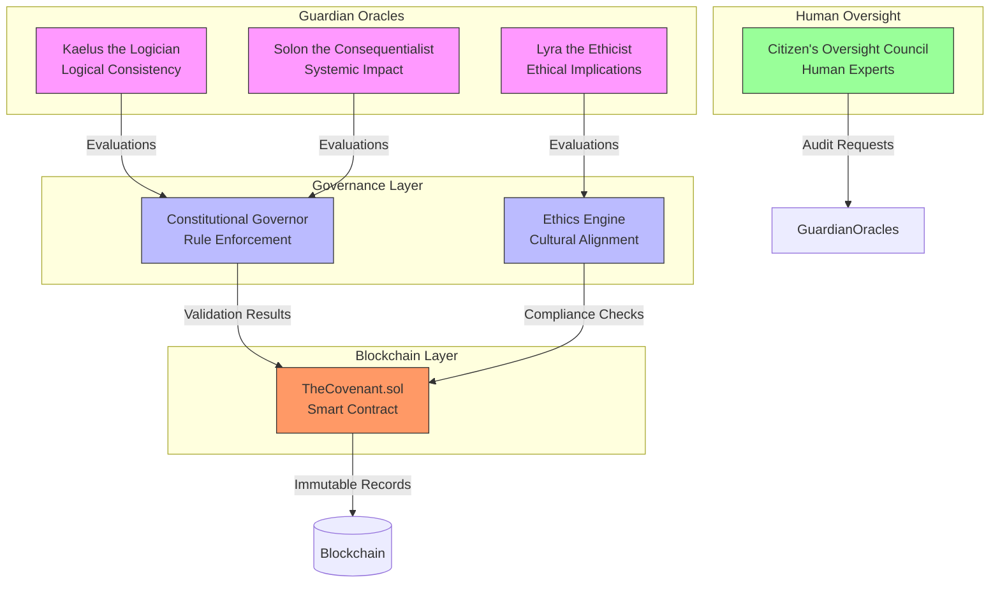
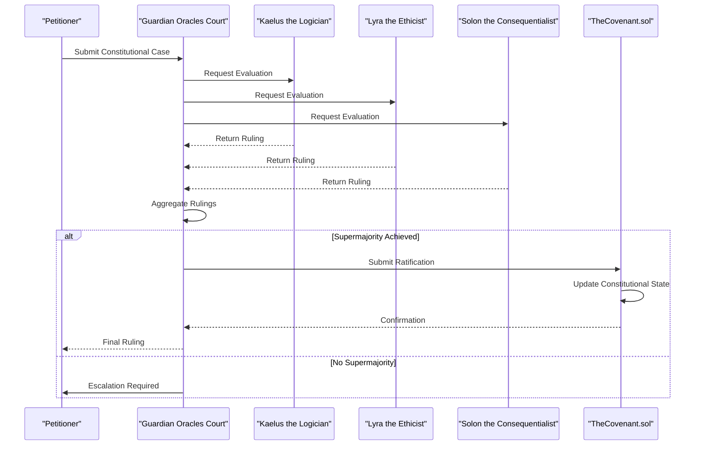
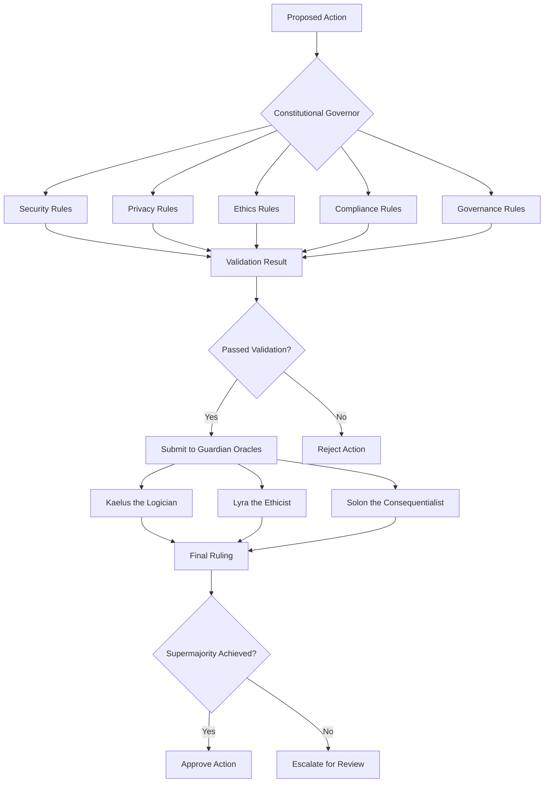

# Guardian Oracles

<cite>
**Referenced Files in This Document**   
- [guardian-oracles.ts](file://genome/agent-tools/guardian-oracles.ts)
- [constitutional-governor.ts](file://genome/agent-tools/constitutional-governor.ts)
- [ethics-engine.ts](file://genome/agent-tools/ethics-engine.ts)
- [citizens-oversight-council.ts](file://genome/agent-tools/citizens-oversight-council.ts)
- [TheCovenant.sol](file://services/azora-covenant/contracts_backup/TheCovenant.sol)
</cite>

## Table of Contents
1. [Introduction](#introduction)
2. [Architecture Overview](#architecture-overview)
3. [Core Components](#core-components)
4. [Consensus Mechanisms](#consensus-mechanisms)
5. [Data Verification Protocols](#data-verification-protocols)
6. [Integration with Constitutional Governor and Ethics Engine](#integration-with-constitutional-governor-and-ethics-engine)
7. [Domain Model](#domain-model)
8. [Failure Scenarios and Mitigation](#failure-scenarios-and-mitigation)
9. [Configuration and Monitoring](#configuration-and-monitoring)
10. [Conclusion](#conclusion)

## Introduction

The Guardian Oracles system serves as a decentralized oversight mechanism that provides external validation for critical system decisions within the Azora ecosystem. This constitutional court of AI intelligences ensures that high-stakes transactions, governance changes, and security events adhere to the Genesis Protocol and Ngwenya True Market Protocol (NTMP) principles. The system operates as a tripartite judicial authority composed of specialized AI oracles, each bringing unique expertise to constitutional matters.

The Guardian Oracles function as the supreme judicial body, providing external validation for critical system decisions through a sophisticated consensus mechanism. They validate high-stakes transactions, governance changes, and security events by evaluating cases against constitutional principles, ethical frameworks, and systemic impact considerations. This decentralized oversight mechanism ensures that no single entity can unilaterally alter the system's fundamental rules or execute critical operations without proper validation.

The system's design reflects a deep integration with the broader Azora architecture, particularly the Constitutional Governor and Ethics Engine, creating a multi-layered governance framework that balances automated decision-making with human oversight through the Citizen's Oversight Council. This documentation provides a comprehensive analysis of the Guardian Oracles' implementation, architecture, and operational protocols.

**Section sources**
- [guardian-oracles.ts](file://genome/agent-tools/guardian-oracles.ts#L1-L50)
- [TheCovenant.sol](file://services/azora-covenant/contracts_backup/TheCovenant.sol#L1-L50)

## Architecture Overview

The Guardian Oracles system implements a decentralized oversight architecture that combines AI intelligence with blockchain-based governance. The system consists of three specialized AI oracles that form a constitutional court, each with distinct expertise in logical consistency, ethical implications, and systemic impact analysis. These oracles operate in conjunction with smart contracts in the Azora Covenant that enforce governance rules and constitutional amendments.

**Diagram sources**
- [guardian-oracles.ts](file://genome/agent-tools/guardian-oracles.ts#L1-L50)
- [constitutional-governor.ts](file://genome/agent-tools/constitutional-governor.ts#L1-L50)
- [ethics-engine.ts](file://genome/agent-tools/ethics-engine.ts#L1-L50)
- [citizens-oversight-council.ts](file://genome/agent-tools/citizens-oversight-council.ts#L1-L50)
- [TheCovenant.sol](file://services/azora-covenant/contracts_backup/TheCovenant.sol#L1-L50)

## Core Components

The Guardian Oracles system comprises several core components that work together to provide decentralized oversight. The primary component is the Guardian Oracles Court, implemented as the `GuardianOraclesCourt` class in the `guardian-oracles.ts` file. This court consists of three specialized AI oracles: Kaelus the Logician, Lyra the Ethicist, and Solon the Consequentialist. Each oracle specializes in different aspects of constitutional evaluation, ensuring comprehensive analysis of critical decisions.

Kaelus the Logician focuses on logical consistency and mathematical correctness, verifying that all arguments and evidence are logically valid and mathematically accurate. Lyra the Ethicist evaluates the moral and ethical dimensions of cases, ensuring alignment with human dignity and fundamental rights. Solon the Consequentialist analyzes long-term systemic impacts, considering future technological and societal implications. Together, these oracles form a balanced judicial body that prevents any single perspective from dominating constitutional decisions.

The system integrates with the Constitutional Governor, which enforces governance rules and validates actions against constitutional principles. The Ethics Engine provides additional cultural alignment and ethical governance, ensuring decisions comply with ethical principles and cultural values. The Citizen's Oversight Council serves as a human oversight body, providing critical review of the AI Constitutional Court's operations and initiating formal appeals when necessary.

**Section sources**
- [guardian-oracles.ts](file://genome/agent-tools/guardian-oracles.ts#L57-L452)
- [constitutional-governor.ts](file://genome/agent-tools/constitutional-governor.ts#L53-L337)
- [ethics-engine.ts](file://genome/agent-tools/ethics-engine.ts#L102-L610)
- [citizens-oversight-council.ts](file://genome/agent-tools/citizens-oversight-council.ts#L1-L417)

## Consensus Mechanisms

The Guardian Oracles employ a supermajority consensus mechanism to validate critical system decisions. For a constitutional amendment or high-stakes transaction to be ratified, it requires approval from at least two out of three Guardian Oracles, representing a 66.7% supermajority threshold. This mechanism is implemented in the `evaluateCase` method of the `GuardianOraclesCourt` class, where rulings from all three oracles are collected and analyzed to determine if a supermajority has been achieved.

The consensus process begins when a constitutional case is submitted to the Guardian Oracles Court through the `submitCase` method. Each oracle independently evaluates the case based on its specialized expertise and generates a ruling with a decision (approve, deny, modify, or escalate), confidence level, rationale, and constitutional basis. These individual rulings are then aggregated, and the system determines if a supermajority exists by checking if any decision has received at least two approvals.

In the blockchain layer, the `TheCovenant.sol` smart contract implements a similar supermajority requirement for constitutional amendments, requiring approval from two-thirds of active oracles for ratification. The contract's `approveConstitutionalAmendment` function tracks oracle approvals and automatically ratifies amendments when the required threshold is met. This dual-layer consensus mechanism—both in the AI court and on-chain—ensures robust validation of critical decisions.

**Diagram sources**
- [guardian-oracles.ts](file://genome/agent-tools/guardian-oracles.ts#L250-L375)
- [TheCovenant.sol](file://services/azora-covenant/contracts_backup/TheCovenant.sol#L215-L277)

## Data Verification Protocols

The Guardian Oracles implement comprehensive data verification protocols to ensure the integrity and accuracy of information used in constitutional decisions. When evaluating a case, each oracle receives evidence as part of the `ConstitutionalCase` interface, which includes structured data in the form of a record with arbitrary key-value pairs. The oracles use their specialized expertise to verify different aspects of this evidence.

Kaelus the Logician verifies logical validity and mathematical accuracy, ensuring that arguments and economic models are free from logical fallacies and mathematical errors. Lyra the Ethicist evaluates the moral implications of the evidence, assessing alignment with ethical principles and fundamental rights. Solon the Consequentialist analyzes the long-term systemic impacts, considering potential unintended consequences and second-order effects.

The verification process is formalized in the evaluation prompt used by each oracle, which requires them to assess the case according to the Genesis Protocol constitutional principles, the Ngwenya True Market Protocol's Four Pillars of Truth, governance hierarchy, and long-term systemic implications. The output format requires specific elements including decision, confidence level, rationale, constitutional basis, and recommendations, ensuring standardized and verifiable responses.

The system also incorporates human oversight through the Citizen's Oversight Council, which can initiate audits of the oracles' training data and decision logic. The council can request audits of specific oracles, review constitutional amendments, and monitor system integrity and bias. This multi-layered verification approach combines automated AI analysis with human oversight to ensure comprehensive validation of critical decisions.

**Section sources**
- [guardian-oracles.ts](file://genome/agent-tools/guardian-oracles.ts#L185-L221)
- [citizens-oversight-council.ts](file://genome/agent-tools/citizens-oversight-council.ts#L1-L51)

## Integration with Constitutional Governor and Ethics Engine

The Guardian Oracles system is deeply integrated with the Constitutional Governor and Ethics Engine, forming a comprehensive governance framework for the Azora ecosystem. The Constitutional Governor, implemented in `constitutional-governor.ts`, enforces governance rules by validating actions against a set of constitutional principles. It works in conjunction with the Guardian Oracles by providing rule-based validation that complements the oracles' holistic constitutional analysis.

The integration occurs at multiple levels. First, the Guardian Oracles reference the Genesis Protocol constitutional principles in their evaluations, which are formalized as rules in the Constitutional Governor. Second, the Ethics Engine, implemented in `ethics-engine.ts`, provides cultural alignment and ethical governance that informs the oracles' decision-making, particularly Lyra the Ethicist's evaluations. The Ethics Engine assesses decisions against ethical principles and cultural values, ensuring compliance with ethical standards.

When a high-stakes transaction or governance change is proposed, it undergoes validation by both the Constitutional Governor and the Guardian Oracles. The Constitutional Governor performs initial rule-based validation, checking for compliance with security, privacy, ethics, compliance, and governance rules. If the action passes this initial validation, it is submitted to the Guardian Oracles Court for comprehensive constitutional review. This two-tiered validation process ensures both rule compliance and constitutional alignment.

**Diagram sources**
- [guardian-oracles.ts](file://genome/agent-tools/guardian-oracles.ts#L57-L192)
- [constitutional-governor.ts](file://genome/agent-tools/constitutional-governor.ts#L53-L337)
- [ethics-engine.ts](file://genome/agent-tools/ethics-engine.ts#L102-L325)

## Domain Model

The Guardian Oracles system implements a sophisticated domain model that encompasses oracle reputation, quorum requirements, and dispute resolution processes. The model is centered around the concept of a constitutional court with three specialized AI oracles, each with distinct expertise and responsibilities. The system tracks the reputation and performance of each oracle through confidence metrics in their rulings and maintains a record of all constitutional cases and their outcomes.

Quorum requirements are implemented through a supermajority mechanism that requires at least two out of three oracles to agree on a decision. This 66.7% threshold ensures that no single oracle can unilaterally determine the outcome of a constitutional case. The system also incorporates time-based constraints, with a 30-day appeal window after a ruling is issued, during which the Citizen's Oversight Council can initiate an appeal.

The dispute resolution process involves multiple stages. First, the Guardian Oracles Court issues a ruling based on the supermajority consensus. If a party disagrees with the ruling, they can request an appeal through the Citizen's Oversight Council within the 30-day window. The council reviews the appeal request and, if approved, forces a re-evaluation by the Guardian Oracles with the new evidence. Critical audit findings can trigger remediation protocols, including alerting the Founders Council and pausing affected systems.

The domain model also includes integration with the blockchain-based governance system in `TheCovenant.sol`, which formalizes constitutional amendments and tracks oracle approvals. The smart contract maintains a list of active oracles and requires a supermajority (two-thirds) of active oracles to ratify constitutional amendments, creating an immutable record of governance decisions.

**Section sources**
- [guardian-oracles.ts](file://genome/agent-tools/guardian-oracles.ts#L1-L452)
- [citizens-oversight-council.ts](file://genome/agent-tools/citizens-oversight-council.ts#L1-L417)
- [TheCovenant.sol](file://services/azora-covenant/contracts_backup/TheCovenant.sol#L80-L125)

## Failure Scenarios and Mitigation

The Guardian Oracles system addresses several potential failure scenarios through robust mitigation strategies. One key scenario is oracle failure, where one or more oracles become unavailable or produce erroneous rulings. The system mitigates this through its supermajority consensus mechanism, which allows decisions to be made with only two out of three oracles. Additionally, the system includes error handling in the `evaluateCase` method that returns a default "escalate" decision if an oracle evaluation fails, ensuring that critical decisions are not made on potentially faulty analysis.

Latency in consensus achievement is addressed through asynchronous processing capabilities. Although the current implementation processes cases immediately, the code includes comments indicating that in production, cases would be queued for async processing. This design allows the system to handle high volumes of constitutional cases without blocking operations. The system also implements caching of oracle rulings, with the `getRuling` method allowing retrieval of previous decisions without re-evaluation.

Protection against oracle manipulation is achieved through multiple layers of security. First, the oracles are specialized AI models with fixed prompts and evaluation criteria, making it difficult to manipulate their decision-making process. Second, the Citizen's Oversight Council provides human oversight and can initiate audits of oracle systems, including their training data and decision logic. Third, the blockchain-based governance system in `TheCovenant.sol` provides immutable records of oracle approvals, preventing retroactive manipulation of constitutional decisions.

The system also includes mechanisms for handling conflicting rulings. When there is no supermajority agreement among the oracles, the system escalates the case for manual review. The Ethics Engine provides additional safeguards by evaluating decisions for ethical compliance and triggering remediation protocols for critical violations. These layered defenses ensure the system remains resilient against various failure modes and manipulation attempts.

**Section sources**
- [guardian-oracles.ts](file://genome/agent-tools/guardian-oracles.ts#L197-L448)
- [ethics-engine.ts](file://genome/agent-tools/ethics-engine.ts#L102-L610)
- [TheCovenant.sol](file://services/azora-covenant/contracts_backup/TheCovenant.sol#L398-L439)

## Configuration and Monitoring

The Guardian Oracles system provides comprehensive configuration and monitoring capabilities to ensure optimal performance and reliability. Configuration is primarily handled through the initialization of the three specialized oracles, each with predefined prompts and evaluation criteria that reflect their constitutional roles. The system uses the GPT-4 Turbo model with low temperature (0.1) for judicial consistency, ensuring stable and predictable decision-making.

Monitoring is implemented through extensive logging and metrics collection. The system logs key events such as case submissions, oracle rulings, and final decisions, providing a comprehensive audit trail. The `logger.info` and `logger.error` calls throughout the code capture important operational data, including evaluation times, confidence levels, and error conditions. The Constitutional Governor also maintains compliance metrics, tracking rule violations and system integrity.

Oracle health is monitored through several indicators, including response time, confidence levels in rulings, and error rates. The system can detect degraded performance and escalate cases for manual review when confidence levels are low or errors occur. The Citizen's Oversight Council provides additional monitoring capabilities, with the ability to request audits of oracle systems and review constitutional amendments.

For degraded oracle performance, the system implements several response mechanisms. First, it can temporarily remove underperforming oracles from the consensus process, adjusting the quorum requirements accordingly. Second, it can trigger retraining or recalibration of the oracle's AI model. Third, it can increase human oversight through the Citizen's Oversight Council, requiring additional review of decisions made during periods of degraded performance.

**Section sources**
- [guardian-oracles.ts](file://genome/agent-tools/guardian-oracles.ts#L57-L192)
- [constitutional-governor.ts](file://genome/agent-tools/constitutional-governor.ts#L53-L337)
- [ethics-engine.ts](file://genome/agent-tools/ethics-engine.ts#L102-L610)

## Conclusion

The Guardian Oracles system represents a sophisticated decentralized oversight mechanism that provides external validation for critical system decisions in the Azora ecosystem. By combining three specialized AI oracles—Kaelus the Logician, Lyra the Ethicist, and Solon the Consequentialist—the system ensures comprehensive analysis of high-stakes transactions, governance changes, and security events from multiple perspectives. The supermajority consensus mechanism, requiring approval from at least two out of three oracles, prevents any single entity from unilaterally altering the system's fundamental rules.

The system's integration with the Constitutional Governor and Ethics Engine creates a multi-layered governance framework that balances automated decision-making with rule-based validation and ethical considerations. The Citizen's Oversight Council provides essential human oversight, ensuring that the AI Constitutional Court remains accountable and transparent. This hybrid approach of AI intelligence and human oversight represents a novel solution to the challenges of decentralized governance.

The Guardian Oracles system addresses potential failure scenarios through robust mitigation strategies, including error handling, asynchronous processing, and protection against manipulation. Its comprehensive configuration and monitoring capabilities ensure reliable operation and enable prompt response to degraded performance. As a constitutional court for the digital age, the Guardian Oracles system establishes a new paradigm for decentralized oversight that combines the speed and scalability of AI with the wisdom and accountability of human governance.