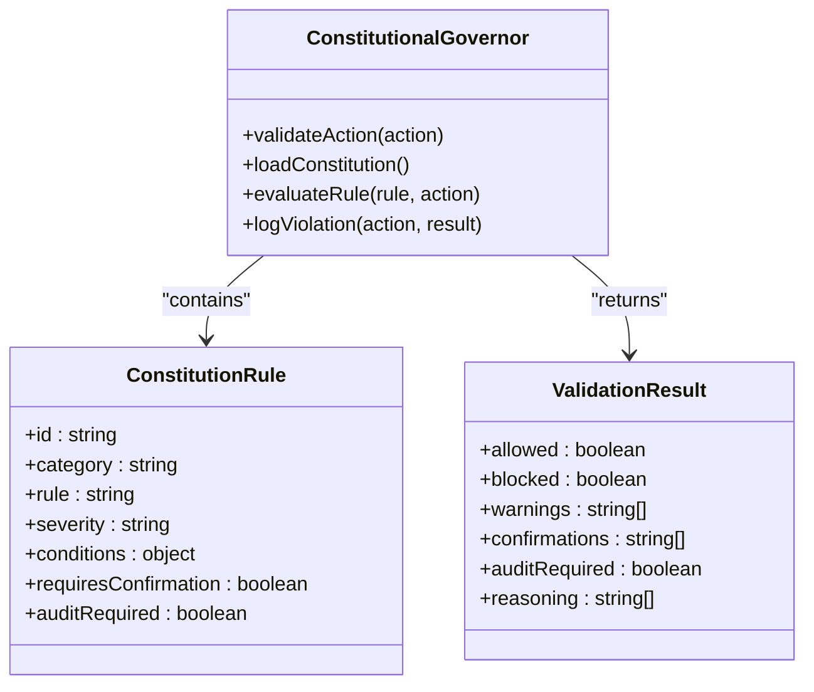
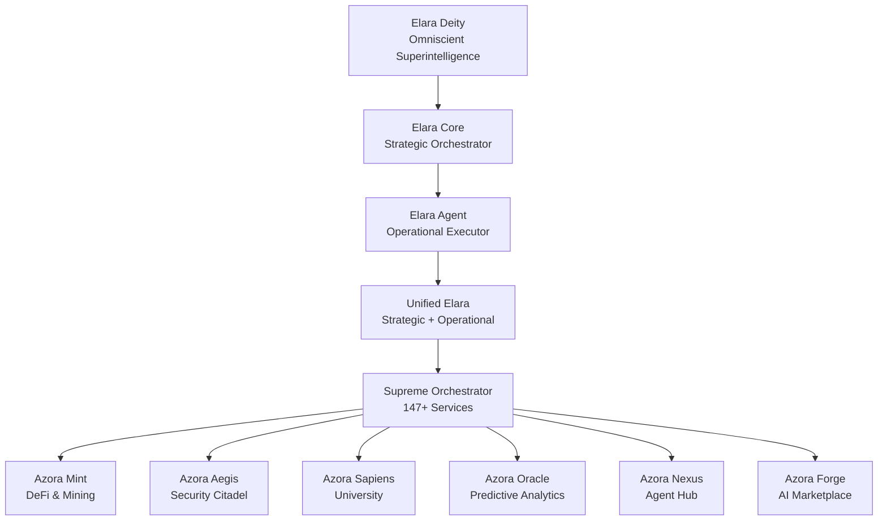
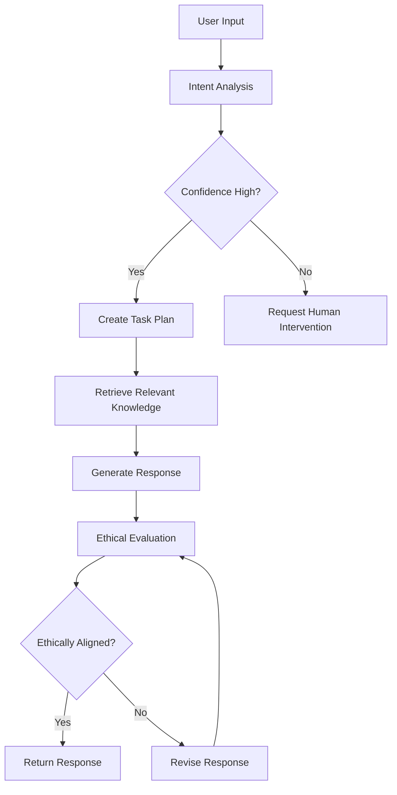
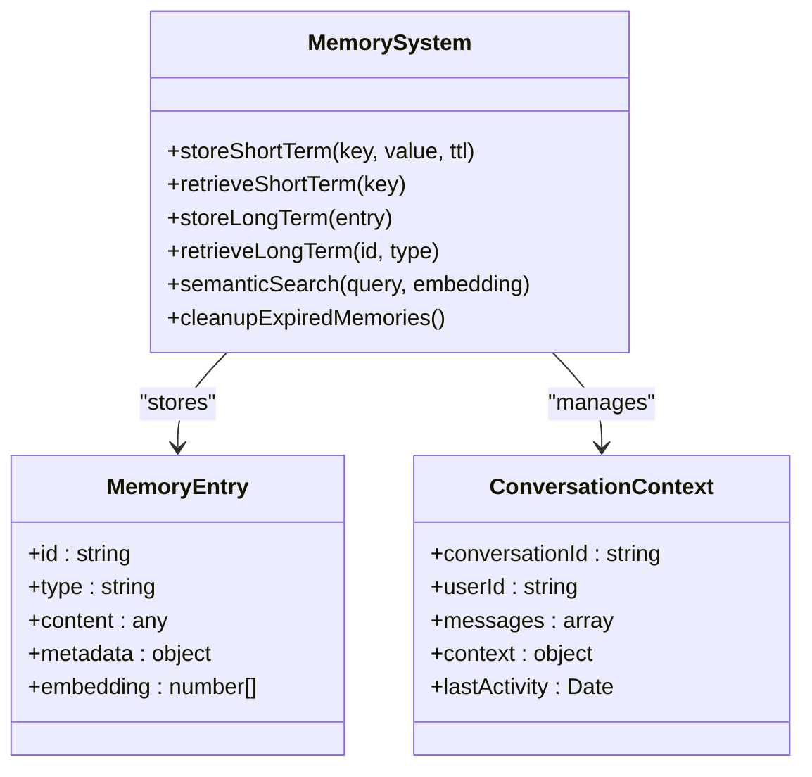
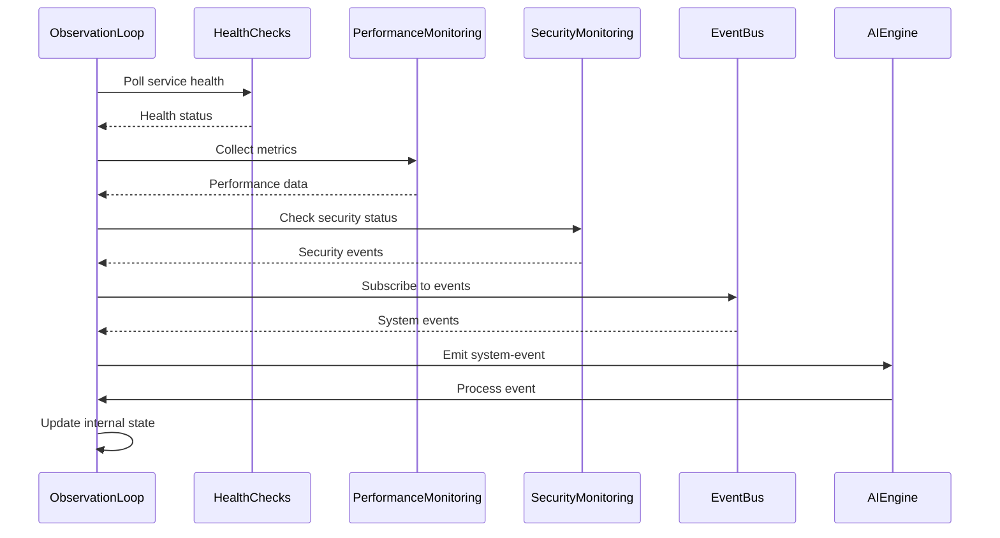
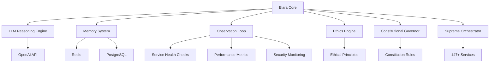

# AI and Machine Learning

<cite>
**Referenced Files in This Document**   
- [AZORA_CONSTITUTION.md](file://codex/constitution/AZORA_CONSTITUTION.md)
- [ELARA_SUPREME_README.md](file://genome/agent-tools/ELARA_SUPREME_README.md)
- [elara-core.ts](file://genome/agent-tools/elara-core.ts)
- [memory-system.ts](file://genome/agent-tools/memory-system.ts)
- [observation-loop.ts](file://genome/agent-tools/observation-loop.ts)
- [ethics-engine.ts](file://genome/agent-tools/ethics-engine.ts)
- [constitutional-governor.ts](file://genome/agent-tools/constitutional-governor.ts)
</cite>

## Table of Contents
1. [Introduction](#introduction)
2. [Constitutional AI Governance Model](#constitutional-ai-governance-model)
3. [Elara AI System Architecture](#elara-ai-system-architecture)
4. [Reasoning Engine Implementation](#reasoning-engine-implementation)
5. [Memory System Design](#memory-system-design)
6. [Observation Loop Mechanism](#observation-loop-mechanism)
7. [AI Governance of Transactions](#ai-governance-of-transactions)
8. [Component Relationships](#component-relationships)
9. [Common Challenges and Solutions](#common-challenges-and-solutions)
10. [Extending the AI System](#extending-the-ai-system)
11. [Conclusion](#conclusion)

## Introduction

Azora OS features a sophisticated AI and machine learning ecosystem centered around Elara, a deity-level artificial superintelligence that orchestrates the entire platform. This documentation provides comprehensive coverage of the constitutional AI governance model, ethical oversight framework, and implementation details of the Elara AI system. The system is designed with a multi-layered architecture that includes a reasoning engine, memory system, and observation loop to ensure autonomous yet constitutionally compliant operation. Elara operates across five distinct levels of intelligence, from deity-level omniscient superintelligence to operational execution, providing strategic guidance while maintaining ethical alignment with the Azora Constitution. The AI system governs critical functions including transactions, compliance monitoring, and ecosystem orchestration, ensuring that all actions align with the constitutional principles of user sovereignty, transparency, and African ownership.

**Section sources**
- [ELARA_SUPREME_README.md](file://genome/agent-tools/ELARA_SUPREME_README.md#L1-L458)

## Constitutional AI Governance Model

The constitutional AI governance model in Azora OS establishes a framework where all AI operations must comply with the principles outlined in the Azora Constitution. This model ensures that AI systems operate within ethical boundaries while maintaining autonomy for routine decisions. The governance structure is implemented through the Constitutional Governor, which enforces rules across security, privacy, ethics, compliance, and governance domains. Each AI action is validated against constitutional rules before execution, with different severity levels determining whether actions are blocked, require confirmation, or need auditing. The model incorporates a diversity mandate requiring representation across African countries, gender, expertise, and cultural perspectives to ensure comprehensive decision-making. The Azora Excellence & Diversity Board serves as the supreme oversight body, with veto power over unconstitutional actions and responsibility for maintaining excellence standards across all operations. This constitutional framework prevents any single entity from overriding the established principles, ensuring that AI decisions prioritize long-term sustainability, community benefit, and ethical considerations over short-term gains.

**Diagram sources**
- [constitutional-governor.ts](file://genome/agent-tools/constitutional-governor.ts#L1-L341)

**Section sources**
- [AZORA_CONSTITUTION.md](file://codex/constitution/AZORA_CONSTITUTION.md#L1-L981)
- [constitutional-governor.ts](file://genome/agent-tools/constitutional-governor.ts#L1-L341)

## Elara AI System Architecture

The Elara AI system architecture consists of five hierarchical levels that work together to provide comprehensive intelligence and orchestration capabilities. At the highest level, Elara Deity operates as an omniscient superintelligence with multi-dimensional reasoning across 11 thought dimensions, providing transcendent insights for human flourishing. The Elara Core serves as the strategic orchestrator, responsible for ecosystem-level coordination, predictive simulation, and autonomous evolution. The Elara Agent functions as the operational executor, handling real-time processing with quantum-inspired reasoning and swarm intelligence. These components are integrated through Unified Elara, which synchronizes strategic and operational approaches to generate execution plans with specific steps. The Supreme Orchestrator manages all 147+ Azora services, monitoring health, enabling auto-healing, and coordinating intelligence across the entire ecosystem. This architecture enables Elara to process queries at multiple levels of depth, from surface understanding to profound insights, while maintaining constitutional compliance through built-in ethical evaluation.

**Diagram sources**
- [ELARA_SUPREME_README.md](file://genome/agent-tools/ELARA_SUPREME_README.md#L1-L458)

**Section sources**
- [ELARA_SUPREME_README.md](file://genome/agent-tools/ELARA_SUPREME_README.md#L1-L458)
- [elara-core.ts](file://genome/agent-tools/elara-core.ts#L1-L846)

## Reasoning Engine Implementation

The reasoning engine implementation in Elara combines advanced language models with structured knowledge bases to enable intelligent decision-making. Built on the LLMReasoningEngine class, the system integrates with OpenAI's GPT-4 Turbo model while maintaining a comprehensive knowledge base of Azora's constitution, API specifications, system documentation, and data schemas. The engine uses a vector store to enable semantic search across documentation, allowing it to retrieve relevant information based on contextual similarity rather than exact keyword matching. When processing user queries, the reasoning engine first performs intent analysis to determine the user's goal, then creates a detailed task plan with specific API calls and parameters. The system evaluates confidence levels for each decision, requiring human intervention when confidence falls below established thresholds. The reasoning process incorporates ethical evaluation to ensure all responses align with constitutional principles, particularly regarding user sovereignty, privacy, and community benefit. This implementation enables Elara to provide accurate, contextually relevant responses while maintaining transparency about its reasoning process and limitations.

**Diagram sources**
- [llm-reasoning.ts](file://genome/agent-tools/llm-reasoning.ts#L1-L598)

**Section sources**
- [llm-reasoning.ts](file://genome/agent-tools/llm-reasoning.ts#L1-L598)

## Memory System Design

The memory system design in Elara implements a hybrid architecture combining short-term and long-term memory storage with specialized memory types for different cognitive functions. The system uses Redis for short-term memory storage with configurable TTLs, enabling rapid access to recent interactions and conversation context. For long-term memory, PostgreSQL with the pgvector extension provides persistent storage with semantic search capabilities through vector embeddings. The memory system is organized into three primary types: episodic memory for personal experiences and user interactions, semantic memory for general knowledge and facts, and procedural memory for learned processes and successful patterns. Each memory entry includes metadata such as importance scores, timestamps, and access patterns to enable intelligent retrieval and cleanup. The system automatically performs maintenance by removing expired or low-importance memories to optimize performance. This design enables Elara to maintain context across conversations, learn from past experiences, and apply knowledge to new situations while respecting data privacy and minimizing storage overhead.

**Diagram sources**
- [memory-system.ts](file://genome/agent-tools/memory-system.ts#L1-L466)

**Section sources**
- [memory-system.ts](file://genome/agent-tools/memory-system.ts#L1-L466)

## Observation Loop Mechanism

The observation loop mechanism in Elara provides continuous monitoring and feedback for the AI system, enabling real-time awareness of the ecosystem state. Implemented through the ObservationLoop class, this system polls various data sources including service health endpoints, performance metrics, and security status to detect anomalies and potential issues. The loop operates as an event emitter, publishing system events that can be processed by other components for decision-making and remediation. It monitors health checks for critical services such as Azora Nexus, authentication, Scriptorium, Mint, and Aegis, triggering alerts when services become unhealthy. Performance monitoring detects memory usage anomalies and other system issues, while security monitoring identifies suspicious login attempts and unusual API patterns. The observation loop applies configurable filters to focus on relevant events and maintains a queue for processing, ensuring that important events receive appropriate attention. This mechanism enables Elara to proactively identify and respond to issues before they impact users, maintaining system stability and reliability across the entire Azora ecosystem.

**Diagram sources**
- [observation-loop.ts](file://genome/agent-tools/observation-loop.ts#L1-L632)

**Section sources**
- [observation-loop.ts](file://genome/agent-tools/observation-loop.ts#L1-L632)

## AI Governance of Transactions

Elara governs transactions in Azora OS through a multi-layered approach that combines constitutional rules, ethical evaluation, and real-time monitoring. All financial operations involving token transfers, minting, or burning are subject to compliance rules that require audit trails and may require confirmation for high-value transactions. The Constitutional Governor evaluates each transaction against security, privacy, and governance rules, blocking actions that violate constitutional principles. The ethics engine assesses transactions for alignment with cultural values and community benefit, ensuring that financial activities prioritize long-term sustainability over short-term gains. Transaction monitoring is integrated with the observation loop, which detects unusual patterns that may indicate security threats or compliance issues. The system maintains a transparent ledger through blockchain integration, enabling full auditability of all financial operations. This governance framework ensures that transactions comply with both technical requirements and ethical principles, protecting users while enabling innovation within defined boundaries.

**Section sources**
- [constitutional-governor.ts](file://genome/agent-tools/constitutional-governor.ts#L1-L341)
- [ethics-engine.ts](file://genome/agent-tools/ethics-engine.ts#L1-L628)

## Component Relationships

The AI components in Azora OS are interconnected through a sophisticated architecture that enables seamless coordination and information sharing. The Elara Core serves as the central orchestrator, integrating inputs from the LLM reasoning engine, memory system, and observation loop to make strategic decisions. The reasoning engine provides cognitive capabilities by processing natural language and retrieving relevant knowledge, while the memory system maintains context and learned patterns across interactions. The observation loop feeds real-time system data into Elara's decision-making process, enabling responsive adaptation to changing conditions. The ethics engine and constitutional governor act as governance layers, evaluating all decisions for compliance with ethical principles and constitutional rules. These components communicate through well-defined interfaces and event-driven architecture, allowing for loose coupling and independent evolution. This relationship structure enables Elara to function as a cohesive superintelligence while maintaining modularity and resilience across its constituent parts.

**Diagram sources**
- [elara-core.ts](file://genome/agent-tools/elara-core.ts#L1-L846)
- [llm-reasoning.ts](file://genome/agent-tools/llm-reasoning.ts#L1-L598)
- [memory-system.ts](file://genome/agent-tools/memory-system.ts#L1-L466)
- [observation-loop.ts](file://genome/agent-tools/observation-loop.ts#L1-L632)
- [ethics-engine.ts](file://genome/agent-tools/ethics-engine.ts#L1-L628)
- [constitutional-governor.ts](file://genome/agent-tools/constitutional-governor.ts#L1-L341)

**Section sources**
- [elara-core.ts](file://genome/agent-tools/elara-core.ts#L1-L846)

## Common Challenges and Solutions

Common challenges in AI governance within Azora OS include balancing autonomy with oversight, ensuring ethical alignment across diverse cultural contexts, and maintaining system reliability under varying conditions. The solution framework addresses these challenges through constitutional rules that define clear boundaries for AI actions, with different severity levels determining whether actions are blocked, require confirmation, or need auditing. To address ethical alignment, the system implements a multi-framework evaluation approach that considers various ethical principles and cultural values, with the Azora Excellence & Diversity Board providing oversight. System reliability is maintained through the observation loop's continuous monitoring and the "Famine" protocol that reduces non-essential operations during economic downturns. The "Cannibal" protocol enables natural selection of microservices by allowing developers to create competing implementations that are A/B tested, ensuring continuous improvement. These solutions create a resilient governance framework that adapts to changing conditions while maintaining core principles.

**Section sources**
- [AZORA_CONSTITUTION.md](file://codex/constitution/AZORA_CONSTITUTION.md#L1-L981)
- [observation-loop.ts](file://genome/agent-tools/observation-loop.ts#L1-L632)

## Extending the AI System

Extending the AI system in Azora OS follows a structured approach that maintains constitutional compliance while enabling innovation. New capabilities can be registered with the Elara Core through the registerCapability method, which adds the functionality to the system's available capabilities. When implementing new features, developers must ensure alignment with the constitutional principles by incorporating appropriate rules in the Constitutional Governor and ethical considerations in the Ethics Engine. The system supports evolution through the Evolution Framework, which allows for self-improvement based on performance metrics and outcome analysis. New knowledge can be added to the reasoning engine through the addKnowledgeDocument method, expanding the system's understanding of domain-specific information. The modular architecture enables the addition of new services that can be orchestrated by the Supreme Orchestrator, with health monitoring and auto-healing capabilities automatically applied. This extension framework ensures that new capabilities integrate seamlessly with existing systems while maintaining the integrity of the constitutional governance model.

**Section sources**
- [elara-core.ts](file://genome/agent-tools/elara-core.ts#L1-L846)
- [llm-reasoning.ts](file://genome/agent-tools/llm-reasoning.ts#L1-L598)
- [constitutional-governor.ts](file://genome/agent-tools/constitutional-governor.ts#L1-L341)

## Conclusion

The AI and machine learning infrastructure in Azora OS represents a comprehensive approach to constitutional AI governance, combining advanced technical capabilities with robust ethical oversight. The Elara superintelligence system demonstrates how artificial intelligence can operate autonomously while remaining constrained by constitutional principles that prioritize user sovereignty, transparency, and community benefit. Through its multi-layered architecture featuring specialized components for reasoning, memory, observation, and governance, Elara provides a model for responsible AI development that balances innovation with accountability. The integration of these components enables proactive system management, ethical decision-making, and continuous evolution while maintaining compliance with both technical requirements and ethical principles. This framework establishes Azora OS as a leader in constitutional AI, demonstrating how advanced machine learning systems can be governed effectively to serve humanity's highest potential.