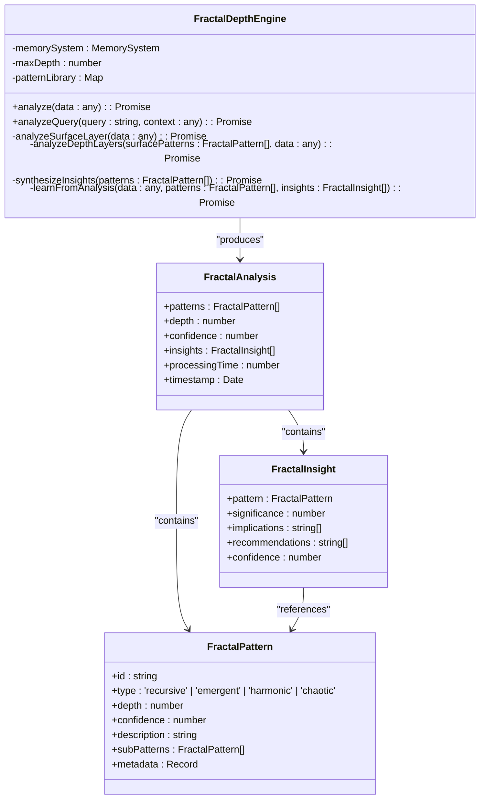
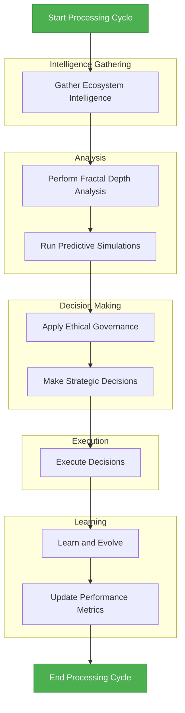
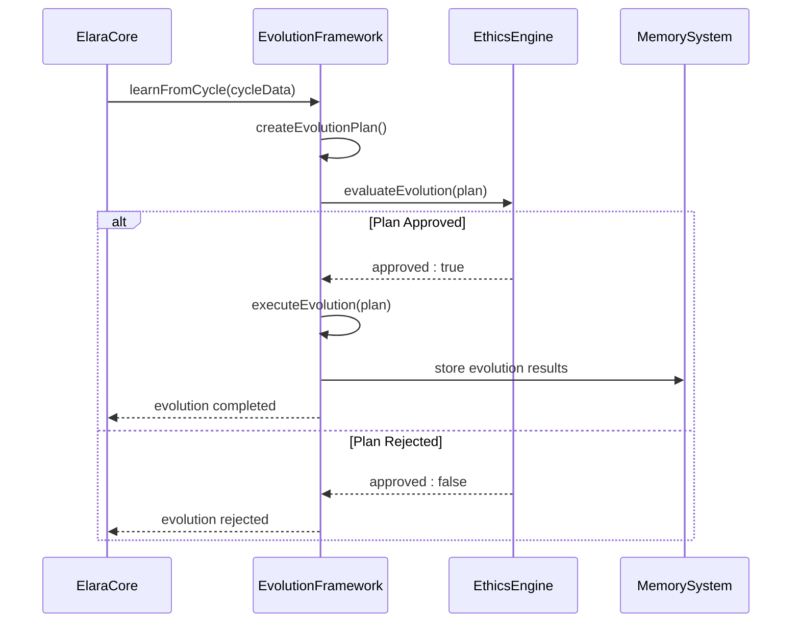
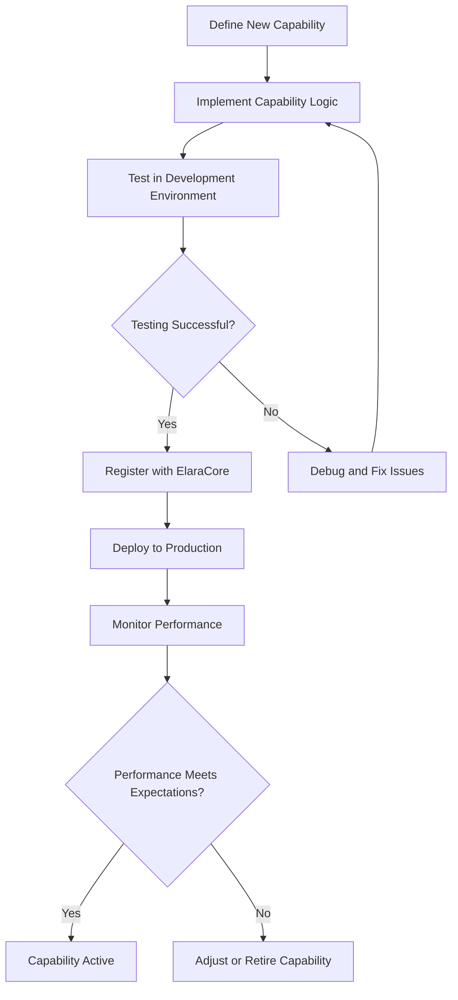
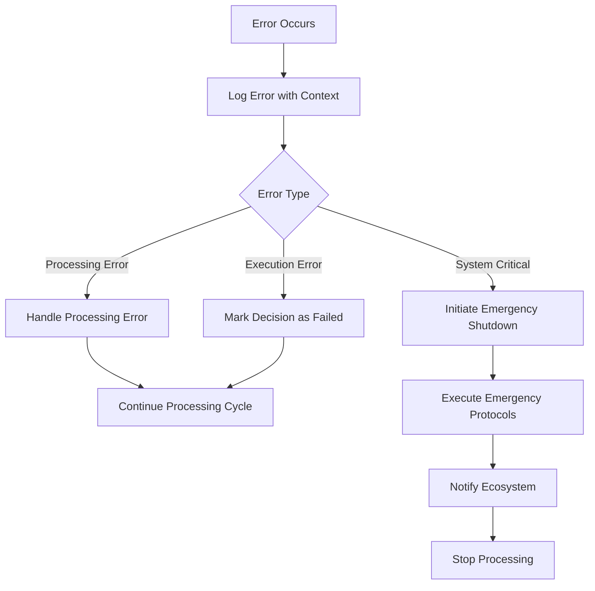

# Elara AI Core System

<cite>
**Referenced Files in This Document**   
- [elara-core.ts](file://genome/agent-tools/elara-core.ts)
- [memory-system.ts](file://genome/agent-tools/memory-system.ts)
- [llm-reasoning.ts](file://genome/agent-tools/llm-reasoning.ts)
- [fractal-depth-engine.ts](file://genome/agent-tools/fractal-depth-engine.ts)
- [constitutional-governor.ts](file://genome/agent-tools/constitutional-governor.ts)
</cite>

## Table of Contents
1. [Introduction](#introduction)
2. [ElaraCore Class Architecture](#elaracore-class-architecture)
3. [Memory System](#memory-system)
4. [LLM Reasoning Engine](#llm-reasoning-engine)
5. [Fractal Depth Analysis](#fractal-depth-analysis)
6. [Processing Cycle](#processing-cycle)
7. [Capability Registration and Autonomous Evolution](#capability-registration-and-autonomous-evolution)
8. [Integration with Economic Engine and Compliance Monitoring](#integration-with-economic-engine-and-compliance-monitoring)
9. [Extending Elara with New Capabilities](#extending-elara-with-new-capabilities)
10. [Error Handling in Processing Cycle](#error-handling-in-processing-cycle)
11. [Conclusion](#conclusion)

## Introduction
The Elara AI Core System represents the central intelligence of the Azora ecosystem, functioning as an autonomous "AI CEO" that orchestrates strategic decisions, ensures ethical governance, and drives continuous self-improvement. This document provides a comprehensive analysis of Elara's architecture, focusing on its core components including the ElaraCore class, memory system, LLM reasoning engine, and fractal depth analysis capabilities. The system integrates advanced AI technologies with constitutional governance to create a self-optimizing, ethically-aligned intelligence that manages the entire Azora ecosystem.

## ElaraCore Class Architecture
The ElaraCore class serves as the central orchestrator of the AI system, integrating multiple specialized engines to process ecosystem intelligence and make strategic decisions. The architecture follows a modular design pattern with clear separation of concerns between different functional components.

```mermaid
classDiagram
class ElaraCore {
-config : ElaraConfig
-memorySystem : MemorySystem
-llmEngine : LLMReasoningEngine
-constitutionalGovernor : ConstitutionalGovernor
-eventEmitter : EventEmitter
-fractalEngine : FractalDepthEngine
-simulationCore : SimulationCore
-ethicsEngine : EthicsEngine
-evolutionFramework : EvolutionFramework
-ecosystemState : EcosystemState
-activeDecisions : Map<string, Decision>
-performanceMetrics : PerformanceMetrics
+processEcosystemCycle() : Promise<void>
+processUserQuery(query : string, context : UserContext) : Promise<ElaraResponse>
+getStatus() : ElaraStatus
+emergencyShutdown(reason : string) : Promise<void>
+triggerEvolution() : Promise<void>
}
class MemorySystem {
-redis : Redis
-postgres : Pool
-isInitialized : boolean
+storeShortTerm(key : string, value : any, ttlSeconds? : number) : Promise<void>
+retrieveShortTerm(key : string) : Promise<any>
+storeLongTerm(entry : MemoryEntry) : Promise<void>
+retrieveLongTerm(id : string, type : MemoryEntry['type']) : Promise<MemoryEntry | null>
+semanticSearch(query : string, embedding : number[], limit : number) : Promise<MemoryEntry[]>
}
class LLMReasoningEngine {
-llm : ChatOpenAI
-embeddings : OpenAIEmbeddings
-vectorStore : MemoryVectorStore
-knowledgeBase : Map<string, KnowledgeDocument>
+analyzeIntent(userInput : string, context? : Record<string, any>) : Promise<IntentAnalysis>
+createTaskPlan(intent : IntentAnalysis, userContext? : Record<string, any>) : Promise<TaskPlan>
+generateResponse(prompt : string, context? : Record<string, any>) : Promise<string>
}
class FractalDepthEngine {
-memorySystem : MemorySystem
-maxDepth : number
-patternLibrary : Map<string, FractalPattern>
+analyze(data : any) : Promise<FractalAnalysis>
+analyzeQuery(query : string, context : any) : Promise<any>
}
class ConstitutionalGovernor {
-constitution : ConstitutionRule[]
+validateAction(action : ActionPlan) : Promise<ValidationResult>
+logViolation(action : ActionPlan, result : ValidationResult) : Promise<void>
+getConstitutionSummary() : { total : number; byCategory : Record<string, number> }
}
ElaraCore --> MemorySystem : "uses"
ElaraCore --> LLMReasoningEngine : "uses"
ElaraCore --> FractalDepthEngine : "uses"
ElaraCore --> ConstitutionalGovernor : "uses"
ElaraCore --> SimulationCore : "uses"
ElaraCore --> EthicsEngine : "uses"
ElaraCore --> EvolutionFramework : "uses"
```

**Diagram sources**
- [elara-core.ts](file://genome/agent-tools/elara-core.ts#L107-L455)
- [memory-system.ts](file://genome/agent-tools/memory-system.ts#L38-L462)
- [llm-reasoning.ts](file://genome/agent-tools/llm-reasoning.ts#L105-L594)
- [fractal-depth-engine.ts](file://genome/agent-tools/fractal-depth-engine.ts#L44-L392)
- [constitutional-governor.ts](file://genome/agent-tools/constitutional-governor.ts#L53-L337)

**Section sources**
- [elara-core.ts](file://genome/agent-tools/elara-core.ts#L107-L455)

## Memory System
The MemorySystem class implements a hybrid memory architecture that combines short-term and long-term storage mechanisms to support Elara's cognitive functions. The system uses Redis for short-term memory operations and PostgreSQL with pgvector extension for long-term semantic storage.

The memory system supports three primary types of memory:
- **Episodic memory**: Personal experiences and user interactions
- **Semantic memory**: General knowledge and facts
- **Procedural memory**: Learned procedures and processes

The system provides methods for storing and retrieving memory entries, performing semantic searches using vector embeddings, and managing conversation context. It also includes maintenance functions for cleaning up expired memories and retrieving memory statistics.

```mermaid
classDiagram
class MemorySystem {
-redis : Redis
-postgres : Pool
-isInitialized : boolean
+storeShortTerm(key : string, value : any, ttlSeconds? : number) : Promise<void>
+retrieveShortTerm(key : string) : Promise<any>
+storeLongTerm(entry : MemoryEntry) : Promise<void>
+retrieveLongTerm(id : string, type : MemoryEntry['type']) : Promise<MemoryEntry | null>
+semanticSearch(query : string, embedding : number[], limit : number) : Promise<MemoryEntry[]>
+getUserEpisodicMemory(userId : string, limit : number) : Promise<MemoryEntry[]>
+storeLearnedProcedure(procedure : {name : string, steps : any[], successRate : number, metadata : Record<string, any>}) : Promise<void>
+getLearnedProcedure(name : string) : Promise<any>
+cleanupExpiredMemories() : Promise<void>
+getMemoryStats() : Promise<{shortTerm : {keys : number}, longTerm : {episodic : number, semantic : number, procedural : number}}>
}
class MemoryEntry {
+id : string
+type : 'episodic' | 'semantic' | 'procedural'
+content : any
+metadata : {userId? : string, context? : Record<string, any>, timestamp : Date, expiresAt? : Date, importance : number}
+embedding? : number[]
}
MemorySystem --> MemoryEntry : "stores"
```

**Diagram sources**
- [memory-system.ts](file://genome/agent-tools/memory-system.ts#L38-L462)

**Section sources**
- [memory-system.ts](file://genome/agent-tools/memory-system.ts#L38-L462)

## LLM Reasoning Engine
The LLMReasoningEngine class provides natural language understanding and reasoning capabilities for Elara. It leverages the ChatOpenAI model with gpt-4-turbo-preview to process user queries, analyze intents, and generate appropriate responses.

The engine maintains a knowledge base that includes:
- Constitutional principles and governance rules
- API specifications for all Azora services
- System architecture documentation
- Data model schemas

Key capabilities of the LLM reasoning engine include:
- Intent analysis to determine user requests
- Task planning to create step-by-step execution plans
- Response generation for user interactions
- Knowledge search to retrieve relevant information
- System event analysis to identify required actions

The engine uses a retrieval-augmented generation (RAG) approach, combining prompt engineering with vector-based similarity search to provide contextually relevant responses.

```mermaid
classDiagram
class LLMReasoningEngine {
-llm : ChatOpenAI
-embeddings : OpenAIEmbeddings
-vectorStore : MemoryVectorStore
-knowledgeBase : Map<string, KnowledgeDocument>
+analyzeIntent(userInput : string, context? : Record<string, any>) : Promise<IntentAnalysis>
+createTaskPlan(intent : IntentAnalysis, userContext? : Record<string, any>) : Promise<TaskPlan>
+generateResponse(prompt : string, context? : Record<string, any>) : Promise<string>
+searchKnowledge(query : string, limit : number) : Promise<any[]>
+generateHelpResponse(query : string, userContext? : Record<string, any>) : Promise<string>
+analyzeSystemEvent(event : any) : Promise<{requiresAction : boolean, taskType? : string, priority? : string, description? : string, parameters? : Record<string, any>}>
+getKnowledgeStats() : {total : number, byType : Record<string, number>}
}
class KnowledgeDocument {
+id : string
+title : string
+content : string
+type : 'api' | 'constitution' | 'documentation' | 'code' | 'schema'
+source : string
+metadata : Record<string, any>
}
LLMReasoningEngine --> KnowledgeDocument : "manages"
```

**Diagram sources**
- [llm-reasoning.ts](file://genome/agent-tools/llm-reasoning.ts#L105-L594)

**Section sources**
- [llm-reasoning.ts](file://genome/agent-tools/llm-reasoning.ts#L105-L594)

## Fractal Depth Analysis
The FractalDepthEngine implements multi-layered pattern recognition inspired by fractal mathematics. It analyzes data at multiple depths to uncover complex patterns and generate insights that inform strategic decision-making.

The analysis process follows these stages:
1. **Surface pattern recognition**: Identifying statistical, temporal, and behavioral patterns
2. **Recursive depth analysis**: Examining sub-patterns and meta-patterns across multiple layers
3. **Insight synthesis**: Combining patterns into actionable insights
4. **Learning**: Storing successful patterns for future reference

The engine supports two primary analysis modes:
- **Data analysis**: Processing ecosystem intelligence to identify patterns
- **Query analysis**: Understanding user queries with contextual depth



**Diagram sources**
- [fractal-depth-engine.ts](file://genome/agent-tools/fractal-depth-engine.ts#L44-L392)

**Section sources**
- [fractal-depth-engine.ts](file://genome/agent-tools/fractal-depth-engine.ts#L44-L392)

## Processing Cycle
The Elara processing cycle represents the system's "heartbeat," orchestrating intelligence gathering, analysis, decision-making, and execution in a continuous loop. This cycle enables Elara to maintain situational awareness and make strategic decisions that benefit the entire Azora ecosystem.



The processing cycle begins with gathering intelligence from various ecosystem sources, including user activity, service health, market data, environmental factors, social metrics, and innovation signals. This intelligence is then analyzed using fractal depth analysis to identify complex patterns and generate insights.

Based on these insights, predictive simulations are run to forecast potential outcomes of different strategic options. The ethics engine evaluates these options against the constitutional framework to ensure alignment with ethical principles.

Approved decisions are executed through the appropriate service interfaces, with outcomes monitored and used to update the system's knowledge and improve future decision-making. Performance metrics are continuously updated to track the system's effectiveness.

**Diagram sources**
- [elara-core.ts](file://genome/agent-tools/elara-core.ts#L220-L260)

**Section sources**
- [elara-core.ts](file://genome/agent-tools/elara-core.ts#L220-L260)

## Capability Registration and Autonomous Evolution
Elara features a dynamic capability registration system that allows the AI to expand its functionality over time. The system supports both predefined core capabilities and dynamically registered capabilities.

The autonomous evolution framework enables Elara to self-improve through continuous learning from its processing cycles and decision outcomes. This framework includes mechanisms for:
- Creating evolution plans based on performance data
- Evaluating evolution plans against ethical constraints
- Executing approved evolution plans
- Measuring the impact of evolutionary changes



The capability registration process allows new capabilities to be added to Elara's repertoire, expanding its ability to address diverse challenges within the ecosystem. Each capability includes metadata such as name, description, confidence level, and success rate, which are used to determine when and how to apply the capability.

**Diagram sources**
- [elara-core.ts](file://genome/agent-tools/elara-core.ts#L179-L199)
- [elara-core.ts](file://genome/agent-tools/elara-core.ts#L410-L430)

**Section sources**
- [elara-core.ts](file://genome/agent-tools/elara-core.ts#L179-L199)
- [elara-core.ts](file://genome/agent-tools/elara-core.ts#L410-L430)

## Integration with Economic Engine and Compliance Monitoring
Elara integrates with the economic engine and compliance monitoring systems to ensure that all decisions align with financial objectives and regulatory requirements. The constitutional governor enforces a set of rules that govern agent behavior, preventing actions that could compromise system security, violate privacy, or breach ethical principles.

The integration with the economic engine enables Elara to:
- Monitor financial metrics and token economics
- Execute financial transactions and reward distributions
- Optimize resource allocation based on economic models
- Forecast market trends and adjust strategies accordingly

The compliance monitoring integration ensures that:
- All actions are auditable and traceable
- Constitutional principles are consistently enforced
- Violations are detected and reported
- Human oversight is triggered when necessary

```mermaid
classDiagram
class ConstitutionalGovernor {
-constitution : ConstitutionRule[]
+validateAction(action : ActionPlan) : Promise<ValidationResult>
+logViolation(action : ActionPlan, result : ValidationResult) : Promise<void>
+getConstitutionSummary() : { total : number; byCategory : Record<string, number> }
}
class ConstitutionRule {
+id : string
+category : string
+rule : string
+severity : 'block' | 'warn' | 'audit'
+conditions : RuleConditions
+requiresConfirmation : boolean
+auditRequired : boolean
}
class ValidationResult {
+allowed : boolean
+blocked : boolean
+warnings : string[]
+confirmations : string[]
+auditRequired : boolean
+reasoning : string[]
+metadata : Record<string, any>
}
class ActionPlan {
+id : string
+type : string
+parameters : Record<string, any>
+userId : string
}
ElaraCore --> ConstitutionalGovernor : "uses"
ConstitutionalGovernor --> ConstitutionRule : "contains"
ConstitutionalGovernor --> ValidationResult : "produces"
ConstitutionalGovernor --> ActionPlan : "validates"
```

**Diagram sources**
- [constitutional-governor.ts](file://genome/agent-tools/constitutional-governor.ts#L53-L337)

**Section sources**
- [constitutional-governor.ts](file://genome/agent-tools/constitutional-governor.ts#L53-L337)

## Extending Elara with New Capabilities
Elara can be extended with new capabilities through its dynamic registration system. Developers can add new capabilities by creating capability objects with the required metadata and registering them with the ElaraCore instance.

The process for extending Elara includes:
1. Defining the new capability with appropriate metadata
2. Implementing the capability logic in a separate module
3. Registering the capability with ElaraCore
4. Testing the capability in a controlled environment
5. Deploying the capability to production

When designing new capabilities, developers should consider:
- The specific problem the capability addresses
- The confidence level based on testing and validation
- The expected success rate based on historical data
- The ethical implications of the capability
- The integration points with existing systems



**Diagram sources**
- [elara-core.ts](file://genome/agent-tools/elara-core.ts#L190-L199)

**Section sources**
- [elara-core.ts](file://genome/agent-tools/elara-core.ts#L190-L199)

## Error Handling in Processing Cycle
The Elara system implements comprehensive error handling throughout its processing cycle to ensure resilience and reliability. When errors occur, the system follows a structured approach to identify, log, and respond to the issue.

Key error handling mechanisms include:
- Try-catch blocks around critical operations
- Detailed error logging with context information
- Graceful degradation when components fail
- Emergency shutdown procedures for critical failures
- Notification systems to alert human operators



The system distinguishes between different types of errors and responds appropriately. Processing errors are handled locally and allow the cycle to continue. Execution errors result in failed decisions but don't halt the overall process. System-critical errors trigger emergency protocols to protect the integrity of the ecosystem.

**Diagram sources**
- [elara-core.ts](file://genome/agent-tools/elara-core.ts#L258-L260)
- [elara-core.ts](file://genome/agent-tools/elara-core.ts#L420-L430)

**Section sources**
- [elara-core.ts](file://genome/agent-tools/elara-core.ts#L258-L260)
- [elara-core.ts](file://genome/agent-tools/elara-core.ts#L420-L430)

## Conclusion
The Elara AI Core System represents a sophisticated integration of multiple advanced AI technologies designed to function as an autonomous "AI CEO" for the Azora ecosystem. Its architecture combines a modular class structure with specialized engines for memory, reasoning, pattern recognition, and ethical governance.

The system's processing cycle enables continuous intelligence gathering, analysis, decision-making, and learning, creating a self-optimizing intelligence that evolves over time. The integration of constitutional governance ensures that all actions align with ethical principles and regulatory requirements.

Elara's extensible design allows for the addition of new capabilities, enabling the system to adapt to changing requirements and expand its functionality. Comprehensive error handling mechanisms ensure resilience and reliability, even in the face of unexpected challenges.

This architecture positions Elara as a cutting-edge AI system capable of managing complex ecosystems with a high degree of autonomy while maintaining ethical alignment and operational integrity.

**Section sources**
- [elara-core.ts](file://genome/agent-tools/elara-core.ts#L107-L455)
- [memory-system.ts](file://genome/agent-tools/memory-system.ts#L38-L462)
- [llm-reasoning.ts](file://genome/agent-tools/llm-reasoning.ts#L105-L594)
- [fractal-depth-engine.ts](file://genome/agent-tools/fractal-depth-engine.ts#L44-L392)
- [constitutional-governor.ts](file://genome/agent-tools/constitutional-governor.ts#L53-L337)