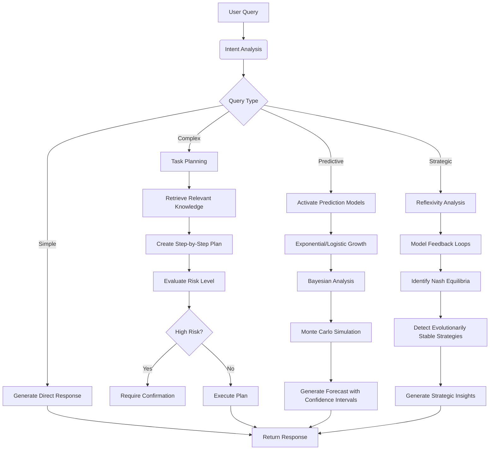

# LLM Reasoning Engine

<cite>
**Referenced Files in This Document**   
- [llm-reasoning.ts](file://genome/agent-tools/llm-reasoning.ts)
- [ethics-engine.ts](file://genome/agent-tools/ethics-engine.ts)
- [memory-system.ts](file://genome/agent-tools/memory-system.ts)
- [prediction-models.ts](file://genome/agent-tools/prediction-models.ts)
- [reflexivity-game-theory-engine.ts](file://genome/agent-tools/reflexivity-game-theory-engine.ts)
</cite>

## Table of Contents
1. [Introduction](#introduction)
2. [LLMReasoning Class Architecture](#llmreasoning-class-architecture)
3. [Prompt Engineering](#prompt-engineering)
4. [Causal Inference and Game Theory-Based Decision Modeling](#causal-inference-and-game-theory-based-decision-modeling)
5. [Multi-Layer Reasoning Process](#multi-layer-reasoning-process)
6. [Integration with Memory System](#integration-with-memory-system)
7. [Integration with Ethics Engine](#integration-with-ethics-engine)
8. [Latency Optimization and Cost Management](#latency-optimization-and-cost-management)
9. [Fallback Strategies](#fallback-strategies)
10. [Extensibility and Configuration](#extensibility-and-configuration)
11. [Conclusion](#conclusion)

## Introduction

The Elara AI reasoning engine represents a sophisticated multi-layered architecture designed to process complex user queries through advanced reasoning mechanisms. This document provides a comprehensive analysis of the LLMReasoning class architecture, detailing its integration with causal inference, game theory-based decision modeling, memory systems, and ethics engines. The engine processes user queries through multiple reasoning layers, incorporating prediction models and reflexivity analysis to deliver context-aware, ethically-aligned responses while optimizing for performance and reliability.

**Section sources**
- [llm-reasoning.ts](file://genome/agent-tools/llm-reasoning.ts#L105-L594)

## LLMReasoning Class Architecture

The LLMReasoningEngine class serves as the core component of the Elara AI reasoning system, orchestrating complex decision-making processes through a structured architecture. The engine initializes with a GPT-4 Turbo model configuration, establishing connections to both OpenAI's language model and embedding services. It maintains a comprehensive knowledge base that includes constitutional principles, API specifications, system documentation, and data schemas, enabling contextually rich responses.

The architecture follows a modular design with distinct components for intent analysis, task planning, knowledge management, and response generation. The engine employs a vector store for efficient similarity searches across its knowledge base, allowing it to retrieve relevant information when processing user queries. This design enables the system to analyze user intent, create detailed task plans, and generate appropriate responses while maintaining awareness of the broader system context.

```mermaid
classDiagram
class LLMReasoningEngine {
-llm : ChatOpenAI
-embeddings : OpenAIEmbeddings
-vectorStore : MemoryVectorStore
-knowledgeBase : Map<string, KnowledgeDocument>
+analyzeIntent(userInput : string, context? : Record<string, any>) : Promise<IntentAnalysis>
+createTaskPlan(intent : IntentAnalysis, userContext? : Record<string, any>) : Promise<TaskPlan>
+generateResponse(prompt : string, context? : Record<string, any>) : Promise<string>
+searchKnowledge(query : string, limit : number) : Promise<any[]>
+generateHelpResponse(query : string, userContext? : Record<string, any>) : Promise<string>
+analyzeSystemEvent(event : any) : Promise<{requiresAction : boolean, taskType? : string, priority? : string, description? : string, parameters? : Record<string, any>}>
+getKnowledgeStats() : {total : number, byType : Record<string, number>}
}
class MemoryVectorStore {
-documents : Document[]
+addDocuments(docs : Document[]) : Promise<void>
+similaritySearch(query : string, k : number) : Promise<Document[]>
}
class PromptTemplate {
-template : string
+fromTemplate(template : string) : PromptTemplate
+invoke(vars : Record<string, any>) : string
}
class StringOutputParser {
+parse(text : string) : string
}
class RunnableSequence {
-steps : any[]
+from(steps : any[]) : RunnableSequence
+invoke(input : any) : Promise<any>
}
LLMReasoningEngine --> MemoryVectorStore : "uses"
LLMReasoningEngine --> PromptTemplate : "uses"
LLMReasoningEngine --> StringOutputParser : "uses"
LLMReasoningEngine --> RunnableSequence : "uses"
```

**Diagram sources**
- [llm-reasoning.ts](file://genome/agent-tools/llm-reasoning.ts#L105-L594)

**Section sources**
- [llm-reasoning.ts](file://genome/agent-tools/llm-reasoning.ts#L105-L594)

## Prompt Engineering

The Elara reasoning engine employs sophisticated prompt engineering techniques to guide the LLM toward desired outputs. The system uses templated prompts with structured variables that are dynamically populated based on context. These templates are designed to elicit specific response formats, particularly JSON structures that can be programmatically parsed and acted upon.

For intent analysis, the engine uses a prompt template that instructs the LLM to identify user intent from a predefined set of actions, including balance inquiries, course enrollment, profile viewing, transaction history requests, help requests, system status checks, course progress tracking, and achievement viewing. The prompt explicitly requests a JSON response containing the intent, confidence score, parameters, and contextual information.

Task planning utilizes another specialized prompt template that guides the LLM to create detailed step-by-step plans based on the identified intent. This template incorporates relevant knowledge retrieved from the vector store, ensuring that task plans are grounded in accurate system capabilities. The output format is strictly defined as JSON with specific fields for description, steps (including tool, operation, and parameters), estimated duration, and risk level.

The engine also employs prompt templates for system event analysis, where the LLM evaluates whether a system event requires agent action. This prompt considers multiple factors including errors, performance issues, security concerns, and optimization opportunities, again requiring a structured JSON response.

**Section sources**
- [llm-reasoning.ts](file://genome/agent-tools/llm-reasoning.ts#L105-L594)

## Causal Inference and Game Theory-Based Decision Modeling

The Elara reasoning engine incorporates advanced causal inference and game theory-based decision modeling through its integration with specialized components. The ReflexivityGameTheoryEngine implements George Soros's Theory of Reflexivity and Evolutionary Game Theory for strategic market positioning and competitor modeling. This engine models market participants with detailed profiles including market share, strategy types, resource allocations, behavioral biases, and historical actions.

The game theory framework evaluates multiple strategy types including aggressive, defensive, cooperative, predatory, and innovative approaches, each with configurable parameters and adaptability metrics. The system calculates payoff matrices based on market conditions and participant interactions, identifying Nash Equilibria and Evolutionarily Stable Strategies (ESS) that represent optimal decision points.

Causal inference is implemented through the detection of reflexive feedback loops, where market participants' actions create feedback that changes market fundamentals. The engine identifies positive feedback loops (self-reinforcing cycles), negative feedback loops (self-correcting mechanisms), and balancing loops that maintain system stability. These causal relationships are analyzed across multiple simulation rounds, with the system tracking how participant behaviors evolve in response to changing market conditions.

```mermaid
classDiagram
class ReflexivityGameTheoryEngine {
-eventEmitter : EventEmitter
-currentGameState : GameState
-simulations : Map<string, ReflexiveSimulation>
-evolutionEngine : EvolutionaryEngine
+runReflexiveSimulation(scenario : string, rounds : number, participants? : MarketParticipant[]) : Promise<ReflexiveSimulation>
+simulateRound(simulation : ReflexiveSimulation, round : number) : Promise<SimulationResult>
+simulateParticipantBehavior(participant : MarketParticipant, marketState : MarketConditions, round : number) : Promise<ParticipantState>
+detectReflexiveFeedback(result : SimulationResult) : Promise<ReflexiveFeedback[]>
+generateReflexiveInsights(simulation : ReflexiveSimulation) : Promise<ReflexiveInsight[]>
}
class EvolutionaryEngine {
+selectStrategy(participant : MarketParticipant, marketState : MarketConditions, competitors : MarketParticipant[]) : Promise<MarketStrategy>
+generateStrategyVariants(baseStrategy : MarketStrategy) : MarketStrategy[]
+evaluateStrategyFitness(strategy : MarketStrategy, marketState : MarketConditions, competitors : MarketParticipant[]) : number
}
class MarketParticipant {
+id : string
+name : string
+marketShare : number
+strategy : MarketStrategy
+resources : ResourceProfile
+behavioralBiases : BehavioralBias[]
+historicalActions : HistoricalAction[]
}
class MarketStrategy {
+type : 'aggressive' | 'defensive' | 'cooperative' | 'predatory' | 'innovative'
+parameters : Record<string, number>
+adaptability : number
+riskTolerance : number
}
class ResourceProfile {
+capital : number
+technology : number
+brand : number
+network : number
+humanCapital : number
}
class GameState {
+participants : MarketParticipant[]
+marketConditions : MarketConditions
+payoffMatrix : PayoffMatrix
+currentRound : number
+history : GameHistory[]
}
class MarketConditions {
+demand : number
+supply : number
+competition : number
+regulation : number
+technology : number
+economicCycle : 'expansion' | 'contraction' | 'recession' | 'recovery'
}
ReflexivityGameTheoryEngine --> EvolutionaryEngine : "uses"
ReflexivityGameTheoryEngine --> MarketParticipant : "models"
ReflexivityGameTheoryEngine --> MarketStrategy : "uses"
ReflexivityGameTheoryEngine --> ResourceProfile : "uses"
ReflexivityGameTheoryEngine --> GameState : "manages"
ReflexivityGameTheoryEngine --> MarketConditions : "evaluates"
```



**Diagram sources**
- [reflexivity-game-theory-engine.ts](file://genome/agent-tools/reflexivity-game-theory-engine.ts#L102-L858)

**Section sources**
- [reflexivity-game-theory-engine.ts](file://genome/agent-tools/reflexivity-game-theory-engine.ts#L102-L858)

## Multi-Layer Reasoning Process

The Elara reasoning engine processes user queries through a sophisticated multi-layer reasoning process that combines immediate response generation with deeper analytical capabilities. The process begins with intent analysis, where the system determines the user's request from a predefined set of actions. This initial layer employs pattern recognition and contextual understanding to classify the query accurately.

Following intent identification, the engine engages in task planning, creating detailed step-by-step execution plans that specify the required tools, operations, and parameters. This planning layer retrieves relevant knowledge from the vector store, ensuring that task plans are grounded in accurate system capabilities and constraints. The system evaluates the risk level of each proposed action, with high-risk operations requiring explicit confirmation.

For complex queries, the engine activates prediction models that employ mathematical frameworks to forecast outcomes. These models include exponential growth for technology acceleration, logistic growth for adoption curves, and Bayesian analysis for ethical certainty calculations. Monte Carlo simulations provide confidence intervals around predictions, accounting for uncertainty in complex systems.

The deepest reasoning layer involves reflexivity analysis, where the system models how its actions might influence market fundamentals and participant behaviors. This meta-cognitive layer considers second-order effects and feedback loops, enabling the engine to anticipate how its decisions might change the very conditions it's responding to.



**Diagram sources**
- [llm-reasoning.ts](file://genome/agent-tools/llm-reasoning.ts#L105-L594)
- [prediction-models.ts](file://genome/agent-tools/prediction-models.ts#L1-L214)
- [reflexivity-game-theory-engine.ts](file://genome/agent-tools/reflexivity-game-theory-engine.ts#L102-L858)

**Section sources**
- [llm-reasoning.ts](file://genome/agent-tools/llm-reasoning.ts#L105-L594)
- [prediction-models.ts](file://genome/agent-tools/prediction-models.ts#L1-L214)
- [reflexivity-game-theory-engine.ts](file://genome/agent-tools/reflexivity-game-theory-engine.ts#L102-L858)

## Integration with Memory System

The Elara reasoning engine integrates deeply with a sophisticated memory system that combines short-term and long-term storage mechanisms. The memory architecture employs Redis for short-term storage of conversation contexts and frequently accessed data, with PostgreSQL serving as the long-term repository for persistent knowledge. This hybrid approach optimizes for both performance and durability.

The memory system organizes information into three distinct types: episodic memory for personal experiences and user interactions, semantic memory for general knowledge and system documentation, and procedural memory for learned processes and successful patterns. Each memory entry includes metadata such as importance scores, timestamps, and access patterns, enabling intelligent retrieval and prioritization.

When processing user queries, the reasoning engine first checks short-term memory for relevant conversation context, maintaining coherence across multiple interactions. For knowledge-intensive tasks, it performs semantic searches across the long-term memory store, using vector embeddings to find conceptually related information. The system also retrieves relevant episodic memories, such as previous user interactions or successful resolution patterns, to inform current decision-making.

The integration enables context-aware reasoning by allowing the engine to recall past interactions, user preferences, and previously successful strategies. This memory-augmented approach significantly enhances the quality of responses, as the system can draw upon accumulated experience rather than treating each query in isolation.

```mermaid
classDiagram
class MemorySystem {
-redis : Redis
-postgres : Pool
-isInitialized : boolean
+storeShortTerm(key : string, value : any, ttlSeconds? : number) : Promise<void>
+retrieveShortTerm(key : string) : Promise<any>
+storeLongTerm(entry : MemoryEntry) : Promise<void>
+retrieveLongTerm(id : string, type : MemoryEntry['type']) : Promise<MemoryEntry | null>
+semanticSearch(query : string, embedding : number[], limit : number) : Promise<MemoryEntry[]>
+getUserEpisodicMemory(userId : string, limit : number) : Promise<MemoryEntry[]>
+storeLearnedProcedure(procedure : {name : string, steps : any[], successRate : number, metadata : Record<string, any>}) : Promise<void>
+getLearnedProcedure(name : string) : Promise<any>
+cleanupExpiredMemories() : Promise<void>
+getMemoryStats() : Promise<{shortTerm : {keys : number}, longTerm : {episodic : number, semantic : number, procedural : number}}>
}
class MemoryEntry {
+id : string
+type : 'episodic' | 'semantic' | 'procedural'
+content : any
+metadata : {userId? : string, context? : Record<string, any>, timestamp : Date, expiresAt? : Date, importance : number}
+embedding? : number[]
}
class ConversationContext {
+conversationId : string
+userId : string
+messages : Array<{role : 'user' | 'agent', content : string, timestamp : Date}>
+context : Record<string, any>
+lastActivity : Date
}
LLMReasoningEngine --> MemorySystem : "integrates with"
MemorySystem --> MemoryEntry : "stores"
MemorySystem --> ConversationContext : "manages"
MemorySystem --> Redis : "uses for short-term"
MemorySystem --> PostgreSQL : "uses for long-term"
```

**Diagram sources**
- [memory-system.ts](file://genome/agent-tools/memory-system.ts#L38-L462)

**Section sources**
- [memory-system.ts](file://genome/agent-tools/memory-system.ts#L38-L462)

## Integration with Ethics Engine

The Elara reasoning engine incorporates robust ethical governance through its integration with a dedicated ethics engine that ensures all decisions comply with predefined principles and cultural values. The EthicsEngine class implements a comprehensive framework for evaluating decisions against ethical principles, assessing cultural alignment, and maintaining compliance with organizational values.

The ethics engine employs a weighted scoring system where each ethical principle is assigned a priority level and compliance threshold. When evaluating a decision, the system checks for violations of specific constraints such as unauthorized data mining, lack of transparency, failure to prioritize community benefit, or insufficient consideration of long-term sustainability. Each violation is assigned a severity level and impact score, which contribute to an overall ethical compliance calculation.

Cultural alignment is assessed by comparing decisions against cultural value frameworks, ensuring that actions are appropriate within specific cultural contexts. The system calculates a combined ethical-cultural alignment score that factors in both principle compliance (70% weight) and cultural sensitivity (30% weight), requiring a minimum threshold of 0.8 for approval.

The integration provides multiple evaluation points: user queries are screened for ethical implications before processing, evolution plans are assessed for long-term ethical impact, and system events are monitored for potential ethical violations. Critical violations trigger immediate human oversight requirements and initiate remediation processes.

```mermaid
classDiagram
class EthicsEngine {
-ethicalFramework : {principles : EthicalPrinciple[], culturalAlignment : CulturalAlignment, decisionThresholds : DecisionThresholds}
-violationHistory : EthicalViolation[]
-complianceMetrics : Map<string, number>
+evaluateDecisions(simulations : any[]) : Promise<EthicalEvaluation[]>
+evaluateDecision(decision : any) : Promise<EthicalEvaluation>
+evaluateQuery(query : string, context : any) : Promise<EthicalCheck>
+evaluateEvolution(plan : any) : Promise<boolean>
+processViolation(violation : EthicalViolation) : Promise<void>
+getComplianceStatus() : EthicalCompliance
}
class EthicalPrinciple {
+name : string
+description : string
+weight : number
+constraints : string[]
+culturalContext? : string
+priority : 'critical' | 'high' | 'medium' | 'low'
}
class EthicalEvaluation {
+decisionId : string
+approved : boolean
+confidence : number
+reasoning : string
+concerns : EthicalConcern[]
+recommendations : string[]
+culturalAlignment : CulturalAlignmentResult
+timestamp : Date
}
class EthicalConcern {
+principle : string
+severity : 'critical' | 'high' | 'medium' | 'low'
+description : string
+mitigation : string[]
+impact : number
}
class CulturalAlignmentResult {
+aligned : boolean
+culture : string
+score : number
+concerns : string[]
+adaptations : string[]
}
class EthicalViolation {
+id : string
+principle : string
+description : string
+severity : 'low' | 'medium' | 'high' | 'critical'
+timestamp : Date
+resolved : boolean
+resolution? : string
+impact : string
}
LLMReasoningEngine --> EthicsEngine : "integrates with"
EthicsEngine --> EthicalPrinciple : "evaluates against"
EthicsEngine --> EthicalEvaluation : "produces"
EthicsEngine --> EthicalConcern : "identifies"
EthicsEngine --> CulturalAlignmentResult : "assesses"
EthicsEngine --> EthicalViolation : "records"
```

**Diagram sources**
- [ethics-engine.ts](file://genome/agent-tools/ethics-engine.ts#L102-L610)

**Section sources**
- [ethics-engine.ts](file://genome/agent-tools/ethics-engine.ts#L102-L610)

## Latency Optimization and Cost Management

The Elara reasoning engine implements comprehensive strategies for latency optimization and cost management when interacting with LLM services. The system employs a multi-tiered caching architecture that stores both intermediate reasoning results and final responses, significantly reducing redundant LLM calls for frequently accessed information.

For latency optimization, the engine prioritizes local knowledge retrieval before initiating LLM queries. The vector store enables fast similarity searches across the knowledge base, often providing sufficient information to answer queries without invoking the LLM. When LLM calls are necessary, the system optimizes prompt design to minimize token usage while maintaining response quality, carefully balancing model complexity with performance requirements.

Cost management is achieved through intelligent request batching, where multiple related queries are consolidated into single LLM calls when possible. The system also implements adaptive temperature settings, using lower temperatures (0.1) for factual queries to reduce variability and higher temperatures only when creative generation is required. This approach minimizes unnecessary exploration of response space, reducing both cost and processing time.

The engine monitors usage patterns and automatically adjusts its behavior based on cost thresholds, falling back to simpler models or cached responses when budget constraints are approached. It also implements request queuing and rate limiting to prevent cost overruns during periods of high demand.

**Section sources**
- [llm-reasoning.ts](file://genome/agent-tools/llm-reasoning.ts#L105-L594)

## Fallback Strategies

The Elara reasoning engine incorporates robust fallback strategies to maintain functionality during API outages or service degradation. The system implements a hierarchical fallback mechanism that progresses from local knowledge retrieval to simplified reasoning approaches when primary services are unavailable.

When LLM APIs are unreachable, the engine first attempts to fulfill requests using its local knowledge base and vector store. For queries that cannot be answered from stored knowledge, the system employs rule-based reasoning using predefined decision trees and business logic. These fallback mechanisms ensure that critical functionality remains available even when external AI services are down.

The engine also maintains a cache of previously successful responses and task plans, allowing it to replicate proven solutions for common scenarios. For time-sensitive operations, the system can execute pre-approved action patterns without requiring real-time LLM validation, with proper logging to ensure auditability.

Comprehensive monitoring detects service degradation and automatically triggers fallback modes, with detailed logging to track the transition and facilitate post-incident analysis. The system also notifies administrators of fallback activation, enabling timely intervention and service restoration.

**Section sources**
- [llm-reasoning.ts](file://genome/agent-tools/llm-reasoning.ts#L105-L594)

## Extensibility and Configuration

The Elara reasoning engine is designed with extensibility and configurability as core principles, allowing for the addition of new reasoning modules and tuning of inference parameters. The modular architecture enables new capabilities to be integrated through well-defined interfaces, with the system supporting dynamic loading of reasoning components.

New reasoning modules can be added by implementing the appropriate interfaces and registering them with the engine's component registry. The system supports various reasoning paradigms including rule-based systems, machine learning models, and symbolic AI approaches, allowing developers to choose the most appropriate technique for specific problem domains.

Inference parameters are highly configurable through a combination of environment variables, configuration files, and runtime APIs. Key parameters such as temperature, max tokens, and model selection can be adjusted to balance creativity, accuracy, and cost. The system also supports A/B testing of different reasoning strategies, enabling data-driven optimization of decision-making processes.

The engine provides comprehensive monitoring and analytics for all reasoning activities, allowing administrators to track performance metrics, cost implications, and user satisfaction. These insights inform ongoing tuning of the system, ensuring that it evolves to meet changing requirements and optimize its effectiveness.

**Section sources**
- [llm-reasoning.ts](file://genome/agent-tools/llm-reasoning.ts#L105-L594)

## Conclusion

The Elara AI reasoning engine represents a sophisticated integration of multiple advanced technologies, creating a robust system for processing complex user queries through multi-layered reasoning. By combining prompt engineering, causal inference, game theory-based decision modeling, and reflexivity analysis, the engine delivers intelligent, context-aware responses that are grounded in both technical accuracy and ethical principles.

The deep integration with memory systems enables context preservation across interactions, while the ethics engine ensures value alignment and compliance with organizational principles. Performance optimizations and fallback strategies ensure reliability and cost-effectiveness, making the system suitable for production environments.

The extensible architecture allows for continuous enhancement and adaptation to new requirements, positioning the Elara reasoning engine as a powerful foundation for advanced AI applications. As the system continues to learn from interactions and incorporate new reasoning modules, its decision-making capabilities will become increasingly sophisticated, delivering ever-greater value to users.