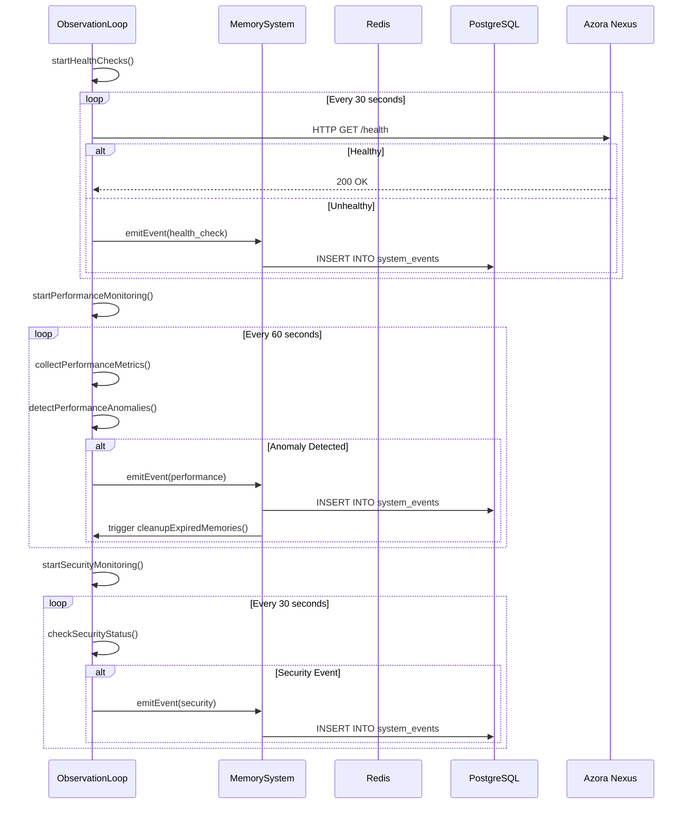
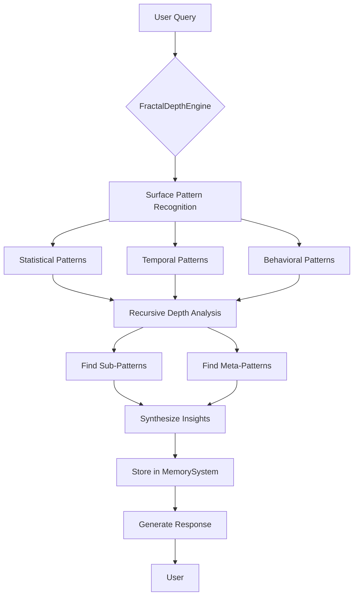
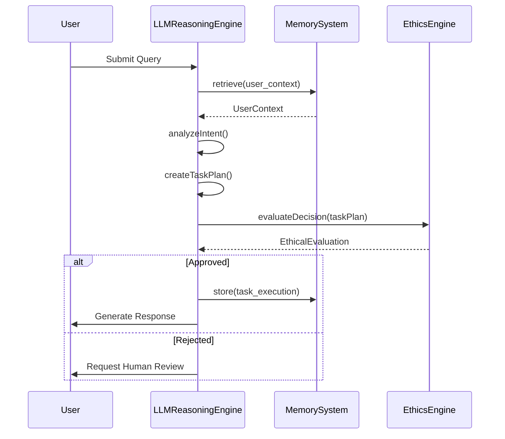

# Memory System

<cite>
**Referenced Files in This Document**   
- [memory-system.ts](file://genome/agent-tools/memory-system.ts)
- [fractal-depth-engine.ts](file://genome/agent-tools/fractal-depth-engine.ts)
- [user-state-tracker.ts](file://genome/agent-tools/user-state-tracker.ts)
- [observation-loop.ts](file://genome/agent-tools/observation-loop.ts)
- [llm-reasoning.ts](file://genome/agent-tools/llm-reasoning.ts)
- [ethics-engine.ts](file://genome/agent-tools/ethics-engine.ts)
</cite>

## Table of Contents
1. [Introduction](#introduction)
2. [Memory System Architecture](#memory-system-architecture)
3. [Short-Term and Long-Term Memory Storage](#short-term-and-long-term-memory-storage)
4. [User State Tracking](#user-state-tracking)
5. [Observation Loop Integration](#observation-loop-integration)
6. [Memory Encoding and Retrieval](#memory-encoding-and-retrieval)
7. [Context-Aware Recall and Fractal Depth Engine](#context-aware-recall-and-fractal-depth-engine)
8. [Integration with LLM Reasoning and Ethical Evaluation](#integration-with-llm-reasoning-and-ethical-evaluation)
9. [Performance and Optimization](#performance-and-optimization)
10. [Memory Persistence and Session Management](#memory-persistence-and-session-management)
11. [Extending Memory Types and Error Handling](#extending-memory-types-and-error-handling)
12. [Conclusion](#conclusion)

## Introduction

The Elara AI memory system is a sophisticated, multi-layered architecture designed to enable persistent, context-aware, and ethically governed artificial intelligence. This system combines short-term and long-term memory storage with advanced pattern recognition, user state tracking, and real-time observation to create a resilient and adaptive cognitive framework. Built on a foundation of Redis for ephemeral data and PostgreSQL with pgvector for persistent, semantically searchable memories, the memory system supports Elara's ability to learn, reason, and evolve while maintaining strict compliance with constitutional AI principles. This document provides a comprehensive analysis of the MemorySystem class, its integration with the fractal depth engine, and its role in the broader Elara AI ecosystem.

## Memory System Architecture

The Elara memory system is implemented as a TypeScript class that orchestrates data persistence, retrieval, and lifecycle management across multiple storage tiers. The architecture is designed for high availability, scalability, and semantic intelligence, leveraging Redis for short-term memory and PostgreSQL with the pgvector extension for long-term, vector-based storage. The system is initialized with connections to both Redis and PostgreSQL, establishing a dual-storage paradigm that optimizes for speed and durability. During initialization, the system verifies connectivity to both databases and creates the necessary tables and indexes, ensuring that the memory infrastructure is ready for immediate use. The MemorySystem class exposes a comprehensive API for storing, retrieving, and managing memories, with methods categorized by their temporal and functional characteristics.

```mermaid
classDiagram
class MemorySystem {
-redis : Redis
-postgres : Pool
-isInitialized : boolean
+constructor()
+storeShortTerm(key : string, value : any, ttlSeconds? : number) : Promise~void~
+retrieveShortTerm(key : string) : Promise~any~
+deleteShortTerm(key : string) : Promise~void~
+storeLongTerm(entry : MemoryEntry) : Promise~void~
+retrieveLongTerm(id : string, type : MemoryEntry['type']) : Promise~MemoryEntry | null~
+semanticSearch(query : string, embedding : number[], limit : number) : Promise~MemoryEntry[]~
+getUserEpisodicMemory(userId : string, limit : number) : Promise~MemoryEntry[]~
+storeLearnedProcedure(procedure : {name : string, steps : any[], successRate : number, metadata : Record~string, any~}) : Promise~void~
+getLearnedProcedure(name : string) : Promise~any~
+cleanupExpiredMemories() : Promise~void~
+getMemoryStats() : Promise~{shortTerm : {keys : number}, longTerm : {episodic : number, semantic : number, procedural : number}}~
+store(type : string, data : any, metadata? : any) : Promise~void~
+retrieve(type : string, filter? : any) : Promise~any[]~
+close() : Promise~void~
}
class MemoryEntry {
+id : string
+type : 'episodic' | 'semantic' | 'procedural'
+content : any
+metadata : {userId? : string, context? : Record~string, any~, timestamp : Date, expiresAt? : Date, importance : number}
+embedding? : number[]
}
class ConversationContext {
+conversationId : string
+userId : string
+messages : {role : 'user' | 'agent', content : string, timestamp : Date}[]
+context : Record~string, any~
+lastActivity : Date
}
MemorySystem --> MemoryEntry : "uses"
MemorySystem --> ConversationContext : "manages"
MemorySystem --> Redis : "stores short-term"
MemorySystem --> PostgreSQL : "stores long-term"
```

**Diagram sources**
- [memory-system.ts](file://genome/agent-tools/memory-system.ts#L38-L462)

**Section sources**
- [memory-system.ts](file://genome/agent-tools/memory-system.ts#L38-L462)

## Short-Term and Long-Term Memory Storage

The Elara memory system implements a dual-storage strategy, with short-term memory managed by Redis and long-term memory stored in PostgreSQL. Short-term memory is designed for high-speed, ephemeral data storage, such as conversation contexts and temporary user states. The `storeShortTerm` method serializes any JavaScript object and stores it in Redis with an optional time-to-live (TTL), ensuring that transient data is automatically purged when no longer needed. This mechanism is critical for maintaining conversational continuity during active sessions, as demonstrated by the `storeConversationContext` method, which stores conversation data with a one-hour TTL.

Long-term memory, in contrast, is designed for persistent, structured storage of episodic, semantic, and procedural knowledge. The system creates three dedicated PostgreSQL tables: `episodic_memory` for personal experiences tied to specific users, `semantic_memory` for general knowledge and facts, and `procedural_memory` for learned processes and workflows. Each table is optimized with indexes on key fields such as user ID, creation timestamp, and importance, enabling efficient querying and retrieval. The `storeLongTerm` method inserts or updates a memory entry in the appropriate table based on its type, using PostgreSQL's `ON CONFLICT` clause to handle upserts seamlessly. This design ensures that Elara can retain and build upon knowledge across sessions, creating a persistent cognitive footprint.

**Section sources**
- [memory-system.ts](file://genome/agent-tools/memory-system.ts#L156-L220)
- [memory-system.ts](file://genome/agent-tools/memory-system.ts#L222-L275)

## User State Tracking

User state tracking is a core function of the Elara memory system, implemented through the UserStateTracker class. This component maintains a comprehensive profile for each user, including their preferences, interaction history, and current context. The `UserProfile` interface defines a rich set of attributes, from basic information like name and email to nuanced preferences such as communication style and expertise level. These profiles are stored in long-term memory and updated dynamically as users interact with the system. The `UserContext` interface captures the user's current state, including active sessions, recent interactions, and ongoing workflows. This context is stored in short-term memory and updated in real-time, allowing Elara to maintain situational awareness and provide contextually relevant responses.

The UserStateTracker class provides a suite of methods for managing user state, including `getOrCreateUserProfile`, `updateUserProfile`, and `addInteraction`. These methods ensure that user data is consistently updated and synchronized between in-memory caches and persistent storage. The system also tracks user engagement through metrics like total interactions and satisfaction scores, which are used to personalize the user experience and identify opportunities for improvement. By maintaining a detailed and up-to-date user state, Elara can deliver highly personalized and adaptive interactions, anticipating user needs and preferences based on historical patterns.

```mermaid
classDiagram
class UserStateTracker {
-memorySystem : MemorySystem
-activeContexts : Map~string, UserContext~
-userProfiles : Map~string, UserProfile~
+initialize() : Promise~void~
+getOrCreateUserProfile(userId : string, initialData? : Partial~UserProfile~) : Promise~UserProfile~
+updateUserProfile(userId : string, updates : Partial~UserProfile~) : Promise~void~
+getUserContext(userId : string) : Promise~UserContext | null~
+createUserContext(userId : string, sessionId : string) : Promise~UserContext~
+updateUserContext(userId : string, updates : Partial~UserContext~) : Promise~void~
+addInteraction(userId : string, interaction : {id : string, timestamp : Date, type : 'query' | 'action' | 'feedback' | 'error', content : string, outcome? : string, satisfaction? : number}) : Promise~void~
+startWorkflow(userId : string, workflow : {id : string, name : string, status : 'active' | 'paused' | 'completed' | 'failed', progress : number, steps : {id : string, name : string, status : 'pending' | 'in_progress' | 'completed' | 'failed', startedAt? : Date, completedAt? : Date}[]}) : Promise~void~
+updateWorkflowProgress(userId : string, workflowId : string, progress : number, stepUpdates? : any) : Promise~void~
+completeWorkflow(userId : string, workflowId : string) : Promise~void~
+getUserInsights(userId : string) : Promise~{interactionPatterns : Record~string, number~, commonQueries : string[], expertiseAreas : string[], engagementLevel : 'low' | 'medium' | 'high', recommendations : string[]}~
+cleanupInactiveContexts(maxAgeHours : number) : Promise~void~
+getActiveUserCount() : number
+getStats() : {activeUsers : number, totalProfiles : number, activeWorkflows : number}
}
class UserProfile {
+id : string
+email? : string
+name? : string
+role : 'user' | 'admin' | 'enterprise' | 'developer'
+preferences : {communicationStyle : 'formal' | 'casual' | 'technical', responseLength : 'brief' | 'detailed' | 'comprehensive', notificationFrequency : 'immediate' | 'daily' | 'weekly' | 'never', expertiseLevel : 'beginner' | 'intermediate' | 'advanced' | 'expert'}
+metadata : {createdAt : Date, lastActive : Date, totalInteractions : number, averageResponseTime : number, satisfactionScore? : number, timezone? : string, language : string}
}
class UserContext {
+userId : string
+currentSession : {id : string, startTime : Date, lastActivity : Date, activeTasks : string[], pendingActions : string[]}
+recentInteractions : {id : string, timestamp : Date, type : 'query' | 'action' | 'feedback' | 'error', content : string, outcome? : string, satisfaction? : number}[]
+activeWorkflows : {id : string, name : string, status : 'active' | 'paused' | 'completed' | 'failed', progress : number, steps : Array[]{id : string, name : string, status : 'pending' | 'in_progress' | 'completed' | 'failed', startedAt? : Date, completedAt? : Date}~}
+permissions : {canAccessServices : string[], canPerformActions : string[], dataAccessLevel : 'public' | 'private' | 'confidential' | 'restricted', enterpriseFeatures : boolean}
+state : {mood? : 'neutral' | 'frustrated' | 'satisfied' | 'confused' | 'engaged', attentionLevel : 'low' | 'medium' | 'high', expertiseDemonstrated : string[], learningGoals : string[]}
}
UserStateTracker --> UserProfile : "manages"
UserStateTracker --> UserContext : "manages"
UserStateTracker --> MemorySystem : "uses"
```

**Diagram sources**
- [user-state-tracker.ts](file://genome/agent-tools/user-state-tracker.ts#L32-L472)

**Section sources**
- [user-state-tracker.ts](file://genome/agent-tools/user-state-tracker.ts#L32-L472)

## Observation Loop Integration

The Elara memory system is tightly integrated with the observation loop, a real-time monitoring and event processing framework. The ObservationLoop class acts as a central nervous system for the AI, continuously polling various data sources for system events, health checks, and performance metrics. When an event is detected, it is emitted through a Node.js EventEmitter, allowing the memory system and other components to react in real-time. The observation loop monitors the health of critical services such as Azora Nexus, Aegis, and Mint, triggering alerts when a service becomes unreachable or unhealthy. It also collects performance metrics, such as memory usage and CPU load, and detects anomalies that may indicate system degradation.

The integration between the memory system and the observation loop enables proactive maintenance and self-healing. For example, the `cleanupExpiredMemories` method can be scheduled to run periodically, removing old or low-importance memories to free up storage and maintain performance. The observation loop can trigger this cleanup based on predefined conditions, such as high memory usage or low disk space. Similarly, the memory system can store system events and performance data, creating a historical record that can be analyzed for trends and patterns. This closed-loop architecture ensures that Elara can monitor its own state, identify potential issues, and take corrective action autonomously.



**Diagram sources**
- [observation-loop.ts](file://genome/agent-tools/observation-loop.ts#L0-L631)

**Section sources**
- [observation-loop.ts](file://genome/agent-tools/observation-loop.ts#L0-L631)

## Memory Encoding and Retrieval

Memory encoding and retrieval in the Elara system are designed for both efficiency and semantic intelligence. Short-term memories are encoded as JSON strings and stored directly in Redis, with optional TTLs to manage their lifespan. Long-term memories, however, are encoded with rich metadata and optional vector embeddings, enabling sophisticated retrieval mechanisms. The `MemoryEntry` interface includes an `embedding` field of type `number[]`, which is used to store vector representations of the memory content. These embeddings are generated by an external model and stored in the PostgreSQL tables as pgvector vectors, allowing for semantic search via cosine similarity.

The `semanticSearch` method is a key feature of the memory system, enabling context-aware recall of relevant memories. Given a query string and its corresponding embedding, the method performs a nearest-neighbor search in the `semantic_memory` table, returning the most similar memories based on their vector embeddings. This allows Elara to retrieve information based on meaning rather than exact keyword matches, supporting more natural and intuitive interactions. The method uses PostgreSQL's `<=>` operator to compute the cosine distance between vectors, ordering results by similarity and limiting the output to a specified number of entries. This approach ensures that Elara can quickly find and retrieve relevant knowledge, even when the query is phrased differently from the stored memory.

**Section sources**
- [memory-system.ts](file://genome/agent-tools/memory-system.ts#L277-L315)
- [memory-system.ts](file://genome/agent-tools/memory-system.ts#L317-L344)

## Context-Aware Recall and Fractal Depth Engine

Context-aware recall is enhanced by the FractalDepthEngine, a multi-layered pattern recognition system that analyzes data at multiple depths to uncover complex relationships. The engine operates on the principle of fractal mathematics, recursively analyzing patterns within patterns to extract deep insights. When given a user query or system event, the engine first performs surface-level analysis to identify basic patterns, such as statistical, temporal, or behavioral trends. It then recursively analyzes these patterns at increasing depths, looking for sub-patterns and meta-patterns that reveal higher-order structures. The results are synthesized into actionable insights, which are stored in the memory system for future reference.

The integration between the memory system and the fractal depth engine enables Elara to perform sophisticated reasoning and decision-making. For example, when a user asks a complex question, the engine can analyze the query for underlying patterns, retrieve relevant memories from both short-term and long-term storage, and generate a comprehensive response that synthesizes multiple sources of information. The engine also learns from each analysis, storing successful patterns in a library for future use. This continuous learning process allows Elara to improve its performance over time, becoming more adept at recognizing and responding to complex patterns in user behavior and system dynamics.



**Diagram sources**
- [fractal-depth-engine.ts](file://genome/agent-tools/fractal-depth-engine.ts#L0-L195)

**Section sources**
- [fractal-depth-engine.ts](file://genome/agent-tools/fractal-depth-engine.ts#L0-L195)

## Integration with LLM Reasoning and Ethical Evaluation

The Elara memory system is deeply integrated with the LLM reasoning engine and ethics engine, forming a cohesive cognitive architecture. The LLMReasoningEngine uses the memory system as a knowledge base, retrieving relevant documents and memories to inform its responses and decision-making. When a user submits a query, the engine analyzes the intent, retrieves context from the memory system, and generates a task plan that may involve multiple steps across different services. Each step is executed with the help of the memory system, which stores intermediate results and maintains state throughout the process. The engine also adds new knowledge to the memory system, ensuring that Elara learns from every interaction.

The EthicsEngine, meanwhile, acts as a constitutional governor, ensuring that all decisions and actions comply with ethical principles and cultural values. Before any action is taken, the engine evaluates it against a framework of ethical principles, such as transparency, community benefit, and sustainability. The evaluation process involves checking for potential violations, assessing cultural alignment, and calculating an overall approval score. If the score is below a critical threshold, the action is blocked, and a human review is required. The results of each evaluation are stored in the memory system, creating an auditable trail of ethical decisions. This integration ensures that Elara operates within strict ethical boundaries, maintaining trust and accountability.



**Diagram sources**
- [llm-reasoning.ts](file://genome/agent-tools/llm-reasoning.ts#L0-L597)
- [ethics-engine.ts](file://genome/agent-tools/ethics-engine.ts#L0-L627)

**Section sources**
- [llm-reasoning.ts](file://genome/agent-tools/llm-reasoning.ts#L0-L597)
- [ethics-engine.ts](file://genome/agent-tools/ethics-engine.ts#L0-L627)

## Performance and Optimization

The Elara memory system is designed with performance and scalability in mind, employing several strategies to optimize memory retrieval and storage at scale. The use of Redis for short-term memory ensures that frequently accessed data can be retrieved with minimal latency, while PostgreSQL with pgvector provides a robust and scalable solution for long-term storage. The system creates indexes on key fields in the PostgreSQL tables, such as user ID, creation timestamp, and importance, to accelerate query performance. Additionally, the `semanticSearch` method leverages pgvector's native support for approximate nearest neighbor search, enabling fast and efficient retrieval of semantically similar memories.

Memory optimization is further enhanced by the `cleanupExpiredMemories` method, which periodically removes old or low-importance memories to free up storage and maintain system performance. Episodic memories older than 90 days and with low importance are deleted, as are semantic memories that have not been accessed in 180 days and have low importance. This automated cleanup process ensures that the memory system remains lean and efficient, without requiring manual intervention. The system also provides a `getMemoryStats` method that returns detailed statistics on memory usage, allowing administrators to monitor the system's health and identify potential bottlenecks.

**Section sources**
- [memory-system.ts](file://genome/agent-tools/memory-system.ts#L364-L417)
- [memory-system.ts](file://genome/agent-tools/memory-system.ts#L125-L154)

## Memory Persistence and Session Management

Memory persistence across sessions is a critical feature of the Elara system, enabling users to resume interactions where they left off. The system achieves this by storing user profiles and contexts in long-term memory, with the `UserProfile` and `UserContext` objects serialized as JSON and inserted into the PostgreSQL database. When a user returns, the `getOrCreateUserProfile` and `getUserContext` methods retrieve this data, reconstructing the user's state and preferences. Conversation contexts are stored in Redis with a one-hour TTL, ensuring that active sessions remain responsive and up-to-date. If a session expires, the context is automatically purged, but the user's long-term profile and history remain intact.

Session management is handled by the UserStateTracker, which maintains a map of active contexts in memory and synchronizes them with persistent storage. The `createUserContext` method initializes a new session, setting the start time and last activity timestamp. The `updateUserContext` method updates the context with new interactions and state changes, ensuring that the system remains aware of the user's current situation. The `cleanupInactiveContexts` method periodically removes contexts that have not been active for a specified period, preventing memory leaks and ensuring that the system remains responsive. This combination of short-term and long-term persistence allows Elara to provide a seamless and personalized user experience, regardless of session duration.

**Section sources**
- [memory-system.ts](file://genome/agent-tools/memory-system.ts#L188-L220)
- [user-state-tracker.ts](file://genome/agent-tools/user-state-tracker.ts#L154-L250)

## Extending Memory Types and Error Handling

The Elara memory system is designed to be extensible, allowing new memory types to be added as needed. The `MemoryEntry` interface defines a `type` field that can be extended to include new categories, such as emotional memory or social memory. The `getTableForType` method maps each memory type to its corresponding database table, making it easy to add new tables and modify the schema. The `store` and `retrieve` methods provide a generic interface for storing and retrieving data, with logic to route different types to the appropriate storage mechanism. This flexibility allows the system to evolve and adapt to new requirements, without requiring major changes to the core architecture.

Error handling is implemented throughout the memory system, with comprehensive logging and exception management. Each method is wrapped in a try-catch block, ensuring that errors are caught and logged without crashing the system. The `logger` object is used to record debug, info, and error messages, providing a detailed audit trail of all memory operations. In the event of a failure, the system attempts to recover gracefully, such as by returning null for a failed retrieval or skipping a failed cleanup operation. This robust error handling ensures that the memory system remains reliable and resilient, even in the face of unexpected issues.

**Section sources**
- [memory-system.ts](file://genome/agent-tools/memory-system.ts#L419-L465)
- [memory-system.ts](file://genome/agent-tools/memory-system.ts#L156-L186)

## Conclusion

The Elara AI memory system represents a sophisticated and comprehensive approach to artificial cognition, combining short-term and long-term memory storage with advanced pattern recognition, user state tracking, and ethical governance. By leveraging Redis and PostgreSQL with pgvector, the system achieves a balance of speed, durability, and semantic intelligence, enabling Elara to learn, reason, and interact in a context-aware and personalized manner. The integration with the fractal depth engine, LLM reasoning engine, and ethics engine creates a cohesive cognitive architecture that is both powerful and responsible. With its focus on performance, scalability, and extensibility, the memory system provides a solid foundation for the continued evolution of Elara AI, ensuring that it can meet the demands of increasingly complex and dynamic environments.