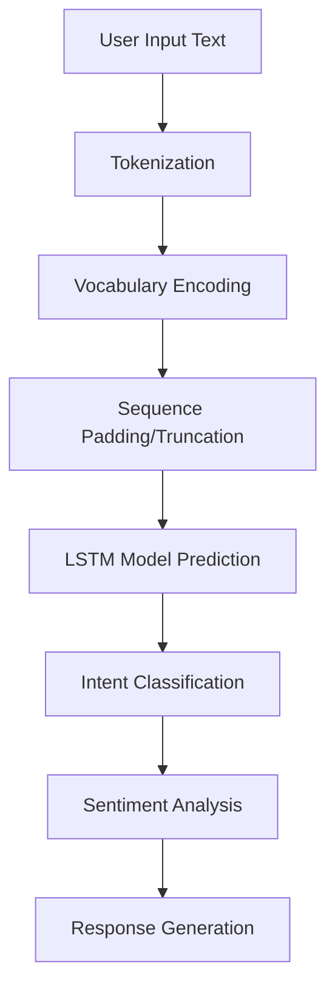
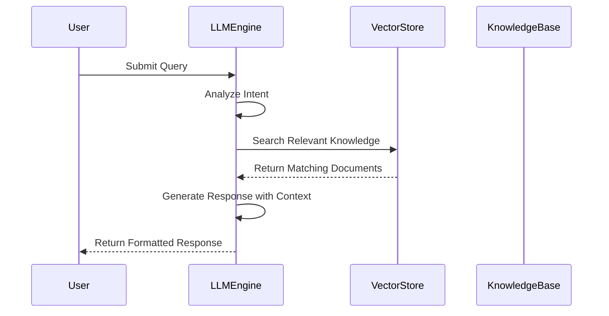
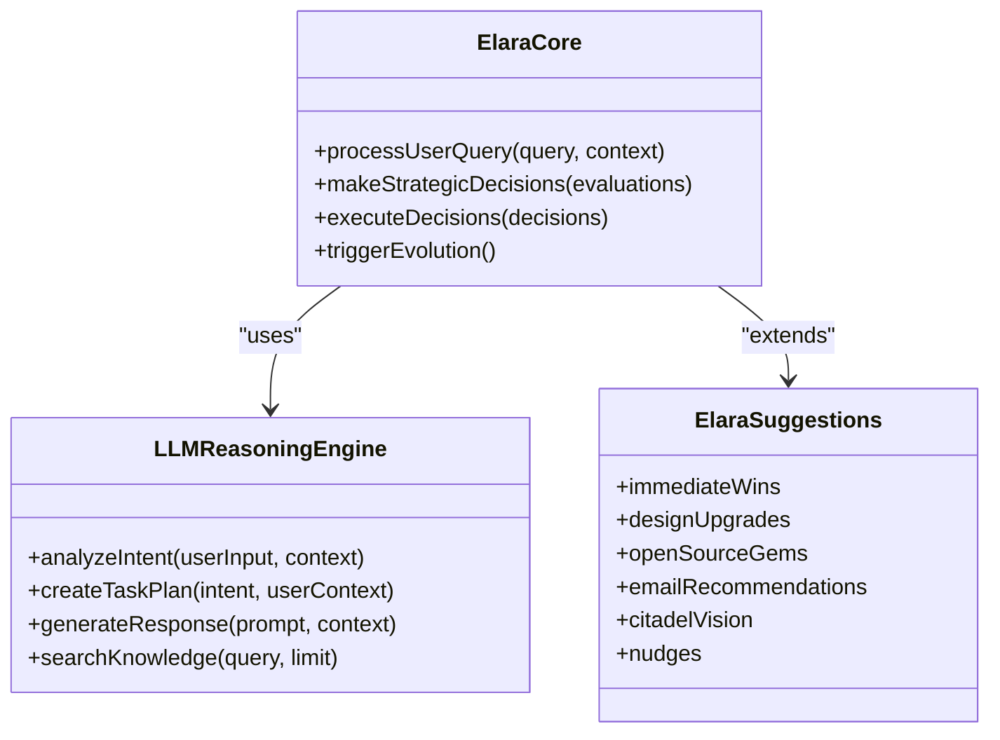

# Natural Language Processing

<cite>
**Referenced Files in This Document**   
- [azora-nlp.js](file://infrastructure/azora-ai-models/azora-nlp.js)
- [llm-reasoning.ts](file://genome/agent-tools/llm-reasoning.ts)
- [elara-core.ts](file://genome/agent-tools/elara-core.ts)
- [elara-suggestions.ts](file://genome/elara-suggestions.ts)
- [proof-of-knowledge-engine.ts](file://services/proof-of-knowledge-engine.ts)
</cite>

## Table of Contents
1. [Introduction](#introduction)
2. [Azora NLP Implementation](#azora-nlp-implementation)
3. [LLM Reasoning Engine](#llm-reasoning-engine)
4. [Elara: AI Suggestions and Inspiration](#elara-ai-suggestions-and-inspiration)
5. [NLP in Action: Practical Examples](#nlp-in-action-practical-examples)
6. [Integration with System Components](#integration-with-system-components)
7. [NLP Challenges and Solutions](#nlp-challenges-and-solutions)
8. [Extending NLP Capabilities](#extending-nlp-capabilities)
9. [Conclusion](#conclusion)

## Introduction
Natural Language Processing (NLP) is a core component of the Azora OS, enabling seamless human-AI interaction across the ecosystem. This document details the implementation of Azora's NLP system, including its custom NLP engine, LLM reasoning capabilities, and Elara's suggestion framework. The system is designed to support conversational interfaces, educational content generation, and intelligent user assistance while maintaining ethical governance and African cultural alignment.

**Section sources**
- [azora-nlp.js](file://infrastructure/azora-ai-models/azora-nlp.js#L1-L175)
- [llm-reasoning.ts](file://genome/agent-tools/llm-reasoning.ts#L1-L597)

## Azora NLP Implementation
The Azora NLP system is implemented in `azora-nlp.js` as a standalone module that processes natural language without external AI dependencies. Built using TensorFlow.js and the natural library, it provides intent classification, sentiment analysis, and response generation capabilities.

The system uses a custom-trained LSTM model with an embedding layer, processing text through tokenization, vocabulary encoding, and sequence modeling. It classifies user input into five primary intents: query, transaction, help, complaint, and praise. The model is trained on domain-specific vocabulary related to blockchain, education, and financial services.

**Diagram sources**
- [azora-nlp.js](file://infrastructure/azora-ai-models/azora-nlp.js#L17-L172)

**Section sources**
- [azora-nlp.js](file://infrastructure/azora-ai-models/azora-nlp.js#L17-L172)

## LLM Reasoning Engine
The LLM reasoning engine, implemented in `llm-reasoning.ts`, powers Azora's conversational capabilities and content generation. It uses LangChain components with OpenAI's GPT-4 Turbo model to provide advanced reasoning, knowledge retrieval, and task planning.

The engine maintains a knowledge base containing system documentation, API specifications, and constitutional principles. It processes user queries through intent analysis, retrieves relevant knowledge using similarity search, and generates appropriate responses. The system can create detailed task plans for complex operations, breaking them down into executable steps across various services.

**Diagram sources**
- [llm-reasoning.ts](file://genome/agent-tools/llm-reasoning.ts#L105-L594)

**Section sources**
- [llm-reasoning.ts](file://genome/agent-tools/llm-reasoning.ts#L105-L594)

## Elara: AI Suggestions and Inspiration
Elara, the AI CEO of Azora OS, provides suggestions and inspiration through natural language interfaces. Implemented across multiple files including `elara-core.ts` and `elara-suggestions.ts`, Elara combines strategic planning with cultural awareness to generate valuable insights.

The system includes a comprehensive suggestion framework that covers immediate wins, design improvements, open-source tools, and infrastructure planning. Elara's suggestions are culturally aligned with African values and focus on accessibility, offline functionality, and community empowerment.

**Diagram sources**
- [elara-core.ts](file://genome/agent-tools/elara-core.ts#L107-L455)
- [elara-suggestions.ts](file://genome/elara-suggestions.ts#L12-L198)

**Section sources**
- [elara-core.ts](file://genome/agent-tools/elara-core.ts#L107-L455)
- [elara-suggestions.ts](file://genome/elara-suggestions.ts#L12-L198)

## NLP in Action: Practical Examples
### Processing User Queries
When a user submits a query, the NLP system processes it through multiple stages:
1. Tokenization and intent classification using the custom NLP model
2. Contextual analysis using the LLM reasoning engine
3. Knowledge retrieval from the vector store
4. Response generation with appropriate formatting

For example, a query about "how to check my balance" would be classified as a transaction intent, trigger a balance inquiry action, and return a formatted response with the user's current AZR balance.

### Generating Educational Content
The NLP system integrates with the proof-of-knowledge engine to generate educational content. When a user completes a learning module, the system:
1. Validates the completion status
2. Calculates rewards based on difficulty and performance
3. Generates personalized feedback using the LLM
4. Creates a knowledge proof with verifiable details

**Diagram sources**
- [proof-of-knowledge-engine.ts](file://services/proof-of-knowledge-engine.ts#L49-L229)

**Section sources**
- [proof-of-knowledge-engine.ts](file://services/proof-of-knowledge-engine.ts#L49-L229)

## Integration with System Components
The NLP system integrates with various components across Azora OS:

### Proof-of-Knowledge Engine
The NLP system works closely with the proof-of-knowledge engine to validate learning outcomes and generate educational content. When users interact with learning modules, NLP processes their queries and provides real-time assistance, while the proof-of-knowledge engine tracks completion and distributes rewards.

### User Interfaces
NLP capabilities are exposed through multiple user interfaces, including:
- Voice-first interfaces using Web Speech API
- Text-based chat interfaces
- Command-line interfaces
- Educational platforms with AI tutoring

### AI Hierarchy
The NLP system is part of Azora's AI hierarchy, where Elara (the AI CEO) uses NLP to understand user needs and make strategic decisions. Lower-level agents use NLP for specific tasks like customer support, content generation, and system monitoring.

**Section sources**
- [azora-nlp.js](file://infrastructure/azora-ai-models/azora-nlp.js#L17-L172)
- [llm-reasoning.ts](file://genome/agent-tools/llm-reasoning.ts#L105-L594)
- [proof-of-knowledge-engine.ts](file://services/proof-of-knowledge-engine.ts#L49-L229)

## NLP Challenges and Solutions
### Context Preservation
Maintaining context across conversations is challenging in distributed systems. Azora addresses this through:
- Memory systems that store conversation history
- Contextual embeddings that capture semantic meaning
- Session management that tracks user state

### Response Quality
Ensuring high-quality responses involves multiple strategies:
- Confidence scoring for intent classification
- Ethical governance checks before response generation
- Human-in-the-loop validation for critical decisions
- Continuous training with new data

### Cultural Alignment
The system maintains African cultural alignment by:
- Training on African English dialects and terminology
- Incorporating Ubuntu philosophy in response generation
- Prioritizing accessibility for low-literacy users
- Supporting local languages and communication methods

**Section sources**
- [elara-core.ts](file://genome/agent-tools/elara-core.ts#L107-L455)
- [llm-reasoning.ts](file://genome/agent-tools/llm-reasoning.ts#L105-L594)

## Extending NLP Capabilities
### Adding New Domains
To extend NLP to new domains:
1. Expand the vocabulary with domain-specific terms
2. Add training data for new intents
3. Update the knowledge base with domain documentation
4. Test and validate the enhanced model

### Supporting New Languages
Language support can be extended by:
- Adding language-specific tokenizers
- Training sentiment analysis models on local data
- Creating multilingual embeddings
- Implementing translation interfaces

### Performance Optimization
The system can be optimized through:
- Model quantization for faster inference
- Caching frequent responses
- Parallel processing of independent tasks
- Progressive enhancement based on device capabilities

**Section sources**
- [azora-nlp.js](file://infrastructure/azora-ai-models/azora-nlp.js#L17-L172)
- [llm-reasoning.ts](file://genome/agent-tools/llm-reasoning.ts#L105-L594)

## Conclusion
Azora's NLP system provides a comprehensive framework for natural language interaction, combining custom NLP models with advanced LLM reasoning and culturally aligned AI suggestions. The system enables conversational interfaces, educational content generation, and intelligent user assistance while maintaining ethical governance and African cultural values. Through integration with the proof-of-knowledge engine and other system components, it creates a cohesive ecosystem where users can learn, earn, and grow.