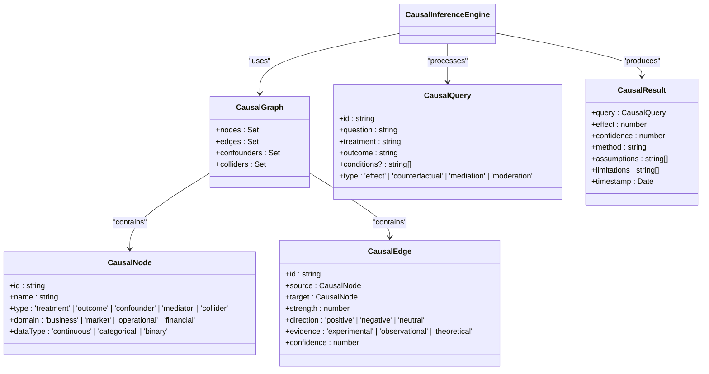
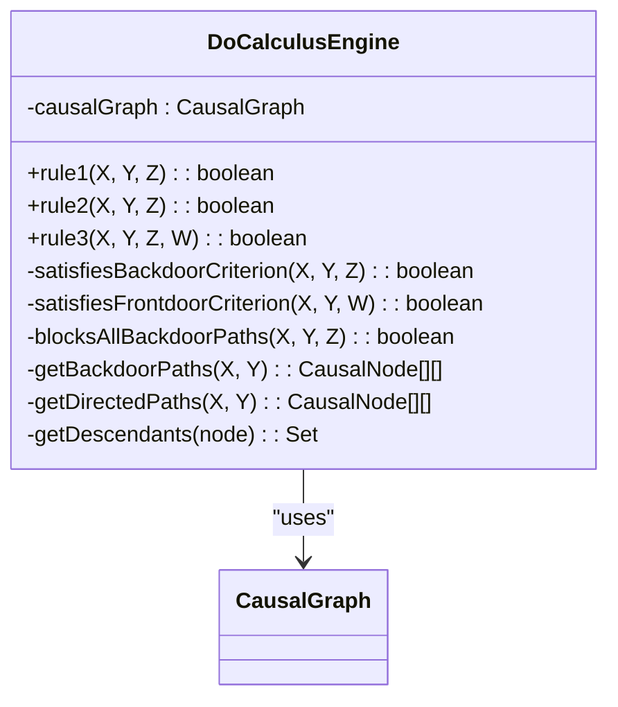
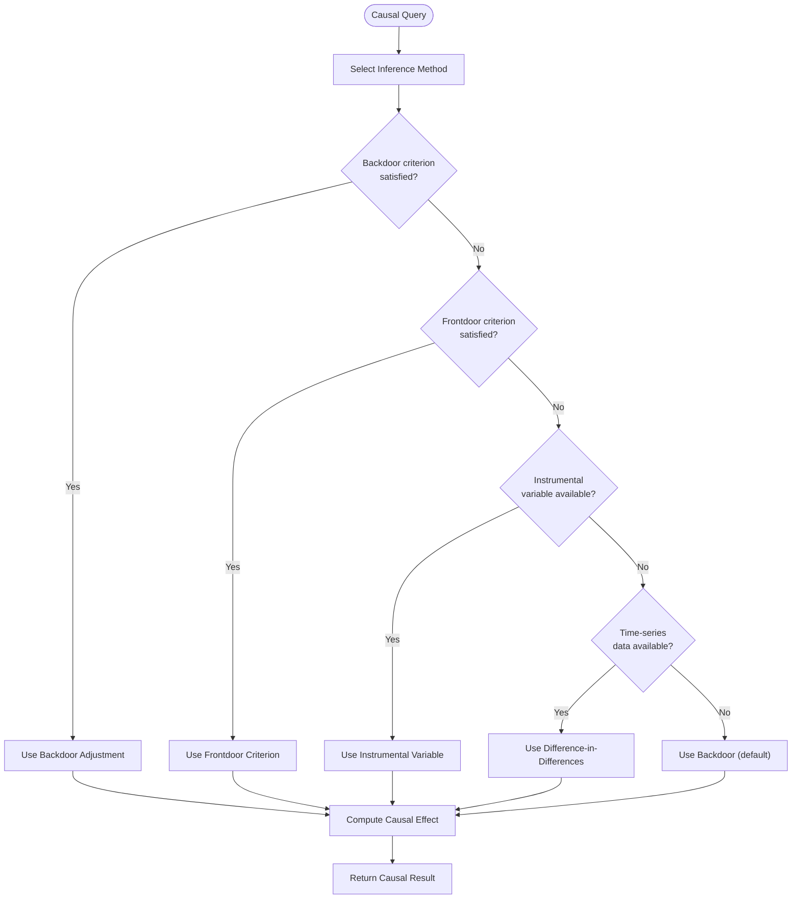
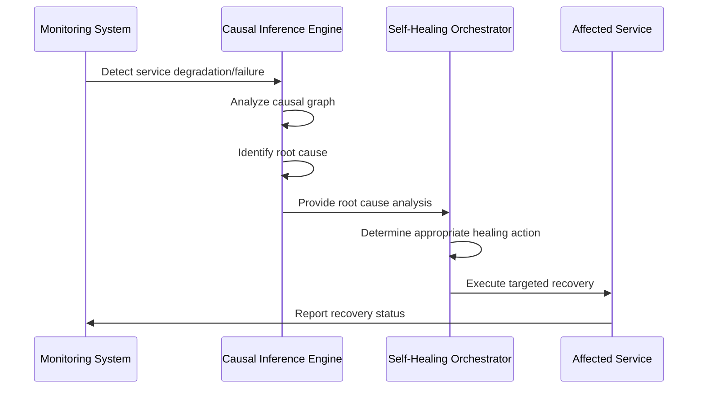

# Causal Inference Engine

<cite>
**Referenced Files in This Document**   
- [causal-inference-engine.ts](file://genome/agent-tools/causal-inference-engine.ts)
- [self-healing-orchestrator.ts](file://services/self-healing-orchestrator.ts)
</cite>

## Table of Contents
1. [Introduction](#introduction)
2. [Core Architecture](#core-architecture)
3. [Causal Graph Representation](#causal-graph-representation)
4. [Do-Calculus Engine](#do-calculus-engine)
5. [Causal Inference Methods](#causal-inference-methods)
6. [Counterfactual Reasoning](#counterfactual-reasoning)
7. [Simpson's Paradox Detection](#simpsons-paradox-detection)
8. [Integration with Self-Healing Infrastructure](#integration-with-self-healing-infrastructure)
9. [Configuration and Thresholds](#configuration-and-thresholds)
10. [Common Issues and Solutions](#common-issues-and-solutions)

## Introduction
The Causal Inference Engine is a sophisticated component that implements Judea Pearl's Do-calculus framework for causal reasoning. Unlike traditional correlation-based analytics, this engine distinguishes true cause-and-effect relationships from mere associations, enabling counterfactual reasoning and intervention analysis. The engine analyzes event sequences and dependency graphs to determine causal relationships in complex datasets, providing the foundation for root-cause analysis in the system.

**Section sources**
- [causal-inference-engine.ts](file://genome/agent-tools/causal-inference-engine.ts#L1-L37)

## Core Architecture
The Causal Inference Engine is built around a Directed Acyclic Graph (DAG) representation of causal relationships. The architecture consists of three main components: the causal graph model, the Do-calculus engine for causal reasoning, and the inference engine that applies various causal methods. The system is designed to handle observational data and apply causal discovery algorithms to identify root causes of system behaviors.

**Diagram sources**
- [causal-inference-engine.ts](file://genome/agent-tools/causal-inference-engine.ts#L32-L82)

**Section sources**
- [causal-inference-engine.ts](file://genome/agent-tools/causal-inference-engine.ts#L32-L82)

## Causal Graph Representation
The engine represents causal relationships using a Directed Acyclic Graph (DAG) structure where nodes represent variables and edges represent causal relationships. Each node is classified by type (treatment, outcome, confounder, mediator, or collider) and domain (business, market, operational, or financial). The graph explicitly tracks confounders (variables affecting multiple nodes) and colliders (variables with multiple incoming edges) to ensure accurate causal inference.

**Section sources**
- [causal-inference-engine.ts](file://genome/agent-tools/causal-inference-engine.ts#L32-L82)

## Do-Calculus Engine
The Do-Calculus Engine implements Judea Pearl's three rules of do-calculus for causal inference. These rules allow the engine to transform causal queries involving interventions (do-operations) into equivalent observational expressions when certain conditions are met. The engine checks for the backdoor and frontdoor criteria to determine when causal effects can be identified from observational data.

**Diagram sources**
- [causal-inference-engine.ts](file://genome/agent-tools/causal-inference-engine.ts#L105-L411)

**Section sources**
- [causal-inference-engine.ts](file://genome/agent-tools/causal-inference-engine.ts#L105-L411)

## Causal Inference Methods
The engine implements multiple causal inference methods, automatically selecting the appropriate method based on the causal graph structure. The primary methods include backdoor adjustment, frontdoor criterion, instrumental variables, and difference-in-differences. The selection process checks whether the necessary criteria are satisfied in the causal graph before applying each method.

**Diagram sources**
- [causal-inference-engine.ts](file://genome/agent-tools/causal-inference-engine.ts#L573-L668)

**Section sources**
- [causal-inference-engine.ts](file://genome/agent-tools/causal-inference-engine.ts#L573-L668)

## Counterfactual Reasoning
The engine supports counterfactual reasoning, allowing it to answer "what if" questions about alternative scenarios. This capability is essential for understanding root causes and predicting the effects of potential interventions. The counterfactual computation finds similar cases in the observational data and estimates what the outcome would have been under different treatment conditions.

**Section sources**
- [causal-inference-engine.ts](file://genome/agent-tools/causal-inference-engine.ts#L485-L531)

## Simpson's Paradox Detection
The engine includes functionality to detect Simpson's paradox, a phenomenon where the association between two variables reverses when conditioning on a third variable. This detection is crucial for ensuring causal inference accuracy, as Simpson's paradox can lead to incorrect conclusions about causal relationships if not properly addressed.

**Section sources**
- [causal-inference-engine.ts](file://genome/agent-tools/causal-inference-engine.ts#L530-L571)

## Integration with Self-Healing Infrastructure
The Causal Inference Engine is integrated with the self-healing infrastructure to enable automated root-cause analysis and recovery. When service failures are detected, the engine analyzes the causal relationships between system events to identify the root cause, allowing for targeted healing actions rather than generic restarts.

**Diagram sources**
- [causal-inference-engine.ts](file://genome/agent-tools/causal-inference-engine.ts)
- [self-healing-orchestrator.ts](file://services/self-healing-orchestrator.ts)

**Section sources**
- [causal-inference-engine.ts](file://genome/agent-tools/causal-inference-engine.ts)
- [self-healing-orchestrator.ts](file://services/self-healing-orchestrator.ts)

## Configuration and Thresholds
The engine supports configuration of confidence thresholds and temporal windows for causal analysis. These parameters allow tuning the sensitivity of causal detection and the time scope of analysis. The confidence threshold determines the minimum confidence level required for a causal relationship to be considered valid, while temporal windows define the time periods over which causal relationships are analyzed.

**Section sources**
- [causal-inference-engine.ts](file://genome/agent-tools/causal-inference-engine.ts)

## Common Issues and Solutions
The engine addresses common issues in causal inference, particularly confounding variables that can distort causal relationships. By explicitly modeling confounders in the causal graph and applying appropriate adjustment methods (like backdoor adjustment), the engine ensures more accurate causal inference. The system also validates assumptions and reports limitations for each causal analysis to maintain transparency about the reliability of results.

**Section sources**
- [causal-inference-engine.ts](file://genome/agent-tools/causal-inference-engine.ts)