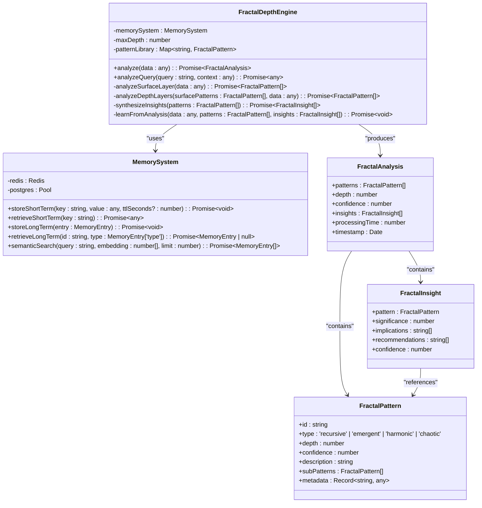
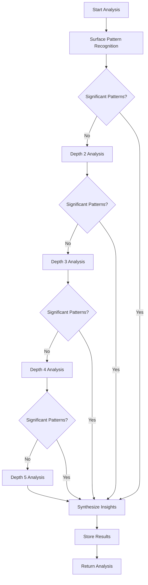
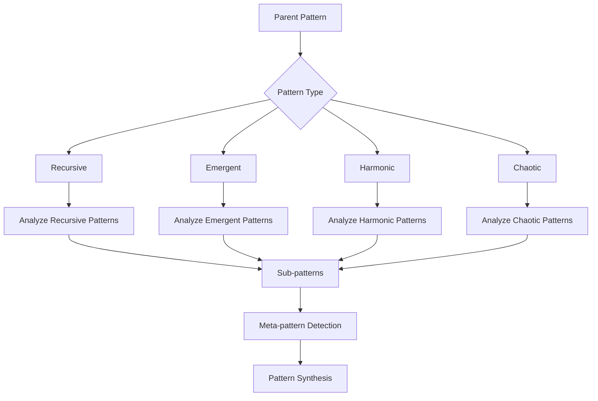
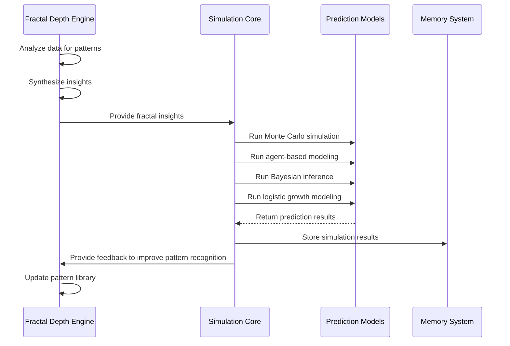
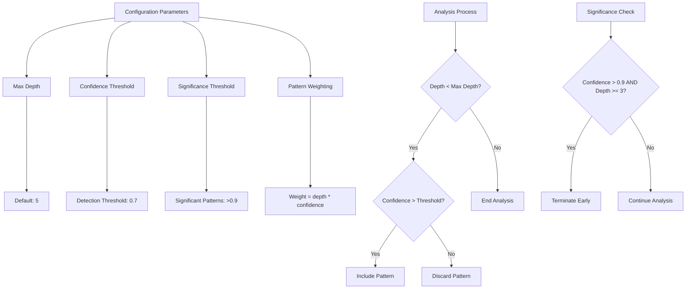
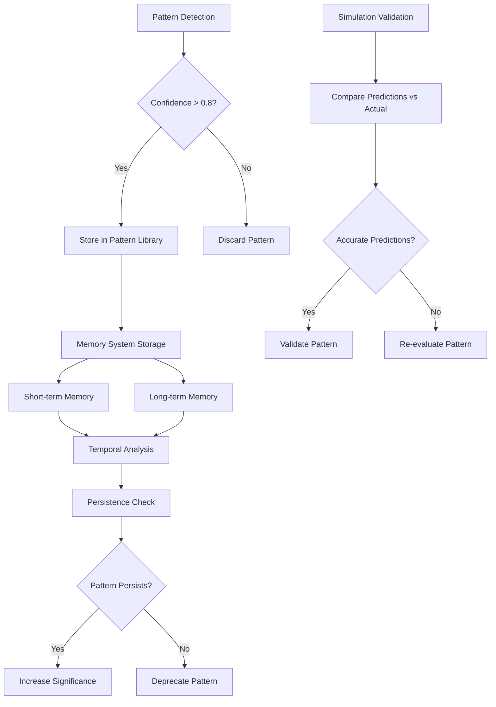

# Fractal Depth Engine

<cite>
**Referenced Files in This Document**   
- [fractal-depth-engine.ts](file://genome/agent-tools/fractal-depth-engine.ts)
- [memory-system.ts](file://genome/agent-tools/memory-system.ts)
- [prediction-models.ts](file://genome/agent-tools/prediction-models.ts)
- [simulation-core.ts](file://genome/agent-tools/simulation-core.ts)
</cite>

## Table of Contents
1. [Introduction](#introduction)
2. [Core Architecture](#core-architecture)
3. [Multi-Resolution Analysis](#multi-resolution-analysis)
4. [Fractal Pattern Recognition](#fractal-pattern-recognition)
5. [Integration with Prediction Models](#integration-with-prediction-models)
6. [Configuration and Parameters](#configuration-and-parameters)
7. [Statistical Significance and Overfitting](#statistical-significance-and-overfitting)
8. [Conclusion](#conclusion)

## Introduction

The Fractal Depth Engine is a sophisticated pattern recognition system that applies fractal mathematics to analyze complex systems across multiple scales. It identifies self-similar structures in economic and educational ecosystems by examining data at various depths of resolution. The engine detects both micro-level user behaviors and macro-level market trends through recursive analysis, enabling comprehensive insights into system dynamics. By leveraging multi-resolution analysis, the engine uncovers hidden patterns that traditional analytical methods might miss, providing a deeper understanding of complex adaptive systems.

**Section sources**
- [fractal-depth-engine.ts](file://genome/agent-tools/fractal-depth-engine.ts#L1-L58)

## Core Architecture

The Fractal Depth Engine employs a layered architecture that systematically analyzes data through recursive depth processing. The engine begins with surface-level pattern recognition and progressively examines deeper layers of complexity. It utilizes a memory system to store and retrieve patterns, enabling continuous learning and improvement over time. The architecture supports multiple pattern types including recursive, emergent, harmonic, and chaotic patterns, each representing different aspects of system behavior. The engine's design allows for integration with various data sources and analytical models, making it adaptable to diverse domains and applications.

**Diagram sources**
- [fractal-depth-engine.ts](file://genome/agent-tools/fractal-depth-engine.ts#L44-L392)
- [memory-system.ts](file://genome/agent-tools/memory-system.ts#L46-L465)

**Section sources**
- [fractal-depth-engine.ts](file://genome/agent-tools/fractal-depth-engine.ts#L44-L392)

## Multi-Resolution Analysis

The Fractal Depth Engine implements multi-resolution analysis through a systematic approach that examines data at increasing depths of complexity. The process begins with surface pattern recognition at depth 1, identifying statistical, temporal, and behavioral patterns in the data. Subsequent layers (depths 2-5) perform recursive analysis, searching for sub-patterns within identified patterns and meta-patterns across multiple patterns. This hierarchical approach enables the detection of both micro-level user behaviors and macro-level market trends simultaneously. The engine dynamically adjusts its analysis depth based on the significance of detected patterns, terminating early when highly confident patterns are identified.

**Diagram sources**
- [fractal-depth-engine.ts](file://genome/agent-tools/fractal-depth-engine.ts#L158-L195)

**Section sources**
- [fractal-depth-engine.ts](file://genome/agent-tools/fractal-depth-engine.ts#L158-L195)

## Fractal Pattern Recognition

The Fractal Depth Engine identifies four primary types of patterns using specialized analysis methods. Recursive patterns represent self-similar structures that repeat across different scales, analyzed through subdivision logic that examines sub-patterns within parent patterns. Emergent patterns arise from bottom-up interactions and are detected by analyzing how simple components combine to create complex behaviors. Harmonic patterns exhibit wave-like characteristics and periodic behavior, while chaotic patterns represent complex, seemingly random system dynamics with underlying order. The engine combines these pattern types to create a comprehensive understanding of system behavior, with each pattern type contributing to the overall analysis confidence.

**Diagram sources**
- [fractal-depth-engine.ts](file://genome/agent-tools/fractal-depth-engine.ts#L197-L225)

**Section sources**
- [fractal-depth-engine.ts](file://genome/agent-tools/fractal-depth-engine.ts#L197-L225)

## Integration with Prediction Models

The Fractal Depth Engine integrates with prediction models to enhance forecasting accuracy by providing deep pattern insights that inform predictive algorithms. The engine's analysis results feed into simulation systems that run comprehensive forecasting models, including Monte Carlo simulations, agent-based modeling, Bayesian inference, and logistic growth modeling. These simulations leverage the fractal insights to create more accurate predictions of future system behavior. The integration creates a feedback loop where prediction outcomes inform pattern recognition, and pattern recognition improves prediction accuracy, resulting in a continuously improving analytical system.

**Diagram sources**
- [fractal-depth-engine.ts](file://genome/agent-tools/fractal-depth-engine.ts#L270-L308)
- [simulation-core.ts](file://genome/agent-tools/simulation-core.ts#L107-L179)

**Section sources**
- [fractal-depth-engine.ts](file://genome/agent-tools/fractal-depth-engine.ts#L270-L308)
- [simulation-core.ts](file://genome/agent-tools/simulation-core.ts#L107-L179)

## Configuration and Parameters

The Fractal Depth Engine provides configurable parameters that control its analysis behavior and sensitivity. The maximum analysis depth can be adjusted to balance thoroughness with computational efficiency, with a default value of 5 layers. Confidence thresholds determine which patterns are considered significant, with patterns above 0.9 confidence and depth 3 or higher triggering early termination of the analysis process. The engine calculates overall confidence as the average of individual pattern confidences, while pattern confidence weights both depth and confidence level. These parameters can be tuned based on specific use cases and data characteristics to optimize pattern detection performance.

**Diagram sources**
- [fractal-depth-engine.ts](file://genome/agent-tools/fractal-depth-engine.ts#L310-L348)

**Section sources**
- [fractal-depth-engine.ts](file://genome/agent-tools/fractal-depth-engine.ts#L310-L348)

## Statistical Significance and Overfitting

The Fractal Depth Engine addresses statistical significance and overfitting through multiple mechanisms. The engine stores only high-confidence patterns (confidence > 0.8) in its pattern library, ensuring that learned patterns have strong statistical support. The memory system maintains both short-term and long-term storage, allowing for temporal analysis of pattern persistence. The engine's recursive analysis approach helps prevent overfitting by requiring patterns to manifest across multiple scales and depths. Additionally, the integration with simulation systems provides a validation mechanism where predicted outcomes can be compared against actual results, enabling continuous assessment of pattern significance and model accuracy.

**Diagram sources**
- [fractal-depth-engine.ts](file://genome/agent-tools/fractal-depth-engine.ts#L270-L308)
- [memory-system.ts](file://genome/agent-tools/memory-system.ts#L46-L465)

**Section sources**
- [fractal-depth-engine.ts](file://genome/agent-tools/fractal-depth-engine.ts#L270-L308)
- [memory-system.ts](file://genome/agent-tools/memory-system.ts#L46-L465)

## Conclusion

The Fractal Depth Engine represents a sophisticated approach to pattern recognition in complex systems, leveraging fractal mathematics to identify self-similar structures across multiple scales. By analyzing both micro-level user behaviors and macro-level market trends, the engine provides comprehensive insights into economic and educational ecosystems. Its integration with prediction models enhances forecasting accuracy through deep pattern analysis, while configurable parameters allow for optimization across different domains and use cases. The engine's architecture, which combines recursive depth analysis with memory-based learning, creates a powerful system for uncovering hidden patterns and generating actionable insights. Through continuous learning and validation, the Fractal Depth Engine improves its analytical capabilities over time, making it a valuable tool for understanding and predicting complex system behaviors.

**Section sources**
- [fractal-depth-engine.ts](file://genome/agent-tools/fractal-depth-engine.ts#L1-L392)
- [prediction-models.ts](file://genome/agent-tools/prediction-models.ts#L1-L213)
- [simulation-core.ts](file://genome/agent-tools/simulation-core.ts#L107-L179)