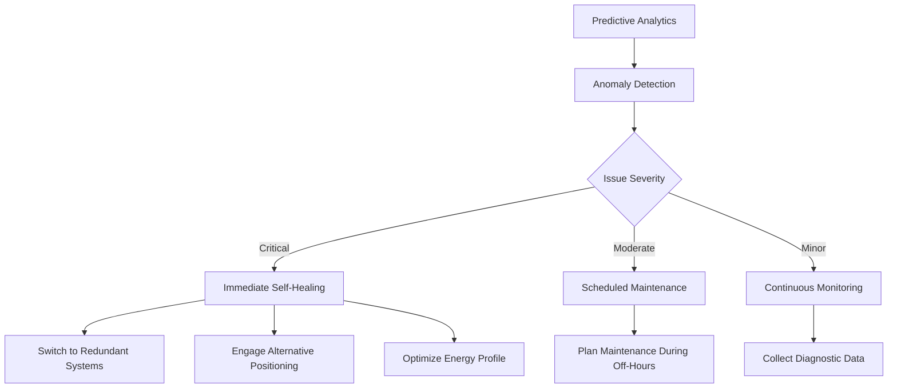

# Predictive Analytics and Simulation

<cite>
**Referenced Files in This Document**   
- [fractal-depth-engine.ts](file://genome/agent-tools/fractal-depth-engine.ts)
- [causal-inference-engine.ts](file://genome/agent-tools/causal-inference-engine.ts)
- [simulation-core.ts](file://genome/agent-tools/simulation-core.ts)
- [index.js](file://organs/predictive-analytics/index.js)
- [AnalyticsEngine.js](file://organs/database-integration/AnalyticsEngine.js)
- [index.js](file://organs/autonomous-operations/index.js)
- [index.js](file://organs/hr-ai-deputy/index.js)
</cite>

## Table of Contents
1. [Introduction](#introduction)
2. [Fractal Depth Engine](#fractal-depth-engine)
3. [Simulation Core](#simulation-core)
4. [Causal Inference Engine](#causal-inference-engine)
5. [Integration with System Components](#integration-with-system-components)
6. [Practical Applications and Decision Support](#practical-applications-and-decision-support)
7. [Configuration and Interpretation](#configuration-and-interpretation)
8. [Challenges and Solutions](#challenges-and-solutions)
9. [Conclusion](#conclusion)

## Introduction
Azora OS employs a sophisticated predictive analytics framework that enables multi-scale ecosystem analysis, forecasting, and causal reasoning. The system integrates three core analytical engines: the Fractal Depth Engine for pattern recognition across multiple scales, the Simulation Core for predictive modeling, and the Causal Inference Engine for identifying root causes of system behaviors. These components work in concert to provide strategic decision support, risk mitigation, and adaptive responses across the organizational ecosystem. This document details the architecture, functionality, and practical applications of these predictive systems.

## Fractal Depth Engine
The Fractal Depth Engine performs multi-layered pattern recognition inspired by fractal mathematics, analyzing data at multiple depths to uncover complex patterns within the ecosystem. It operates through a hierarchical analysis process that begins with surface pattern recognition and progresses through recursive depth analysis.

The engine identifies four primary pattern types: recursive, emergent, harmonic, and chaotic. Each pattern is characterized by depth, confidence, and metadata, allowing the system to distinguish between superficial correlations and deeply embedded structural relationships. The analysis process begins with surface-level detection of statistical, temporal, and behavioral patterns, then recursively examines sub-patterns and meta-patterns across five depth levels.

This multi-scale approach enables the system to detect self-similar patterns across different organizational levels, from individual agent behaviors to macro-level ecosystem dynamics. The engine synthesizes insights from identified patterns, generating recommendations based on pattern significance and confidence metrics. It also incorporates learning capabilities, storing successful patterns in its library for future reference and continuously improving its pattern recognition accuracy.

**Section sources**
- [fractal-depth-engine.ts](file://genome/agent-tools/fractal-depth-engine.ts#L0-L392)

## Simulation Core
The Simulation Core executes comprehensive predictive modeling using multiple simulation methodologies, including Monte Carlo, agent-based, Bayesian, logistic growth, and system dynamics approaches. This multi-model framework provides robust forecasting capabilities by combining different analytical perspectives on ecosystem behavior.

The core runs five primary simulation types:
- **Monte Carlo simulations** for probabilistic forecasting of ecosystem variables and outcomes
- **Agent-based modeling** for simulating ecosystem dynamics and participant interactions
- **Bayesian inference** for uncertainty quantification and decision-making under uncertainty
- **Logistic growth modeling** for adoption curve projections and ecosystem expansion
- **System dynamics modeling** for analyzing complex interactions and feedback loops

Each simulation generates detailed results including success metrics, scenario outcomes, risk assessments, and recommendations. The system stores simulation history for learning purposes and maintains confidence metrics based on result consistency and scenario probability. The Simulation Core integrates with the Fractal Depth Engine, using pattern insights to inform simulation parameters and improve forecast accuracy.

**Section sources**
- [simulation-core.ts](file://genome/agent-tools/simulation-core.ts#L0-L612)

## Causal Inference Engine
The Causal Inference Engine implements Judea Pearl's Do-calculus framework for causal reasoning, enabling the system to distinguish between correlation and causation. Unlike traditional analytics that identify associations, this engine determines true cause-and-effect relationships, supporting counterfactual reasoning and intervention analysis.

The engine operates on a causal graph represented as a directed acyclic graph (DAG) with nodes representing variables and edges representing causal relationships. It implements three rules of Do-calculus to determine when observational data can be used to estimate causal effects. The system supports multiple inference methods including backdoor adjustment, frontdoor criterion, instrumental variables, and difference-in-differences analysis.

Key capabilities include:
- Computing causal effects using appropriate inference methods based on graph structure
- Performing counterfactual reasoning to answer "what if" scenarios
- Detecting Simpson's paradox where associations reverse when conditioning on third variables
- Identifying confounding paths and determining appropriate adjustment variables

The engine loads observational data for causal analysis and selects the most appropriate inference method based on the causal graph structure, ensuring valid causal conclusions while documenting assumptions and limitations.

**Section sources**
- [causal-inference-engine.ts](file://genome/agent-tools/causal-inference-engine.ts#L0-L799)

## Integration with System Components
The predictive analytics components integrate extensively with other system elements, creating a cohesive intelligence framework that informs organizational decision-making and operational responses.

### Integration with Economic Engine
Predictive analytics directly inform economic modeling and resource allocation. The Simulation Core generates revenue and cost forecasts that feed into the economic engine's budgeting and allocation processes. These predictions consider market trends, seasonality, and fleet capacity to provide realistic financial projections. The system recommends strategic actions such as fleet expansion or efficiency optimization based on forecasted demand and profitability metrics.

### Integration with Self-Healing Infrastructure
Predictive analytics enable proactive maintenance and system recovery through integration with self-healing infrastructure. The autonomous operations system uses predictive maintenance algorithms to identify potential issues before they become critical. When issues are detected, the self-healing system automatically initiates recovery protocols such as switching to redundant sensors, engaging alternative positioning systems, or optimizing energy profiles to extend operational capacity.

**Diagram sources**
- [index.js](file://organs/autonomous-operations/index.js#L0-L513)
- [index.js](file://organs/hr-ai-deputy/index.js#L0-L799)

### Integration with Decision Support Systems
The analytics framework provides actionable insights to executive decision-makers through comprehensive reporting and dashboard interfaces. The HR AI Deputy system incorporates predictive analytics into its decision approval processes, requiring AI validation for significant organizational changes. This integration ensures that hiring, firing, and strategic decisions are informed by data-driven forecasts and risk assessments.

**Section sources**
- [index.js](file://organs/predictive-analytics/index.js#L0-L329)
- [AnalyticsEngine.js](file://organs/database-integration/AnalyticsEngine.js#L0-L283)

## Practical Applications and Decision Support
Predictive analytics in Azora OS inform strategic decisions across multiple domains, providing actionable insights for risk mitigation and opportunity identification.

### Demand Forecasting and Route Optimization
The predictive analytics service forecasts demand based on historical patterns, enabling proactive fleet capacity planning. For route optimization, the system evaluates multiple route alternatives considering traffic conditions, weather, vehicle type, cargo requirements, and priority levels. It generates efficiency scores and recommends optimal routes while providing estimated cost savings and confidence levels.

### Traffic Prediction and Risk Assessment
The system predicts traffic conditions by analyzing historical patterns adjusted for time-of-day, day-of-week, and weather conditions. These predictions inform route planning and provide recommendations for alternative routes when congestion exceeds thresholds. The risk assessment component evaluates multiple factors including traffic density, weather impact, and safety scores to provide comprehensive risk profiles for planned operations.

### Strategic Planning and Resource Allocation
Predictive models support long-term strategic planning by projecting ecosystem growth, market penetration, and financial performance. The system identifies optimal investment opportunities, resource allocation strategies, and expansion timelines based on comprehensive scenario analysis. These insights enable leadership to make data-driven decisions about organizational direction and capacity planning.

**Section sources**
- [index.js](file://organs/predictive-analytics/index.js#L0-L329)
- [AnalyticsEngine.js](file://organs/database-integration/AnalyticsEngine.js#L0-L283)

## Configuration and Interpretation
Effective use of the predictive analytics system requires proper configuration of simulation parameters and accurate interpretation of prediction results.

### Simulation Parameter Configuration
The Simulation Core allows customization of key parameters including time horizon, iteration count, variable distributions, and constraints. Users can define variable types (continuous, discrete, categorical), specify distribution parameters (normal, uniform, exponential), and set bounds for constrained optimization. Assumptions for each simulation type are documented to ensure appropriate application.

### Interpreting Prediction Results
Prediction results include multiple confidence metrics and risk assessments to support informed decision-making. The system provides:
- **Scenario probabilities** indicating the likelihood of different outcomes
- **Risk factor analysis** identifying potential threats and mitigation strategies
- **Confidence intervals** for forecasted values
- **Sensitivity analysis** showing how results change with parameter variations

Users should consider the assumptions and limitations documented with each prediction, particularly regarding data quality, model validity, and external factors not captured in the analysis. The system recommends actions based on predicted outcomes while acknowledging uncertainty in long-term forecasts.

**Section sources**
- [simulation-core.ts](file://genome/agent-tools/simulation-core.ts#L0-L612)
- [AnalyticsEngine.js](file://organs/database-integration/AnalyticsEngine.js#L0-L283)

## Challenges and Solutions
The implementation of predictive analytics in complex organizational ecosystems presents several challenges, which Azora OS addresses through architectural and methodological solutions.

### Data Quality and Availability
Challenge: Predictive accuracy depends on the quality and completeness of historical data. Missing or inaccurate data can lead to biased predictions.

Solution: The system implements data validation and imputation techniques, clearly documenting data limitations in prediction results. It uses ensemble methods that can operate with partial data and provides confidence metrics that reflect data quality.

### Model Complexity and Interpretability
Challenge: Advanced models like agent-based simulations can become "black boxes" that are difficult to interpret and trust.

Solution: The system provides transparent reporting of model assumptions, parameters, and limitations. It uses multiple complementary models to cross-validate results and presents findings through intuitive visualizations and plain-language summaries.

### Overfitting and Generalization
Challenge: Models may overfit to historical data and fail to generalize to novel situations.

Solution: The system employs regularization techniques, cross-validation, and out-of-sample testing. It maintains a balance between model complexity and generalizability, preferring simpler models when predictive performance is comparable.

### Integration with Human Decision-Making
Challenge: Automated predictions must be integrated with human judgment and organizational context.

Solution: The system positions analytics as decision support rather than decision replacement. It requires human approval for significant actions and provides explanatory insights that help stakeholders understand the reasoning behind recommendations.

**Section sources**
- [causal-inference-engine.ts](file://genome/agent-tools/causal-inference-engine.ts#L0-L799)
- [simulation-core.ts](file://genome/agent-tools/simulation-core.ts#L0-L612)

## Conclusion
Azora OS's predictive analytics framework represents a comprehensive approach to ecosystem forecasting and decision support. By integrating the Fractal Depth Engine, Simulation Core, and Causal Inference Engine, the system provides multi-scale pattern recognition, robust predictive modeling, and true causal reasoning capabilities. These components work in concert with economic and self-healing systems to create an intelligent, adaptive organizational infrastructure.

The framework enables proactive decision-making, risk mitigation, and strategic planning based on data-driven insights rather than intuition alone. Through transparent reporting, confidence metrics, and clear documentation of assumptions, the system supports informed human judgment while automating routine analytical tasks. As the system continues to learn from operational data, its predictive accuracy and strategic value will increase, positioning Azora OS as a leader in autonomous organizational intelligence.