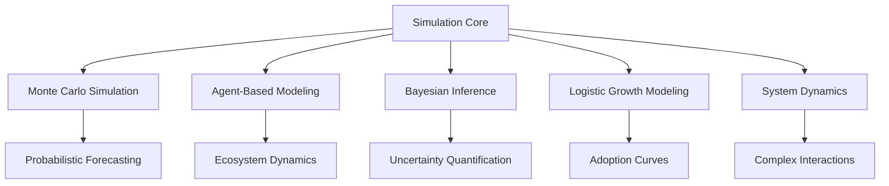
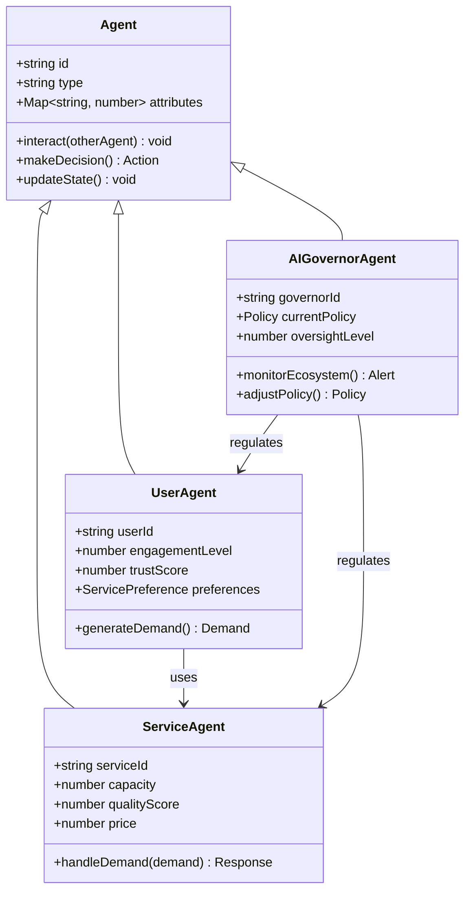
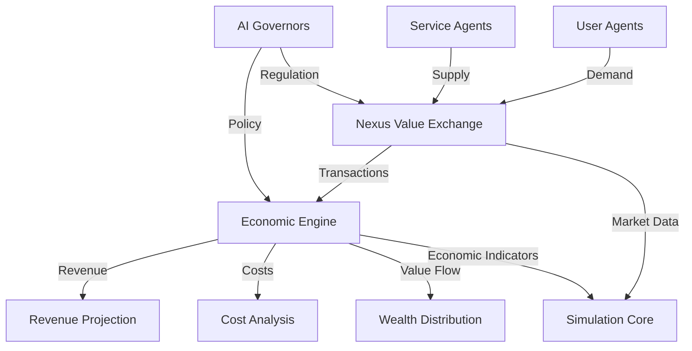
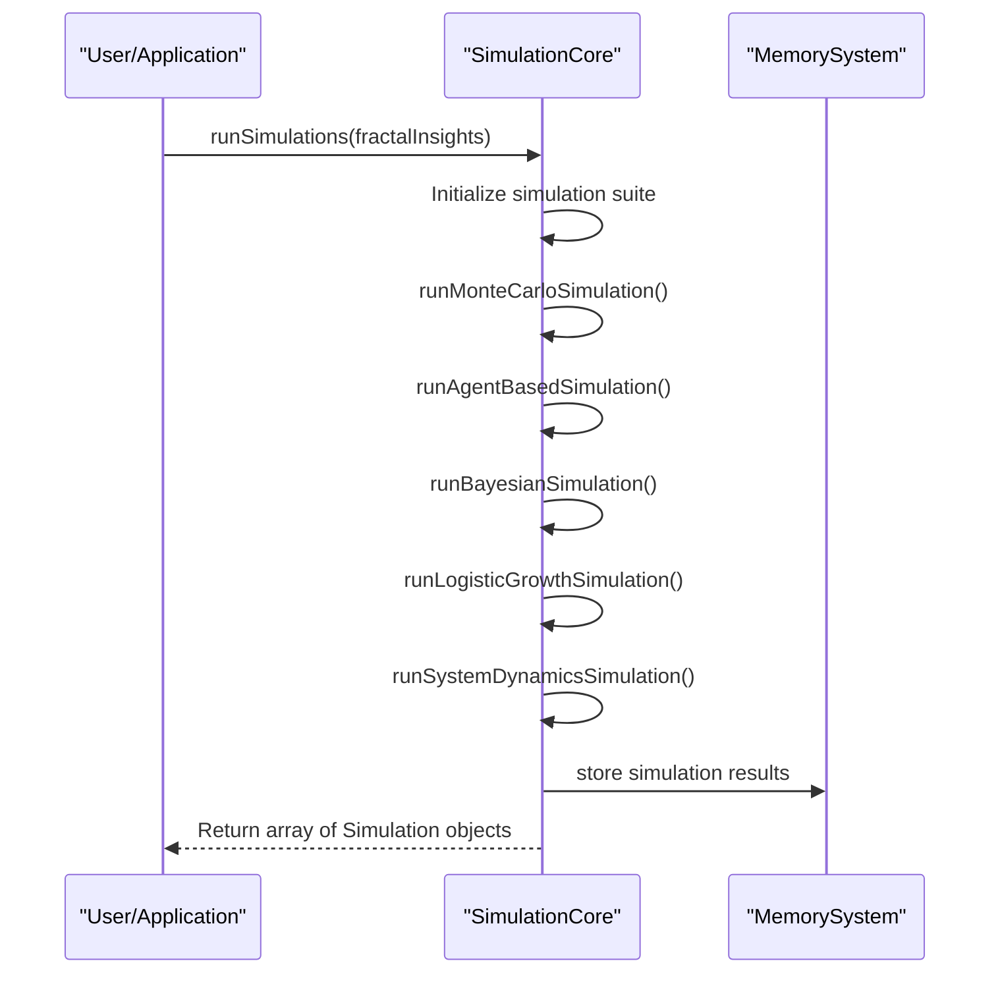
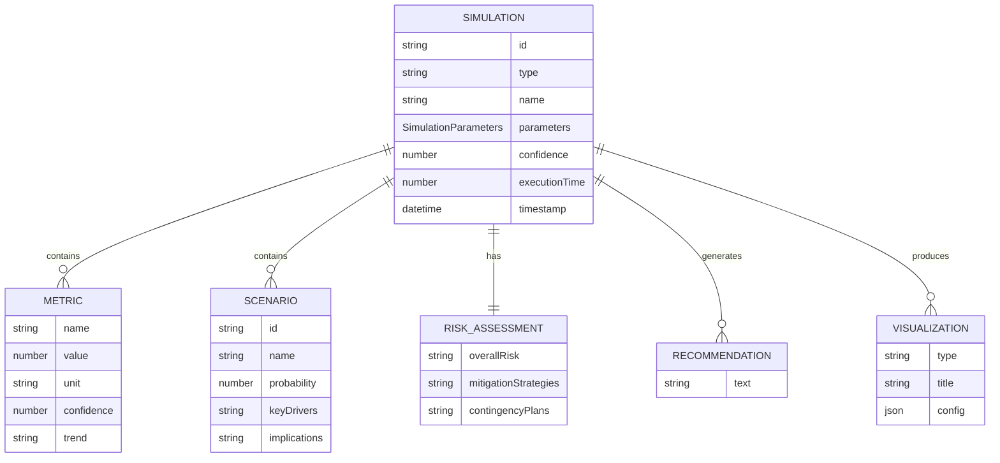

# Simulation Core

<cite>
**Referenced Files in This Document**   
- [simulation-core.ts](file://genome/agent-tools/simulation-core.ts)
- [corporate-metabolism.ts](file://genome/agent-tools/corporate-metabolism.ts)
</cite>

## Table of Contents
1. [Introduction](#introduction)
2. [Core Simulation Methodologies](#core-simulation-methodologies)
3. [Agent-Based Modeling Approach](#agent-based-modeling-approach)
4. [Integration with Nexus Value Exchange System](#integration-with-nexus-value-exchange-system)
5. [Simulation Configuration and Execution](#simulation-configuration-and-execution)
6. [Result Interpretation and Strategic Decision Making](#result-interpretation-and-strategic-decision-making)
7. [Performance and Optimization Considerations](#performance-and-optimization-considerations)
8. [Model Validation and Accuracy Verification](#model-validation-and-accuracy-verification)
9. [Conclusion](#conclusion)

## Introduction

The Simulation Core component serves as the central predictive engine within the Azora ecosystem, enabling comprehensive forecasting of system behavior under diverse scenarios. This component leverages multiple advanced modeling techniques to simulate economic shifts, user growth patterns, and infrastructure stress events. The core functionality is implemented in the `SimulationCore` class within the `simulation-core.ts` file, which orchestrates various simulation methodologies including Monte Carlo, agent-based modeling, Bayesian inference, logistic growth, and system dynamics.

The Simulation Core plays a critical role in strategic planning by providing data-driven insights that inform decision-making processes across the organization. By simulating complex interactions between users, services, and AI governors, the system enables proactive risk mitigation and optimization of ecosystem performance. The integration with the Nexus value exchange system allows for realistic modeling of financial flows and economic dynamics within the ecosystem.

**Section sources**
- [simulation-core.ts](file://genome/agent-tools/simulation-core.ts#L107-L612)

## Core Simulation Methodologies

The Simulation Core implements five distinct simulation methodologies, each designed to address specific aspects of ecosystem forecasting. These methodologies work in concert to provide a comprehensive view of potential future states.



**Diagram sources**
- [simulation-core.ts](file://genome/agent-tools/simulation-core.ts#L107-L612)

### Monte Carlo Simulation

The Monte Carlo simulation provides probabilistic forecasting by running thousands of iterations with randomized variables. This approach is particularly effective for assessing risk and uncertainty in ecosystem projections. The simulation uses defined variables such as user growth rate and market penetration, each with specified distributions and constraints.

Key parameters for Monte Carlo simulations include:
- **Time Horizon**: 365 days (1 year)
- **Iterations**: 10,000
- **Variables**: User growth rate (normal distribution, mean 0.15, std 0.05), market penetration (uniform distribution, 0.1-0.8)
- **Constraints**: Positive growth requirement (user_growth_rate > 0)

The results include metrics such as projected user growth (125,000 users) and revenue projection ($2.5M), along with scenario analysis and risk assessment.

**Section sources**
- [simulation-core.ts](file://genome/agent-tools/simulation-core.ts#L141-L210)

### Agent-Based Modeling

The agent-based modeling approach simulates the interactions between individual agents within the ecosystem, including users, services, and AI governors. This methodology captures emergent system properties that arise from local interaction rules and rational agent behavior.

The model operates with the following parameters:
- **Time Horizon**: 180 days (6 months)
- **Iterations**: 1,000
- **Assumptions**: Rational agent behavior, local interaction rules, emergent system properties

This approach is particularly valuable for understanding complex ecosystem dynamics and predicting how changes in individual agent behavior can cascade through the system.

**Section sources**
- [simulation-core.ts](file://genome/agent-tools/simulation-core.ts#L209-L245)

### Bayesian Inference

Bayesian simulation incorporates prior knowledge to quantify uncertainty and update beliefs based on new evidence. This approach is essential for decision-making under uncertainty and allows for the incorporation of historical data and expert knowledge.

Key features of the Bayesian simulation include:
- **Time Horizon**: 90 days (3 months)
- **Iterations**: 5,000
- **Assumptions**: Prior knowledge incorporation, likelihood function accuracy, convergence of posterior distributions

The Bayesian approach enables more accurate predictions by continuously updating probability distributions as new data becomes available.

**Section sources**
- [simulation-core.ts](file://genome/agent-tools/simulation-core.ts#L241-L269)

### Logistic Growth Modeling

Logistic growth modeling focuses on adoption curves and expansion patterns, capturing the S-shaped growth trajectory typical of technology adoption. This methodology accounts for carrying capacity and diminishing returns as the ecosystem matures.

Parameters for logistic growth simulations:
- **Time Horizon**: 730 days (2 years)
- **Iterations**: 100
- **Assumptions**: S-shaped growth curve, carrying capacity existence, logistic growth rate function

This model is particularly useful for forecasting user adoption and planning resource allocation for scaling.

**Section sources**
- [simulation-core.ts](file://genome/agent-tools/simulation-core.ts#L269-L300)

### System Dynamics Modeling

System dynamics modeling captures complex interactions through feedback loops, stock and flow relationships, and time-delayed effects. This approach is ideal for understanding how different components of the ecosystem influence each other over time.

Key aspects of system dynamics simulations:
- **Time Horizon**: 365 days (1 year)
- **Iterations**: 500
- **Assumptions**: Feedback loop dominance, stock and flow relationships, time-delayed effects

This methodology reveals how policy changes, market shifts, and infrastructure modifications can have cascading effects throughout the ecosystem.

**Section sources**
- [simulation-core.ts](file://genome/agent-tools/simulation-core.ts#L337-L371)

## Agent-Based Modeling Approach

The agent-based modeling component of the Simulation Core simulates the interactions between users, services, and AI governors within the ecosystem. This approach treats each participant as an autonomous agent with specific behaviors, goals, and decision-making rules.



**Diagram sources**
- [simulation-core.ts](file://genome/agent-tools/simulation-core.ts#L209-L245)

The agent-based model operates on several key principles:
- **Autonomy**: Each agent makes independent decisions based on its internal state and environmental inputs
- **Local Interactions**: Agents interact primarily with nearby or directly connected agents
- **Emergent Behavior**: Complex system-level patterns emerge from simple agent-level rules
- **Adaptation**: Agents can learn and modify their behavior over time based on experience

The simulation tracks various metrics including user engagement, service utilization, transaction volumes, and system stability. By modeling the ecosystem at the agent level, the system can identify potential bottlenecks, predict adoption patterns, and evaluate the impact of policy changes before implementation.

**Section sources**
- [simulation-core.ts](file://genome/agent-tools/simulation-core.ts#L209-L245)

## Integration with Nexus Value Exchange System

The Simulation Core is tightly integrated with the Nexus value exchange system and economic engine, enabling realistic modeling of financial flows within the ecosystem. This integration allows for comprehensive economic simulations that account for transaction patterns, value creation, and resource allocation.



**Diagram sources**
- [corporate-metabolism.ts](file://genome/agent-tools/corporate-metabolism.ts#L162-L208)
- [simulation-core.ts](file://genome/agent-tools/simulation-core.ts#L107-L612)

The integration leverages the metabolic pathway framework defined in the corporate-metabolism system, where financial flows are treated as a specific type of resource (ResourceType.FINANCIAL). Each transaction in the Nexus system is modeled with:
- **Flow Rate**: Transactions per day
- **Efficiency**: Success rate of transactions (0.99 in baseline)
- **Waste Generated**: Failed transactions
- **Energy Required**: Validation compute resources

The economic engine assigns a value of $1.00 per transaction, which is used in calculating the potential value of symbiosis opportunities and overall economic efficiency. This integration enables the Simulation Core to model complex economic scenarios such as market saturation, pricing strategies, and the impact of transaction fees on user behavior.

**Section sources**
- [corporate-metabolism.ts](file://genome/agent-tools/corporate-metabolism.ts#L162-L208)
- [simulation-core.ts](file://genome/agent-tools/simulation-core.ts#L107-L612)

## Simulation Configuration and Execution

The Simulation Core provides a comprehensive API for configuring and executing simulations. The primary entry point is the `runSimulations` method, which orchestrates multiple simulation types based on fractal insights.



**Diagram sources**
- [simulation-core.ts](file://genome/agent-tools/simulation-core.ts#L107-L612)

### Configuration Parameters

Each simulation type accepts configurable parameters through the `SimulationParameters` interface:

```typescript
interface SimulationParameters {
    timeHorizon: number; // days
    iterations: number;
    variables: SimulationVariable[];
    constraints: SimulationConstraint[];
    assumptions: string[];
}
```

The `SimulationVariable` interface defines variables with their statistical properties:

```typescript
interface SimulationVariable {
    name: string;
    type: 'continuous' | 'discrete' | 'categorical';
    distribution: 'normal' | 'uniform' | 'exponential' | 'custom';
    parameters: Record<string, number>;
    bounds?: { min: number; max: number };
}
```

### Execution Workflow

The simulation execution follows a standardized workflow:
1. **Initialization**: Set up simulation parameters and generate simulation ID
2. **Parameter Definition**: Define variables, constraints, and assumptions
3. **Execution**: Run the simulation with specified iterations
4. **Result Processing**: Calculate metrics, scenarios, and risk assessments
5. **Confidence Calculation**: Determine simulation confidence based on metric and scenario confidence
6. **Storage**: Store results in the MemorySystem and maintain simulation history
7. **Return**: Provide structured results to the caller

The `runCustomSimulation` method allows for targeted simulations with specific parameters, enabling focused analysis of particular scenarios.

**Section sources**
- [simulation-core.ts](file://genome/agent-tools/simulation-core.ts#L107-L612)

## Result Interpretation and Strategic Decision Making

Simulation results are structured to facilitate strategic decision-making and risk mitigation. The `SimulationResult` interface provides a comprehensive output format that includes success status, metrics, scenarios, risk assessments, recommendations, and visualizations.



**Diagram sources**
- [simulation-core.ts](file://genome/agent-tools/simulation-core.ts#L45-L105)

### Key Output Components

**Metrics**: Quantitative measurements of ecosystem performance, such as user growth (125,000 users) and revenue projection ($2.5M), each with associated confidence levels and trend indicators.

**Scenarios**: Probabilistic future states with defined outcomes, key drivers, and implications. For example, the "Optimistic Growth Scenario" has a 25% probability and projects 200,000 users.

**Risk Assessment**: Comprehensive evaluation of potential risks, including:
- Overall risk level (low, medium, high, critical)
- Specific risk factors with probability, impact, and risk scores
- Mitigation strategies and contingency plans

**Recommendations**: Actionable insights derived from simulation results, such as increasing marketing budget by 40% or expanding to three new markets.

The `calculateSimulationConfidence` method combines metric confidence and scenario probability to provide an overall confidence score for each simulation, helping decision-makers assess the reliability of predictions.

**Section sources**
- [simulation-core.ts](file://genome/agent-tools/simulation-core.ts#L45-L105)
- [simulation-core.ts](file://genome/agent-tools/simulation-core.ts#L540-L579)

## Performance and Optimization Considerations

The Simulation Core addresses computational complexity through several optimization strategies. Different simulation types have varying computational requirements based on their time horizon and iteration count.

```mermaid
barChart
title Simulation Computational Requirements
x-axis Simulation Type
y-axis Computational Intensity
bar Monte Carlo: 10000
bar Agent-Based: 1000
bar Bayesian: 5000
bar Logistic Growth: 100
bar System Dynamics: 500
```

**Diagram sources**
- [simulation-core.ts](file://genome/agent-tools/simulation-core.ts#L107-L612)

### Optimization Techniques

**Memory Management**: The system maintains a simulation history but limits it to the most recent 100 simulations to prevent memory bloat. Historical results are stored in the MemorySystem for long-term retention.

**Parallel Execution**: While the current implementation runs simulations sequentially, the architecture supports potential parallelization of independent simulation types to reduce overall execution time.

**Efficient Data Structures**: The use of Maps for active simulations enables O(1) lookup and insertion operations, optimizing performance for real-time simulation tracking.

**Configurable Parameters**: Users can adjust time horizon and iteration count based on their accuracy and performance requirements, allowing for rapid prototyping with shorter time horizons and fewer iterations.

The system also implements error handling and logging to monitor performance and identify bottlenecks during simulation execution.

**Section sources**
- [simulation-core.ts](file://genome/agent-tools/simulation-core.ts#L540-L579)

## Model Validation and Accuracy Verification

The Simulation Core incorporates several mechanisms for model validation and accuracy verification. The confidence calculation methodology combines multiple factors to assess the reliability of simulation results.

```mermaid
flowchart TD
A[Simulation Results] --> B{Success?}
B --> |No| C[Confidence = 0]
B --> |Yes| D[Calculate Metric Confidence]
D --> E[Mean of metric confidence values]
A --> F[Calculate Scenario Confidence]
F --> G[Sum of scenario probabilities]
E --> H[Combine Confidence Scores]
G --> H
H --> I[Final Confidence = (Metric + Scenario) / 2]
I --> J[Return Confidence Score]
```

**Diagram sources**
- [simulation-core.ts](file://genome/agent-tools/simulation-core.ts#L540-L579)

### Validation Approaches

**Historical Comparison**: The `getPredictiveInsights` method analyzes simulation history to identify patterns and validate current predictions against past performance.

**Cross-Method Validation**: By running multiple simulation types (Monte Carlo, agent-based, Bayesian, etc.), the system can compare results across methodologies to identify consensus predictions and outlier scenarios.

**Constraint Enforcement**: Hard and soft constraints ensure that simulation results remain within realistic bounds. For example, the Monte Carlo simulation enforces a "positive_growth" constraint to prevent unrealistic negative growth scenarios.

**Memory Integration**: The integration with the MemorySystem allows for continuous learning from past simulations, enabling the system to refine its models over time based on actual ecosystem performance.

The system also maintains detailed execution metrics, including execution time for each simulation, which can be used to monitor performance trends and identify potential issues.

**Section sources**
- [simulation-core.ts](file://genome/agent-tools/simulation-core.ts#L540-L612)

## Conclusion

The Simulation Core represents a sophisticated predictive modeling system that enables comprehensive forecasting of ecosystem behavior under various scenarios. By integrating multiple simulation methodologies—Monte Carlo, agent-based modeling, Bayesian inference, logistic growth, and system dynamics—the system provides a holistic view of potential future states.

The agent-based modeling approach effectively captures the complex interactions between users, services, and AI governors, revealing emergent behaviors that would be difficult to predict through traditional analysis. Integration with the Nexus value exchange system allows for realistic modeling of financial flows and economic dynamics, making the simulations highly relevant for strategic decision-making.

The system's architecture supports flexible configuration, comprehensive result interpretation, and continuous learning through memory integration. While computational complexity remains a consideration, the implementation includes optimization strategies for memory management and performance monitoring.

For optimal use, stakeholders should:
- Leverage the multiple simulation types for cross-validation of results
- Adjust parameters based on specific use cases and performance requirements
- Regularly review simulation history to identify patterns and validate predictions
- Use the risk assessment and recommendation outputs to inform strategic planning and risk mitigation

The Simulation Core serves as a powerful tool for proactive ecosystem management, enabling data-driven decisions that enhance resilience, optimize performance, and drive sustainable growth.

**Section sources**
- [simulation-core.ts](file://genome/agent-tools/simulation-core.ts#L107-L612)
- [corporate-metabolism.ts](file://genome/agent-tools/corporate-metabolism.ts#L162-L208)