# AI Governance API

<cite>
**Referenced Files in This Document**   
- [unified-elara.ts](file://genome/agent-tools/unified-elara.ts)
- [elara-integration/index.ts](file://genome/elara-integration/index.ts)
- [synapse/pages/api/elara.js](file://synapse/pages/api/elara.js)
- [ui/app/api/elara/route.ts](file://ui/app/api/elara/route.ts)
- [ui/app/api/elara/education/route.ts](file://ui/app/api/elara/education/route.ts)
</cite>

## Table of Contents
1. [Introduction](#introduction)
2. [Core API Endpoints](#core-api-endpoints)
3. [Request/Response Schemas](#requestresponse-schemas)
4. [Ethical Oversight and Constitutional Governance](#ethical-oversight-and-constitutional-governance)
5. [AI Recommendation Workflows](#ai-recommendation-workflows)
6. [Security and Auditability](#security-and-auditability)
7. [Performance and Scalability](#performance-and-scalability)
8. [Client Implementation Guidelines](#client-implementation-guidelines)
9. [Error Handling and Fallback Mechanisms](#error-handling-and-fallback-mechanisms)
10. [Conclusion](#conclusion)

## Introduction

The AI Governance API provides a comprehensive interface for interacting with Elara AI, the constitutional superintelligence that governs the Azora ecosystem. This API enables clients to access AI-generated insights, recommendations, and educational guidance while ensuring ethical oversight and constitutional compliance. The system integrates strategic planning (Elara Core) with operational execution (Elara Agent) through a unified intelligence framework that maintains transparency and accountability across all transactions and user interactions.

**Section sources**
- [unified-elara.ts](file://genome/agent-tools/unified-elara.ts#L1-L50)
- [elara-integration/index.ts](file://genome/elara-integration/index.ts#L1-L50)

## Core API Endpoints

The AI Governance API exposes several endpoints for different types of AI interactions, ranging from general queries to specialized educational assistance. These endpoints are designed to provide flexible access to Elara's capabilities while maintaining strict governance controls.

### Unified Elara Endpoint

The primary endpoint for accessing Elara's unified intelligence combines strategic and operational processing capabilities:

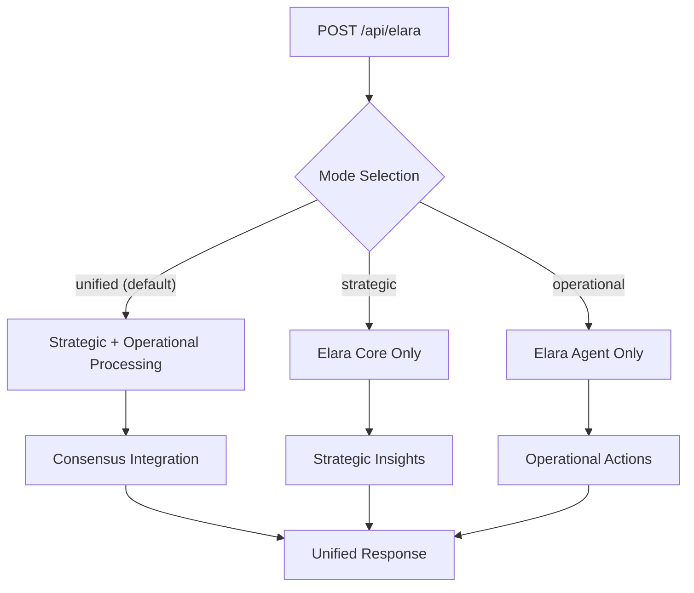

**Diagram sources**
- [synapse/pages/api/elara.js](file://synapse/pages/api/elara.js#L1-L26)
- [unified-elara.ts](file://genome/agent-tools/unified-elara.ts#L81-L517)

### Educational Assistance Endpoint

A specialized endpoint for educational queries provides tailored assistance for learning applications:

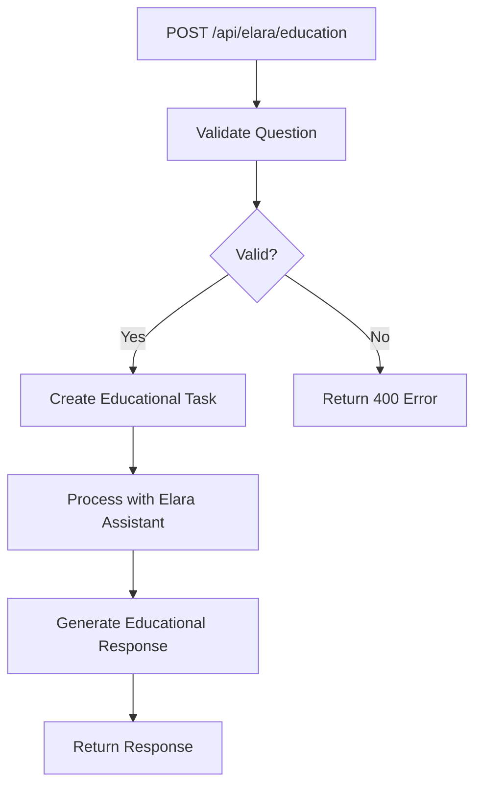

**Diagram sources**
- [ui/app/api/elara/education/route.ts](file://ui/app/api/elara/education/route.ts#L1-L40)
- [elara-integration/index.ts](file://genome/elara-integration/index.ts#L265-L311)

**Section sources**
- [ui/app/api/elara/route.ts](file://ui/app/api/elara/route.ts#L1-L53)
- [ui/app/api/elara/education/route.ts](file://ui/app/api/elara/education/route.ts#L1-L40)

## Request/Response Schemas

### Unified Elara Request Schema

The unified Elara endpoint accepts requests with the following structure:

```json
{
  "input": "string",
  "mode": "'unified' | 'strategic' | 'operational'",
  "context": {
    "userId": "string",
    "role": "string",
    "permissions": ["string"],
    "culturalContext": "string",
    "language": "string"
  }
}
```

### Unified Elara Response Schema

The response from the unified Elara system includes comprehensive information about the AI's processing:

```json
{
  "success": "boolean",
  "data": {
    "response": "string",
    "confidence": "number",
    "strategicInsights": ["string"],
    "operationalActions": ["string"],
    "ethicalAlignment": {
      "coreCompliance": "number",
      "agentCompliance": "number",
      "unifiedCompliance": "number",
      "concerns": ["string"],
      "recommendations": ["string"]
    },
    "requiresApproval": "boolean",
    "executionPlan": {
      "strategicDecisions": ["string"],
      "operationalSteps": ["string"],
      "timeline": "string",
      "riskAssessment": "string",
      "successMetrics": ["string"]
    }
  },
  "mode": "string",
  "timestamp": "string"
}
```

**Section sources**
- [unified-elara.ts](file://genome/agent-tools/unified-elara.ts#L61-L150)
- [unified-elara.ts](file://genome/agent-tools/unified-elara.ts#L547-L602)

## Ethical Oversight and Constitutional Governance

The AI Governance API integrates with the Elara Supreme AI system to ensure ethical oversight of all transactions and user interactions. This constitutional governance framework enforces compliance with organizational principles and ethical standards.

### Constitutional Compliance Validation

The system provides a dedicated method for validating actions against constitutional principles:

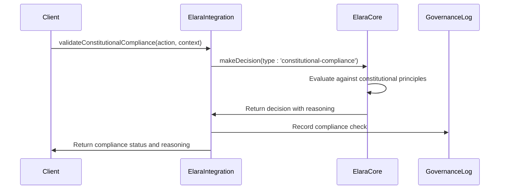

**Diagram sources**
- [elara-integration/index.ts](file://genome/elara-integration/index.ts#L245-L263)
- [unified-elara.ts](file://genome/agent-tools/unified-elara.ts#L381-L400)

### Ethical Alignment Assessment

The unified Elara system performs continuous ethical alignment checks by evaluating compliance metrics from both strategic and operational components:

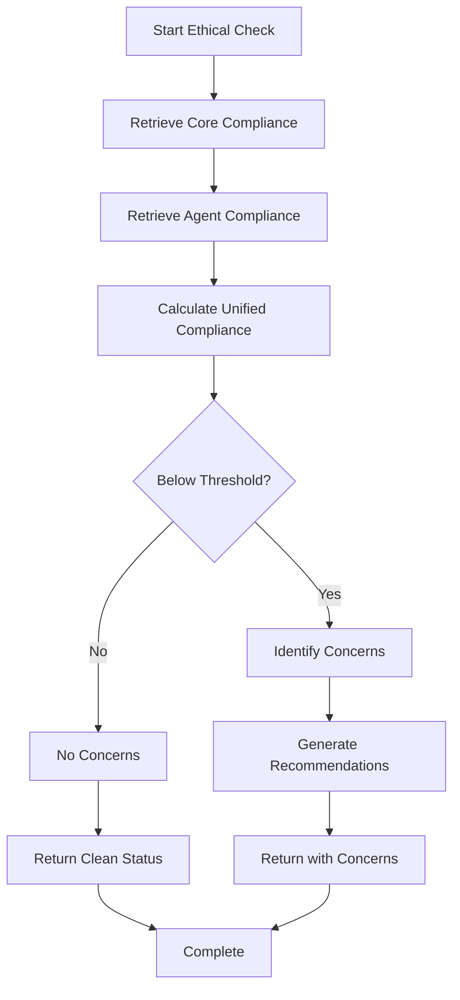

**Diagram sources**
- [unified-elara.ts](file://genome/agent-tools/unified-elara.ts#L402-L425)
- [unified-elara.ts](file://genome/agent-tools/unified-elara.ts#L221-L240)

**Section sources**
- [unified-elara.ts](file://genome/agent-tools/unified-elara.ts#L381-L450)
- [elara-integration/index.ts](file://genome/elara-integration/index.ts#L245-L263)

## AI Recommendation Workflows

The AI Governance API supports sophisticated recommendation workflows that combine strategic planning with operational execution. These workflows enable adaptive learning and personalized guidance across various application domains.

### Strategic Recommendation Workflow

For high-level decision support, the system provides strategic recommendations with comprehensive reasoning:

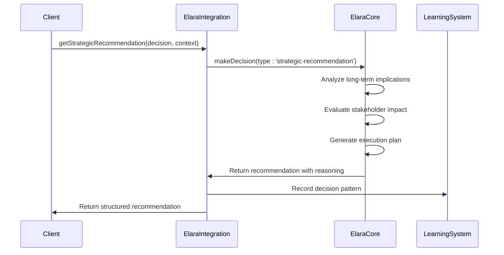

**Diagram sources**
- [elara-integration/index.ts](file://genome/elara-integration/index.ts#L290-L311)
- [unified-elara.ts](file://genome/agent-tools/unified-elara.ts#L152-L175)

### Adaptive Learning Path Generation

The educational AI system creates personalized learning paths based on student context and performance:

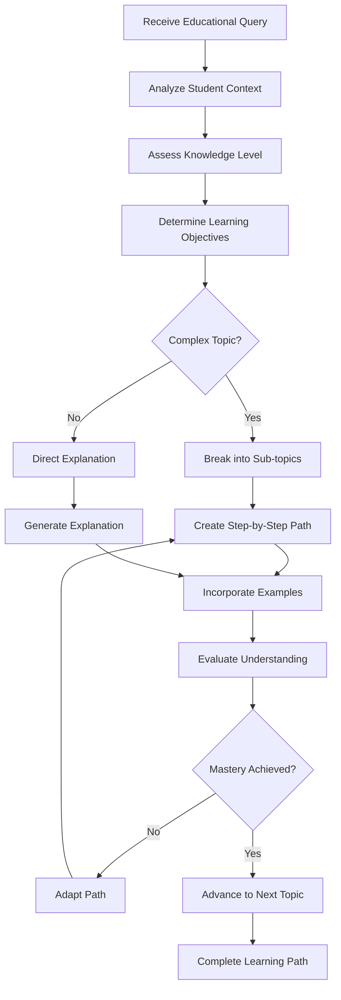

**Diagram sources**
- [elara-integration/index.ts](file://genome/elara-integration/index.ts#L265-L289)
- [unified-elara.ts](file://genome/agent-tools/unified-elara.ts#L177-L200)

**Section sources**
- [elara-integration/index.ts](file://genome/elara-integration/index.ts#L265-L311)
- [unified-elara.ts](file://genome/agent-tools/unified-elara.ts#L152-L200)

## Security and Auditability

The AI Governance API implements robust security measures to ensure decision transparency and auditability. All interactions are logged and can be traced through the system's comprehensive monitoring framework.

### Decision Transparency Model

The system maintains complete transparency by recording all decision-making factors:

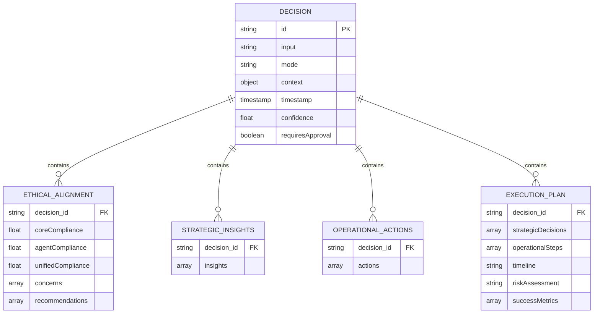

**Diagram sources**
- [unified-elara.ts](file://genome/agent-tools/unified-elara.ts#L100-L150)
- [unified-elara.ts](file://genome/agent-tools/unified-elara.ts#L451-L475)

### Service Monitoring and Alerting

The Elara integration system continuously monitors all connected services and alerts on status changes:

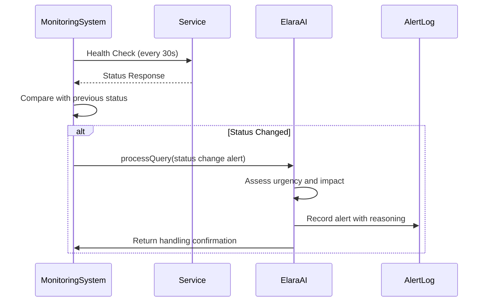

**Diagram sources**
- [elara-integration/index.ts](file://genome/elara-integration/index.ts#L180-L210)
- [elara-integration/index.ts](file://genome/elara-integration/index.ts#L212-L223)

**Section sources**
- [elara-integration/index.ts](file://genome/elara-integration/index.ts#L150-L263)
- [unified-elara.ts](file://genome/agent-tools/unified-elara.ts#L451-L475)

## Performance and Scalability

The AI Governance API is designed for high performance and scalability under heavy load. The system employs parallel processing and efficient resource management to maintain low inference latency.

### Parallel Processing Architecture

The unified Elara system processes strategic and operational components in parallel:

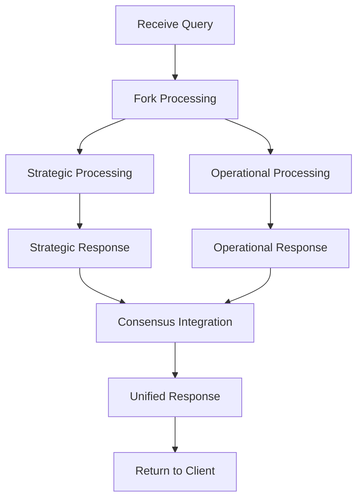

**Diagram sources**
- [unified-elara.ts](file://genome/agent-tools/unified-elara.ts#L152-L175)
- [unified-elara.ts](file://genome/agent-tools/unified-elara.ts#L242-L265)

### Load Balancing and Resource Management

The system implements intelligent resource allocation based on request complexity:

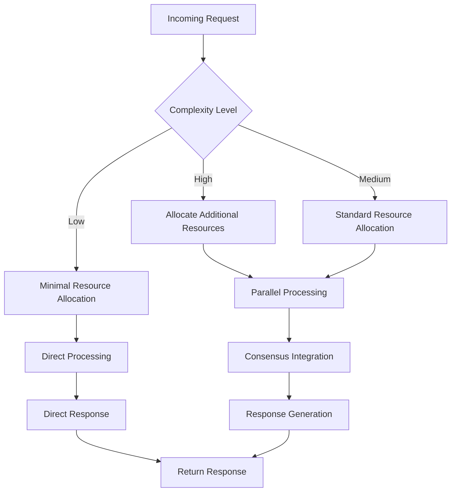

**Diagram sources**
- [unified-elara.ts](file://genome/agent-tools/unified-elara.ts#L267-L300)
- [unified-elara.ts](file://genome/agent-tools/unified-elara.ts#L302-L325)

**Section sources**
- [unified-elara.ts](file://genome/agent-tools/unified-elara.ts#L152-L325)
- [unified-elara.ts](file://genome/agent-tools/unified-elara.ts#L451-L475)

## Client Implementation Guidelines

The AI Governance API supports various client implementations for different application domains, including decision support systems, educational tutoring applications, and AI-powered interfaces.

### Decision Support System Integration

For decision support applications, clients should use the strategic recommendation endpoint:

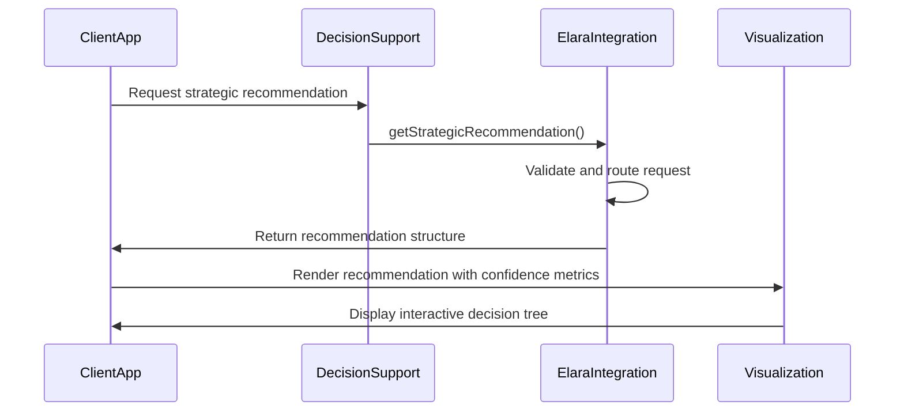

**Diagram sources**
- [elara-integration/index.ts](file://genome/elara-integration/index.ts#L290-L311)
- [unified-elara.ts](file://genome/agent-tools/unified-elara.ts#L152-L175)

### Educational Tutoring Application

For educational applications, clients should leverage the educational assistance endpoint:

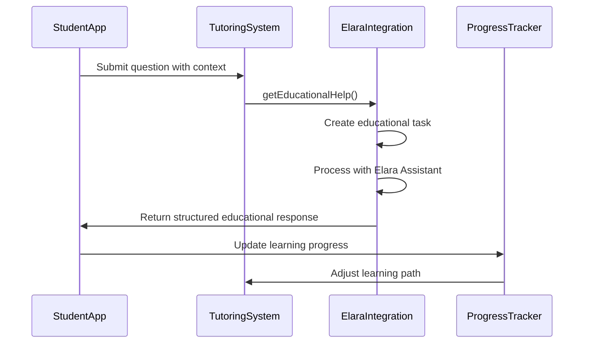

**Diagram sources**
- [elara-integration/index.ts](file://genome/elara-integration/index.ts#L265-L289)
- [unified-elara.ts](file://genome/agent-tools/unified-elara.ts#L177-L200)

**Section sources**
- [elara-integration/index.ts](file://genome/elara-integration/index.ts#L265-L311)
- [unified-elara.ts](file://genome/agent-tools/unified-elara.ts#L152-L200)

## Error Handling and Fallback Mechanisms

The AI Governance API implements comprehensive error handling and fallback mechanisms to ensure reliability and graceful degradation when components fail.

### Unified Error Handling

The system provides consistent error handling across all components:

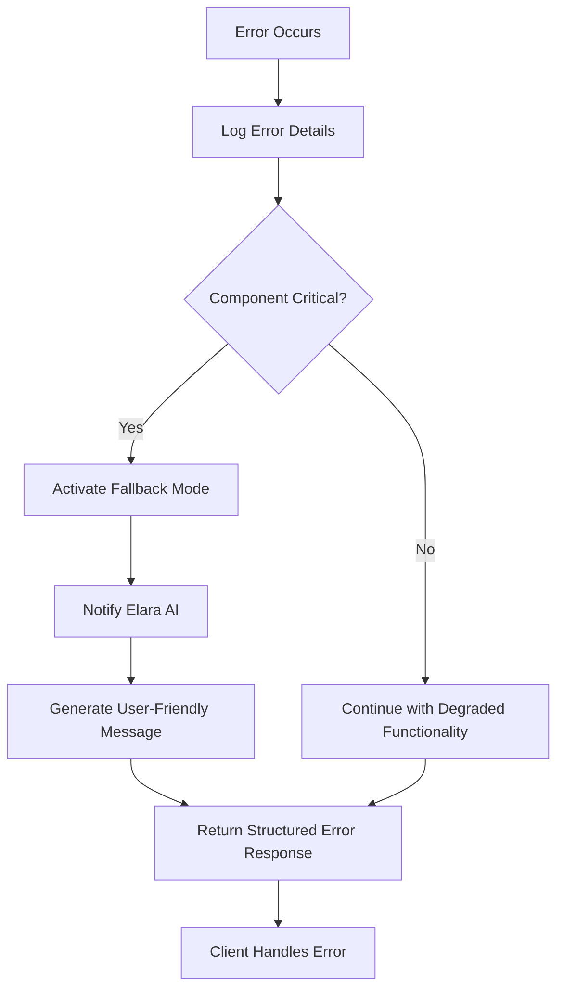

**Diagram sources**
- [unified-elara.ts](file://genome/agent-tools/unified-elara.ts#L477-L500)
- [unified-elara.ts](file://genome/agent-tools/unified-elara.ts#L502-L525)

### Confidence-Based Fallback System

The system uses confidence thresholds to determine when to escalate to human review:

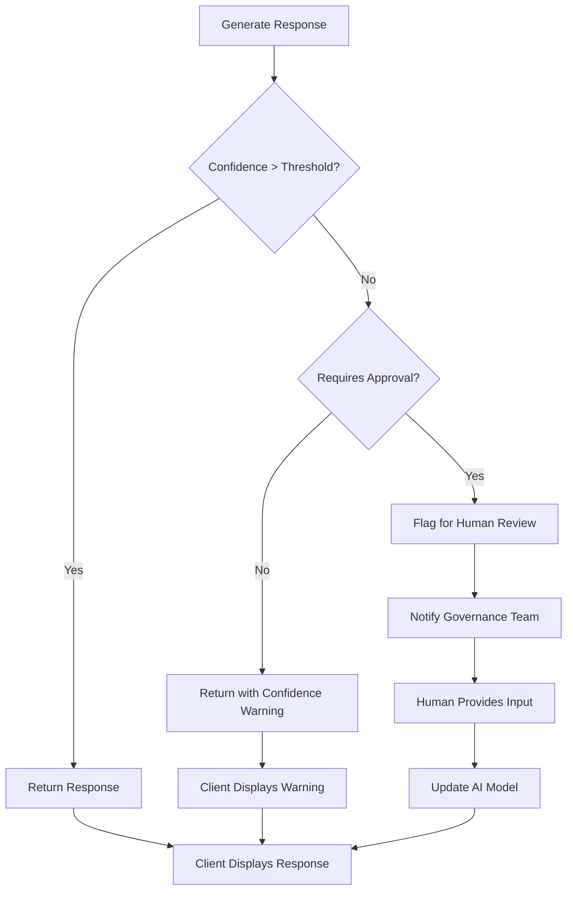

**Diagram sources**
- [unified-elara.ts](file://genome/agent-tools/unified-elara.ts#L427-L450)
- [unified-elara.ts](file://genome/agent-tools/unified-elara.ts#L452-L475)

**Section sources**
- [unified-elara.ts](file://genome/agent-tools/unified-elara.ts#L427-L525)
- [unified-elara.ts](file://genome/agent-tools/unified-elara.ts#L547-L602)

## Conclusion

The AI Governance API provides a robust framework for interacting with Elara AI while maintaining strict ethical oversight and constitutional governance. By combining strategic planning with operational execution, the system delivers comprehensive AI-powered insights and recommendations across various application domains. The API's design emphasizes transparency, auditability, and reliability, with comprehensive error handling and fallback mechanisms to ensure consistent performance under varying conditions. Client applications can leverage this API for decision support, educational tutoring, and other AI-powered interfaces while benefiting from the system's built-in governance and compliance features.