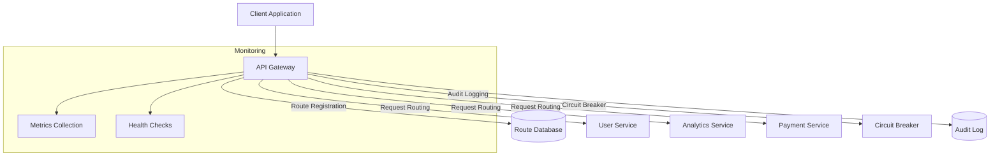

# API Reference

<cite>
**Referenced Files in This Document**   
- [server.ts](file://azora/azora-aegis/server.ts)
- [apiGatewayRoutes.ts](file://organs/api-gateway/src/apiGatewayRoutes.ts)
- [index.ts](file://organs/api-gateway/src/index.ts)
- [apiGatewayService.ts](file://organs/api-gateway/src/apiGatewayService.ts)
- [server.js](file://services/azora-covenant/server.js)
- [server.ts](file://services/azora-education/server.ts)
</cite>

## Table of Contents
1. [Introduction](#introduction)
2. [API Gateway](#api-gateway)
3. [Aegis Citadel](#aegis-citadel)
4. [Blockchain Node](#blockchain-node)
5. [Education System](#education-system)
6. [Security and Authentication](#security-and-authentication)
7. [Error Handling](#error-handling)
8. [Rate Limiting and Performance](#rate-limiting-and-performance)
9. [Monitoring and Health Checks](#monitoring-and-health-checks)
10. [Audit Logging](#audit-logging)

## Introduction
The Azora OS API ecosystem provides a comprehensive suite of services for sovereign nation management, blockchain operations, education systems, and service orchestration. This documentation details the available RESTful API endpoints, their request/response schemas, authentication methods, and operational characteristics.

The system follows a microservices architecture with an API Gateway that routes requests to appropriate backend services. All APIs follow REST principles and use JSON for request/response payloads. The API Gateway provides centralized features including rate limiting, circuit breaking, audit logging, and service discovery.

**Section sources**
- [apiGatewayService.ts](file://organs/api-gateway/src/apiGatewayService.ts#L1-L50)
- [index.ts](file://organs/api-gateway/src/index.ts#L1-L20)

## API Gateway
The API Gateway serves as the entry point for all Azora OS services, providing routing, load balancing, security, and monitoring capabilities.

### Service Routing
The API Gateway manages service routes and directs requests to appropriate backend services.



**Diagram sources**
- [apiGatewayService.ts](file://organs/api-gateway/src/apiGatewayService.ts#L150-L200)
- [apiGatewayRoutes.ts](file://organs/api-gateway/src/apiGatewayRoutes.ts#L1-L50)

### Register Service Route
Registers a new service route for routing through the API Gateway.

**HTTP Method**: POST  
**URL Pattern**: `/api/routes`  
**Authentication**: Bearer Token (JWT)  
**Request Schema**:
```json
{
  "serviceName": "string",
  "route": "string",
  "targetUrl": "string",
  "method": "GET|POST|PUT|DELETE|PATCH"
}
```

**Response Schema (201 Created)**:
```json
{
  "routeId": "string"
}
```

**Error Responses**:
- 400 Bad Request: Missing required fields
- 500 Internal Server Error: Failed to register route

**Section sources**
- [apiGatewayRoutes.ts](file://organs/api-gateway/src/apiGatewayRoutes.ts#L1-L50)
- [apiGatewayService.ts](file://organs/api-gateway/src/apiGatewayService.ts#L200-L250)

### List Registered Routes
Retrieves a list of all active service routes.

**HTTP Method**: GET  
**URL Pattern**: `/api/routes`  
**Authentication**: Bearer Token (JWT)  
**Response Schema (200 OK)**:
```json
{
  "routes": [
    {
      "id": "string",
      "serviceName": "string",
      "route": "string",
      "targetUrl": "string",
      "method": "string",
      "isActive": "boolean"
    }
  ]
}
```

**Error Responses**:
- 500 Internal Server Error: Failed to get routes

**Section sources**
- [apiGatewayRoutes.ts](file://organs/api-gateway/src/apiGatewayRoutes.ts#L50-L75)
- [apiGatewayService.ts](file://organs/api-gateway/src/apiGatewayService.ts#L250-L300)

### Circuit Breaker Status
Retrieves the current status of all circuit breakers.

**HTTP Method**: GET  
**URL Pattern**: `/api/circuit-breakers`  
**Authentication**: Bearer Token (JWT)  
**Response Schema (200 OK)**:
```json
{
  "circuitBreakers": [
    {
      "serviceName": "string",
      "state": "closed|open|half-open",
      "failureCount": "integer",
      "lastFailure": "string (date-time)"
    }
  ]
}
```

**Error Responses**:
- 500 Internal Server Error: Failed to get circuit breaker status

**Section sources**
- [apiGatewayRoutes.ts](file://organs/api-gateway/src/apiGatewayRoutes.ts#L75-L120)
- [apiGatewayService.ts](file://organs/api-gateway/src/apiGatewayService.ts#L300-L330)

### Audit Logs
Retrieves audit logs with optional filtering.

**HTTP Method**: GET  
**URL Pattern**: `/api/audit`  
**Authentication**: Bearer Token (JWT)  
**Query Parameters**:
- `entityId`: Filter by entity ID
- `entityType`: Filter by entity type
- `limit`: Maximum number of logs to return (default: 50)

**Response Schema (200 OK)**:
```json
{
  "auditLogs": [
    {
      "id": "string",
      "action": "string",
      "entityId": "string",
      "entityType": "string",
      "userId": "string",
      "details": "object",
      "timestamp": "string (date-time)"
    }
  ]
}
```

**Error Responses**:
- 500 Internal Server Error: Failed to get audit logs

**Section sources**
- [apiGatewayRoutes.ts](file://organs/api-gateway/src/apiGatewayRoutes.ts#L120-L160)
- [apiGatewayService.ts](file://organs/api-gateway/src/apiGatewayService.ts#L330-L337)

## Aegis Citadel
The Aegis Citadel service provides constitutional compliance checks and sovereign nation management.

### Sovereign Nation Grant
Submits a request for a sovereign nation grant.

**HTTP Method**: POST  
**URL Pattern**: `/api/nation-grants`  
**Authentication**: Bearer Token (JWT)  
**Request Schema**:
```json
{
  "nationName": "string",
  "founderId": "string",
  "initialCapital": "number",
  "constitution": "object"
}
```

**Response Schema (200 OK)**:
```json
{
  "success": "boolean",
  "grantId": "string",
  "message": "string",
  "elaraStatus": "approved|denied"
}
```

**Error Responses**:
- 403 Forbidden: Nation grant denied by Elara AI
- 500 Internal Server Error: Failed to process nation grant

**Section sources**
- [server.ts](file://azora/azora-aegis/server.ts#L100-L150)

### Sovereign Trigger
Queues a sovereign trigger for execution.

**HTTP Method**: POST  
**URL Pattern**: `/api/sovereign-triggers`  
**Authentication**: Bearer Token (JWT)  
**Request Schema**:
```json
{
  "triggerType": "economic-stimulus|sovereign-defense|constitutional-amendment",
  "nationId": "string",
  "parameters": "object",
  "justification": "string"
}
```

**Response Schema (200 OK)**:
```json
{
  "success": "boolean",
  "triggerId": "string",
  "message": "string",
  "elaraStatus": "approved|denied"
}
```

**Error Responses**:
- 403 Forbidden: Sovereign trigger denied by Elara AI
- 500 Internal Server Error: Failed to process sovereign trigger

**Section sources**
- [server.ts](file://azora/azora-aegis/server.ts#L150-L200)

### Get Nation Status
Retrieves the status of a sovereign nation.

**HTTP Method**: GET  
**URL Pattern**: `/api/nations/:nationId`  
**Authentication**: Bearer Token (JWT)  
**Response Schema (200 OK)**:
```json
{
  "id": "string",
  "name": "string",
  "founderId": "string",
  "sovereignTokenAddress": "string",
  "initialCapital": "number",
  "status": "string",
  "createdAt": "string (date-time)"
}
```

**Error Responses**:
- 404 Not Found: Nation not found
- 500 Internal Server Error: Failed to retrieve nation

**Section sources**
- [server.ts](file://azora/azora-aegis/server.ts#L200-L220)

## Blockchain Node
The blockchain node records all founder withdrawals and transactions in an immutable ledger.

### Blockchain Information
Retrieves information about the blockchain.

**HTTP Method**: GET  
**URL Pattern**: `/api/blockchain/info`  
**Authentication**: None  
**Response Schema (200 OK)**:
```json
{
  "name": "string",
  "symbol": "string",
  "blocks": "integer",
  "totalTransactions": "integer",
  "lastBlockIndex": "integer",
  "lastBlockHash": "string",
  "lastUpdated": "string (date-time)"
}
```

**Error Responses**:
- 500 Internal Server Error: Failed to get blockchain info

**Section sources**
- [server.js](file://services/azora-covenant/server.js#L300-L330)

### List Blocks
Retrieves a paginated list of blocks.

**HTTP Method**: GET  
**URL Pattern**: `/api/blocks`  
**Authentication**: None  
**Query Parameters**:
- `page`: Page number (default: 0)
- `limit`: Number of blocks per page (default: 10)

**Response Schema (200 OK)**:
```json
{
  "page": "integer",
  "limit": "integer",
  "total": "integer",
  "blocks": [
    {
      "index": "integer",
      "timestamp": "string (date-time)",
      "transactions": "array",
      "previousHash": "string",
      "hash": "string",
      "nonce": "integer"
    }
  ]
}
```

**Error Responses**:
- 500 Internal Server Error: Failed to get blocks

**Section sources**
- [server.js](file://services/azora-covenant/server.js#L330-L360)

### Get Block by Index
Retrieves a specific block by its index.

**HTTP Method**: GET  
**URL Pattern**: `/api/blocks/:index`  
**Authentication**: None  
**Response Schema (200 OK)**:
```json
{
  "index": "integer",
  "timestamp": "string (date-time)",
  "transactions": "array",
  "previousHash": "string",
  "hash": "string",
  "nonce": "integer"
}
```

**Error Responses**:
- 404 Not Found: Block not found
- 500 Internal Server Error: Failed to get block

**Section sources**
- [server.js](file://services/azora-covenant/server.js#L360-L380)

### Create Transaction
Creates a new transaction in the blockchain.

**HTTP Method**: POST  
**URL Pattern**: `/api/transactions`  
**Authentication**: None  
**Request Schema**: Any valid JSON object  
**Response Schema (201 Created)**:
```json
{
  "message": "string",
  "transaction": {
    "id": "string",
    "type": "string",
    "data": "object",
    "timestamp": "string (date-time)",
    "hash": "string"
  },
  "explorerUrl": "string"
}
```

**Error Responses**:
- 500 Internal Server Error: Failed to create transaction

**Section sources**
- [server.js](file://services/azora-covenant/server.js#L400-L420)

### Get Transaction by ID
Retrieves a transaction by its ID.

**HTTP Method**: GET  
**URL Pattern**: `/api/transactions/:id`  
**Authentication**: None  
**Response Schema (200 OK)**:
```json
{
  "transaction": {
    "id": "string",
    "type": "string",
    "data": "object",
    "timestamp": "string (date-time)",
    "hash": "string"
  },
  "block": {
    "index": "integer",
    "hash": "string"
  },
  "confirmed": "boolean"
}
```

**Error Responses**:
- 404 Not Found: Transaction not found
- 500 Internal Server Error: Failed to get transaction

**Section sources**
- [server.js](file://services/azora-covenant/server.js#L420-L440)

## Education System
The Azora Education System provides comprehensive API access to educational services.

### Primary Education Enrollment
Enrolls a student in primary education.

**HTTP Method**: POST  
**URL Pattern**: `/api/primary/enroll`  
**Authentication**: Bearer Token (JWT)  
**Request Schema**:
```json
{
  "studentId": "string",
  "grade": "string",
  "preferences": "object"
}
```

**Response Schema (200 OK)**: Depends on implementation  
**Error Responses**:
- 400 Bad Request: Invalid request parameters
- 500 Internal Server Error: Failed to enroll student

**Section sources**
- [server.ts](file://services/azora-education/server.ts#L50-L60)

### Get Student Progress
Retrieves a student's progress in primary education.

**HTTP Method**: GET  
**URL Pattern**: `/api/primary/student/:studentId`  
**Authentication**: Bearer Token (JWT)  
**Response Schema (200 OK)**: Depends on implementation  
**Error Responses**:
- 404 Not Found: Student not found
- 500 Internal Server Error: Failed to get student progress

**Section sources**
- [server.ts](file://services/azora-education/server.ts#L70-L80)

### Secondary Education Enrollment
Enrolls a student in secondary education.

**HTTP Method**: POST  
**URL Pattern**: `/api/secondary/enroll`  
**Authentication**: Bearer Token (JWT)  
**Request Schema**:
```json
{
  "studentId": "string",
  "gradeLevel": "string",
  "streamId": "string"
}
```

**Response Schema (200 OK)**: Depends on implementation  
**Error Responses**:
- 400 Bad Request: Invalid request parameters
- 500 Internal Server Error: Failed to enroll student

**Section sources**
- [server.ts](file://services/azora-education/server.ts#L90-L100)

### University Enrollment
Enrolls a student in university.

**HTTP Method**: POST  
**URL Pattern**: `/api/university/enroll`  
**Authentication**: Bearer Token (JWT)  
**Request Schema**:
```json
{
  "studentId": "string",
  "programmeId": "string"
}
```

**Response Schema (200 OK)**: Depends on implementation  
**Error Responses**:
- 400 Bad Request: Invalid request parameters
- 500 Internal Server Error: Failed to enroll student

**Section sources**
- [server.ts](file://services/azora-education/server.ts#L140-L150)

## Security and Authentication
The Azora OS API ecosystem uses bearer token authentication (JWT) for securing endpoints.

### Authentication Method
All protected endpoints require a valid JWT token in the Authorization header:
```
Authorization: Bearer <token>
```

The token must be obtained through the authentication service before making requests to protected endpoints.

### Security Schemes
The API supports the following security scheme:
- **bearerAuth**: Bearer token authentication using JWT

Swagger documentation is available at `/api-docs` endpoint on the API Gateway.

**Section sources**
- [apiGatewayService.ts](file://organs/api-gateway/src/apiGatewayService.ts#L30-L50)
- [swagger.ts](file://services/azora-nexus/src/config/swagger.ts#L50-L70)

## Error Handling
The API follows consistent error handling patterns across all services.

### Error Response Format
All error responses follow the standard format:
```json
{
  "error": "string"
}
```

For detailed error information in development mode:
```json
{
  "error": "Internal Server Error",
  "message": "Detailed error message"
}
```

### Common Error Codes
- **400 Bad Request**: Invalid request parameters or body
- **403 Forbidden**: Authentication successful but insufficient permissions
- **404 Not Found**: Requested resource does not exist
- **500 Internal Server Error**: Server encountered an unexpected condition
- **502 Bad Gateway**: Service temporarily unavailable (gateway error)

**Section sources**
- [index.ts](file://organs/api-gateway/src/index.ts#L80-L90)
- [server.ts](file://azora/azora-aegis/server.ts#L250-L280)

## Rate Limiting and Performance
The API Gateway implements rate limiting to protect backend services.

### Rate Limiting Configuration
- **Window**: 15 minutes
- **Limit**: 1,000 requests per IP address
- **Response**: 429 Too Many Requests when limit is exceeded

After 100 requests within the window, a delay of 500ms is added per additional request to prevent abuse.

### Performance Optimization
- **Compression**: Gzip compression enabled for all responses
- **Caching**: Response caching for static resources
- **Connection Pooling**: HTTP keep-alive for improved performance
- **Load Balancing**: Round-robin distribution across service instances

**Section sources**
- [index.ts](file://organs/api-gateway/src/index.ts#L30-L50)

## Monitoring and Health Checks
All services provide health check endpoints for monitoring.

### Health Check Endpoint
**HTTP Method**: GET  
**URL Pattern**: `/health`  
**Authentication**: None  
**Response Schema (200 OK)**:
```json
{
  "status": "ok|healthy",
  "service": "string",
  "timestamp": "string (date-time)",
  "uptime": "number"
}
```

The API Gateway health endpoint also includes additional information:
```json
{
  "status": "ok",
  "service": "api-gateway",
  "timestamp": "string (date-time)",
  "uptime": "number"
}
```

**Section sources**
- [index.ts](file://organs/api-gateway/src/index.ts#L60-L70)
- [server.ts](file://azora/azora-aegis/server.ts#L270-L280)

## Audit Logging
The API Gateway maintains comprehensive audit logs for security and compliance.

### Audit Log Structure
Each audit log entry contains:
- **action**: Type of action performed
- **entityId**: ID of the affected entity
- **entityType**: Type of the affected entity
- **details**: Additional details about the action
- **timestamp**: When the action occurred

### Audit Log Events
Common audit log events include:
- `route_registered`: A new service route was registered
- `circuit_breaker_failure`: A circuit breaker detected a failure
- `api_call`: A successful API call was made
- `authentication_failed`: Authentication attempt failed

**Section sources**
- [apiGatewayService.ts](file://organs/api-gateway/src/apiGatewayService.ts#L310-L337)
- [apiGatewayRoutes.ts](file://organs/api-gateway/src/apiGatewayRoutes.ts#L160-L200)