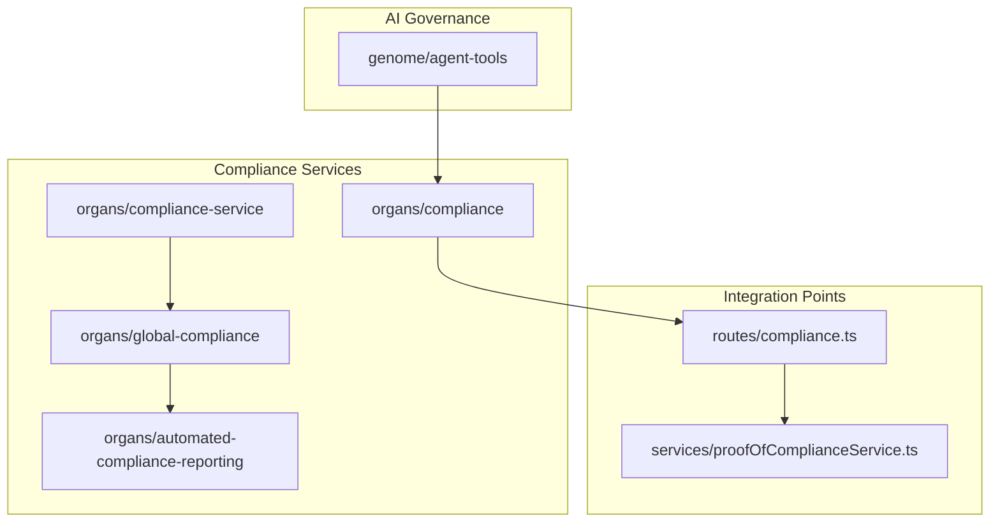
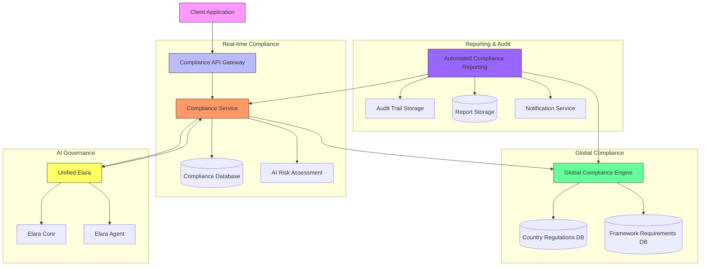
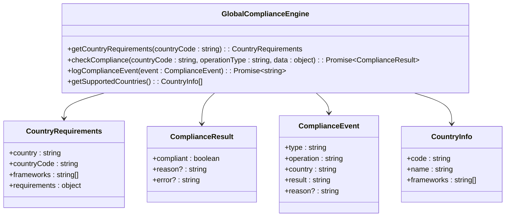
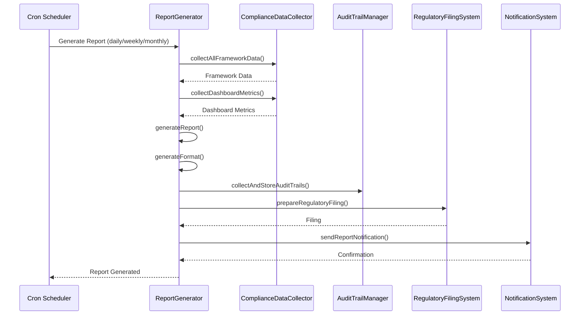
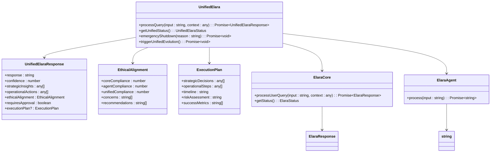
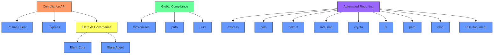

# Compliance Monitoring API

<cite>
**Referenced Files in This Document**   
- [complianceApi.ts](file://organs/compliance/src/complianceApi.ts)
- [complianceService.ts](file://organs/compliance/src/complianceService.ts)
- [index.ts](file://organs/compliance/src/index.ts)
- [compliance.ts](file://routes/compliance.ts)
- [proofOfComplianceService.ts](file://services/proofOfComplianceService.ts)
- [global-compliance.js](file://organs/compliance-service/global-compliance.js)
- [index.js](file://organs/global-compliance/index.js)
- [automated-compliance-reporting/index.js](file://organs/automated-compliance-reporting/index.js)
- [unified-elara.ts](file://genome/agent-tools/unified-elara.ts)
- [unified-elara.test.ts](file://genome/agent-tools/unified-elara.test.ts)
</cite>

## Table of Contents
1. [Introduction](#introduction)
2. [Project Structure](#project-structure)
3. [Core Components](#core-components)
4. [Architecture Overview](#architecture-overview)
5. [Detailed Component Analysis](#detailed-component-analysis)
6. [Dependency Analysis](#dependency-analysis)
7. [Performance Considerations](#performance-considerations)
8. [Troubleshooting Guide](#troubleshooting-guide)
9. [Conclusion](#conclusion)

## Introduction
The Compliance Monitoring API provides a comprehensive system for real-time compliance checks, regulatory reporting, and constitutional governance verification. This documentation details the RESTful endpoints for compliance operations, integration with Elara AI governance, and automated compliance reporting. The system supports multiple regional regulations including US, ZA, and EU frameworks, with robust audit trail capabilities and Proof-of-Compliance integration.

## Project Structure
The Compliance Monitoring API is organized across multiple service directories with clear separation of concerns. The core compliance functionality resides in the organs/compliance module, while global compliance services are implemented in dedicated modules. Reporting and audit trail functionality is handled by the automated-compliance-reporting service, and AI governance is managed through the genome/agent-tools components.



**Diagram sources**
- [complianceApi.ts](file://organs/compliance/src/complianceApi.ts)
- [global-compliance.js](file://organs/compliance-service/global-compliance.js)
- [index.js](file://organs/global-compliance/index.js)
- [automated-compliance-reporting/index.js](file://organs/automated-compliance-reporting/index.js)

**Section sources**
- [complianceApi.ts](file://organs/compliance/src/complianceApi.ts)
- [global-compliance.js](file://organs/compliance-service/global-compliance.js)
- [index.js](file://organs/global-compliance/index.js)

## Core Components
The Compliance Monitoring API consists of several core components that work together to provide comprehensive compliance functionality. The main compliance service handles real-time checks and records, while the global compliance engine manages regional regulations. The automated reporting system generates periodic compliance reports and regulatory filings, and the Elara AI governance system provides ethical oversight.

**Section sources**
- [complianceService.ts](file://organs/compliance/src/complianceService.ts)
- [global-compliance.js](file://organs/compliance-service/global-compliance.js)
- [automated-compliance-reporting/index.js](file://organs/automated-compliance-reporting/index.js)

## Architecture Overview
The Compliance Monitoring API follows a microservices architecture with dedicated services for different compliance functions. The system is designed for high availability and scalability, with proper separation between real-time compliance checks, historical record keeping, and reporting functions.



**Diagram sources**
- [complianceApi.ts](file://organs/compliance/src/complianceApi.ts)
- [global-compliance.js](file://organs/compliance-service/global-compliance.js)
- [automated-compliance-reporting/index.js](file://organs/automated-compliance-reporting/index.js)
- [unified-elara.ts](file://genome/agent-tools/unified-elara.ts)

## Detailed Component Analysis

### Compliance Service Analysis
The Compliance Service provides the core API endpoints for real-time compliance checks, record retrieval, and risk prediction. It integrates with both the database for persistent storage and AI models for intelligent risk assessment.

```mermaid
classDiagram
class ComplianceService {
+checkCompliance(userId : string, action : string) : Promise~ComplianceResult~
+getComplianceRecords(userId : string) : Promise~ComplianceRecord[]~
+predictRisk(userId : string) : Promise~RiskPrediction~
}
class AuditService {
+log(eventType : string, details : any, userId? : string) : Promise~void~
}
class ComplianceResult {
+compliant : boolean
+risk : string
+aiInsights : string
}
class ComplianceRecord {
+userId : string
+action : string
+compliant : boolean
+risk : string
+timestamp : Date
+metadata : object
}
class RiskPrediction {
+predictedRisk : string
+recommendation : string
}
ComplianceService --> ComplianceResult
ComplianceService --> ComplianceRecord
ComplianceService --> RiskPrediction
ComplianceService --> AuditService
AuditService --> DB[(Prisma Database)]
```

**Diagram sources**
- [complianceService.ts](file://organs/compliance/src/complianceService.ts)

**Section sources**
- [complianceService.ts](file://organs/compliance/src/complianceService.ts)

### Global Compliance Engine Analysis
The Global Compliance Engine manages regulatory requirements for different countries and regions. It provides a centralized service for checking compliance against various frameworks including GDPR, HIPAA, CCPA, and POPIA.



**Diagram sources**
- [global-compliance.js](file://organs/compliance-service/global-compliance.js)

**Section sources**
- [global-compliance.js](file://organs/compliance-service/global-compliance.js)

### Automated Compliance Reporting Analysis
The Automated Compliance Reporting system generates periodic reports and regulatory filings. It collects data from various compliance services, generates reports in multiple formats, and manages audit trails.



**Diagram sources**
- [automated-compliance-reporting/index.js](file://organs/automated-compliance-reporting/index.js)

**Section sources**
- [automated-compliance-reporting/index.js](file://organs/automated-compliance-reporting/index.js)

### Elara AI Governance Analysis
The Unified Elara system provides AI governance for ethical oversight of compliance decisions. It combines strategic planning from Elara Core with operational execution from Elara Agent to ensure both tactical and strategic alignment.



**Diagram sources**
- [unified-elara.ts](file://genome/agent-tools/unified-elara.ts)

**Section sources**
- [unified-elara.ts](file://genome/agent-tools/unified-elara.ts)

## Dependency Analysis
The Compliance Monitoring API has a well-defined dependency structure with clear boundaries between components. The system relies on several key dependencies for its operation.



**Diagram sources**
- [package.json](file://organs/compliance/package.json)
- [package.json](file://organs/global-compliance/package.json)
- [package.json](file://organs/automated-compliance-reporting/package.json)

**Section sources**
- [complianceApi.ts](file://organs/compliance/src/complianceApi.ts)
- [global-compliance.js](file://organs/compliance-service/global-compliance.js)
- [automated-compliance-reporting/index.js](file://organs/automated-compliance-reporting/index.js)

## Performance Considerations
The Compliance Monitoring API is designed with performance in mind, incorporating several optimization strategies to handle high-frequency compliance checks and large-scale reporting.

### Caching Strategy
The automated compliance reporting system implements a multi-layer caching strategy:
- Response caching with 10-minute TTL
- Data collection pooling with 3 concurrent connections
- Circuit breakers for external service calls

### Scalability Features
- Connection pooling for database operations
- Rate limiting on API endpoints
- Asynchronous processing for report generation
- Cron-based scheduling for resource-intensive operations

### High Availability
- Health check endpoints for monitoring
- Error handling with fallback responses
- Comprehensive logging and audit trails
- Circuit breakers to prevent cascading failures

**Section sources**
- [automated-compliance-reporting/index.js](file://organs/automated-compliance-reporting/index.js)
- [complianceService.ts](file://organs/compliance/src/complianceService.ts)

## Troubleshooting Guide
This section provides guidance for troubleshooting common issues with the Compliance Monitoring API.

### Common Issues and Solutions
- **500 Internal Server Error**: Check service logs and database connectivity
- **404 Not Found**: Verify endpoint URL and HTTP method
- **400 Bad Request**: Validate request payload structure and required fields
- **Slow Performance**: Check cache status and database query performance
- **Failed Compliance Checks**: Review country-specific requirements and operation types

### Monitoring and Logging
The system provides comprehensive monitoring capabilities:
- Health check endpoints at /health and /api/health
- Detailed compliance event logging
- Audit trail collection and storage
- Performance metrics and error tracking

### Recovery Procedures
- Restart services using standard process management
- Clear caches if stale data is suspected
- Verify database connections and schema
- Check external service dependencies

**Section sources**
- [complianceApi.ts](file://organs/compliance/src/complianceApi.ts)
- [test.js](file://organs/compliance/test.js)
- [automated-compliance-reporting/index.js](file://organs/automated-compliance-reporting/index.js)

## Conclusion
The Compliance Monitoring API provides a robust, scalable solution for real-time compliance checks, regulatory reporting, and constitutional governance verification. By integrating AI governance through the Elara system, the API ensures both operational efficiency and ethical alignment. The modular architecture allows for easy extension and maintenance, while the comprehensive documentation and error handling make it accessible for developers and operators alike.