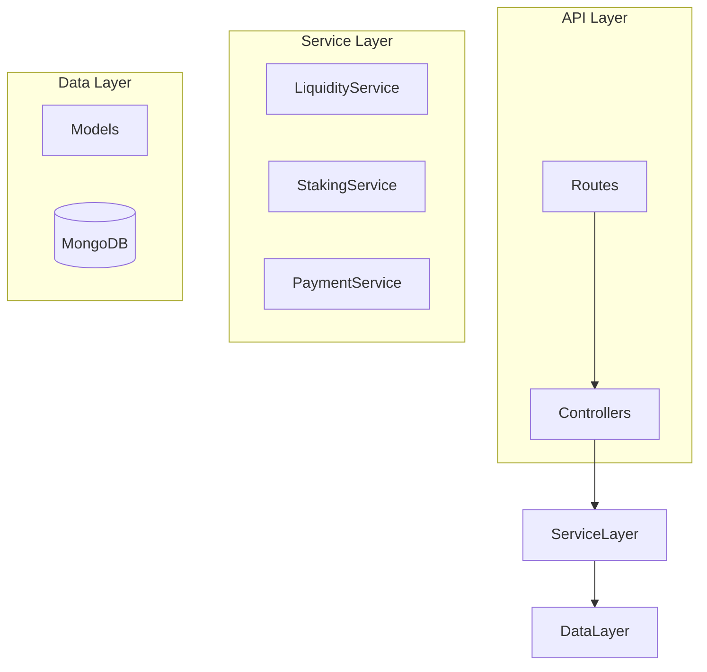
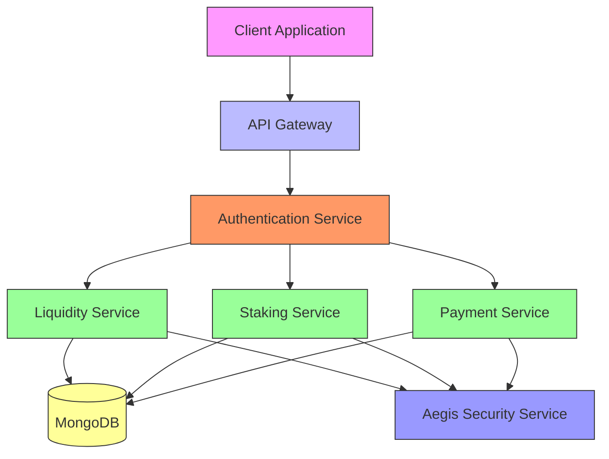
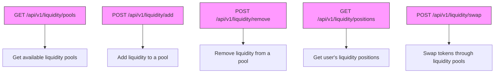
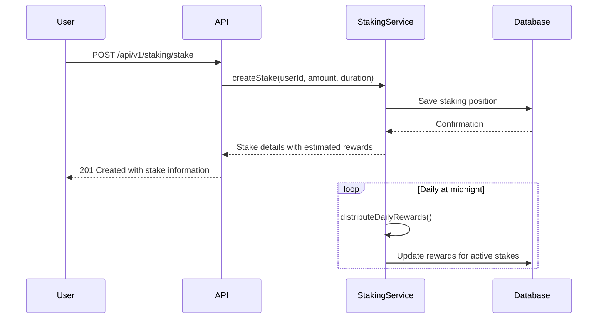
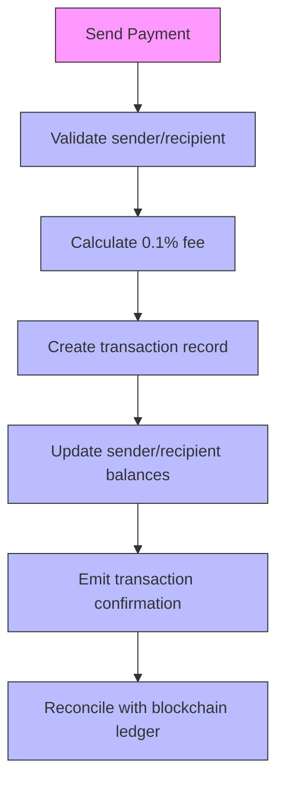
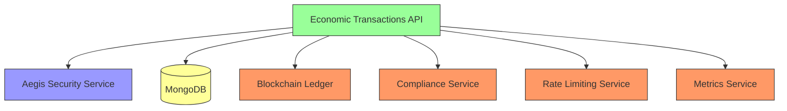

# Economic Transactions API

<cite>
**Referenced Files in This Document**   
- [liquidity.ts](file://services/azora-mint/src/routes/liquidity.ts)
- [staking.ts](file://services/azora-mint/src/routes/staking.ts)
- [payment.ts](file://services/azora-mint/src/routes/payment.ts)
- [LiquidityService.ts](file://services/azora-mint/src/services/LiquidityService.ts)
- [StakingService.ts](file://services/azora-mint/src/services/StakingService.ts)
- [PaymentService.ts](file://services/azora-mint/src/services/PaymentService.ts)
- [GENESIS_PROTOCOL.ts](file://GENESIS_PROTOCOL.ts)
- [azora-covenant/index.js](file://services/azora-covenant/index.js)
</cite>

## Table of Contents
1. [Introduction](#introduction)
2. [Project Structure](#project-structure)
3. [Core Components](#core-components)
4. [Architecture Overview](#architecture-overview)
5. [Detailed Component Analysis](#detailed-component-analysis)
6. [Dependency Analysis](#dependency-analysis)
7. [Performance Considerations](#performance-considerations)
8. [Troubleshooting Guide](#troubleshooting-guide)
9. [Conclusion](#conclusion)

## Introduction
The Economic Transactions API provides a comprehensive interface for managing financial operations within the Azora economic system. This API enables token minting, staking, liquidity management, and transaction processing through a secure, scalable architecture. The system implements a two-token protocol with global AZR tokens and local a-Tokens, supporting frictionless daily transactions while maintaining long-term value appreciation. All transactions contribute to system growth through the metabolic reinvestment mechanism, where fees are strategically allocated to drive ecosystem expansion and token value.

## Project Structure
The Economic Transactions API is organized within the azora-mint service, containing dedicated modules for liquidity, staking, and payment operations. The structure follows a clean separation of concerns with routes, services, and models organized in a logical hierarchy.

**Diagram sources**
- [liquidity.ts](file://services/azora-mint/src/routes/liquidity.ts)
- [staking.ts](file://services/azora-mint/src/routes/staking.ts)
- [payment.ts](file://services/azora-mint/src/routes/payment.ts)

**Section sources**
- [liquidity.ts](file://services/azora-mint/src/routes/liquidity.ts)
- [staking.ts](file://services/azora-mint/src/routes/staking.ts)
- [payment.ts](file://services/azora-mint/src/routes/payment.ts)

## Core Components
The Economic Transactions API consists of three primary components: liquidity management, staking operations, and payment processing. Each component provides RESTful endpoints for specific financial operations, with comprehensive validation, error handling, and security measures. The API integrates with the two-token protocol (global AZR and local a-Tokens) and implements the metabolic reinvestment mechanism where transaction fees fuel system growth.

**Section sources**
- [LiquidityService.ts](file://services/azora-mint/src/services/LiquidityService.ts)
- [StakingService.ts](file://services/azora-mint/src/services/StakingService.ts)
- [PaymentService.ts](file://services/azora-mint/src/services/PaymentService.ts)

## Architecture Overview
The Economic Transactions API follows a service-oriented architecture with clear separation between API endpoints, business logic, and data persistence. The system implements rate limiting, authentication, and comprehensive error handling to ensure reliability and security.

**Diagram sources**
- [liquidity.ts](file://services/azora-mint/src/routes/liquidity.ts)
- [staking.ts](file://services/azora-mint/src/routes/staking.ts)
- [payment.ts](file://services/azora-mint/src/routes/payment.ts)

## Detailed Component Analysis

### Liquidity Management
The liquidity management component enables users to participate in decentralized finance operations including adding/removing liquidity and token swaps. The system implements automated market maker (AMM) mechanics with a 0.3% fee on swaps.

#### API Endpoints for Liquidity Management

**Diagram sources**
- [liquidity.ts](file://services/azora-mint/src/routes/liquidity.ts)

**Section sources**
- [liquidity.ts](file://services/azora-mint/src/routes/liquidity.ts)
- [LiquidityService.ts](file://services/azora-mint/src/services/LiquidityService.ts)

### Staking Operations
The staking component allows users to lock AZR tokens for specified durations to earn rewards based on annual percentage yield (APY). Longer staking periods receive higher APY rates, incentivizing long-term commitment to the ecosystem.

#### Staking Workflow

**Diagram sources**
- [staking.ts](file://services/azora-mint/src/routes/staking.ts)
- [StakingService.ts](file://services/azora-mint/src/services/StakingService.ts)

**Section sources**
- [staking.ts](file://services/azora-mint/src/routes/staking.ts)
- [StakingService.ts](file://services/azora-mint/src/services/StakingService.ts)

### Payment Processing
The payment component facilitates peer-to-peer transactions, payment requests, and escrow services for marketplace transactions. All payments include a 0.1% transaction fee that contributes to the metabolic reinvestment mechanism.

#### Payment Transaction Flow

**Diagram sources**
- [payment.ts](file://services/azora-mint/src/routes/payment.ts)
- [PaymentService.ts](file://services/azora-mint/src/services/PaymentService.ts)

**Section sources**
- [payment.ts](file://services/azora-mint/src/routes/payment.ts)
- [PaymentService.ts](file://services/azora-mint/src/services/PaymentService.ts)

## Dependency Analysis
The Economic Transactions API depends on several core services and infrastructure components to provide secure, reliable financial operations.

**Diagram sources**
- [azora-covenant/index.js](file://services/azora-covenant/index.js)
- [liquidity.ts](file://services/azora-mint/src/routes/liquidity.ts)
- [staking.ts](file://services/azora-mint/src/routes/staking.ts)
- [payment.ts](file://services/azora-mint/src/routes/payment.ts)

**Section sources**
- [azora-covenant/index.js](file://services/azora-covenant/index.js)
- [liquidity.ts](file://services/azora-mint/src/routes/liquidity.ts)

## Performance Considerations
The Economic Transactions API is designed for high performance and scalability. Key performance characteristics include:

- **Rate Limiting**: Implemented to prevent abuse and ensure fair usage
- **Caching**: Strategic caching of frequently accessed data to reduce database load
- **Connection Pooling**: Efficient database connection management
- **Asynchronous Processing**: Non-blocking operations for improved throughput
- **Indexing**: Proper database indexing for optimal query performance

The system handles transaction finality through a reconciliation process that ensures consistency between the API's state and the underlying blockchain ledger. Rate limiting is enforced at the API gateway level to prevent denial-of-service attacks and ensure service availability.

## Troubleshooting Guide
Common issues and their solutions for the Economic Transactions API:

**Section sources**
- [liquidity.ts](file://services/azora-mint/src/routes/liquidity.ts)
- [staking.ts](file://services/azora-mint/src/routes/staking.ts)
- [payment.ts](file://services/azora-mint/src/routes/payment.ts)
- [LiquidityService.ts](file://services/azora-mint/src/services/LiquidityService.ts)
- [StakingService.ts](file://services/azora-mint/src/services/StakingService.ts)
- [PaymentService.ts](file://services/azora-mint/src/services/PaymentService.ts)

### Error Handling Strategies
| Error Type | HTTP Status | Response Body | Resolution |
|-----------|------------|---------------|----------|
| Insufficient Funds | 400 | `{ "error": "Insufficient balance for transaction" }` | Verify wallet balance before initiating transaction |
| Compliance Failure | 403 | `{ "error": "Transaction violates compliance rules" }` | Complete required KYC/AML verification |
| Network Congestion | 429 | `{ "error": "Rate limit exceeded" }` | Implement exponential backoff and retry logic |
| Invalid Parameters | 400 | `{ "errors": [...] }` | Validate request payload against API specification |
| Authentication Required | 401 | `{ "error": "User not authenticated" }` | Include valid bearer token in Authorization header |

## Conclusion
The Economic Transactions API provides a robust foundation for financial operations within the Azora ecosystem. By implementing a two-token protocol with global AZR and local a-Tokens, the system enables both long-term value appreciation and frictionless daily transactions. The metabolic reinvestment mechanism ensures sustainable growth by allocating 5% of all transaction fees to ecosystem development, token buybacks, and social programs. With quantum-resistant cryptography and integration with Aegis security services, the API delivers enterprise-grade security for all financial operations.