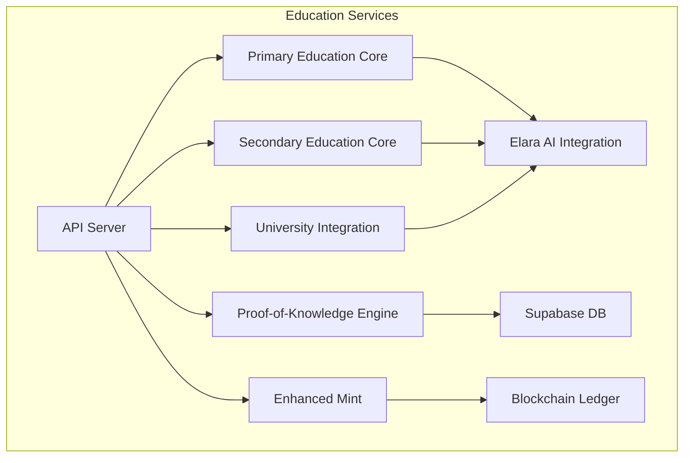
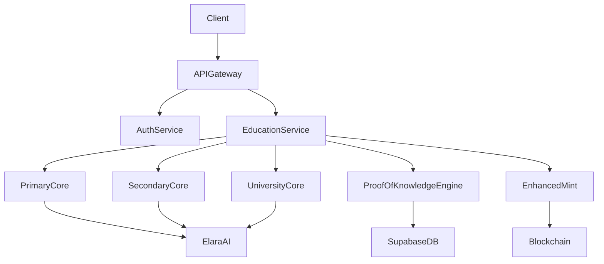
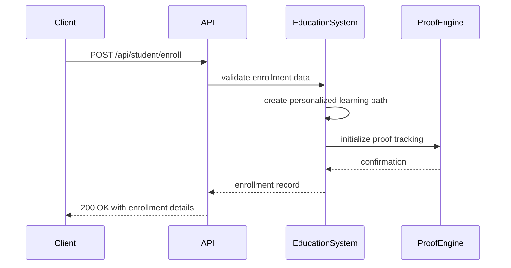
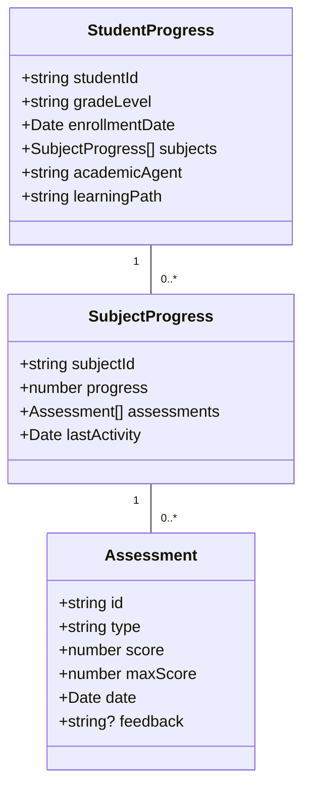
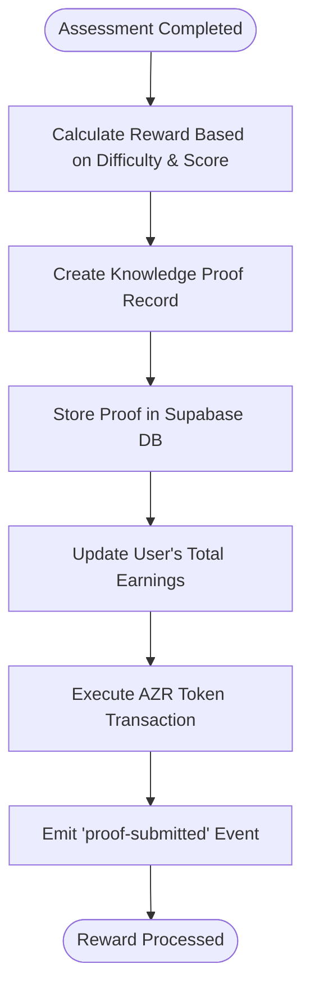
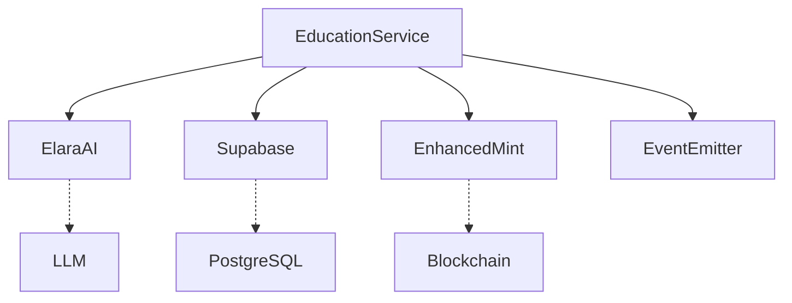

# Education Services API

<cite>
**Referenced Files in This Document**   
- [server.ts](file://services/azora-education/server.ts)
- [index.ts](file://services/azora-education/index.ts)
- [primary-education-core.ts](file://services/azora-education/primary-education-core.ts)
- [secondary-education-core.ts](file://services/azora-education/secondary-education-core.ts)
- [proof-of-knowledge-engine.ts](file://services/proof-of-knowledge-engine.ts)
- [sapiens-service.js](file://services/azora-sapiens/sapiens-service.js)
</cite>

## Table of Contents
1. [Introduction](#introduction)
2. [Project Structure](#project-structure)
3. [Core Components](#core-components)
4. [Architecture Overview](#architecture-overview)
5. [Detailed Component Analysis](#detailed-component-analysis)
6. [Dependency Analysis](#dependency-analysis)
7. [Performance Considerations](#performance-considerations)
8. [Troubleshooting Guide](#troubleshooting-guide)
9. [Conclusion](#conclusion)

## Introduction
The Education Services API provides a comprehensive RESTful interface for managing educational activities across primary, secondary, and university-level programs. It supports course management, student enrollment, progress tracking, and Proof-of-Knowledge verification with integrated economic rewards via AZR tokens. The system is powered by Elara AI for personalized learning paths and academic agent support, ensuring adaptive instruction and real-time feedback. This documentation details all available endpoints, request/response schemas, authentication requirements, and integration points with the Proof-of-Knowledge engine for rewarding learners upon successful completion of educational milestones.

## Project Structure
The Education Services API is organized into modular components that handle different levels of education and associated services. The core functionality resides in the `azora-education` service, which exposes REST endpoints through an Express server. Supporting modules include primary and secondary education cores, university integration, and the Proof-of-Knowledge engine for credentialing and token rewards. The system integrates with Supabase for persistent storage and uses EventEmitter patterns for internal event handling. Configuration and deployment are managed through Docker and Kubernetes manifests located in the infrastructure directory.

**Diagram sources**
- [server.ts](file://services/azora-education/server.ts#L1-L261)
- [index.ts](file://services/azora-education/index.ts#L1-L154)

**Section sources**
- [server.ts](file://services/azora-education/server.ts#L1-L261)
- [index.ts](file://services/azora-education/index.ts#L1-L154)

## Core Components
The Education Services API consists of several core components that manage different aspects of the educational lifecycle. These include enrollment management, progress tracking, assessment recording, and reward distribution. Each component is exposed through dedicated API endpoints and follows a consistent request/response pattern. The system supports three educational levels: primary (Grades R-7), secondary (Grades 8-12), and university-level programs. All components integrate with the Proof-of-Knowledge engine to verify learning outcomes and distribute AZR tokens as economic incentives.

**Section sources**
- [primary-education-core.ts](file://services/azora-education/primary-education-core.ts#L1-L590)
- [secondary-education-core.ts](file://services/azora-education/secondary-education-core.ts#L1-L732)
- [proof-of-knowledge-engine.ts](file://services/proof-of-knowledge-engine.ts#L1-L236)

## Architecture Overview
The Education Services API follows a modular microservices architecture with clear separation of concerns between educational levels and supporting systems. The API server acts as a facade, routing requests to appropriate core modules while maintaining a unified interface. Each educational level has its own data model and business logic, but shares common patterns for enrollment, assessment, and progress tracking. The system integrates with external services including Supabase for data persistence, Elara AI for personalized learning, and the Enhanced Mint for secure token transactions. Authentication and authorization are handled at the gateway level, allowing the education service to focus on domain-specific logic.

**Diagram sources**
- [server.ts](file://services/azora-education/server.ts#L1-L261)
- [index.ts](file://services/azora-education/index.ts#L1-L154)
- [proof-of-knowledge-engine.ts](file://services/proof-of-knowledge-engine.ts#L1-L236)

## Detailed Component Analysis

### Course Management and Enrollment
The Education Services API provides comprehensive endpoints for managing courses and enrolling students across different educational levels. Each level has dedicated endpoints for enrollment, with shared patterns for request/response formats. The system supports both direct enrollment and integrated enrollment through the `/api/student/enroll` endpoint, which routes to the appropriate level-specific handler.

#### Course Enrollment Endpoints

**Diagram sources**
- [server.ts](file://services/azora-education/server.ts#L86-L131)
- [index.ts](file://services/azora-education/index.ts#L25-L100)

**Section sources**
- [server.ts](file://services/azora-education/server.ts#L86-L131)
- [index.ts](file://services/azora-education/index.ts#L25-L100)

### Progress Tracking and Assessment
The system provides robust progress tracking capabilities for all educational levels. Students' progress is recorded at the subject level, with assessments contributing to overall completion metrics. The API exposes endpoints for retrieving student progress and recording new assessments, which trigger AI-powered feedback generation through Elara integration.

#### Progress Tracking Data Model

**Diagram sources**
- [primary-education-core.ts](file://services/azora-education/primary-education-core.ts#L1-L590)
- [secondary-education-core.ts](file://services/azora-education/secondary-education-core.ts#L1-L732)

**Section sources**
- [primary-education-core.ts](file://services/azora-education/primary-education-core.ts#L1-L590)
- [secondary-education-core.ts](file://services/azora-education/secondary-education-core.ts#L1-L732)

### Proof-of-Knowledge Verification and Token Rewards
The Proof-of-Knowledge engine is central to the educational reward system, verifying learning outcomes and distributing AZR tokens based on performance. When a student completes a module and achieves a passing score, a knowledge proof is generated and stored, triggering a reward transaction through the Enhanced Mint system. The reward calculation considers both module difficulty and assessment score, creating an incentive structure that rewards both challenge-seeking and mastery.

#### Proof-of-Knowledge Workflow

**Diagram sources**
- [proof-of-knowledge-engine.ts](file://services/proof-of-knowledge-engine.ts#L1-L236)

**Section sources**
- [proof-of-knowledge-engine.ts](file://services/proof-of-knowledge-engine.ts#L1-L236)

## Dependency Analysis
The Education Services API has well-defined dependencies on several internal and external systems. The primary dependencies include the Elara AI integration for personalized learning, Supabase for persistent data storage, and the Enhanced Mint system for secure token transactions. The service communicates with these dependencies through well-defined interfaces, minimizing coupling while enabling rich functionality. Error handling strategies include fallback mechanisms for database connectivity issues, ensuring service availability even when external systems experience temporary outages.

**Diagram sources**
- [index.ts](file://services/azora-education/index.ts#L1-L154)
- [proof-of-knowledge-engine.ts](file://services/proof-of-knowledge-engine.ts#L1-L236)

**Section sources**
- [index.ts](file://services/azora-education/index.ts#L1-L154)
- [proof-of-knowledge-engine.ts](file://services/proof-of-knowledge-engine.ts#L1-L236)

## Performance Considerations
The Education Services API is designed to handle large numbers of concurrent learners through several optimization strategies. The system uses in-memory caching for frequently accessed data, such as grade configurations and academic agent assignments, reducing database load. For high-volume operations like assessment recording and reward distribution, the system employs event-driven architecture to decouple processing steps and prevent blocking operations. The API server is configured to run behind a load balancer with auto-scaling capabilities, ensuring consistent performance during peak usage periods. Additionally, the system supports offline-first synchronization through service workers and local storage, allowing learners to continue their studies without constant connectivity.

## Troubleshooting Guide
Common issues with the Education Services API typically fall into three categories: enrollment conflicts, course availability issues, and reward processing failures. Enrollment conflicts occur when attempting to enroll a student in a course they are already registered for and are handled with a 409 Conflict status code. Course availability issues arise when requesting non-existent programs or grades and return a 404 Not Found response. Reward processing failures may occur due to database connectivity issues or insufficient funds in the reward pool, with appropriate error messages returned to the client. Monitoring is implemented through health check endpoints and structured logging, enabling rapid diagnosis of issues in production environments.

**Section sources**
- [server.ts](file://services/azora-education/server.ts#L1-L261)
- [proof-of-knowledge-engine.ts](file://services/proof-of-knowledge-engine.ts#L1-L236)

## Conclusion
The Education Services API provides a robust foundation for delivering personalized, incentivized learning experiences across multiple educational levels. By integrating AI-powered instruction with blockchain-based credentialing and reward systems, it creates a closed-loop learning economy where knowledge acquisition is directly tied to economic value. The modular architecture allows for independent scaling of different educational levels while maintaining a consistent interface for clients. With comprehensive endpoints for course management, enrollment, progress tracking, and Proof-of-Knowledge verification, the API enables the development of rich educational applications and reporting dashboards that can adapt to diverse learning needs and contexts.