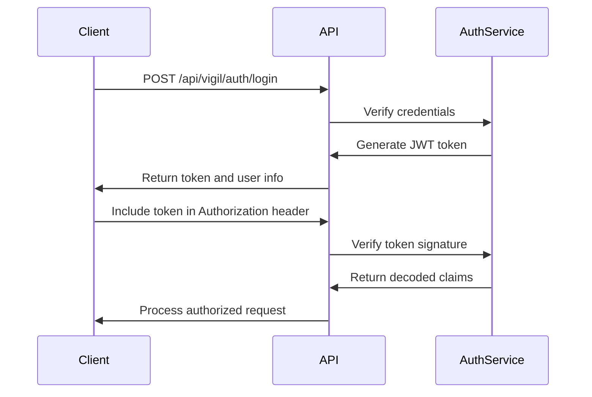
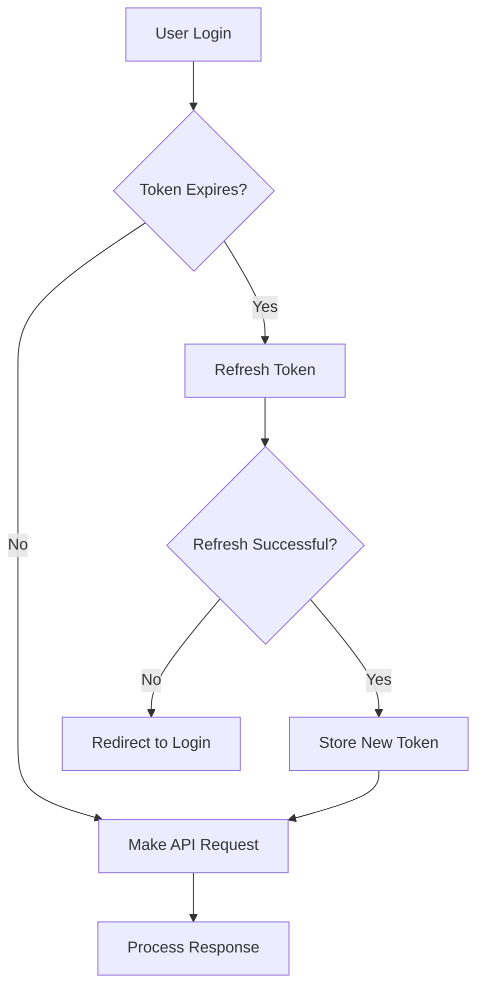

# User Management API

<cite>
**Referenced Files in This Document**   
- [main.go](file://services/user-service/main.go)
- [auth.ts](file://organs/vigil-service/src/routes/auth.ts)
- [admin.ts](file://organs/vigil-service/src/routes/admin.ts)
- [authService.ts](file://organs/auth/src/authService.ts)
- [founder-onboarding-api.ts](file://services/founder-onboarding-api.ts)
- [DIGITAL_ONBOARDING_SYSTEM.md](file://codex/archive/operations/DIGITAL_ONBOARDING_SYSTEM.md)
</cite>

## Table of Contents
1. [Introduction](#introduction)
2. [Authentication Endpoints](#authentication-endpoints)
3. [User Management Endpoints](#user-management-endpoints)
4. [Founder Onboarding Endpoints](#founder-onboarding-endpoints)
5. [Request/Response Schemas](#requestresponse-schemas)
6. [Security and Compliance](#security-and-compliance)
7. [Client Implementation Guidelines](#client-implementation-guidelines)
8. [Error Handling](#error-handling)
9. [Rate Limiting](#rate-limiting)

## Introduction
The User Management API provides comprehensive endpoints for user authentication, profile management, and founder onboarding workflows. The system implements JWT-based authentication with role-based access control and integrates with the Elara AI governance system for compliance monitoring. All endpoints require authentication unless explicitly stated as public.

The API supports both traditional username/password authentication and integrates with blockchain-based identity systems. User data is encrypted at rest and in transit, with compliance controls for GDPR, CCPA, and POPIA regulations.

**Section sources**
- [auth.ts](file://organs/vigil-service/src/routes/auth.ts#L1-L198)
- [DIGITAL_ONBOARDING_SYSTEM.md](file://codex/archive/operations/DIGITAL_ONBOARDING_SYSTEM.md#L1-L770)

## Authentication Endpoints

### POST /api/vigil/auth/login
Authenticates a user and returns a JWT token for subsequent requests.

**Request**
```json
{
  "email": "user@azora.world",
  "password": "securePassword123"
}
```

**Response**
```json
{
  "token": "eyJhbGciOiJIUzI1NiIsInR5cCI6IkpXVCJ9.xJ...",
  "user": {
    "id": "user-123",
    "name": "John Doe",
    "email": "user@azora.world",
    "role": "user",
    "createdAt": "2025-10-21T10:00:00Z",
    "lastLoginAt": "2025-10-21T10:00:00Z"
  },
  "expiresIn": 3600
}
```

### POST /api/vigil/auth/logout
Handles user logout. In the stateless JWT system, this is primarily a client-side operation.

**Response**
```json
{
  "message": "Logged out successfully"
}
```

### GET /api/vigil/auth/me
Retrieves the current user's information from the authentication token.

**Response**
```json
{
  "id": "user-123",
  "name": "John Doe",
  "email": "user@azora.world",
  "role": "user",
  "createdAt": "2025-10-21T10:00:00Z",
  "lastLoginAt": "2025-10-21T10:00:00Z"
}
```

### POST /api/vigil/auth/refresh
Refreshes an expired JWT token using the current session.

**Response**
```json
{
  "token": "eyJhbGciOiJIUzI1NiIsInR5cCI6IkpXVCJ9.xJ...",
  "expiresIn": 3600
}
```

**Section sources**
- [auth.ts](file://organs/vigil-service/src/routes/auth.ts#L91-L198)
- [authService.ts](file://organs/auth/src/authService.ts#L26-L36)

## User Management Endpoints

### GET /api/vigil/admin/users
Retrieves a list of all users in the system. Requires admin role.

**Response**
```json
[
  {
    "id": "user-123",
    "name": "John Doe",
    "email": "user@azora.world",
    "role": "user",
    "createdAt": "2025-10-21T10:00:00Z",
    "lastLoginAt": "2025-10-21T10:00:00Z",
    "isActive": true
  }
]
```

### POST /api/vigil/admin/users
Creates a new user account. Requires admin role.

**Request**
```json
{
  "name": "John Doe",
  "email": "user@azora.world",
  "role": "user",
  "password": "securePassword123"
}
```

**Response**
```json
{
  "id": "user-123",
  "name": "John Doe",
  "email": "user@azora.world",
  "role": "user",
  "createdAt": "2025-10-21T10:00:00Z",
  "isActive": true
}
```

### PUT /api/vigil/admin/users/:userId/role
Updates a user's role. Requires admin role.

**Request**
```json
{
  "role": "admin"
}
```

**Response**
```json
{
  "id": "user-123",
  "name": "John Doe",
  "email": "user@azora.world",
  "role": "admin",
  "updatedAt": "2025-10-21T11:00:00Z"
}
```

### DELETE /api/vigil/admin/users/:userId
Deactivates a user account. Requires admin role.

**Response**
```json
{
  "message": "User deactivated successfully"
}
```

**Section sources**
- [admin.ts](file://organs/vigil-service/src/routes/admin.ts#L58-L262)
- [main.go](file://services/user-service/main.go#L76-L117)

## Founder Onboarding Endpoints

### POST /api/founders/onboard
Onboards a new founder into the system with equity allocation and contract generation.

**Request**
```json
{
  "name": "Sizwe Ngwenya",
  "email": "sizwe.ngwenya@azora.world",
  "role": "CEO",
  "volunteerMonths": 12,
  "equity": "65%"
}
```

**Response**
```json
{
  "success": true,
  "founder": {
    "id": "founder-001",
    "name": "Sizwe Ngwenya",
    "email": "sizwe.ngwenya@azora.world",
    "role": "CEO",
    "createdAt": "2025-10-21T10:00:00Z"
  },
  "contract": {
    "id": "contract-001",
    "equity": "65%",
    "vestingYears": 4,
    "cliff": 1
  },
  "message": "Sizwe Ngwenya successfully onboarded as CEO"
}
```

### GET /api/founders/:id
Retrieves detailed information about a specific founder.

**Response**
```json
{
  "success": true,
  "founder": {
    "id": "founder-001",
    "name": "Sizwe Ngwenya",
    "email": "sizwe.ngwenya@azora.world",
    "role": "CEO",
    "createdAt": "2025-10-21T10:00:00Z"
  },
  "contract": {
    "id": "contract-001",
    "equity": "65%",
    "vestingYears": 4,
    "cliff": 1
  }
}
```

### GET /api/founders
Retrieves statistics about all founders in the system.

**Response**
```json
{
  "success": true,
  "totalFounders": 1,
  "activeFounders": 1,
  "totalEquityAllocated": "65%"
}
```

**Section sources**
- [founder-onboarding-api.ts](file://services/founder-onboarding-api.ts#L1-L144)
- [DIGITAL_ONBOARDING_SYSTEM.md](file://codex/archive/operations/DIGITAL_ONBOARDING_SYSTEM.md#L221-L243)

## Request/Response Schemas

### User Object
```json
{
  "id": "string",
  "name": "string",
  "email": "string",
  "role": "string",
  "createdAt": "string",
  "lastLoginAt": "string",
  "isActive": "boolean"
}
```

### Authentication Response
```json
{
  "token": "string",
  "user": "User",
  "expiresIn": "number"
}
```

### Founder Object
```json
{
  "id": "string",
  "name": "string",
  "email": "string",
  "role": "string",
  "country": "string",
  "tier": "string",
  "walletAddress": "string",
  "createdAt": "string",
  "totalWithdrawn": "number",
  "kycVerified": "boolean",
  "active": "boolean"
}
```

### Contract Object
```json
{
  "id": "string",
  "equity": "string",
  "vestingYears": "number",
  "cliff": "number",
  "createdAt": "string"
}
```

**Section sources**
- [auth.ts](file://organs/vigil-service/src/routes/auth.ts#L1-L198)
- [admin.ts](file://organs/vigil-service/src/routes/admin.ts#L58-L262)
- [founder-onboarding-api.ts](file://services/founder-onboarding-api.ts#L1-L144)

## Security and Compliance

### JWT Authentication
The API uses JWT tokens for authentication with configurable expiration times. Tokens are signed using either HS256 or RS256 algorithms based on environment configuration.



**Diagram sources**
- [auth.ts](file://organs/vigil-service/src/routes/auth.ts#L91-L138)
- [authService.ts](file://organs/auth/src/authService.ts#L26-L36)

### Data Encryption
Sensitive user data is encrypted at rest using AES-256 encryption. The encryption key is stored in a secure secrets management system.

### Compliance Regulations
The system implements controls for multiple regulatory frameworks:
- **GDPR**: Right to erasure, data portability, and consent management
- **CCPA**: Consumer rights to access and delete personal information
- **POPIA**: South African data protection requirements including accountability and security safeguards

**Section sources**
- [auth.ts](file://organs/vigil-service/src/routes/auth.ts#L91-L138)
- [DIGITAL_ONBOARDING_SYSTEM.md](file://codex/archive/operations/DIGITAL_ONBOARDING_SYSTEM.md#L1-L770)

## Client Implementation Guidelines

### Web Client
Web clients should store JWT tokens in memory rather than localStorage to prevent XSS attacks. Implement token refresh mechanisms before expiration.



**Diagram sources**
- [auth.ts](file://organs/vigil-service/src/routes/auth.ts#L140-L198)

### Mobile Client
Mobile clients should use secure storage mechanisms like Keychain (iOS) or Keystore (Android) for token storage. Implement biometric authentication for sensitive operations.

### Session Management
Implement the following session management practices:
- Set JWT expiration to 1 hour for standard users
- Use refresh tokens with 7-day expiration
- Implement token revocation on logout
- Monitor for concurrent sessions

**Section sources**
- [auth.ts](file://organs/vigil-service/src/routes/auth.ts#L140-L198)
- [authService.ts](file://organs/auth/src/authService.ts#L26-L36)

## Error Handling

### Common Error Responses
The API returns standardized error responses for common scenarios:

**401 Unauthorized**
```json
{
  "error": "Unauthorized - No token provided"
}
```

**403 Forbidden**
```json
{
  "error": "Forbidden - Insufficient permissions",
  "required": ["admin"],
  "current": "user"
}
```

**404 Not Found**
```json
{
  "error": "User not found"
}
```

**422 Unprocessable Entity**
```json
{
  "error": "Invalid role. Must be admin, operator, or viewer"
}
```

### Validation Rules
Input validation is performed on all endpoints:
- Email format validation using RFC 5322
- Password strength requirements (12 characters, mixed case, numbers, symbols)
- Role validation against allowed values (admin, operator, viewer, user)
- Required field validation for all POST/PUT operations

**Section sources**
- [auth.ts](file://organs/vigil-service/src/routes/auth.ts#L53-L91)
- [admin.ts](file://organs/vigil-service/src/routes/admin.ts#L58-L103)

## Rate Limiting
The API implements rate limiting to prevent abuse:
- 100 requests per 15 minutes for unauthenticated endpoints
- 1000 requests per 15 minutes for authenticated endpoints
- Exponential backoff for failed authentication attempts
- IP-based tracking with temporary bans after 10 failed attempts

Rate limits are communicated through response headers:
- `X-RateLimit-Limit`: Total requests allowed in the window
- `X-RateLimit-Remaining`: Remaining requests in the window
- `X-RateLimit-Reset`: Time when the limit resets (Unix timestamp)

**Section sources**
- [auth.ts](file://organs/vigil-service/src/routes/auth.ts#L91-L138)
- [admin.ts](file://organs/vigil-service/src/routes/admin.ts#L58-L103)