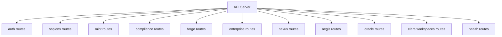
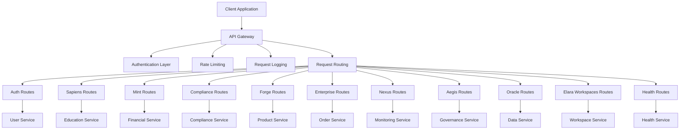
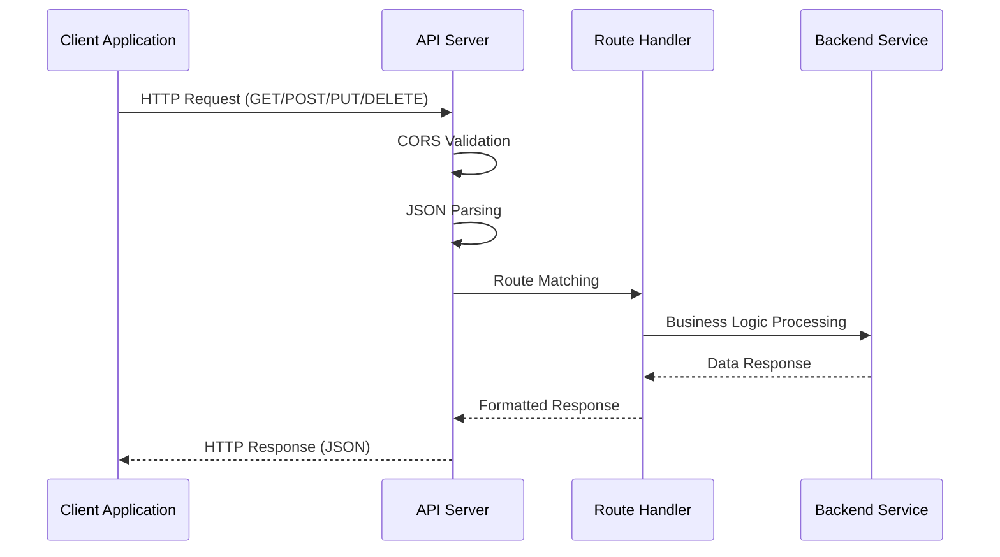
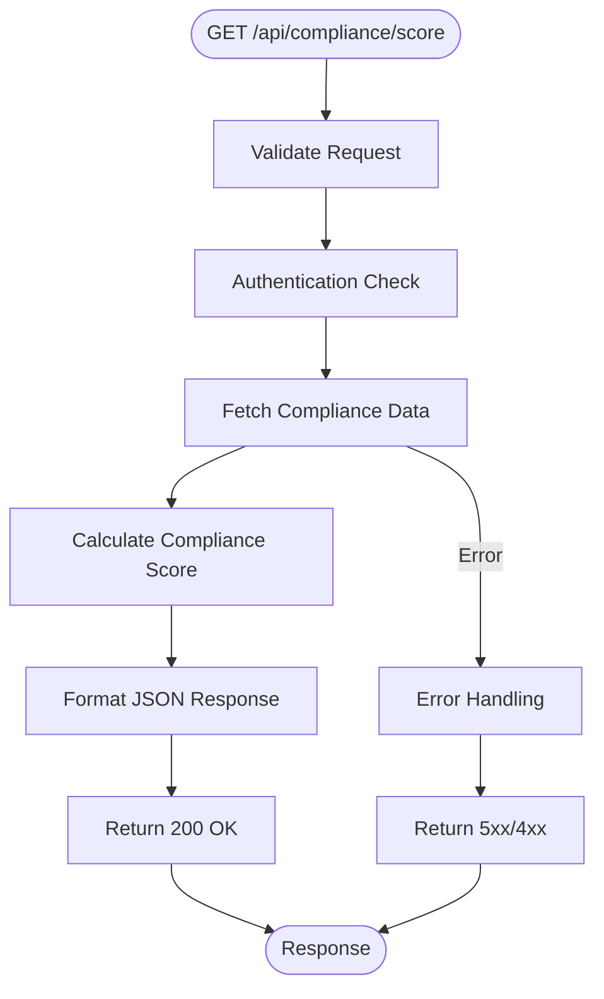
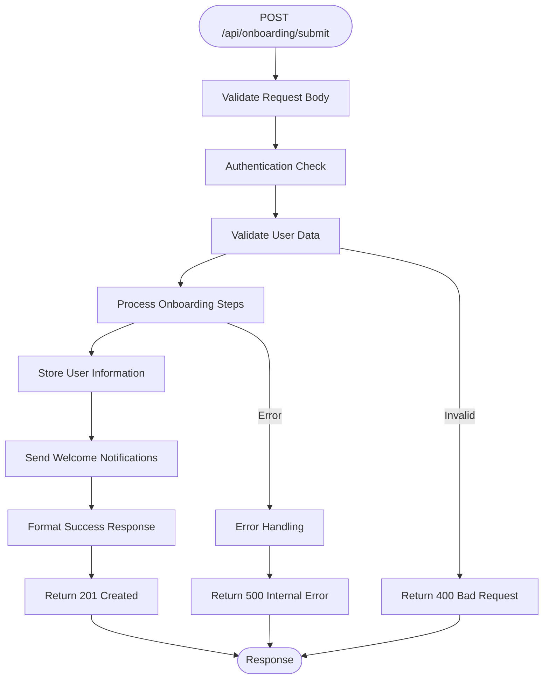
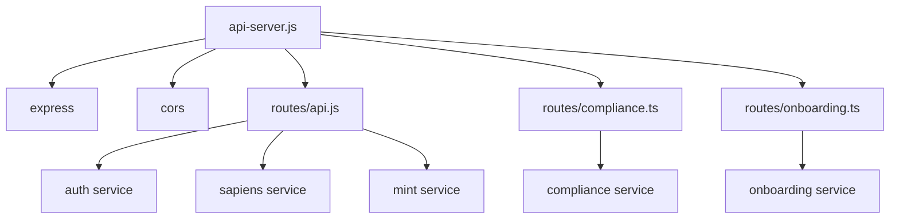

# API Design

<cite>
**Referenced Files in This Document**   
- [api-server.js](file://api-server.js)
- [routes/api.js](file://routes/api.js)
- [routes/compliance.ts](file://routes/compliance.ts)
- [routes/onboarding.ts](file://routes/onboarding.ts)
</cite>

## Table of Contents
1. [Introduction](#introduction)
2. [Project Structure](#project-structure)
3. [Core Components](#core-components)
4. [Architecture Overview](#architecture-overview)
5. [Detailed Component Analysis](#detailed-component-analysis)
6. [Dependency Analysis](#dependency-analysis)
7. [Performance Considerations](#performance-considerations)
8. [Troubleshooting Guide](#troubleshooting-guide)
9. [Conclusion](#conclusion)

## Introduction
This document provides a comprehensive overview of the RESTful API architecture and design principles implemented in Azora OS. It details the structure of API routes, request/response patterns, error handling mechanisms, authentication strategies, rate limiting, versioning approaches, and guidelines for creating new endpoints. The analysis is based on key files including api-server.js, compliance.ts, and onboarding.ts, which define the core API behaviors and routing logic within the system.

## Project Structure
The API design in Azora OS follows a modular structure with clear separation of concerns. The main API server is defined in api-server.js, while specific route handlers are organized in the routes/ directory. This structure enables scalable development and maintenance of API endpoints across different domains such as compliance, onboarding, and core services.

**Diagram sources**
- [api-server.js](file://api-server.js#L1-L176)

**Section sources**
- [api-server.js](file://api-server.js#L1-L176)

## Core Components
The API design in Azora OS is built around several core components that work together to provide a robust, secure, and scalable interface. These components include the API server, route handlers, authentication mechanisms, error handling systems, and monitoring endpoints. The architecture follows RESTful principles with clear resource naming, proper HTTP methods, and consistent response formats.

**Section sources**
- [api-server.js](file://api-server.js#L1-L176)
- [routes/api.js](file://routes/api.js)

## Architecture Overview
The API architecture in Azora OS follows a layered approach with Express.js serving as the foundation. The design emphasizes modularity, security, and maintainability. The system implements a centralized API gateway pattern where all requests are routed through a single entry point that handles cross-cutting concerns like authentication, logging, and rate limiting before delegating to specific route handlers.

**Diagram sources**
- [api-server.js](file://api-server.js#L1-L176)

## Detailed Component Analysis

### API Server Implementation
The API server implementation in api-server.js serves as the central entry point for all API requests in Azora OS. It uses Express.js to define routes and handle HTTP requests, following RESTful principles with clear resource naming and proper use of HTTP methods.

**Diagram sources**
- [api-server.js](file://api-server.js#L1-L176)

**Section sources**
- [api-server.js](file://api-server.js#L1-L176)

### Compliance API Design
The compliance API design in compliance.ts implements endpoints that provide compliance status, scores, and alerts. These endpoints follow a consistent pattern with standardized response formats and proper error handling.

**Diagram sources**
- [routes/compliance.ts](file://routes/compliance.ts)

**Section sources**
- [routes/compliance.ts](file://routes/compliance.ts)

### Onboarding API Design
The onboarding API design in onboarding.ts implements endpoints that handle user onboarding processes. These endpoints follow the same design patterns as other API routes, ensuring consistency across the system.

**Diagram sources**
- [routes/onboarding.ts](file://routes/onboarding.ts)

**Section sources**
- [routes/onboarding.ts](file://routes/onboarding.ts)

## Dependency Analysis
The API design in Azora OS has minimal external dependencies, relying primarily on Express.js for server functionality and CORS middleware for cross-origin resource sharing. The internal dependencies are well-structured, with clear separation between route definitions and business logic.

**Diagram sources**
- [api-server.js](file://api-server.js#L1-L176)
- [routes/api.js](file://routes/api.js)
- [routes/compliance.ts](file://routes/compliance.ts)
- [routes/onboarding.ts](file://routes/onboarding.ts)

**Section sources**
- [api-server.js](file://api-server.js#L1-L176)
- [routes/api.js](file://routes/api.js)
- [routes/compliance.ts](file://routes/compliance.ts)
- [routes/onboarding.ts](file://routes/onboarding.ts)

## Performance Considerations
The API design incorporates several performance considerations including efficient routing, minimal middleware processing, and optimized response formatting. The use of Express.js provides good performance characteristics out of the box, while the modular structure allows for targeted optimization of specific endpoints when needed.

## Troubleshooting Guide
When troubleshooting API issues in Azora OS, developers should first check the health endpoint to verify server status. Common issues include incorrect route definitions, authentication failures, and data validation errors. The consistent error handling pattern makes it easier to identify and resolve problems.

**Section sources**
- [api-server.js](file://api-server.js#L1-L176)

## Conclusion
The API design in Azora OS follows RESTful principles with a focus on consistency, security, and maintainability. The architecture provides a solid foundation for building scalable services with clear separation of concerns. By following the established patterns in api-server.js, compliance.ts, and onboarding.ts, developers can create new endpoints that integrate seamlessly with the existing system.