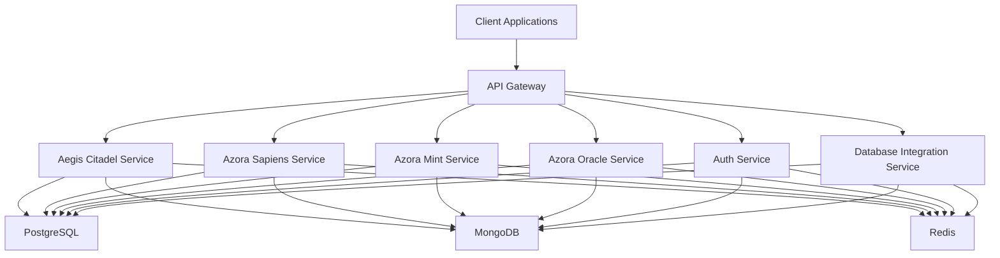
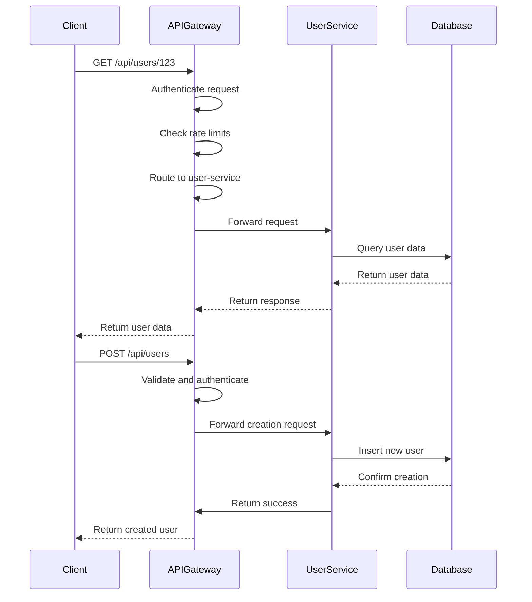
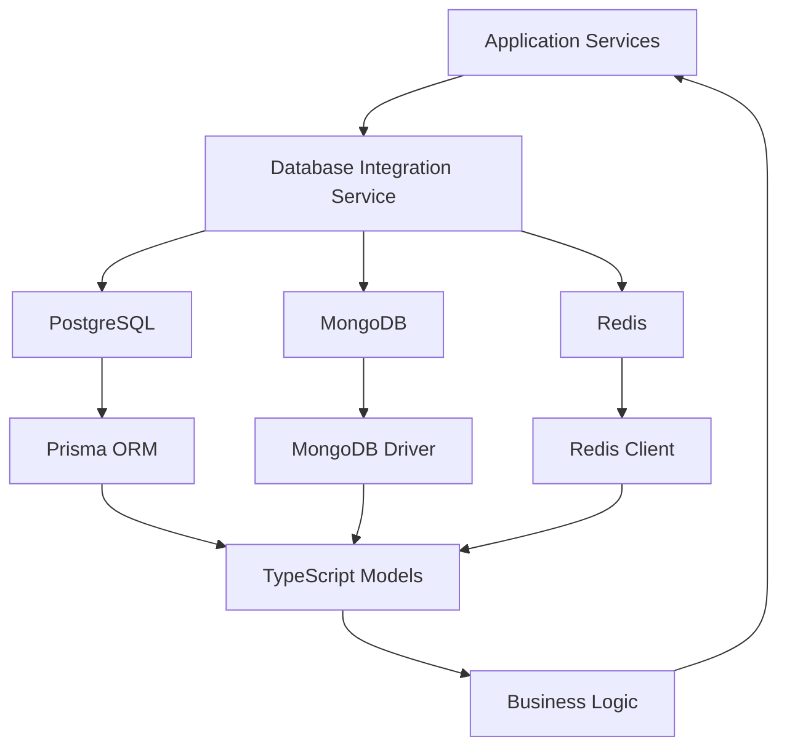
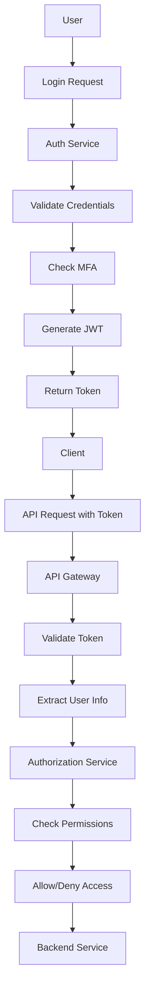
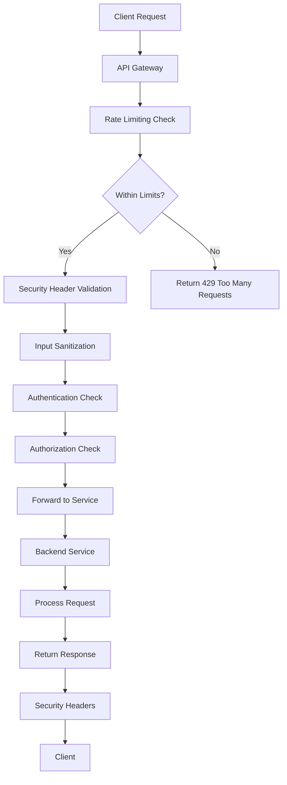
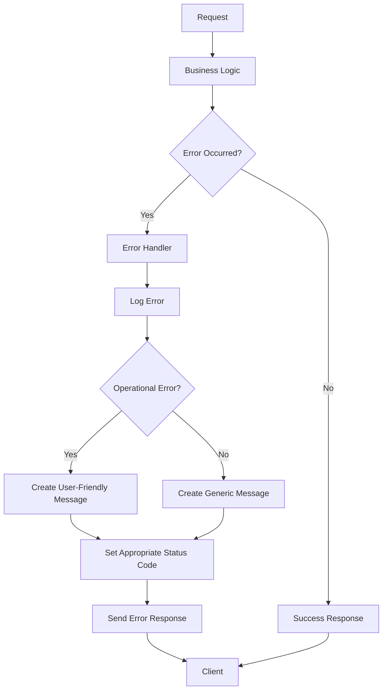
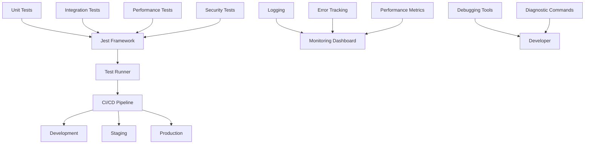

# Backend Development

<cite>
**Referenced Files in This Document**   
- [apiGatewayRoutes.ts](file://organs/api-gateway/src/apiGatewayRoutes.ts)
- [apiGatewayService.ts](file://organs/api-gateway/src/apiGatewayService.ts)
- [index.ts](file://organs/api-gateway/src/index.ts)
- [database-integration/server.js](file://organs/database-integration/server.js)
- [database-integration/package.json](file://organs/database-integration/package.json)
- [auth/src/index.ts](file://organs/auth/src/index.ts)
- [errorHandler.ts](file://services/azora-mint/src/middleware/errorHandler.ts)
- [errorHandler.ts](file://services/azora-forge/src/middleware/errorHandler.ts)
- [errorHandler.ts](file://services/azora-nexus/src/middleware/errorHandler.ts)
- [errorHandler.ts](file://organs/ai-website-builder/src/middleware/errorHandler.ts)
- [errorHandler.ts](file://organs/email-hosting/src/middleware/errorHandler.ts)
- [data-access-controls.ts](file://genome/agent-tools/data-access-controls.ts)
- [services.ts](file://genome/agent-tools/services.ts)
- [rate-limiting.js](file://tests/security/rate-limiting.js)
- [authorization-checks.js](file://tests/security/authorization-checks.js)
- [authentication-validation.js](file://tests/security/authentication-validation.js)
- [multi-service-communication.js](file://tests/integration/multi-service-communication.js)
</cite>

## Table of Contents
1. [Introduction](#introduction)
2. [Service-Oriented Architecture](#service-oriented-architecture)
3. [API Gateway and Service Integration](#api-gateway-and-service-integration)
4. [REST API Design Principles](#rest-api-design-principles)
5. [Database Integration Strategies](#database-integration-strategies)
6. [Authentication and Authorization](#authentication-and-authorization)
7. [Rate Limiting and Security](#rate-limiting-and-security)
8. [Error Handling and Middleware](#error-handling-and-middleware)
9. [Testing and Debugging Backend Services](#testing-and-debugging-backend-services)
10. [Creating New Endpoints and Services](#creating-new-endpoints-and-services)
11. [Conclusion](#conclusion)

## Introduction

Azora OS is a comprehensive platform designed for African economic liberation, combining education, economic empowerment, and advanced technology. The backend system is built on a service-oriented architecture with microservices communicating through a central API gateway. This document provides comprehensive guidance on backend development in Azora OS, covering service architecture, API design, database integration, security, and development practices.

The system addresses real African challenges through innovative solutions like offline-first education, mobile money integration, multi-language support, and self-healing infrastructure powered by Elara AI. The backend architecture is designed to be scalable, secure, and resilient, supporting the platform's mission of economic sovereignty and knowledge-based prosperity.

**Section sources**
- [README.md](file://README.md#L0-L555)

## Service-Oriented Architecture

Azora OS implements a service-oriented architecture with multiple independent microservices that communicate through well-defined APIs. The architecture follows a microservices pattern where each service has a specific responsibility and can be developed, deployed, and scaled independently.

The system includes various specialized services such as the Aegis Citadel for global genesis, Azora Sapiens for education, Azora Mint for economic engine, and Azora Oracle for intelligence. These services are orchestrated through a central API gateway that handles routing, authentication, rate limiting, and monitoring.

Each service is containerized and can be deployed independently, allowing for flexible scaling based on demand. The services communicate through REST APIs and event-driven messaging, ensuring loose coupling and high cohesion. The architecture supports both synchronous and asynchronous communication patterns, enabling efficient data flow and system responsiveness.

The service registry maintains information about all available services, including their endpoints, health status, and metadata. This enables dynamic service discovery and load balancing, improving system resilience and availability. The architecture also incorporates circuit breakers to prevent cascading failures and ensure graceful degradation during partial outages.

**Diagram sources **
- [README.md](file://README.md#L0-L555)
- [apiGatewayRoutes.ts](file://organs/api-gateway/src/apiGatewayRoutes.ts#L210-L260)

## API Gateway and Service Integration

The API gateway serves as the entry point for all client requests, providing a unified interface to the underlying microservices. It handles critical cross-cutting concerns such as authentication, rate limiting, request routing, and response aggregation.

The gateway implements dynamic route registration, allowing services to register their endpoints at startup or during runtime. This enables flexible service discovery and eliminates the need for hardcoded configurations. The route management system stores registered routes in a database, ensuring persistence across gateway restarts.

Service integration is facilitated through the API gateway's proxy functionality, which forwards requests to the appropriate backend services based on the requested path. The gateway maintains a routing table that maps URL patterns to target service endpoints, supporting both exact and wildcard matching.

The gateway also implements circuit breakers for each service, monitoring failure rates and automatically opening the circuit when failure thresholds are exceeded. This prevents cascading failures and allows services time to recover without being overwhelmed by requests. When a circuit is open, the gateway returns appropriate error responses or fallback content.

Event-driven communication is supported through a message bus that enables services to publish and subscribe to events. This decouples services and enables real-time data synchronization across the system. The event bus supports various messaging patterns including publish-subscribe, request-response, and fire-and-forget.

**Diagram sources **
- [apiGatewayRoutes.ts](file://organs/api-gateway/src/apiGatewayRoutes.ts#L53-L75)
- [apiGatewayService.ts](file://organs/api-gateway/src/apiGatewayService.ts#L112-L154)
- [index.ts](file://organs/api-gateway/src/index.ts#L49-L98)

## REST API Design Principles

Azora OS follows consistent REST API design principles across all services, ensuring a uniform and predictable interface for clients. The APIs are designed to be resource-oriented, with clear URL structures that reflect the underlying data model.

All API endpoints follow a standardized structure with versioning in the URL path (e.g., `/api/v1/users`). This enables backward compatibility and smooth transitions between API versions. The versioning strategy allows multiple API versions to coexist, providing time for clients to migrate to newer versions.

The API uses standard HTTP methods (GET, POST, PUT, PATCH, DELETE) according to their semantic meaning:
- GET for retrieving resources
- POST for creating resources
- PUT for replacing resources
- PATCH for partial updates
- DELETE for removing resources

Response formats are consistent across all services, using JSON as the primary data interchange format. Error responses follow a standardized structure with appropriate HTTP status codes, error codes, and descriptive messages. The error handling system provides detailed information in development environments while maintaining security in production by limiting sensitive information exposure.

API documentation is automatically generated using Swagger/OpenAPI specifications embedded in the code. The gateway serves interactive API documentation at `/api-docs`, allowing developers to explore endpoints, view request/response examples, and even test API calls directly from the browser.

The API design emphasizes HATEOAS (Hypermedia as the Engine of Application State) principles where appropriate, including links to related resources in responses. This enables clients to navigate the API dynamically without hardcoding URL structures.

**Section sources**
- [apiGatewayRoutes.ts](file://organs/api-gateway/src/apiGatewayRoutes.ts#L77-L120)
- [apiGatewayService.ts](file://organs/api-gateway/src/apiGatewayService.ts#L112-L154)

## Database Integration Strategies

Azora OS employs a polyglot persistence strategy, utilizing multiple database technologies optimized for different use cases. The database integration service provides a unified interface to PostgreSQL, MongoDB, and Redis, enabling services to leverage the strengths of each database system.

PostgreSQL serves as the primary relational database for structured data with complex relationships and transactional requirements. It stores core business data such as user accounts, financial transactions, and educational records. The system uses Prisma ORM for type-safe database access with TypeScript, providing compile-time verification of queries and schema migrations.

MongoDB is used for document storage, handling flexible schema requirements and high-volume data such as logs, analytics, and user-generated content. Its schema-less nature allows for rapid iteration and adaptation to changing data requirements. The document database is particularly useful for storing hierarchical data and JSON-like structures.

Redis provides in-memory data storage for caching, session management, and real-time features. It significantly improves application performance by reducing database load and enabling low-latency access to frequently used data. Redis is also used for message queuing and pub/sub functionality, supporting real-time communication between services.

The database integration service implements connection pooling, query optimization, and automatic retry mechanisms to ensure reliable database access. It also provides monitoring and analytics capabilities, tracking query performance, connection metrics, and database health.

Data synchronization between databases is handled through the sync engine, which ensures consistency across different storage systems. The analytics engine processes data from multiple sources, generating insights and reports that drive business decisions.

**Diagram sources **
- [server.js](file://organs/database-integration/server.js#L0-L39)
- [package.json](file://organs/database-integration/package.json#L0-L33)

## Authentication and Authorization

Azora OS implements a comprehensive authentication and authorization system to ensure secure access to resources. The auth service provides centralized identity management, supporting multiple authentication methods and fine-grained access control.

Authentication is handled through JSON Web Tokens (JWT), which are issued upon successful login and included in subsequent requests. The tokens contain user identity information and are signed to prevent tampering. Token expiration and refresh mechanisms ensure security while maintaining user convenience.

The system supports role-based access control (RBAC) with predefined roles such as user, manager, and admin. Each role has specific permissions that determine what resources and operations the user can access. The authorization system checks permissions before allowing access to protected endpoints.

Attribute-based access control (ABAC) is also implemented for more complex scenarios, allowing access decisions based on attributes of the user, resource, and environment. This enables dynamic and context-aware authorization policies that can adapt to changing conditions.

The data access controls system implements a rule-based approach to authorization, allowing administrators to define and manage access policies. Rules can be based on various criteria including user roles, resource types, time of day, and IP address ranges.

Multi-factor authentication (MFA) is supported for enhanced security, requiring users to verify their identity through multiple methods. Biometric authentication is also available for supported devices, providing convenient and secure access.

The system logs all authentication and authorization events for audit and security monitoring. These logs include timestamps, user identities, requested resources, and access decisions, enabling comprehensive security analysis.

**Diagram sources **
- [index.ts](file://organs/auth/src/index.ts#L0-L27)
- [data-access-controls.ts](file://genome/agent-tools/data-access-controls.ts#L358-L404)
- [services.ts](file://genome/agent-tools/services.ts#L0-L52)

## Rate Limiting and Security

Azora OS implements robust rate limiting and security measures to protect against abuse and ensure fair usage of resources. The API gateway enforces rate limits at multiple levels, preventing denial-of-service attacks and ensuring system stability.

Rate limiting is applied based on various criteria including IP address, user account, and API key. Different limits are configured for different endpoints based on their resource requirements and business importance. The system supports both fixed window and sliding window algorithms for rate limiting.

The security system includes protection against common web vulnerabilities such as SQL injection, cross-site scripting (XSS), and cross-site request forgery (CSRF). Input validation and output encoding are applied consistently across all services to prevent injection attacks.

The system implements a zero-trust security model, verifying every request regardless of origin. All communications are encrypted using TLS, and sensitive data is protected with strong encryption algorithms. The security manager continuously monitors for suspicious activities and potential threats.

Security headers are automatically added to all responses, including Content Security Policy (CSP), X-Content-Type-Options, and X-Frame-Options. These headers help protect against various client-side attacks and ensure secure content delivery.

The system undergoes regular security testing, including automated scans and manual penetration testing. Vulnerability reports are tracked and addressed promptly, with security patches deployed according to a defined process.

**Diagram sources **
- [rate-limiting.js](file://tests/security/rate-limiting.js#L86-L132)
- [authorization-checks.js](file://tests/security/authorization-checks.js#L99-L144)
- [authentication-validation.js](file://tests/security/authentication-validation.js#L81-L124)

## Error Handling and Middleware

Azora OS implements a comprehensive error handling system that ensures consistent and informative responses to clients while maintaining system stability. The error handling middleware is applied across all services, providing a uniform approach to error management.

The system distinguishes between operational errors (expected errors that can be handled gracefully) and programmer errors (bugs that need to be fixed). Operational errors include things like validation failures, resource not found, and authentication issues. Programmer errors include unhandled exceptions and coding mistakes.

When an error occurs, it is logged with detailed context including the error message, stack trace, request information, and relevant data. The logging system includes structured logging with key-value pairs, enabling efficient searching and analysis of error logs.

Error responses follow a standardized format with appropriate HTTP status codes, error codes, and descriptive messages. In development environments, detailed error information is included to aid debugging. In production, sensitive information is filtered out to prevent information disclosure.

The error handling system includes automatic recovery mechanisms for certain types of errors. Transient failures such as database connection issues are retried automatically with exponential backoff. Circuit breakers prevent repeated attempts to failing services, allowing them time to recover.

Custom error types are defined for common scenarios, making it easier to handle specific error conditions. These include validation errors, authentication errors, authorization errors, and resource not found errors. Each error type has appropriate status codes and handling logic.

**Diagram sources **
- [errorHandler.ts](file://services/azora-mint/src/middleware/errorHandler.ts#L0-L56)
- [errorHandler.ts](file://services/azora-forge/src/middleware/errorHandler.ts#L0-L56)
- [errorHandler.ts](file://services/azora-nexus/src/middleware/errorHandler.ts#L0-L73)

## Testing and Debugging Backend Services

Azora OS provides comprehensive testing and debugging capabilities to ensure the reliability and performance of backend services. The testing framework includes unit tests, integration tests, performance tests, and security tests.

Unit tests verify the correctness of individual functions and components in isolation. They are written using Jest and cover both happy paths and edge cases. Test coverage is monitored to ensure critical code paths are adequately tested.

Integration tests validate the interaction between multiple components and services. They verify that the system works correctly as a whole, including database access, API communication, and event handling. The integration tests run against real services and databases to ensure realistic test conditions.

Performance tests measure the system's behavior under various load conditions. They identify bottlenecks and ensure the system meets performance requirements. The tests measure response times, throughput, and resource utilization under different scenarios.

Security tests verify the effectiveness of security controls and identify potential vulnerabilities. They include tests for authentication, authorization, rate limiting, input validation, and other security features. The security testing framework includes both automated scans and manual testing procedures.

The debugging system provides tools for troubleshooting issues in development and production environments. It includes logging, monitoring, and diagnostic capabilities that help identify and resolve problems quickly. The system supports remote debugging and live inspection of running services.

**Diagram sources **
- [multi-service-communication.js](file://tests/integration/multi-service-communication.js#L48-L83)
- [test-runner.js](file://tests/test-runner.js#L260-L309)

## Creating New Endpoints and Services

Creating new endpoints and services in Azora OS follows a standardized process that ensures consistency and maintainability. The process begins with defining the service requirements and API contract before implementation.

New services are created as independent modules with their own repository or directory. They follow the same project structure and coding standards as existing services, ensuring consistency across the codebase. The service template includes configuration files, testing setup, and deployment scripts.

API endpoints are defined using TypeScript interfaces that specify the request and response structures. These interfaces are used to generate API documentation and type-safe client libraries. The endpoint implementations follow the controller-service-repository pattern, separating concerns and improving testability.

Database models are defined using Prisma schema files, which generate type-safe database access code. Migrations are used to manage database schema changes, ensuring consistency across development, staging, and production environments.

The service registration process involves adding the service to the API gateway's routing table and service registry. This makes the service discoverable and accessible through the gateway. Health checks and monitoring are configured to ensure the service's availability and performance.

Deployment configurations are created for different environments, including development, staging, and production. These configurations specify resource limits, environment variables, and scaling policies. The deployment process is automated using CI/CD pipelines.

**Section sources**
- [README.md](file://README.md#L0-L555)
- [apiGatewayRoutes.ts](file://organs/api-gateway/src/apiGatewayRoutes.ts#L53-L75)

## Conclusion

Azora OS provides a robust and scalable backend architecture for building advanced applications that address real-world challenges. The service-oriented architecture, combined with comprehensive API design, database integration, and security features, creates a solid foundation for sustainable development.

The system's focus on education, economic empowerment, and technological innovation positions it as a transformative platform for African development. By following the principles and practices outlined in this document, developers can contribute effectively to the Azora OS ecosystem and help realize its vision of economic sovereignty and knowledge-based prosperity.

The backend development environment is designed to be developer-friendly, with comprehensive tooling, clear documentation, and standardized processes. This enables rapid development and iteration while maintaining high code quality and system reliability.

As the platform continues to evolve, the backend architecture will adapt to new requirements and technological advancements, ensuring Azora OS remains at the forefront of innovation in the African technology landscape.