# Database Integration

<cite>
**Referenced Files in This Document**   
- [DatabaseManager.js](file://organs/database-integration/DatabaseManager.js)
- [package.json](file://organs/database-integration/package.json)
- [index.js](file://organs/database-integration/index.js)
- [schema.sql](file://database/schema.sql)
- [schema.sql](file://services/azora-mint/schema.sql)
- [migration.sql](file://services/azora-mint/prisma/migrations/20251027215234_init/migration.sql)
- [migration.sql](file://organs/api-gateway/prisma/migrations/20251020113910_init/migration.sql)
- [migration.sql](file://organs/compliance/prisma/migrations/20251020075522_init/migration.sql)
- [AnalyticsEngine.js](file://organs/database-integration/AnalyticsEngine.js)
- [CacheEngine.js](file://organs/database-integration/CacheEngine.js)
- [SyncEngine.js](file://organs/database-integration/SyncEngine.js)
</cite>

## Table of Contents
1. [Introduction](#introduction)
2. [Project Structure](#project-structure)
3. [Core Components](#core-components)
4. [Architecture Overview](#architecture-overview)
5. [Detailed Component Analysis](#detailed-component-analysis)
6. [Dependency Analysis](#dependency-analysis)
7. [Performance Considerations](#performance-considerations)
8. [Troubleshooting Guide](#troubleshooting-guide)
9. [Conclusion](#conclusion)

## Introduction
The Azora OS database integration system provides a comprehensive data management solution across multiple database technologies. This documentation details the entity relationships, data models, and integration patterns used throughout the system, with a focus on Prisma ORM usage, schema design, and data access patterns. The system supports PostgreSQL, MongoDB, and Redis through a unified interface, enabling robust data operations for the Azora ecosystem.

## Project Structure
The database integration components are organized across multiple directories in the Azora OS repository. The primary database integration service is located in `organs/database-integration/`, while various Prisma migrations are distributed across service-specific directories. Core SQL schema files are maintained in the `database/` and `services/azora-mint/` directories, with additional migration files in various `prisma/migrations/` subdirectories throughout the codebase.

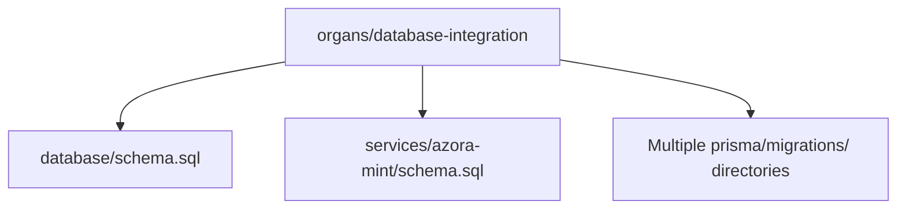

**Diagram sources**
- [DatabaseManager.js](file://organs/database-integration/DatabaseManager.js)
- [schema.sql](file://database/schema.sql)
- [schema.sql](file://services/azora-mint/schema.sql)

**Section sources**
- [DatabaseManager.js](file://organs/database-integration/DatabaseManager.js)
- [schema.sql](file://database/schema.sql)
- [schema.sql](file://services/azora-mint/schema.sql)

## Core Components
The database integration system consists of several core components that work together to provide a unified data access layer. These include the DatabaseManager for connection handling, AnalyticsEngine for data processing, CacheEngine for performance optimization, and SyncEngine for data synchronization between different storage systems. The system leverages Prisma ORM for PostgreSQL operations while providing direct MongoDB and Redis access through their respective clients.

**Section sources**
- [DatabaseManager.js](file://organs/database-integration/DatabaseManager.js)
- [AnalyticsEngine.js](file://organs/database-integration/AnalyticsEngine.js)
- [CacheEngine.js](file://organs/database-integration/CacheEngine.js)
- [SyncEngine.js](file://organs/database-integration/SyncEngine.js)

## Architecture Overview
The database integration architecture follows a multi-database pattern, combining PostgreSQL for relational data, MongoDB for document storage, and Redis for caching and real-time operations. The system uses Prisma ORM as the primary interface for PostgreSQL, providing type-safe database access and migration management. Connection pooling is handled automatically by the underlying database drivers, with connection configuration managed through environment variables.

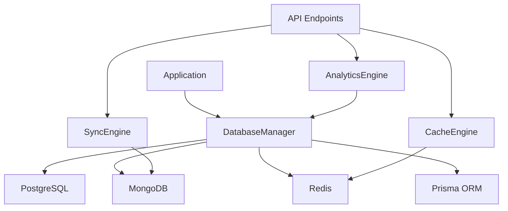

**Diagram sources**
- [DatabaseManager.js](file://organs/database-integration/DatabaseManager.js)
- [AnalyticsEngine.js](file://organs/database-integration/AnalyticsEngine.js)
- [CacheEngine.js](file://organs/database-integration/CacheEngine.js)
- [SyncEngine.js](file://organs/database-integration/SyncEngine.js)

## Detailed Component Analysis

### Database Manager Analysis
The DatabaseManager class serves as the central connection handler for all database systems in Azora OS. It provides methods to connect to PostgreSQL, MongoDB, and Redis, with graceful degradation when specific databases are not configured. The manager maintains connection status and provides a unified interface for accessing the different database clients.

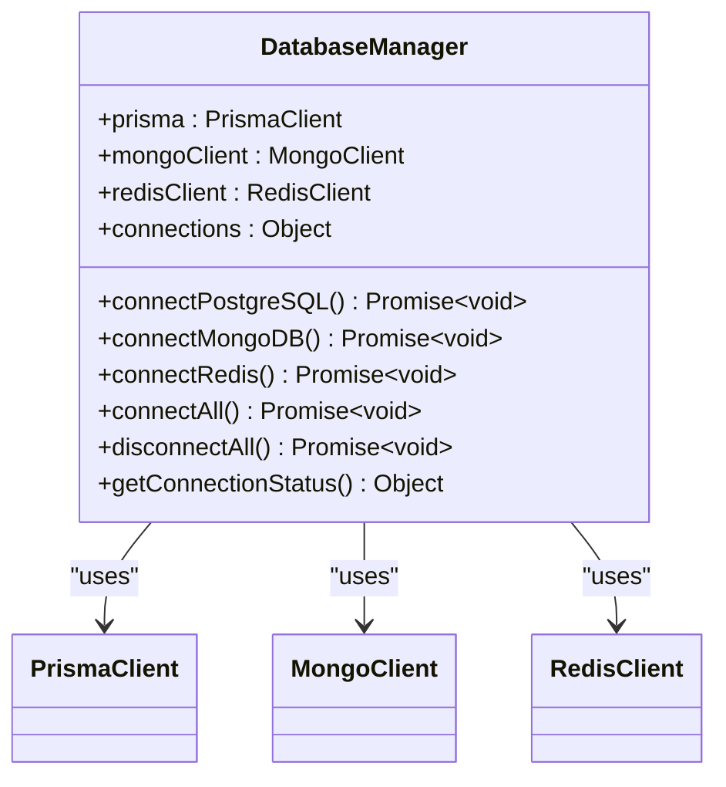

**Diagram sources**
- [DatabaseManager.js](file://organs/database-integration/DatabaseManager.js)

**Section sources**
- [DatabaseManager.js](file://organs/database-integration/DatabaseManager.js)

### Prisma ORM Usage
Prisma ORM is used extensively throughout the Azora OS system for PostgreSQL database operations. Multiple services maintain their own Prisma schemas and migration histories, allowing for service-specific database evolution while maintaining data consistency. The package.json files indicate Prisma version 6.17.1 is used across components, ensuring compatibility and access to the latest features.

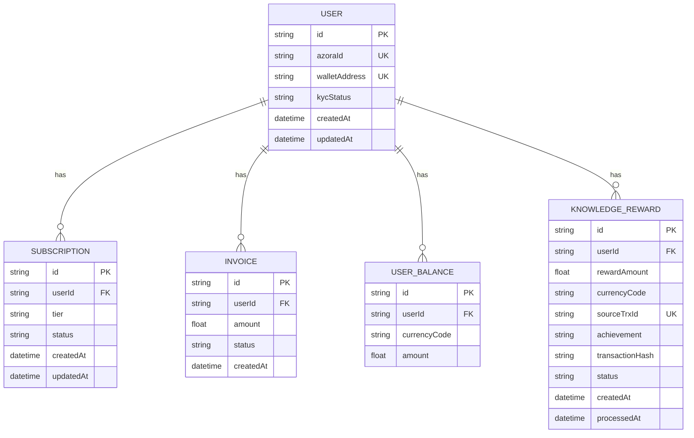

**Diagram sources**
- [migration.sql](file://services/azora-mint/prisma/migrations/20251027215234_init/migration.sql)

**Section sources**
- [package.json](file://organs/database-integration/package.json)
- [migration.sql](file://services/azora-mint/prisma/migrations/20251027215234_init/migration.sql)

### Migration Strategies
The system employs a distributed migration strategy, with each service maintaining its own Prisma migration history. This approach allows for independent evolution of service-specific schemas while preventing migration conflicts. The migration files follow a timestamp-based naming convention (e.g., `20251027215234_init`) to ensure proper ordering and provide clear historical context for schema changes.

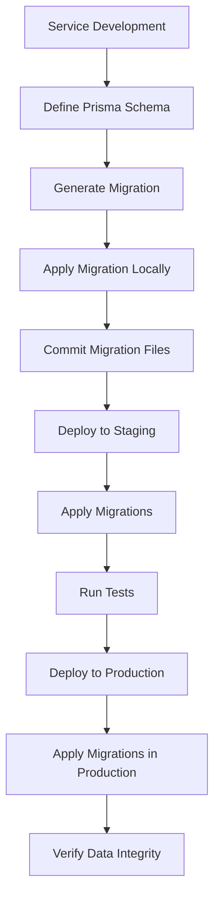

**Section sources**
- [migration.sql](file://services/azora-mint/prisma/migrations/20251027215234_init/migration.sql)
- [migration.sql](file://organs/api-gateway/prisma/migrations/20251020113910_init/migration.sql)
- [migration.sql](file://organs/compliance/prisma/migrations/20251020075522_init/migration.sql)

### Data Access Patterns
The system implements several data access patterns to optimize performance and ensure data consistency. The DatabaseManager provides a unified interface for accessing different database types, while the AnalyticsEngine, CacheEngine, and SyncEngine components handle specialized data operations. The system uses environment variables for database configuration, allowing for flexible deployment across different environments.

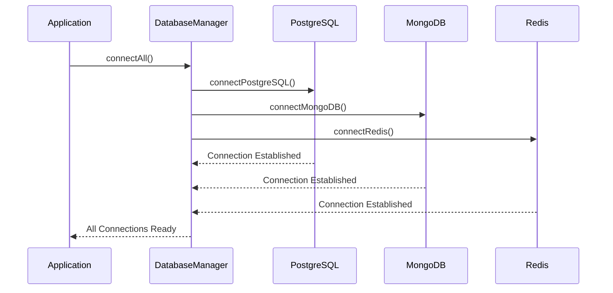

**Diagram sources**
- [DatabaseManager.js](file://organs/database-integration/DatabaseManager.js)

**Section sources**
- [DatabaseManager.js](file://organs/database-integration/DatabaseManager.js)
- [index.js](file://organs/database-integration/index.js)

### Schema Design Patterns
The database schema design follows several consistent patterns across the system. Primary keys use UUIDs for global uniqueness, with appropriate indexes on foreign keys and frequently queried fields. The main schema.sql file includes comprehensive comments and documentation, with constitutional compliance constraints ensuring data integrity. Views are used to simplify complex queries and provide reporting capabilities.

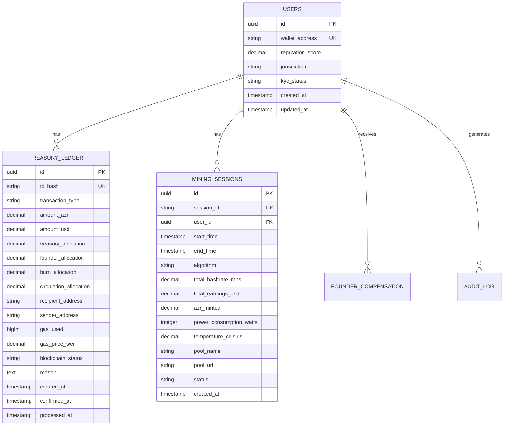

**Diagram sources**
- [schema.sql](file://database/schema.sql)

**Section sources**
- [schema.sql](file://database/schema.sql)

### Query Optimization Techniques
The system employs several query optimization techniques to ensure high performance. These include comprehensive indexing on frequently queried fields, the use of database-specific features like PostgreSQL extensions, and the implementation of caching strategies through Redis. The AnalyticsEngine component provides pre-computed metrics and predictive analytics, reducing the need for complex real-time queries.

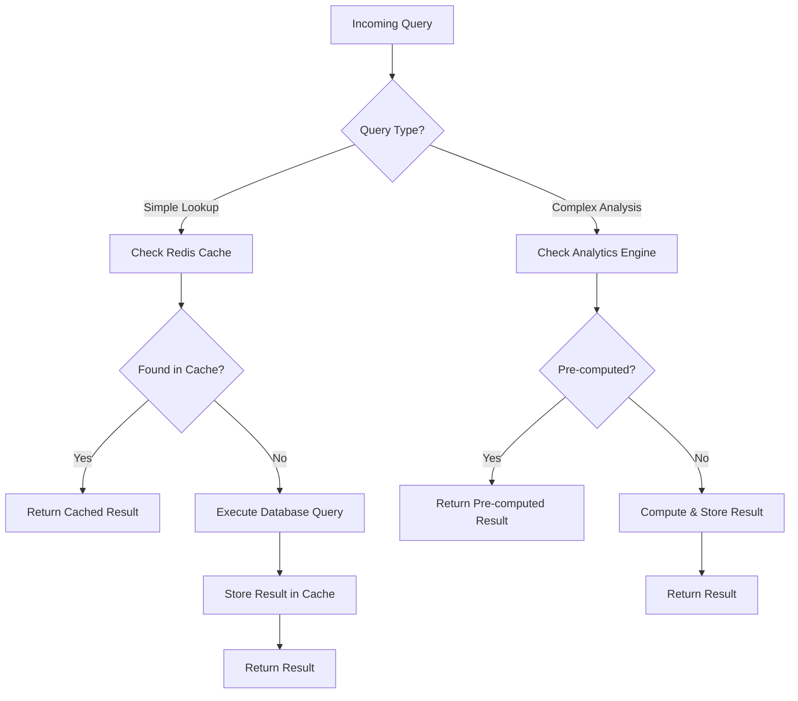

**Diagram sources**
- [AnalyticsEngine.js](file://organs/database-integration/AnalyticsEngine.js)
- [CacheEngine.js](file://organs/database-integration/CacheEngine.js)

**Section sources**
- [AnalyticsEngine.js](file://organs/database-integration/AnalyticsEngine.js)
- [CacheEngine.js](file://organs/database-integration/CacheEngine.js)

### Database Security Considerations
Security is a primary concern in the database design, with multiple layers of protection implemented. The system uses environment variables for sensitive configuration, preventing credentials from being stored in code. Row-level security is enabled on sensitive tables, and comprehensive audit logging tracks all system actions. The DatabaseManager implements graceful degradation when connections fail, ensuring system availability even when individual database services are unavailable.

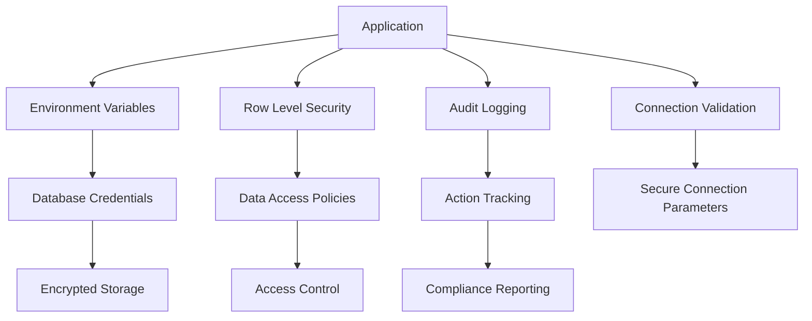

**Section sources**
- [DatabaseManager.js](file://organs/database-integration/DatabaseManager.js)
- [schema.sql](file://database/schema.sql)

### Connection Pooling Strategies
The system relies on the built-in connection pooling capabilities of the underlying database drivers. The DatabaseManager class manages connection lifecycle, with automatic reconnection attempts and status monitoring. For PostgreSQL, Prisma Client handles connection pooling internally, while MongoDB and Redis connections are managed directly through their respective clients with configurable timeout and retry parameters.

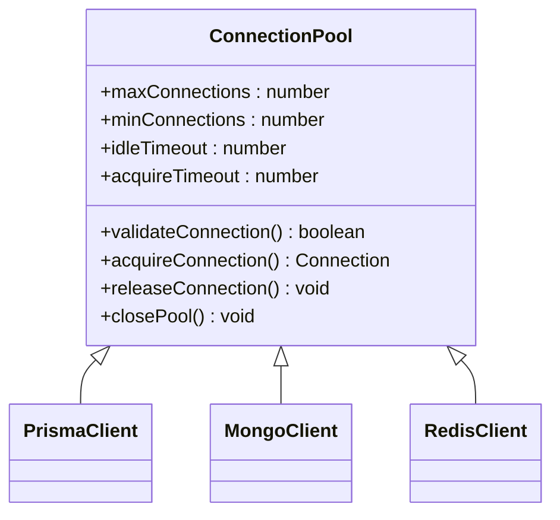

**Section sources**
- [DatabaseManager.js](file://organs/database-integration/DatabaseManager.js)

### Performance Tuning Approaches
Performance tuning in the system focuses on several key areas: query optimization through proper indexing, efficient data access patterns, and strategic caching. The system monitors database performance through the system_health table and alerts components, allowing for proactive identification and resolution of performance issues. Regular schema reviews and index optimization are performed to maintain optimal query performance as data volumes grow.

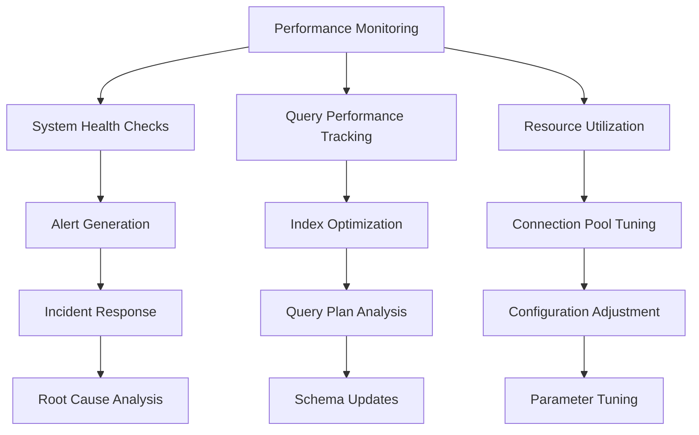

**Section sources**
- [schema.sql](file://database/schema.sql)
- [AnalyticsEngine.js](file://organs/database-integration/AnalyticsEngine.js)

## Dependency Analysis
The database integration system has dependencies on several key packages, including Prisma Client, MongoDB, Redis, and PostgreSQL drivers. These dependencies are managed through npm and specified in the package.json files. The system is designed to function with optional database backends, allowing for deployment flexibility based on infrastructure requirements.

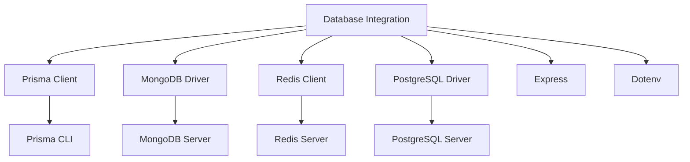

**Diagram sources**
- [package.json](file://organs/database-integration/package.json)

**Section sources**
- [package.json](file://organs/database-integration/package.json)

## Performance Considerations
The database integration system is designed with performance as a primary consideration. The use of Redis for caching significantly reduces database load for frequently accessed data, while the AnalyticsEngine pre-computes complex metrics to avoid expensive real-time calculations. Connection pooling and efficient query patterns ensure optimal resource utilization, and the system includes comprehensive monitoring to identify and address performance bottlenecks.

## Troubleshooting Guide
When troubleshooting database integration issues, first check the health endpoint (/health) to verify database connection status. Review the connection logs in the DatabaseManager for specific error messages. For performance issues, examine the cache statistics and query patterns. When migration issues occur, verify that the Prisma schema matches the database state and check for any pending migrations that need to be applied.

**Section sources**
- [DatabaseManager.js](file://organs/database-integration/DatabaseManager.js)
- [index.js](file://organs/database-integration/index.js)

## Conclusion
The Azora OS database integration system provides a robust, scalable foundation for data management across the platform. By combining multiple database technologies with a unified interface, the system offers flexibility, performance, and reliability. The use of Prisma ORM simplifies database operations while ensuring type safety and migration management. With comprehensive security measures, performance optimization, and monitoring capabilities, the system is well-equipped to support the evolving needs of the Azora ecosystem.