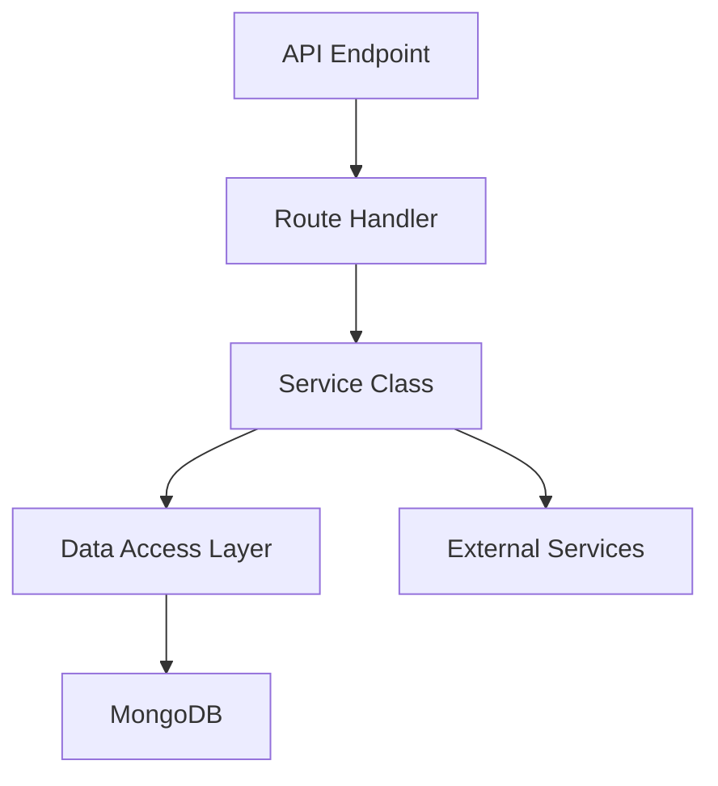
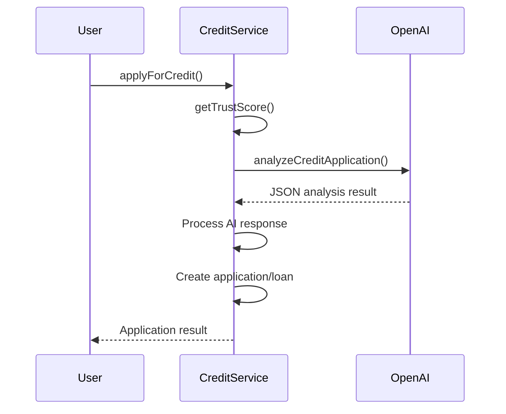
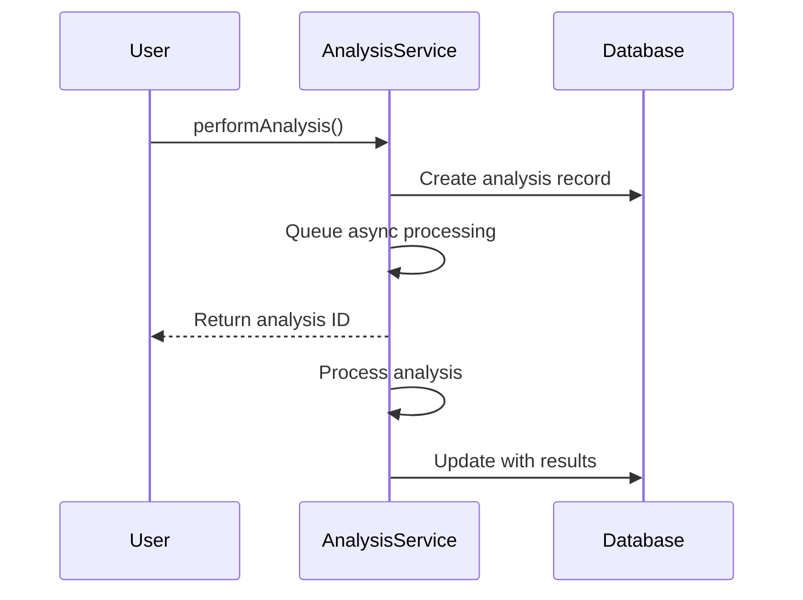
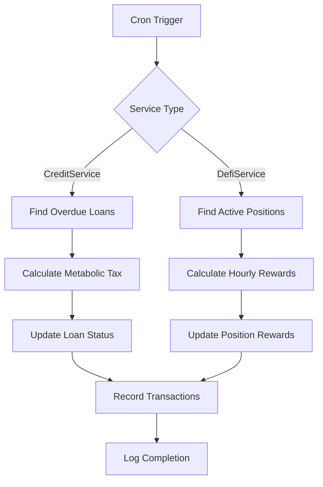
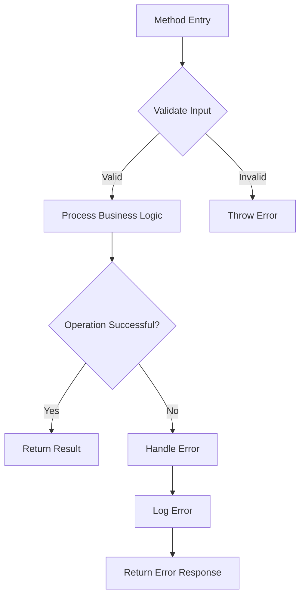

# Business Logic Organization

<cite>
**Referenced Files in This Document**   
- [CreditService.ts](file://services/azora-mint/src/services/CreditService.ts)
- [DefiService.ts](file://services/azora-mint/src/services/DefiService.ts)
- [AnalysisService.ts](file://services/azora-nexus/src/services/AnalysisService.ts)
</cite>

## Table of Contents
1. [Introduction](#introduction)
2. [Service Layer Architecture](#service-layer-architecture)
3. [Core Service Components](#core-service-components)
4. [Business Logic Implementation Patterns](#business-logic-implementation-patterns)
5. [Data Validation and Error Handling](#data-validation-and-error-handling)
6. [Transaction Management](#transaction-management)
7. [API Endpoint Relationships](#api-endpoint-relationships)
8. [Testing and Dependency Management](#testing-and-dependency-management)
9. [Best Practices](#best-practices)
10. [Conclusion](#conclusion)

## Introduction
The Azora OS services implement a well-defined service layer pattern that separates business logic from route handling and data access concerns. This documentation details how business logic is organized within the CreditService, DefiService, and AnalysisService, following the service layer pattern to ensure maintainability, testability, and separation of concerns. The architecture promotes clean boundaries between components while enabling complex business rules to be implemented and maintained effectively.

## Service Layer Architecture
The service layer in Azora OS follows a clear separation of concerns between route handlers, service classes, and data access components. Service classes encapsulate business logic and act as intermediaries between API endpoints and data persistence layers. This pattern ensures that business rules are centralized and reusable across different entry points.

The architecture follows a three-tier pattern where:
- Route handlers receive HTTP requests and validate input
- Service classes implement business logic and coordinate operations
- Data access components (Mongoose models) handle persistence

This separation allows business logic to be tested independently of HTTP concerns and enables multiple endpoints to share the same underlying business rules.

**Diagram sources**
- [CreditService.ts](file://services/azora-mint/src/services/CreditService.ts)
- [DefiService.ts](file://services/azora-mint/src/services/DefiService.ts)

**Section sources**
- [CreditService.ts](file://services/azora-mint/src/services/CreditService.ts)
- [DefiService.ts](file://services/azora-mint/src/services/DefiService.ts)

## Core Service Components

### CreditService
The CreditService implements micro-credit functionality with AI-driven approval processes. It manages credit applications, loan creation, repayments, and trust score calculations. The service coordinates between multiple data models including credit applications, loans, repayments, and trust scores.

Key responsibilities include:
- Processing credit applications with AI analysis
- Managing loan lifecycle from creation to repayment
- Calculating and maintaining user trust scores
- Handling autonomous collection of metabolic tax

The service integrates with OpenAI for creditworthiness analysis and uses cron jobs for automated collection processes.

### DefiService
The DefiService provides decentralized finance functionality including staking, liquidity mining, and yield farming. It manages user positions in various DeFi pools and handles deposit, withdrawal, and reward distribution operations.

Key responsibilities include:
- Managing DeFi pool configurations and availability
- Processing user deposits and withdrawals
- Calculating and distributing yield rewards
- Maintaining position and reward records

The service uses hourly cron jobs to distribute yield rewards and maintains accurate accounting of user positions and earnings.

### AnalysisService
The AnalysisService performs various types of user behavior analysis including behavioral, predictive, comparative, and trend analysis. It leverages AI to generate insights from user data and supports asynchronous processing of complex analytical tasks.

Key responsibilities include:
- Coordinating different analysis types based on user requests
- Gathering relevant data from multiple sources
- Performing AI-assisted analysis and insight generation
- Managing analysis lifecycle and status tracking

The service supports multiple analysis types with specialized algorithms and provides structured results with metrics and confidence scores.

**Section sources**
- [CreditService.ts](file://services/azora-mint/src/services/CreditService.ts#L15-L389)
- [DefiService.ts](file://services/azora-mint/src/services/DefiService.ts#L15-L277)
- [AnalysisService.ts](file://services/azora-nexus/src/services/AnalysisService.ts#L15-L435)

## Business Logic Implementation Patterns

### AI-Driven Decision Making
The CreditService demonstrates AI-driven decision making by integrating with OpenAI to analyze credit applications. The service constructs prompts with user trust scores and application details, then parses AI responses to determine approval decisions, suggested amounts, interest rates, and terms.

**Diagram sources**
- [CreditService.ts](file://services/azora-mint/src/services/CreditService.ts#L150-L200)

### Asynchronous Processing
The AnalysisService implements asynchronous processing for computationally intensive tasks. When a user requests analysis, the service creates a record with "processing" status and returns immediately, allowing the client to poll for results.

**Diagram sources**
- [AnalysisService.ts](file://services/azora-nexus/src/services/AnalysisService.ts#L50-L100)

### Cron-Based Automation
Both CreditService and DefiService use cron jobs for automated processes. The CreditService runs daily autonomous collection, while DefiService runs hourly yield distribution.

**Diagram sources**
- [CreditService.ts](file://services/azora-mint/src/services/CreditService.ts#L350-L389)
- [DefiService.ts](file://services/azora-mint/src/services/DefiService.ts#L250-L277)

## Data Validation and Error Handling

### Input Validation
Services implement comprehensive input validation to ensure data integrity. The DefiService validates deposit amounts and pool availability, while CreditService validates application parameters.

**Diagram sources**
- [DefiService.ts](file://services/azora-mint/src/services/DefiService.ts#L70-L90)
- [CreditService.ts](file://services/azora-mint/src/services/CreditService.ts#L110-L130)

### Error Handling Strategy
The services follow a consistent error handling strategy with try-catch blocks around critical operations and meaningful error messages. Errors are logged with context and rethrown for route handlers to convert to appropriate HTTP responses.

Common error handling patterns include:
- Validating preconditions before operations
- Using specific error messages for different failure modes
- Logging errors with relevant context
- Providing fallback mechanisms when external services fail

**Section sources**
- [CreditService.ts](file://services/azora-mint/src/services/CreditService.ts#L100-L389)
- [DefiService.ts](file://services/azora-mint/src/services/DefiService.ts#L60-L277)

## Transaction Management
While the services don't use traditional database transactions, they implement atomic operations through careful sequencing of database updates. The CreditService ensures consistency by updating related records in the correct order.

For example, when processing a repayment:
1. Validate loan existence and status
2. Calculate metabolic tax and actual payment
3. Update loan balance and status
4. Calculate next payment date
5. Save updated loan record
6. Create repayment record

This sequential approach ensures data consistency even without multi-document transactions. The services rely on MongoDB's document-level atomicity and careful operation ordering to maintain data integrity.

**Section sources**
- [CreditService.ts](file://services/azora-mint/src/services/CreditService.ts#L250-L300)

## API Endpoint Relationships
Service methods map directly to API endpoints, with route handlers delegating to service classes after initial validation. Each service method represents a discrete business operation that can be exposed through one or more endpoints.

For example, the CreditService methods correspond to endpoints like:
- `applyForCredit()` → POST /api/credit/apply
- `getUserApplications()` → GET /api/credit/applications
- `makeRepayment()` → POST /api/credit/repayment

This direct mapping makes the relationship between business logic and API surface clear and maintainable. The service layer acts as a stable contract that can be exposed through different transport mechanisms if needed.

**Section sources**
- [CreditService.ts](file://services/azora-mint/src/services/CreditService.ts)
- [DefiService.ts](file://services/azora-mint/src/services/DefiService.ts)

## Testing and Dependency Management

### Dependency Injection
Services use constructor-based dependency injection for external services like OpenAI. This pattern enables easy testing by allowing mock implementations to be injected during tests.

The services have minimal dependencies, primarily relying on:
- Mongoose for data access
- Node-cron for scheduling
- OpenAI for AI analysis (CreditService and AnalysisService)

### Interface Segregation
Each service exposes a focused interface with methods grouped by functionality. The interfaces are designed to be consumed by route handlers and other services, with clear method names and parameters.

For testability, services avoid static methods and global state, making them easy to instantiate with test configurations. The separation of concerns enables unit testing of business logic without requiring database or network connections.

**Section sources**
- [CreditService.ts](file://services/azora-mint/src/services/CreditService.ts#L15-L50)
- [AnalysisService.ts](file://services/azora-nexus/src/services/AnalysisService.ts#L15-L50)

## Best Practices

### Separation of Concerns
The services strictly separate different concerns:
- Public methods handle business operations
- Private methods implement internal logic
- Data access is handled through Mongoose models
- External service integration is encapsulated

### Single Responsibility Principle
Each service has a well-defined scope:
- CreditService focuses on credit lifecycle management
- DefiService manages DeFi operations
- AnalysisService handles analytical processing

### Error Resilience
Services implement fallback mechanisms, particularly when integrating with external AI services. The CreditService uses rule-based decisions when AI analysis fails, ensuring the system remains operational.

### Performance Considerations
Services optimize database operations by:
- Using appropriate indexing
- Minimizing round trips
- Using batch operations when possible
- Implementing efficient queries

## Conclusion
The business logic organization in Azora OS services follows established patterns that promote maintainability, testability, and scalability. By implementing the service layer pattern with clear separation of concerns, the services provide robust implementations of complex business rules while remaining accessible for testing and modification. The consistent approach across CreditService, DefiService, and AnalysisService demonstrates a mature architecture that can serve as a model for future service development.