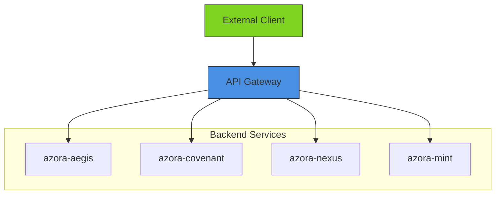
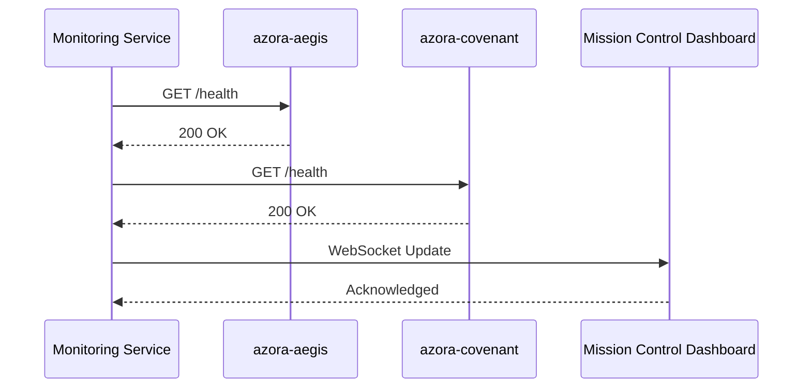
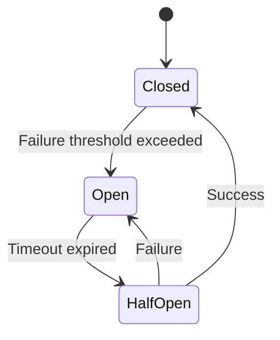
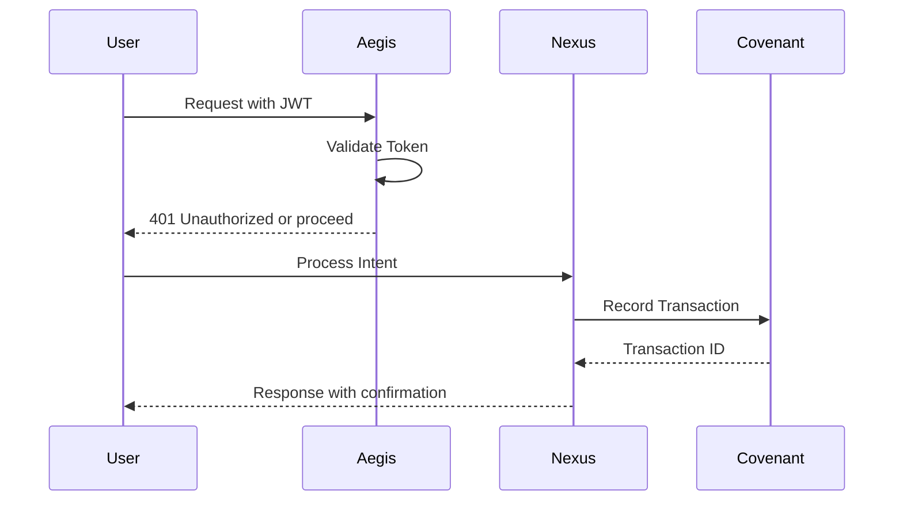

# Inter-Service Communication

<cite>
**Referenced Files in This Document**   
- [api-gateway-complete.js](file://infrastructure/api-gateway-complete.js)
- [api-gateway.yaml](file://infrastructure/k8s/api-gateway.yaml)
- [event-bus/index.js](file://organs/event-bus/index.js)
- [monitoring/index.js](file://organs/monitoring/index.js)
- [elara-supreme-orchestrator.ts](file://genome/agent-tools/elara-supreme-orchestrator.ts)
- [azora-aegis/index.js](file://services/azora-aegis/index.js)
- [azora-covenant/server.js](file://services/azora-covenant/server.js)
- [azora-nexus/neuralIntent.js](file://services/azora-nexus/neuralIntent.js)
</cite>

## Table of Contents
1. [Introduction](#introduction)
2. [Communication Patterns](#communication-patterns)
3. [API Gateway and Service Routing](#api-gateway-and-service-routing)
4. [Service Discovery and Health Monitoring](#service-discovery-and-health-monitoring)
5. [Event-Driven Architecture with Message Queues](#event-driven-architecture-with-message-queues)
6. [Resilience and Fault Tolerance](#resilience-and-fault-tolerance)
7. [Integration Examples: Aegis, Covenant, and NeuralIntentService](#integration-examples-aegis-covenant-and-neuralintentservice)
8. [Best Practices for Inter-Service Communication](#best-practices-for-inter-service-communication)
9. [Conclusion](#conclusion)

## Introduction
Inter-service communication in Azora OS is designed to support a highly distributed, resilient, and scalable microservices architecture. The system leverages multiple communication patterns including direct HTTP calls, message queues, and event-driven architectures to ensure reliable and efficient interaction between services such as aegis, covenant, and NeuralIntentService. This document details the integration points, failure handling mechanisms, service discovery, and best practices that enable robust distributed communication across the Azora ecosystem.

## Communication Patterns
Azora OS employs a hybrid communication model combining synchronous and asynchronous patterns. Direct HTTP calls are used for real-time request-response interactions, while message queues and event buses facilitate decoupled, asynchronous communication. The event-driven architecture allows services to react to state changes without tight coupling, enhancing system resilience and scalability.

**Section sources**
- [event-bus/index.js](file://organs/event-bus/index.js)
- [api-gateway-complete.js](file://infrastructure/api-gateway-complete.js)

## API Gateway and Service Routing
The API gateway serves as the entry point for all external requests, routing them to appropriate backend services. Implemented using Tyk Gateway in Kubernetes, it provides rate limiting, authentication, and request transformation capabilities. The gateway configuration ensures secure and efficient routing while maintaining visibility into API traffic.



**Diagram sources**
- [api-gateway.yaml](file://infrastructure/k8s/api-gateway.yaml)
- [api-gateway-complete.js](file://infrastructure/api-gateway-complete.js)

## Service Discovery and Health Monitoring
Service discovery in Azora OS is implemented through a combination of Kubernetes service discovery and custom health monitoring. The monitoring service periodically checks the health of all microservices by querying their `/health` endpoints and broadcasts status updates via WebSocket connections. This enables real-time visibility into service availability and facilitates automated failover decisions.



**Diagram sources**
- [monitoring/index.js](file://organs/monitoring/index.js)
- [azora-aegis/index.js](file://services/azora-aegis/index.js)
- [azora-covenant/server.js](file://services/azora-covenant/server.js)

**Section sources**
- [monitoring/index.js](file://organs/monitoring/index.js)

## Event-Driven Architecture with Message Queues
The event-driven architecture in Azora OS is centered around a robust event bus implementation that supports multiple message brokers including Kafka, RabbitMQ, and Redis pub/sub. Events are published with standardized metadata and routed based on event type patterns. The system implements CQRS (Command Query Responsibility Segregation) and event sourcing patterns to maintain data consistency across services.

```mermaid
flowchart TD
Producer[Event Producer] --> |Publish| EventBus[Event Bus]
EventBus --> |Kafka| Kafka[Kafka Cluster]
EventBus --> |RabbitMQ| RabbitMQ[RabbitMQ Cluster]
EventBus --> |Redis| Redis[Redis Pub/Sub]
Kafka --> Consumer1[Service A]
RabbitMQ --> Consumer2[Service B]
Redis --> Consumer3[Service C]
class Kafka,RabbitMQ,Redis,Bus style fill:#F8E71C,stroke:#333
```

**Diagram sources**
- [event-bus/index.js](file://organs/event-bus/index.js)

**Section sources**
- [event-bus/index.js](file://organs/event-bus/index.js)

## Resilience and Fault Tolerance
Azora OS implements comprehensive resilience patterns including circuit breakers, retries with exponential backoff, and dead letter queues. The circuit breaker pattern prevents cascading failures by temporarily halting requests to failing services. Failed events are stored in a dead letter queue for later processing, ensuring no data loss during transient failures.



**Diagram sources**
- [event-bus/index.js](file://organs/event-bus/index.js)

## Integration Examples: Aegis, Covenant, and NeuralIntentService
The integration between aegis (security), covenant (blockchain), and NeuralIntentService (AI intent recognition) demonstrates the communication patterns in practice. Aegis authenticates requests before they reach other services, covenant records transactions immutably, and NeuralIntentService processes user intents through the azora-nexus service. These services communicate via both direct API calls and event notifications.



**Diagram sources**
- [azora-aegis/index.js](file://services/azora-aegis/index.js)
- [azora-covenant/server.js](file://services/azora-covenant/server.js)
- [azora-nexus/neuralIntent.js](file://services/azora-nexus/neuralIntent.js)

**Section sources**
- [azora-aegis/index.js](file://services/azora-aegis/index.js)
- [azora-covenant/server.js](file://services/azora-covenant/server.js)
- [azora-nexus/neuralIntent.js](file://services/azora-nexus/neuralIntent.js)

## Best Practices for Inter-Service Communication
Azora OS follows several best practices for inter-service communication:
- **Standardized APIs**: All services expose consistent RESTful interfaces with proper error handling
- **Timeouts and Retries**: Configured with appropriate timeouts and retry policies
- **Circuit Breaking**: Implemented to prevent cascading failures
- **Monitoring and Tracing**: Comprehensive logging and distributed tracing enabled
- **Schema Validation**: Events and API payloads are validated against defined schemas
- **Security**: All communications are secured with authentication and encryption

These practices ensure reliable communication even under adverse network conditions and service failures.

**Section sources**
- [elara-supreme-orchestrator.ts](file://genome/agent-tools/elara-supreme-orchestrator.ts)
- [event-bus/index.js](file://organs/event-bus/index.js)

## Conclusion
Inter-service communication in Azora OS is designed with resilience, scalability, and maintainability as core principles. By combining multiple communication patterns, implementing robust service discovery, and following proven resilience patterns, the system ensures reliable operation across its distributed microservices architecture. The integration of services like aegis, covenant, and NeuralIntentService demonstrates how these patterns work together to create a cohesive and fault-tolerant system.