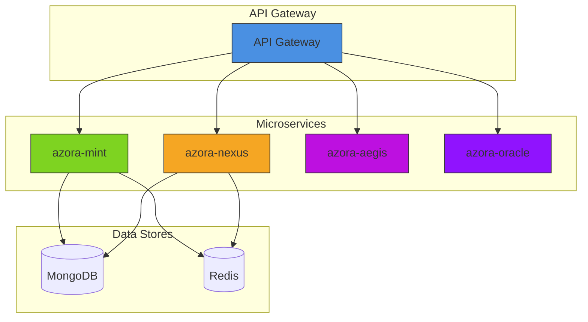
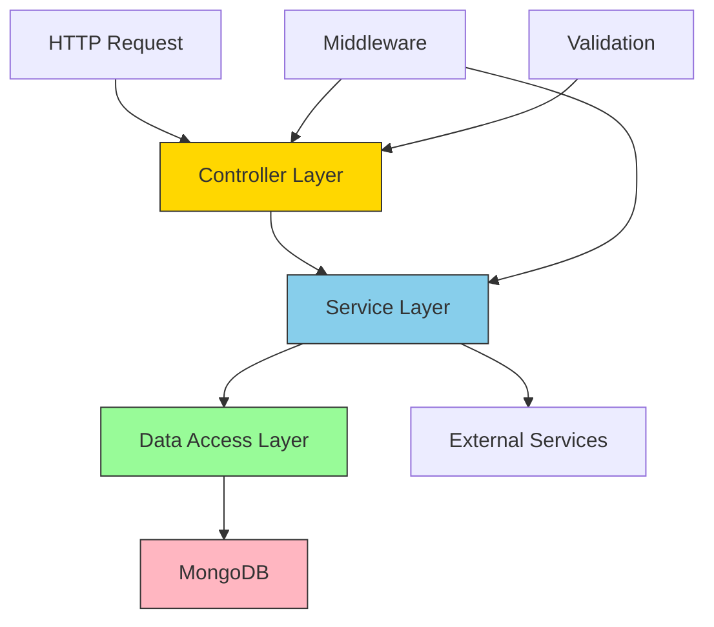
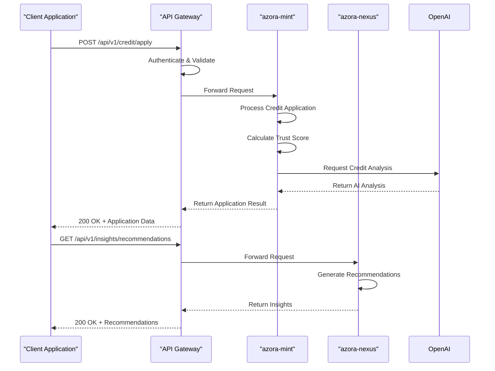

# Service Implementation

<cite>
**Referenced Files in This Document**   
- [creditService.ts](file://services/azora-mint/src/services/creditService.ts)
- [server.js](file://services/azora-mint/server.js)
- [index.ts](file://services/azora-nexus/src/index.ts)
- [api-gateway.yaml](file://infrastructure/k8s/api-gateway.yaml)
- [azora-mint/src/services](file://services/azora-mint/src/services)
- [azora-nexus/src/services](file://services/azora-nexus/src/services)
</cite>

## Table of Contents
1. [Introduction](#introduction)
2. [Microservices Architecture Overview](#microservices-architecture-overview)
3. [Service Structure and Layering](#service-structure-and-layering)
4. [Core Service Components](#core-service-components)
5. [Service Communication and API Gateway Integration](#service-communication-and-api-gateway-integration)
6. [Dependency Management and External Integrations](#dependency-management-and-external-integrations)
7. [Error Handling and Resilience Patterns](#error-handling-and-resilience-patterns)
8. [Best Practices for Service Development](#best-practices-for-service-development)
9. [Conclusion](#conclusion)

## Introduction
This document provides a comprehensive overview of service implementation within Azora OS, focusing on the microservices architecture and implementation patterns used across key services such as azora-mint and azora-nexus. The documentation details the structural organization of service components including controllers, services, and data access layers, while explaining how business logic is organized and executed. It also covers the relationship between services and the API gateway, addresses common implementation challenges, and provides best practices for developing maintainable and testable service code.

## Microservices Architecture Overview
Azora OS implements a distributed microservices architecture where each service operates independently with its own technology stack, data storage, and deployment lifecycle. Services such as azora-mint (credit and financial services) and azora-nexus (AI-driven insights and analysis) are deployed as separate units, communicating through well-defined APIs. The architecture leverages Kubernetes for orchestration, with each service containerized and managed through YAML manifests in the infrastructure/k8s directory. This design enables independent scaling, fault isolation, and technology diversity across services.

**Diagram sources**
- [api-gateway.yaml](file://infrastructure/k8s/api-gateway.yaml)
- [azora-mint](file://services/azora-mint)
- [azora-nexus](file://services/azora-nexus)

**Section sources**
- [api-gateway.yaml](file://infrastructure/k8s/api-gateway.yaml)

## Service Structure and Layering
The service components in Azora OS follow a clean architectural pattern with distinct layers for separation of concerns. Each service implements a standard directory structure that includes controllers, services, models, routes, and middleware. The controller layer handles HTTP request processing and response formatting, while the service layer contains the core business logic. Data access is managed through models that interface with MongoDB collections. This layered approach ensures that business logic remains decoupled from transport concerns and data persistence mechanisms.

**Diagram sources**
- [azora-mint/src](file://services/azora-mint/src)
- [azora-nexus/src](file://services/azora-nexus/src)

**Section sources**
- [azora-mint/src](file://services/azora-mint/src)
- [azora-nexus/src](file://services/azora-nexus/src)

## Core Service Components

### azora-mint Service Implementation
The azora-mint service implements a comprehensive credit management system with AI-driven decision making. The CreditService class encapsulates the core business logic for credit applications, loan management, and repayment processing. It integrates with OpenAI to analyze creditworthiness based on user trust scores and application details. The service calculates trust scores using multiple factors including transaction history, social connections, reputation, financial stability, and community engagement, with each factor contributing to an overall score that influences credit decisions.

**Section sources**
- [creditService.ts](file://services/azora-mint/src/services/creditService.ts)

### azora-nexus Service Implementation
The azora-nexus service provides AI-powered analysis and insights through specialized service classes such as AnalysisService, InsightService, NeuralIntentService, and RecommendationService. These services process user data and behavioral patterns to generate actionable intelligence. The architecture supports neural intent recognition and self-improving mesh capabilities, allowing the system to evolve its understanding of user needs over time. The service layer abstracts complex AI operations behind clean interfaces that can be consumed by controllers and external systems.

**Section sources**
- [azora-nexus/src/services](file://services/azora-nexus/src/services)

## Service Communication and API Gateway Integration
Services in Azora OS communicate through RESTful APIs that are exposed through a centralized API gateway. The API gateway (defined in api-gateway.yaml) acts as the single entry point for all client requests, handling routing, authentication, rate limiting, and request transformation. Each service exposes its endpoints under specific path prefixes, with the gateway forwarding requests to the appropriate service instances. This pattern provides a unified interface to clients while enabling independent evolution of backend services. The gateway also implements cross-cutting concerns such as logging, monitoring, and security policies consistently across all services.

**Diagram sources**
- [api-gateway.yaml](file://infrastructure/k8s/api-gateway.yaml)
- [creditService.ts](file://services/azora-mint/src/services/creditService.ts)

**Section sources**
- [api-gateway.yaml](file://infrastructure/k8s/api-gateway.yaml)

## Dependency Management and External Integrations
The services in Azora OS manage dependencies through standard package.json files and leverage various external integrations to enhance functionality. The azora-mint service depends on mongoose for MongoDB interactions, node-cron for scheduled tasks, and OpenAI for AI-powered credit analysis. Dependencies are explicitly declared and versioned to ensure reproducible builds. The architecture supports both synchronous and asynchronous communication patterns, with services able to invoke external APIs directly or through message queues for decoupled processing. The autonomous collection system in azora-mint uses cron scheduling to execute daily operations, demonstrating how time-based workflows are implemented within the service layer.

**Section sources**
- [creditService.ts](file://services/azora-mint/src/services/creditService.ts)
- [package.json](file://services/azora-mint/package.json)
- [package.json](file://services/azora-nexus/package.json)

## Error Handling and Resilience Patterns
Azora OS services implement comprehensive error handling strategies to ensure system reliability and graceful degradation. Each service includes dedicated middleware for error handling, request logging, and metrics collection. The credit service in azora-mint demonstrates a robust error handling pattern by implementing fallback mechanisms when external dependencies fail—in the case of OpenAI unavailability, the system reverts to rule-based credit decisions based on trust scores. All critical operations are wrapped in try-catch blocks with appropriate error logging, and meaningful error messages are returned to clients while sensitive implementation details are concealed. The architecture also includes health check endpoints that allow monitoring systems to verify service availability.

**Section sources**
- [creditService.ts](file://services/azora-mint/src/services/creditService.ts)
- [middleware/errorHandler.ts](file://services/azora-mint/src/middleware/errorHandler.ts)
- [server.js](file://services/azora-mint/server.js)

## Best Practices for Service Development
The implementation of services in Azora OS follows several best practices for building maintainable and testable code:

1. **Separation of Concerns**: Clear division between controllers (HTTP handling), services (business logic), and data access layers
2. **Dependency Injection**: Services are instantiated with their dependencies, facilitating testing and flexibility
3. **Configuration Management**: Environment-specific settings are externalized through configuration files
4. **Comprehensive Logging**: Structured logging is implemented throughout the codebase for debugging and monitoring
5. **API Documentation**: Swagger configuration is included for API documentation and testing
6. **Health Monitoring**: Built-in health check endpoints provide operational visibility
7. **Scheduled Operations**: Time-based workflows are implemented using reliable scheduling libraries
8. **Fallback Mechanisms**: Critical functionality includes fallback strategies for external dependency failures

These practices ensure that services are modular, testable, and resilient to failures, while supporting independent development and deployment cycles.

**Section sources**
- [azora-mint/src](file://services/azora-mint/src)
- [azora-nexus/src](file://services/azora-nexus/src)
- [server.js](file://services/azora-mint/server.js)

## Conclusion
The service implementation in Azora OS demonstrates a mature microservices architecture with well-defined patterns for structuring service components, managing dependencies, and ensuring reliability. The azora-mint and azora-nexus services exemplify how business logic can be organized into maintainable layers with clear responsibilities. The integration with the API gateway provides a unified entry point while allowing services to evolve independently. By following best practices for error handling, dependency management, and operational monitoring, the architecture supports the development of robust, scalable, and maintainable services that can adapt to changing requirements and workloads.