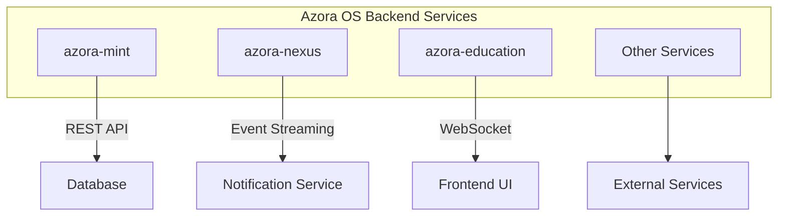
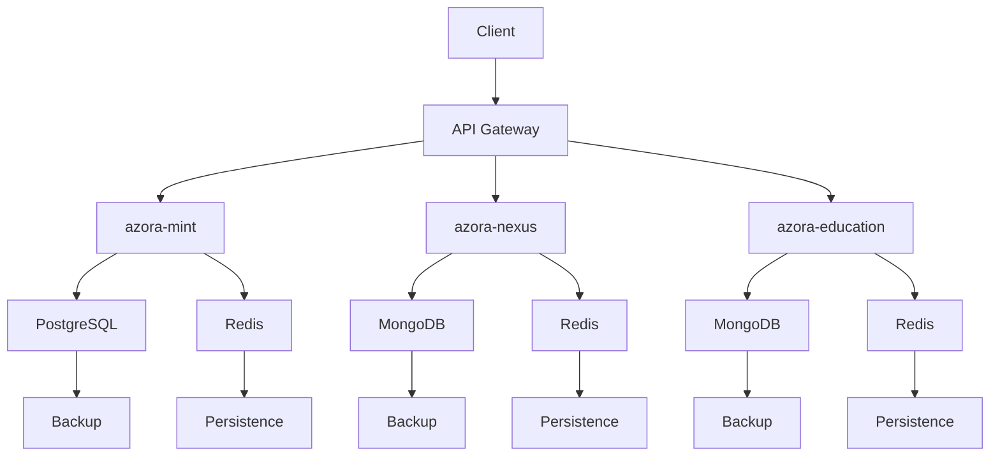
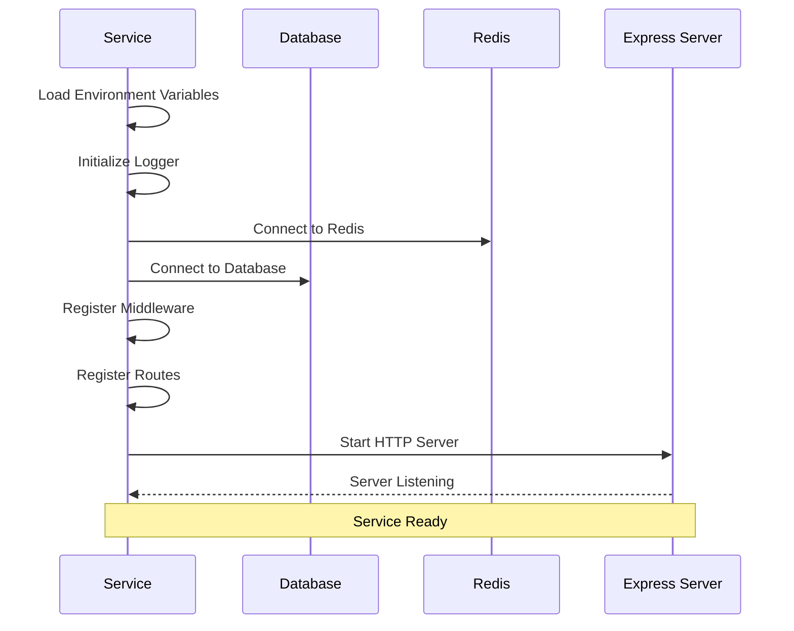
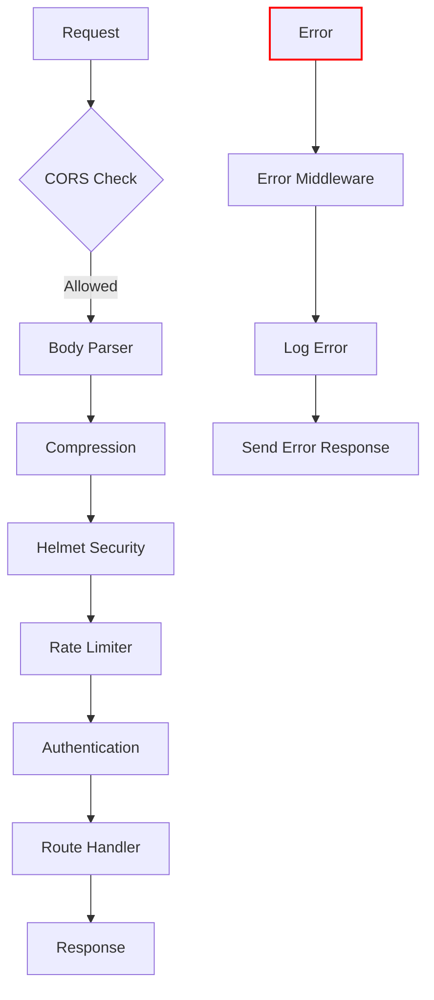
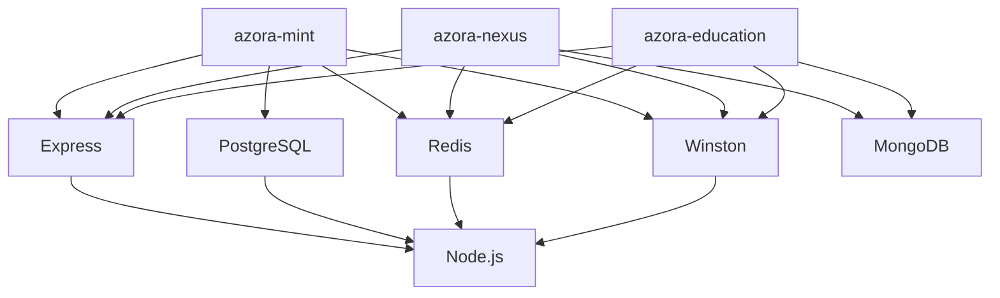

# Service Patterns

<cite>
**Referenced Files in This Document**   
- [azora-mint/index.js](file://services/azora-mint/index.js)
- [azora-mint/package.json](file://services/azora-mint/package.json)
- [azora-nexus/index.js](file://services/azora-nexus/index.js)
- [azora-nexus/package.json](file://services/azora-nexus/package.json)
- [azora-education/index.js](file://services/azora-education/index.js)
- [azora-education/package.json](file://services/azora-education/package.json)
</cite>

## Table of Contents
1. [Introduction](#introduction)
2. [Project Structure](#project-structure)
3. [Core Components](#core-components)
4. [Architecture Overview](#architecture-overview)
5. [Detailed Component Analysis](#detailed-component-analysis)
6. [Dependency Analysis](#dependency-analysis)
7. [Performance Considerations](#performance-considerations)
8. [Troubleshooting Guide](#troubleshooting-guide)
9. [Conclusion](#conclusion)

## Introduction
This document provides a comprehensive analysis of the service patterns used across Azora OS backend services, focusing on architectural consistency, initialization sequences, and deployment configurations. The analysis covers key services such as azora-mint, azora-nexus, and azora-education, highlighting common patterns in Express.js/Node.js server structuring, middleware usage, routing, and error handling. The document also examines package.json configurations and Docker deployment strategies, addressing critical aspects like environment variable management, graceful shutdown, and health check implementation.

## Project Structure
The Azora OS backend services follow a microservices architecture with each service residing in its own directory under the services/ folder. Each service maintains its own package.json, Dockerfile, and configuration files, enabling independent development, testing, and deployment. The services are designed to be loosely coupled and highly cohesive, with clear boundaries and well-defined interfaces. This structure facilitates scalability, maintainability, and resilience across the platform.

**Diagram sources**
- [azora-mint/index.js](file://services/azora-mint/index.js)
- [azora-nexus/index.js](file://services/azora-nexus/index.js)
- [azora-education/index.js](file://services/azora-education/index.js)

**Section sources**
- [azora-mint/index.js](file://services/azora-mint/index.js)
- [azora-nexus/index.js](file://services/azora-nexus/index.js)
- [azora-education/index.js](file://services/azora-education/index.js)

## Core Components
The core components of Azora OS backend services include Express.js servers, database connectors, caching mechanisms, and event-driven architectures. Each service implements a consistent pattern of initialization, configuration management, and lifecycle handling. The services leverage modern JavaScript features, including ES modules, async/await patterns, and robust error handling. Common components across services include logging with Winston, rate limiting, CORS configuration, and security headers through Helmet.

**Section sources**
- [azora-mint/index.js](file://services/azora-mint/index.js)
- [azora-nexus/index.js](file://services/azora-nexus/index.js)
- [azora-education/index.js](file://services/azora-education/index.js)

## Architecture Overview
The architecture of Azora OS backend services follows a layered approach with clear separation of concerns. Each service exposes REST APIs through Express.js, with middleware handling cross-cutting concerns such as authentication, logging, and rate limiting. The services connect to various data stores including PostgreSQL, MongoDB, and Redis, using connection pooling for performance optimization. Event-driven patterns are implemented through Redis pub/sub or WebSocket connections, enabling real-time communication between services and clients.

**Diagram sources**
- [azora-mint/index.js](file://services/azora-mint/index.js)
- [azora-nexus/index.js](file://services/azora-nexus/index.js)
- [azora-education/index.js](file://services/azora-education/index.js)

## Detailed Component Analysis

### Service Initialization and Lifecycle Management
Each Azora OS service follows a consistent initialization pattern, starting with environment configuration, followed by dependency injection, middleware setup, route registration, and finally server startup. The services implement graceful shutdown procedures, ensuring proper cleanup of resources and connections. Health checks are implemented through dedicated endpoints that verify the status of critical components such as database connections and external service dependencies.

**Diagram sources**
- [azora-mint/index.js](file://services/azora-mint/index.js)
- [azora-nexus/index.js](file://services/azora-nexus/index.js)
- [azora-education/index.js](file://services/azora-education/index.js)

**Section sources**
- [azora-mint/index.js](file://services/azora-mint/index.js)
- [azora-nexus/index.js](file://services/azora-nexus/index.js)
- [azora-education/index.js](file://services/azora-education/index.js)

### Express.js Server Structure
The Express.js servers across Azora OS services follow a consistent structure with standardized middleware, routing, and error handling. All services implement CORS, body parsing, compression, and security headers through Helmet. Rate limiting is applied to API endpoints to prevent abuse. The routing structure follows REST conventions with versioned endpoints and consistent response formats. Error handling is centralized through error middleware that logs errors and returns appropriate HTTP status codes and messages.

**Diagram sources**
- [azora-mint/index.js](file://services/azora-mint/index.js)
- [azora-nexus/index.js](file://services/azora-nexus/index.js)
- [azora-education/index.js](file://services/azora-education/index.js)

**Section sources**
- [azora-mint/index.js](file://services/azora-mint/index.js)
- [azora-nexus/index.js](file://services/azora-nexus/index.js)
- [azora-education/index.js](file://services/azora-education/index.js)

### Configuration Management
Configuration management across Azora OS services follows the 12-factor app methodology, with environment variables used for configuration. Each service loads configuration from environment variables with sensible defaults. The configuration includes database connection strings, port numbers, API keys, and feature flags. The services use dotenv for local development, allowing environment variables to be loaded from .env files. Configuration validation is implemented to ensure required variables are present before service startup.

**Section sources**
- [azora-mint/index.js](file://services/azora-mint/index.js)
- [azora-nexus/index.js](file://services/azora-nexus/index.js)
- [azora-education/index.js](file://services/azora-education/index.js)

### Dependency Injection
Dependency injection patterns are implemented across Azora OS services to promote testability and loose coupling. Services are initialized with their dependencies, which can be easily mocked for testing. The pattern is particularly evident in the separation of concerns between route handlers, business logic, and data access layers. This approach enables easier unit testing and facilitates the replacement of components without affecting the overall service structure.

**Section sources**
- [azora-mint/index.js](file://services/azora-mint/index.js)
- [azora-nexus/index.js](file://services/azora-nexus/index.js)
- [azora-education/index.js](file://services/azora-education/index.js)

## Dependency Analysis
The dependency analysis reveals a consistent set of core dependencies across Azora OS services, with each service sharing common packages for Express.js, database connectors, logging, and security. The package.json files show a preference for actively maintained, well-documented packages with strong community support. The services use semantic versioning with caret ranges to allow for patch and minor updates while preventing breaking changes. DevDependencies are properly separated from runtime dependencies, with testing, linting, and development tools included only in development environments.

**Diagram sources**
- [azora-mint/package.json](file://services/azora-mint/package.json)
- [azora-nexus/package.json](file://services/azora-nexus/package.json)
- [azora-education/package.json](file://services/azora-education/package.json)

**Section sources**
- [azora-mint/package.json](file://services/azora-mint/package.json)
- [azora-nexus/package.json](file://services/azora-nexus/package.json)
- [azora-education/package.json](file://services/azora-education/package.json)

## Performance Considerations
Performance considerations are addressed through multiple mechanisms across Azora OS services. Compression middleware is used to reduce payload sizes for improved network performance. Connection pooling is implemented for database connections to minimize connection overhead. Caching strategies using Redis are employed to reduce database load and improve response times. The services are designed to be stateless, enabling horizontal scaling. Monitoring and metrics collection are implemented through Prometheus client libraries, allowing for performance tracking and optimization.

**Section sources**
- [azora-mint/index.js](file://services/azora-mint/index.js)
- [azora-nexus/index.js](file://services/azora-nexus/index.js)
- [azora-education/index.js](file://services/azora-education/index.js)

## Troubleshooting Guide
The troubleshooting guide addresses common issues encountered in Azora OS backend services. Environment variable management is a frequent source of issues, particularly in deployment environments where variables may be missing or incorrectly configured. Health check implementation ensures that services can report their status, aiding in rapid diagnosis of issues. Logging with Winston provides detailed information for debugging, with different log levels for various types of messages. The services implement graceful error handling, preventing crashes and providing meaningful error messages for troubleshooting.

**Section sources**
- [azora-mint/index.js](file://services/azora-mint/index.js)
- [azora-nexus/index.js](file://services/azora-nexus/index.js)
- [azora-education/index.js](file://services/azora-education/index.js)

## Conclusion
The service patterns in Azora OS backend services demonstrate a consistent, well-architected approach to microservices development. The use of Express.js, standardized middleware, and consistent initialization patterns creates a cohesive ecosystem of services that are maintainable, scalable, and resilient. The attention to configuration management, dependency injection, and error handling reflects best practices in modern backend development. These patterns enable the creation of robust, observable services that can be effectively monitored, maintained, and extended over time.