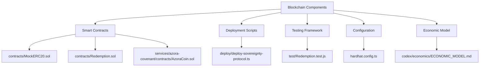
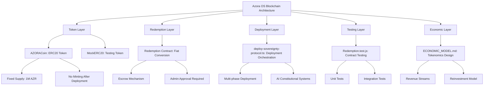
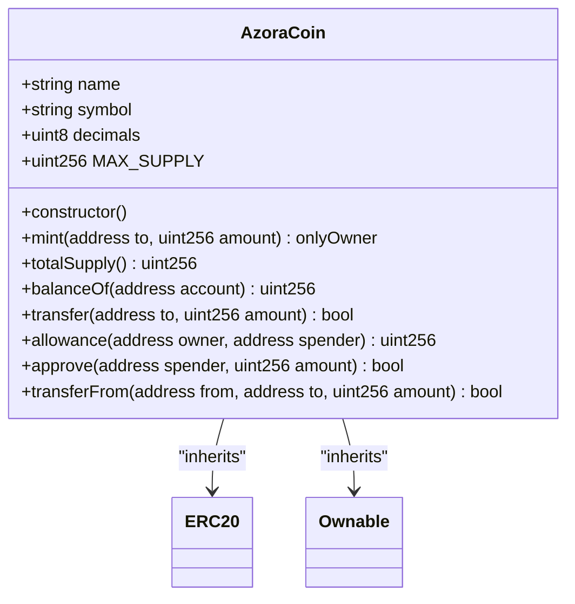
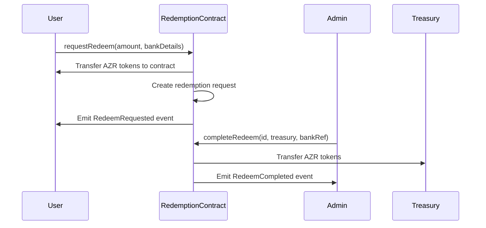
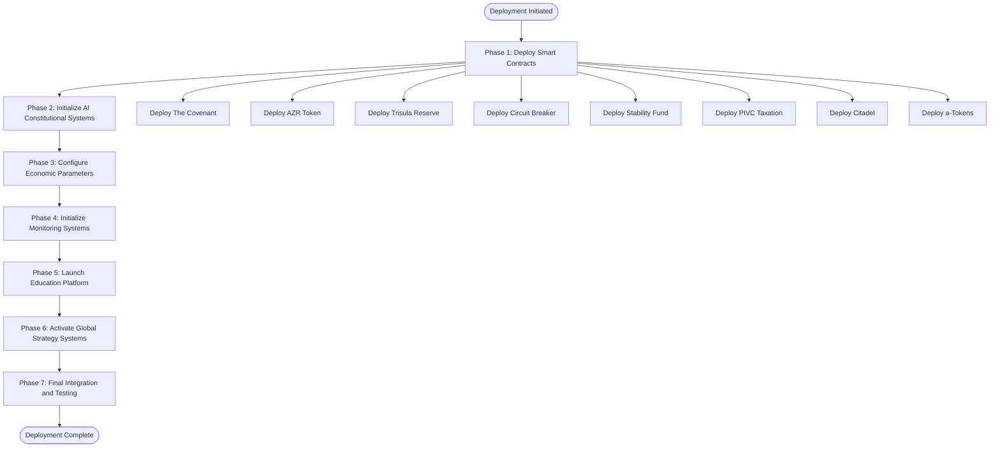
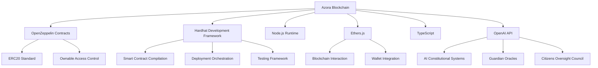

# Blockchain Integration

<cite>
**Referenced Files in This Document**   
- [MockERC20.sol](file://contracts/MockERC20.sol)
- [Redemption.sol](file://contracts/Redemption.sol)
- [AzoraCoin.sol](file://services/azora-covenant/contracts/AzoraCoin.sol)
- [hardhat.config.ts](file://hardhat.config.ts)
- [deploy-sovereignty-protocol.ts](file://deploy/deploy-sovereignty-protocol.ts)
- [ECONOMIC_MODEL.md](file://codex/economics/ECONOMIC_MODEL.md)
- [Redemption.test.js](file://test/Redemption.test.js)
</cite>

## Table of Contents
1. [Introduction](#introduction)
2. [Project Structure](#project-structure)
3. [Core Components](#core-components)
4. [Architecture Overview](#architecture-overview)
5. [Detailed Component Analysis](#detailed-component-analysis)
6. [Dependency Analysis](#dependency-analysis)
7. [Performance Considerations](#performance-considerations)
8. [Troubleshooting Guide](#troubleshooting-guide)
9. [Conclusion](#conclusion)

## Introduction
This document provides comprehensive documentation on the blockchain integration within Azora OS, focusing on the smart contract architecture, tokenomics design, and economic engine. It details the implementation of the AZR token and Redemption contracts, their deployment process, wallet integration, transaction processing, and interaction patterns. The document also covers testing methodologies, security considerations, gas optimization strategies, and network configuration for the blockchain components.

## Project Structure
The blockchain components of Azora OS are organized in a modular structure with clear separation of concerns. The core smart contracts are located in the `contracts` directory, while deployment scripts are in the `deploy` folder. Test files are maintained in the `test` directory, and economic model documentation is stored in `codex/economics`. The Hardhat configuration file defines the development and deployment environment settings.

**Diagram sources**
- [contracts](file://contracts)
- [deploy](file://deploy)
- [test](file://test)
- [hardhat.config.ts](file://hardhat.config.ts)
- [codex/economics](file://codex/economics)

**Section sources**
- [contracts](file://contracts)
- [deploy](file://deploy)
- [test](file://test)
- [hardhat.config.ts](file://hardhat.config.ts)
- [codex/economics](file://codex/economics)

## Core Components
The core blockchain components of Azora OS consist of the AZR token contract, the Redemption contract for fiat conversion, and supporting infrastructure for deployment and testing. These components work together to create a secure, efficient, and scalable blockchain integration that supports the economic model of the platform.

**Section sources**
- [AzoraCoin.sol](file://services/azora-covenant/contracts/AzoraCoin.sol#L1-L25)
- [Redemption.sol](file://contracts/Redemption.sol#L1-L151)
- [MockERC20.sol](file://contracts/MockERC20.sol#L1-L58)

## Architecture Overview
The blockchain architecture in Azora OS follows a layered approach with distinct components for token management, redemption processing, deployment orchestration, and economic modeling. The system is designed to be secure, auditable, and maintainable, with clear separation between different functional areas.

**Diagram sources**
- [AzoraCoin.sol](file://services/azora-covenant/contracts/AzoraCoin.sol#L1-L25)
- [Redemption.sol](file://contracts/Redemption.sol#L1-L151)
- [deploy-sovereignty-protocol.ts](file://deploy/deploy-sovereignty-protocol.ts#L1-L520)
- [Redemption.test.js](file://test/Redemption.test.js#L1-L88)
- [ECONOMIC_MODEL.md](file://codex/economics/ECONOMIC_MODEL.md#L1-L356)

## Detailed Component Analysis

### AZR Token Contract Analysis
The AZR token contract implements a standard ERC20 interface with additional security features and a fixed supply model. It serves as the native cryptocurrency of the Azora ecosystem, enabling value transfer, staking, and governance participation.

**Diagram sources**
- [AzoraCoin.sol](file://services/azora-covenant/contracts/AzoraCoin.sol#L1-L25)

**Section sources**
- [AzoraCoin.sol](file://services/azora-covenant/contracts/AzoraCoin.sol#L1-L25)

### Redemption Contract Analysis
The Redemption contract serves as an escrow mechanism for converting AZR tokens to fiat currency. It ensures secure handling of token transfers and provides an audit trail for all redemption requests and completions.

**Diagram sources**
- [Redemption.sol](file://contracts/Redemption.sol#L1-L151)
- [Redemption.test.js](file://test/Redemption.test.js#L1-L88)

**Section sources**
- [Redemption.sol](file://contracts/Redemption.sol#L1-L151)
- [Redemption.test.js](file://test/Redemption.test.js#L1-L88)

### Deployment and Configuration Analysis
The deployment system for Azora OS blockchain components is orchestrated through a comprehensive deployment script that handles the complete protocol setup, including contract deployment, AI system initialization, and economic parameter configuration.

**Diagram sources**
- [deploy-sovereignty-protocol.ts](file://deploy/deploy-sovereignty-protocol.ts#L1-L520)

**Section sources**
- [deploy-sovereignty-protocol.ts](file://deploy/deploy-sovereignty-protocol.ts#L1-L520)

## Dependency Analysis
The blockchain components in Azora OS have well-defined dependencies that ensure modularity and maintainability. The system relies on established libraries and frameworks while maintaining independence from external services where possible.

**Diagram sources**
- [AzoraCoin.sol](file://services/azora-covenant/contracts/AzoraCoin.sol#L1-L25)
- [hardhat.config.ts](file://hardhat.config.ts#L1-L53)
- [deploy-sovereignty-protocol.ts](file://deploy/deploy-sovereignty-protocol.ts#L1-L520)

**Section sources**
- [AzoraCoin.sol](file://services/azora-covenant/contracts/AzoraCoin.sol#L1-L25)
- [hardhat.config.ts](file://hardhat.config.ts#L1-L53)
- [deploy-sovereignty-protocol.ts](file://deploy/deploy-sovereignty-protocol.ts#L1-L520)

## Performance Considerations
The blockchain implementation in Azora OS incorporates several performance optimizations to ensure efficient operation and cost-effective transactions. These include gas optimization techniques, efficient data structures, and scalable architecture patterns.

The Hardhat configuration specifies an optimized compiler setting with 200 runs, which balances deployment cost with runtime efficiency. The Redemption contract uses storage-efficient data structures and minimizes expensive operations like external calls. The deployment script implements a phased approach to reduce the complexity of individual transactions.

**Section sources**
- [hardhat.config.ts](file://hardhat.config.ts#L1-L53)
- [Redemption.sol](file://contracts/Redemption.sol#L1-L151)
- [AzoraCoin.sol](file://services/azora-covenant/contracts/AzoraCoin.sol#L1-L25)

## Troubleshooting Guide
When working with the blockchain components of Azora OS, several common issues may arise. This section provides guidance on identifying and resolving these issues.

For deployment problems, ensure that the environment variables are properly set, particularly the `BLOCKCHAIN_PRIVATE_KEY` and `AZORA_RPC_URL`. Verify network connectivity to the Azora network RPC endpoint. Check that the Hardhat configuration matches the target network specifications.

For contract interaction issues, confirm that the correct contract addresses are being used and that the calling account has the necessary permissions. For the Redemption contract, only the admin address can complete redemptions, while any user can request them.

When encountering gas estimation errors, check that the calling account has sufficient balance to cover both the transaction value and gas fees. For token transfer failures, verify that the spender has been approved to transfer tokens on behalf of the owner.

**Section sources**
- [hardhat.config.ts](file://hardhat.config.ts#L1-L53)
- [Redemption.sol](file://contracts/Redemption.sol#L1-L151)
- [Redemption.test.js](file://test/Redemption.test.js#L1-L88)

## Conclusion
The blockchain integration in Azora OS represents a sophisticated and well-architected system that combines smart contract functionality with economic modeling and AI-driven governance. The implementation demonstrates a deep understanding of blockchain technology, security considerations, and economic principles.

The AZR token and Redemption contract form the foundation of the Azora economic engine, enabling secure value transfer and fiat conversion. The deployment system orchestrates the complete protocol setup, ensuring consistency and reliability across different environments. The comprehensive testing framework provides confidence in the correctness and security of the smart contracts.

This integration positions Azora OS as a leader in blockchain-based operating systems, combining technical excellence with innovative economic design to create a sustainable and scalable platform for the future.