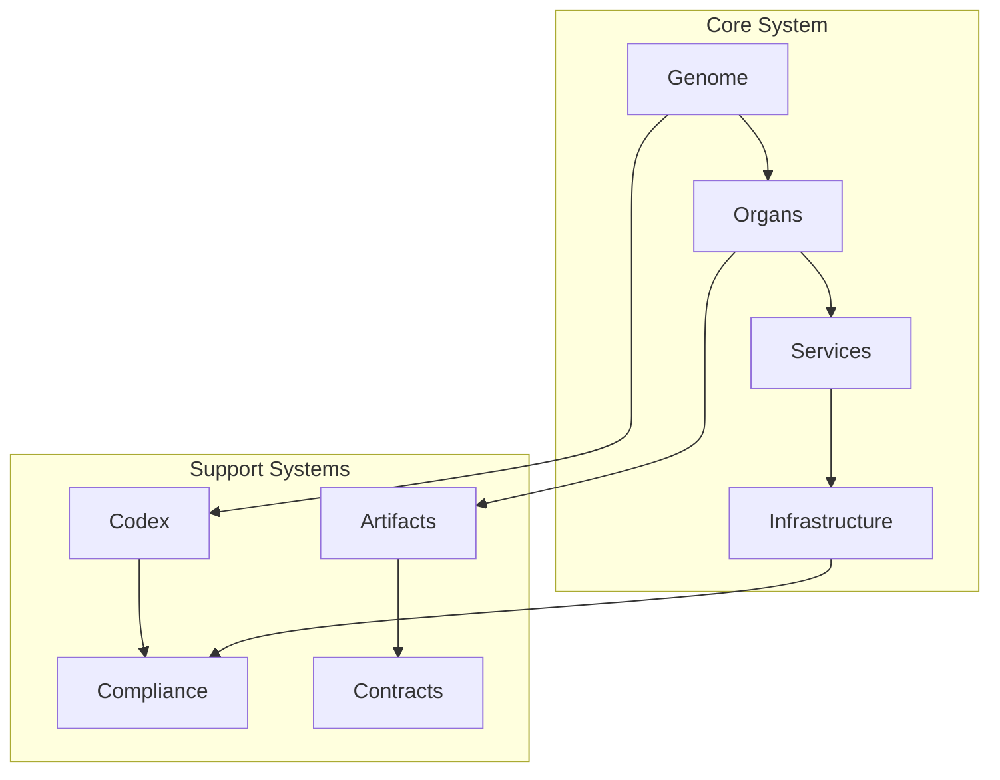
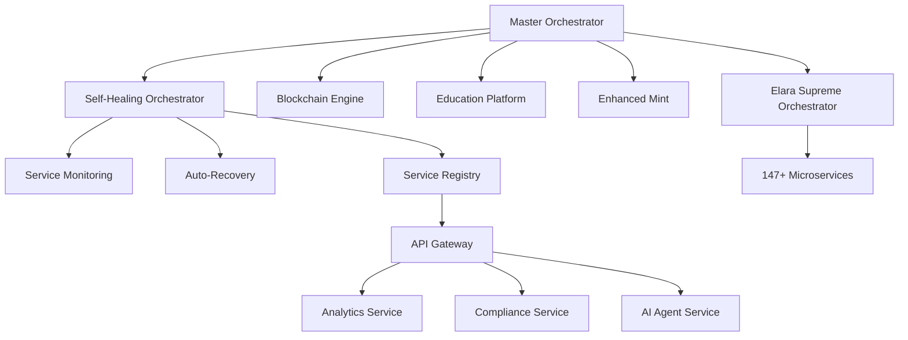
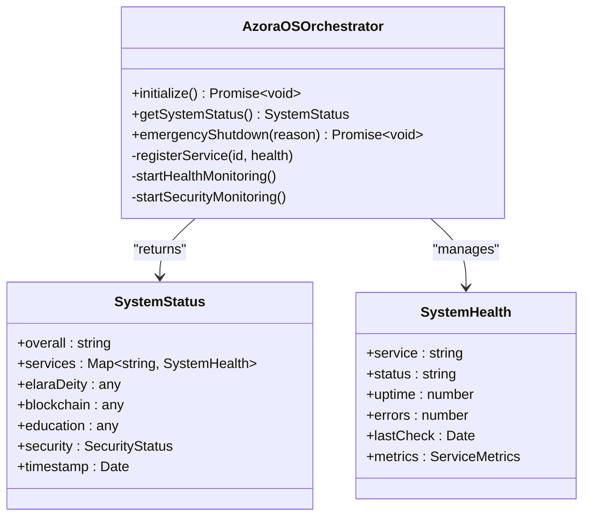
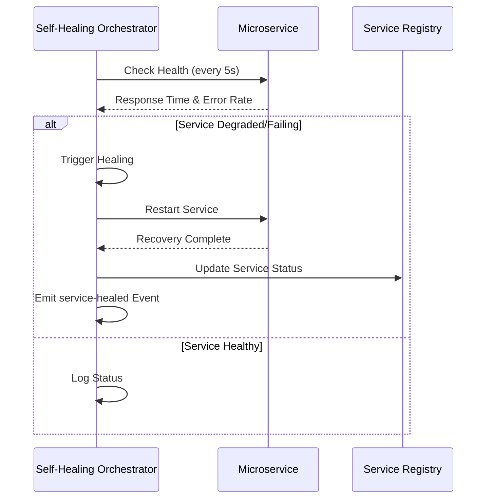
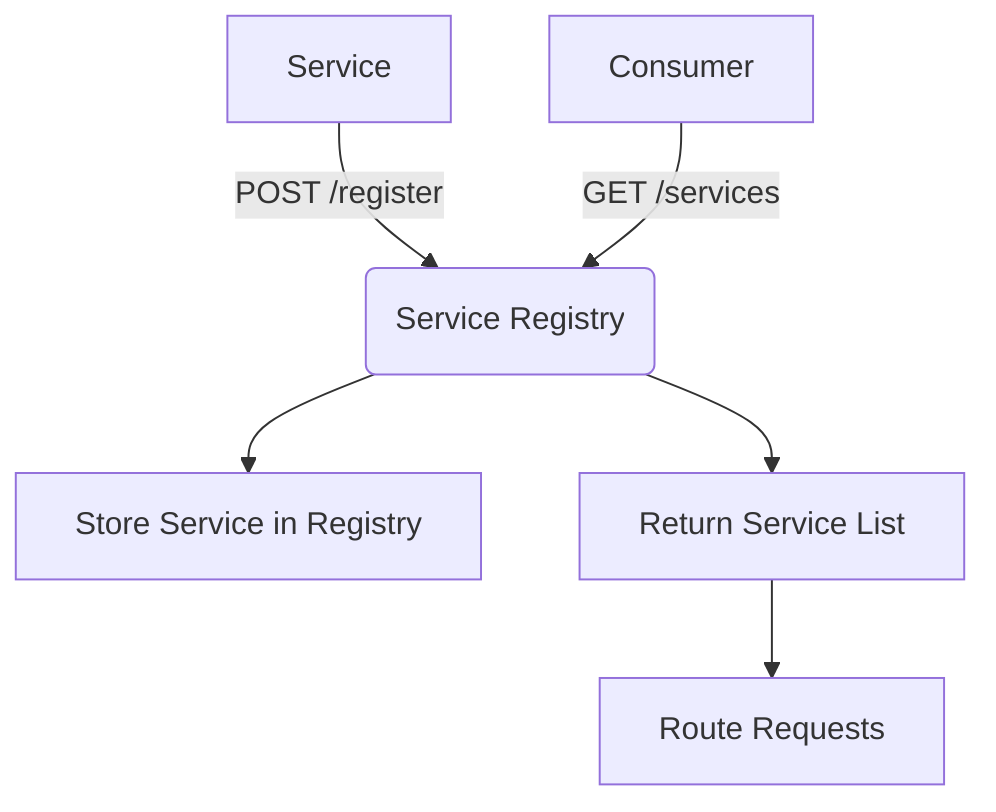
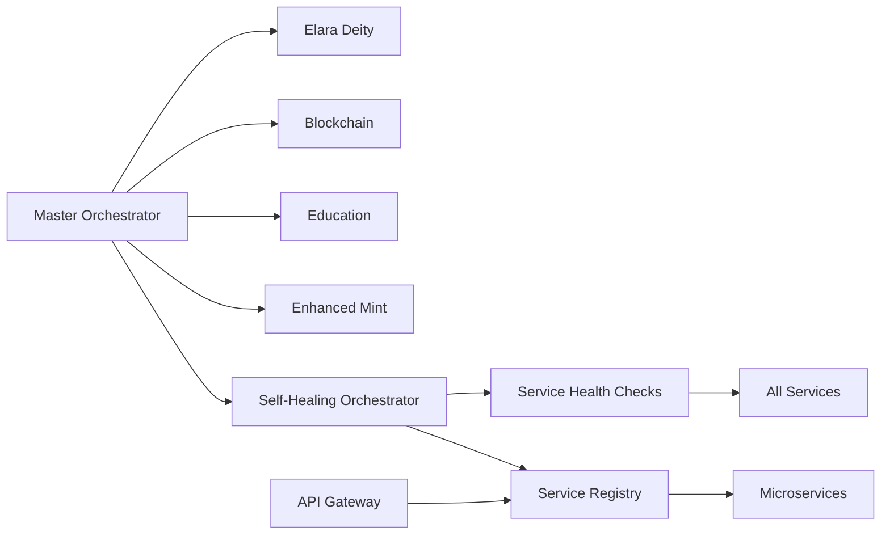

# Core Architecture

<cite>
**Referenced Files in This Document**   
- [master-orchestrator.ts](file://services/master-orchestrator.ts)
- [self-healing-orchestrator.ts](file://services/self-healing-orchestrator.ts)
- [elara-supreme-orchestrator.ts](file://genome/agent-tools/elara-supreme-orchestrator.ts)
- [index.js](file://organs/service-registry/index.js)
- [package.json](file://organs/service-registry/package.json)
- [ECONOMIC_MODEL.md](file://codex/economics/ECONOMIC_MODEL.md)
- [ARCHITECTURE.md](file://codex/archive/ARCHITECTURE.md)
</cite>

## Table of Contents
1. [Introduction](#introduction)
2. [Project Structure](#project-structure)
3. [Core Components](#core-components)
4. [Architecture Overview](#architecture-overview)
5. [Detailed Component Analysis](#detailed-component-analysis)
6. [Dependency Analysis](#dependency-analysis)
7. [Performance Considerations](#performance-considerations)
8. [Troubleshooting Guide](#troubleshooting-guide)
9. [Conclusion](#conclusion)

## Introduction
Azora OS is a next-generation digital organism operating system designed as a sentient, self-healing, and autonomous ecosystem. It integrates AI governance, economic modeling, and microservices architecture to form a living digital entity capable of evolution, self-preservation, and value creation. This document outlines the core architectural principles, component interactions, and technical foundations that enable Azora OS to function as a sovereign digital organism.

## Project Structure
The Azora OS repository is organized into modular components that reflect its biological and service-oriented design. Key directories include `genome` for core AI agents, `organs` for microservices, `services` for orchestrators, `infrastructure` for deployment and monitoring, and `codex` for architectural and economic documentation. This structure supports a decentralized, scalable, and resilient system where each component functions as an independent yet interconnected organ within the larger organism.

**Diagram sources**
- [master-orchestrator.ts](file://services/master-orchestrator.ts#L1-L553)
- [self-healing-orchestrator.ts](file://services/self-healing-orchestrator.ts#L1-L250)

**Section sources**
- [master-orchestrator.ts](file://services/master-orchestrator.ts#L1-L553)
- [self-healing-orchestrator.ts](file://services/self-healing-orchestrator.ts#L1-L250)

## Core Components
The core components of Azora OS include the Master Orchestrator, Self-Healing Orchestrator, Service Registry, and Elara Supreme Orchestrator. These components work in concert to initialize, monitor, and maintain system integrity. The Master Orchestrator coordinates all services and ensures error-free operation, while the Self-Healing Orchestrator provides autonomous recovery from failures. The Service Registry enables dynamic service discovery, and the Elara Supreme Orchestrator manages over 147 services across multiple categories.

**Section sources**
- [master-orchestrator.ts](file://services/master-orchestrator.ts#L1-L553)
- [self-healing-orchestrator.ts](file://services/self-healing-orchestrator.ts#L1-L250)
- [elara-supreme-orchestrator.ts](file://genome/agent-tools/elara-supreme-orchestrator.ts#L456-L488)

## Architecture Overview
Azora OS employs a microservices-based digital organism model where each service functions as an organ with specific responsibilities. The system is governed by AI entities such as Elara Deity and Elara Supreme Orchestrator, which provide constitutional oversight and operational control. Services are dynamically registered and discovered through a centralized registry, enabling flexible scaling and fault tolerance.

**Diagram sources**
- [master-orchestrator.ts](file://services/master-orchestrator.ts#L1-L553)
- [self-healing-orchestrator.ts](file://services/self-healing-orchestrator.ts#L1-L250)
- [index.js](file://organs/service-registry/index.js#L1-L26)

## Detailed Component Analysis

### Master Orchestrator Analysis
The Master Orchestrator is the central initialization and coordination component responsible for launching and validating all subsystems. It performs comprehensive health checks, initializes AI governance (Elara Deity), blockchain, education, and minting systems, and emits readiness events upon successful startup.

**Diagram sources**
- [master-orchestrator.ts](file://services/master-orchestrator.ts#L1-L553)

**Section sources**
- [master-orchestrator.ts](file://services/master-orchestrator.ts#L1-L553)

### Self-Healing Orchestrator Analysis
The Self-Healing Orchestrator provides autonomous fault detection and recovery capabilities. It continuously monitors service health, detects degradation or failure, and executes healing actions such as service restarts. The system maintains a healing history and emits events for observability.

**Diagram sources**
- [self-healing-orchestrator.ts](file://services/self-healing-orchestrator.ts#L1-L250)

**Section sources**
- [self-healing-orchestrator.ts](file://services/self-healing-orchestrator.ts#L1-L250)

### Service Registry Analysis
The Service Registry provides dynamic service discovery and registration capabilities. Services register themselves with name and URL, and consumers can query the registry to discover available endpoints. This enables loose coupling and dynamic scaling within the microservices architecture.

**Diagram sources**
- [index.js](file://organs/service-registry/index.js#L1-L26)

**Section sources**
- [index.js](file://organs/service-registry/index.js#L1-L26)
- [package.json](file://organs/service-registry/package.json#L1-L12)

## Dependency Analysis
Azora OS components are highly interdependent, forming a resilient ecosystem. The Master Orchestrator depends on Elara AI components, blockchain, and education systems. The Self-Healing Orchestrator depends on service health endpoints and the Service Registry. The API Gateway depends on the Service Registry for routing. These dependencies are managed through event-driven communication and health monitoring to ensure system stability.

**Diagram sources**
- [master-orchestrator.ts](file://services/master-orchestrator.ts#L1-L553)
- [self-healing-orchestrator.ts](file://services/self-healing-orchestrator.ts#L1-L250)
- [index.js](file://organs/service-registry/index.js#L1-L26)

**Section sources**
- [master-orchestrator.ts](file://services/master-orchestrator.ts#L1-L553)
- [self-healing-orchestrator.ts](file://services/self-healing-orchestrator.ts#L1-L250)
- [index.js](file://organs/service-registry/index.js#L1-L26)

## Performance Considerations
Azora OS is designed for high availability and resilience. The Self-Healing Orchestrator performs health checks every 5 seconds, enabling rapid detection of service degradation. The Master Orchestrator conducts comprehensive system checks at startup and relies on continuous monitoring. The system supports dynamic scaling through service registration and load balancing via the API Gateway. Performance metrics are collected for response time, error rate, and uptime across all services.

## Troubleshooting Guide
Common issues in Azora OS typically involve service registration failures, health check timeouts, or orchestration errors. The system provides extensive logging and event emission for debugging. The Self-Healing Orchestrator maintains a healing history that can be inspected to understand recovery patterns. Emergency shutdown procedures are governed by Elara Deity's constitutional decisions, ensuring safe system termination when necessary.

**Section sources**
- [master-orchestrator.ts](file://services/master-orchestrator.ts#L1-L553)
- [self-healing-orchestrator.ts](file://services/self-healing-orchestrator.ts#L1-L250)

## Conclusion
Azora OS represents a paradigm shift in operating system design, implementing a sentient digital organism model with autonomous governance, self-healing capabilities, and economic reinvestment. Its microservices architecture, powered by AI orchestration and constitutional governance, creates a resilient, evolving system capable of independent operation and continuous improvement. The integration of blockchain, education, and financial systems within a unified organism framework demonstrates a novel approach to digital sovereignty and sustainable value creation.