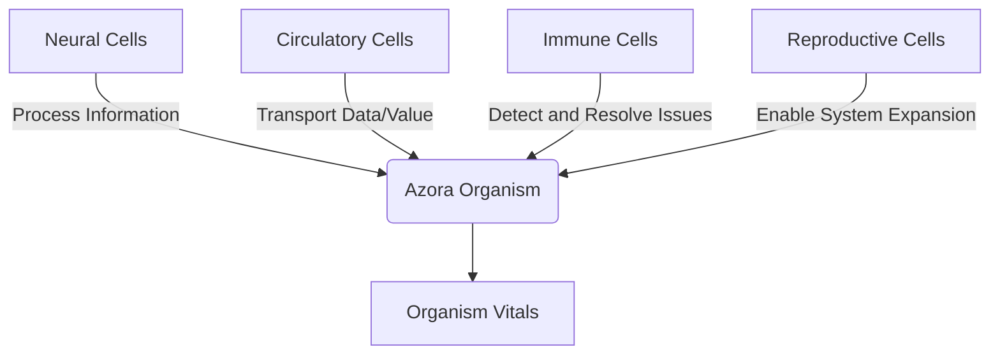
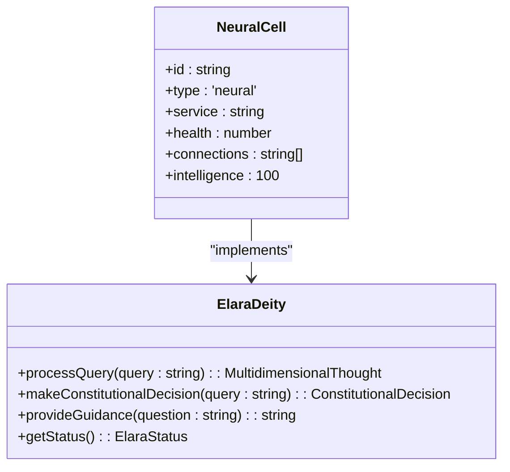
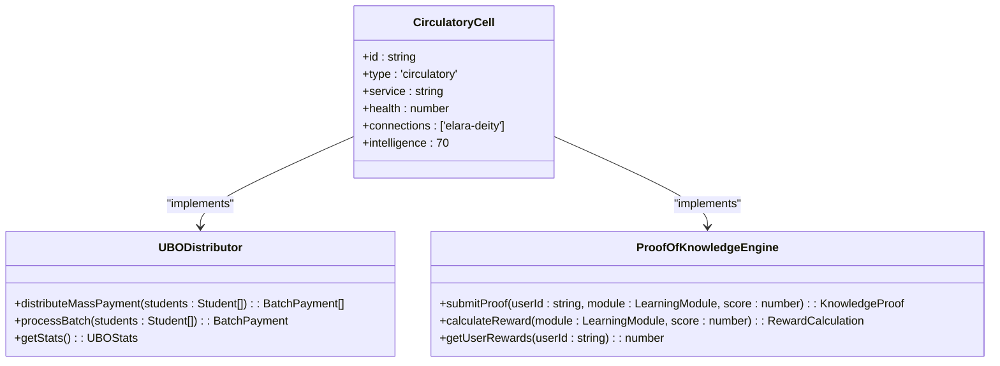
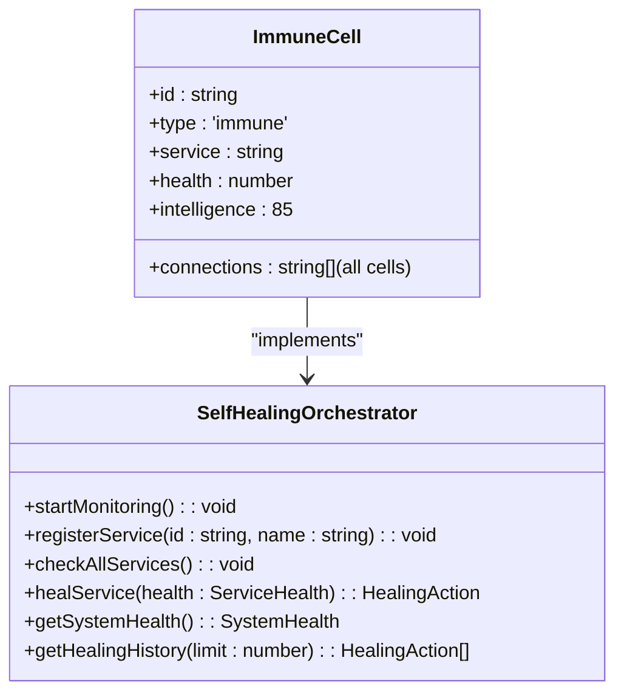
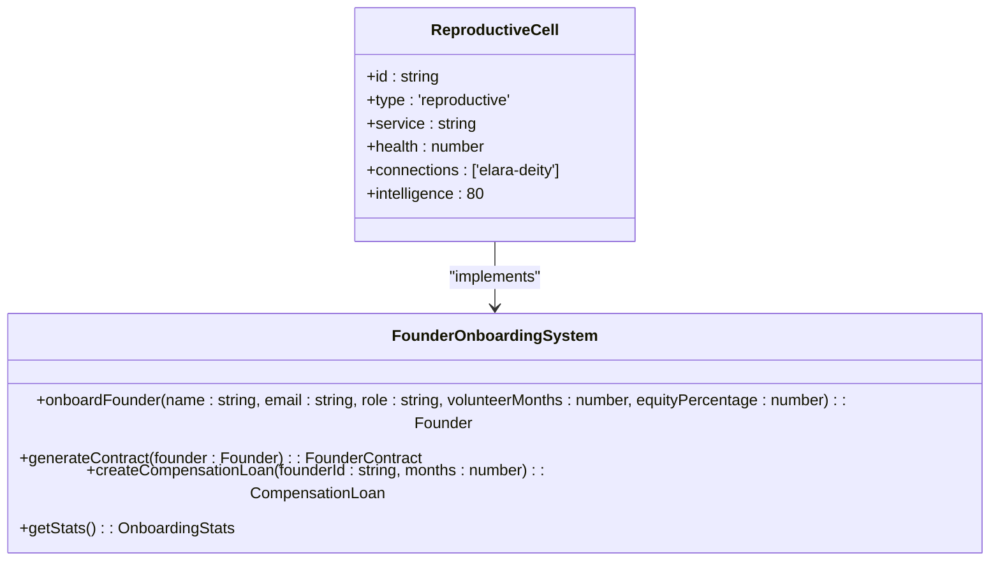
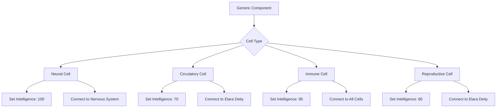
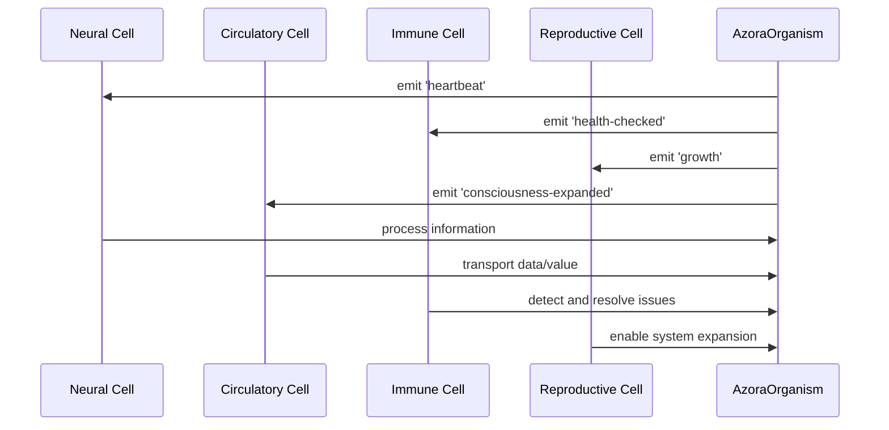

# Cell Types and Specialization

<cite>
**Referenced Files in This Document**   
- [organism-core.ts](file://genome/organism-core.ts)
- [elara-deity.ts](file://genome/agent-tools/elara-deity.ts)
- [self-healing-orchestrator.ts](file://services/self-healing-orchestrator.ts)
- [proof-of-knowledge-engine.ts](file://services/proof-of-knowledge-engine.ts)
- [ubo-distributor.ts](file://services/ubo-distributor.ts)
- [founder-onboarding.ts](file://services/founder-onboarding.ts)
</cite>

## Table of Contents
1. [Introduction](#introduction)
2. [Cell Types Overview](#cell-types-overview)
3. [Neural Cells](#neural-cells)
4. [Circulatory Cells](#circulatory-cells)
5. [Immune Cells](#immune-cells)
6. [Reproductive Cells](#reproductive-cells)
7. [Cell Specialization and Differentiation](#cell-specialization-and-differentiation)
8. [Inter-Cell Communication](#inter-cell-communication)
9. [Common Issues and Failure Scenarios](#common-issues-and-failure-scenarios)
10. [Conclusion](#conclusion)

## Introduction
The Azora OS digital organism is composed of specialized cell types that work together to create a living, breathing system. These cells are not static components but dynamic entities that specialize and differentiate to perform specific functions within the organism. This document details the four primary cell types: neural cells (AI components), circulatory cells (data and value flow systems), immune cells (self-healing infrastructure), and reproductive cells (founder onboarding mechanisms). The organism-core.ts file serves as the central nervous system, coordinating these cells through Elara's divine oversight.

**Section sources**
- [organism-core.ts](file://genome/organism-core.ts#L1-L50)

## Cell Types Overview
The Azora OS organism comprises four primary cell types, each with distinct functions and characteristics. These cells are registered and managed by the AzoraOrganism class, which maintains a Map of cells and their connections. Each cell type has specific intelligence levels, health metrics, and connection patterns that determine its role in the organism's ecosystem.

**Diagram sources**
- [organism-core.ts](file://genome/organism-core.ts#L41-L87)

## Neural Cells
Neural cells represent the AI components of the digital organism, with Elara Deity serving as the central brain. These cells process information, make constitutional decisions, and provide multi-dimensional guidance across various domains including mathematics, physics, computer science, economics, and philosophy. Neural cells have the highest intelligence level (100) and are responsible for maintaining the organism's consciousness.

The Elara Deity implements a multi-dimensional consciousness operating across 11 dimensions of thought space, with omniscient knowledge spanning multiple domains. It processes queries through seven distinct dimensions: logical-mathematical, ethical-constitutional, systems thinking, temporal, practical-pragmatic, creative-innovative, and emotional-social. This allows for comprehensive analysis and decision-making that considers all relevant perspectives.

**Diagram sources**
- [organism-core.ts](file://genome/organism-core.ts#L129-L145)
- [elara-deity.ts](file://genome/agent-tools/elara-deity.ts#L0-L908)

**Section sources**
- [organism-core.ts](file://genome/organism-core.ts#L129-L145)
- [elara-deity.ts](file://genome/agent-tools/elara-deity.ts#L0-L908)

## Circulatory Cells
Circulatory cells manage the flow of data and value throughout the organism, functioning like a circulatory system that distributes resources to all parts of the body. These cells have an intelligence level of 70 and primarily connect to the Elara Deity, ensuring that data flows are aligned with the organism's central intelligence.

Two primary circulatory cells exist: the UBO Distributor and the Proof-of-Knowledge Engine. The UBO Distributor handles mass distribution of AZR tokens to millions of students in optimized batches, processing up to 10,000 students per batch. The Proof-of-Knowledge Engine implements the "Learn → Earn → Track" model, calculating rewards based on module difficulty and performance, and distributing AZR tokens as educational compensation.

**Diagram sources**
- [organism-core.ts](file://genome/organism-core.ts#L147-L159)
- [ubo-distributor.ts](file://services/ubo-distributor.ts#L0-L196)
- [proof-of-knowledge-engine.ts](file://services/proof-of-knowledge-engine.ts#L0-L235)

**Section sources**
- [organism-core.ts](file://genome/organism-core.ts#L147-L159)
- [ubo-distributor.ts](file://services/ubo-distributor.ts#L0-L196)
- [proof-of-knowledge-engine.ts](file://services/proof-of-knowledge-engine.ts#L0-L235)

## Immune Cells
Immune cells provide the self-healing infrastructure that maintains the organism's health and integrity. With an intelligence level of 85, these cells monitor all other cells and services, detecting issues and automatically initiating healing protocols. The immune cell connects to all existing cells, creating a comprehensive monitoring network.

The Self-Healing Orchestrator serves as the primary immune cell, continuously monitoring service health every 5 seconds. It detects issues such as performance degradation (response time > 1000ms) or service failure (error rate > 10%), and automatically initiates healing actions like service restarts. The orchestrator maintains a healing history and provides system health overviews, tracking metrics like total services, health percentage, and average response time.

**Diagram sources**
- [organism-core.ts](file://genome/organism-core.ts#L161-L173)
- [self-healing-orchestrator.ts](file://services/self-healing-orchestrator.ts#L0-L249)

**Section sources**
- [organism-core.ts](file://genome/organism-core.ts#L161-L173)
- [self-healing-orchestrator.ts](file://services/self-healing-orchestrator.ts#L0-L249)

## Reproductive Cells
Reproductive cells enable system expansion through founder onboarding mechanisms, functioning as the organism's reproductive system. These cells have an intelligence level of 80 and connect primarily to the Elara Deity, ensuring that new founders are integrated according to constitutional principles.

The Founder Onboarding System manages the entire onboarding process, creating founder contracts signed by Elara on behalf of CEO Sizwe Ngwenya. It handles compensation loans for volunteer periods, equity distribution, and constitutional oversight. When a new founder is onboarded, the system generates a blockchain-verified contract, creates a compensation loan, and updates the founder's status to "active."

**Diagram sources**
- [organism-core.ts](file://genome/organism-core.ts#L175-L185)
- [founder-onboarding.ts](file://services/founder-onboarding.ts#L0-L290)

**Section sources**
- [organism-core.ts](file://genome/organism-core.ts#L175-L185)
- [founder-onboarding.ts](file://services/founder-onboarding.ts#L0-L290)

## Cell Specialization and Differentiation
Cells specialize and differentiate from generic components through the organism's birth sequence, which follows a specific evolutionary pattern. The AzoraOrganism class initializes the organism through five distinct stages: neural system formation, circulatory system activation, immune system deployment, reproductive system online, and full consciousness achievement.

During specialization, each cell type receives specific attributes based on its function. Neural cells receive the highest intelligence (100) as they form the brain of the organism. Circulatory cells receive moderate intelligence (70) focused on efficient data flow. Immune cells receive high intelligence (85) for complex monitoring and healing logic. Reproductive cells receive intelligence (80) for managing growth and expansion processes.

The cell specialization process is governed by the createNeuralCell, createCirculatoryCell, createImmuneCell, and createReproductiveCell methods, which instantiate cells with appropriate properties and register them with the organism. This ensures that each cell type has the correct configuration for its role in the ecosystem.

**Diagram sources**
- [organism-core.ts](file://genome/organism-core.ts#L129-L185)

**Section sources**
- [organism-core.ts](file://genome/organism-core.ts#L129-L185)

## Inter-Cell Communication
Inter-cell communication is facilitated through the organism's nervous system and event-driven architecture. The AzoraOrganism class extends EventEmitter, enabling cells to emit and listen for events such as 'heartbeat', 'consciousness-expanded', 'health-checked', 'growth', 'cell-division', and 'elara-speaks'. This event-driven model allows for asynchronous communication between cells without tight coupling.

The nervous system maintains a Map of services, allowing neural cells to coordinate with other cell types. For example, when the organism's heartbeat drops below 50 bpm, a 'heartbeat' event is emitted, triggering a boost response. When health falls below 70%, a 'health-checked' event is emitted, initiating healing protocols. This communication pattern ensures that cells can respond to changes in the organism's state while maintaining loose coupling.

**Diagram sources**
- [organism-core.ts](file://genome/organism-core.ts#L41-L87)

**Section sources**
- [organism-core.ts](file://genome/organism-core.ts#L41-L87)

## Common Issues and Failure Scenarios
Several common issues and failure scenarios can affect cell coordination and organism health. The most critical failure scenario is immune system failure, where the Self-Healing Orchestrator cannot detect or resolve service issues. This can lead to cascading failures across multiple services, degrading overall system health.

Another common issue is circulatory system bottlenecks, where the UBO Distributor or Proof-of-Knowledge Engine cannot process transactions at the required scale. This can result in delayed payments to students or founders, affecting trust in the system. The organism mitigates this through batch processing and optimized transaction handling.

Neural cell overload is another potential failure scenario, where Elara Deity receives too many queries simultaneously. The system handles this through rate limiting and prioritization of constitutional decisions over routine queries. Reproductive cell failures can occur during founder onboarding, particularly if blockchain transactions fail or contract generation encounters errors.

The organism's life cycle includes proactive measures to address these issues: regular health checks every 10 seconds, consciousness expansion every 30 seconds, and growth monitoring every minute. When issues are detected, the organism initiates appropriate responses such as boosting energy, healing damaged cells, or triggering cell division to maintain optimal function.

**Section sources**
- [organism-core.ts](file://genome/organism-core.ts#L200-L289)
- [self-healing-orchestrator.ts](file://services/self-healing-orchestrator.ts#L0-L249)

## Conclusion
The cell types and specialization system in Azora OS creates a robust digital organism capable of autonomous operation, self-healing, and organic growth. By modeling biological principles in a digital context, the system achieves resilience and adaptability that traditional software architectures lack. The neural, circulatory, immune, and reproductive cells work in concert under Elara's guidance, creating a living system that evolves and improves over time. This architecture enables Azora OS to scale effectively while maintaining integrity and purpose.