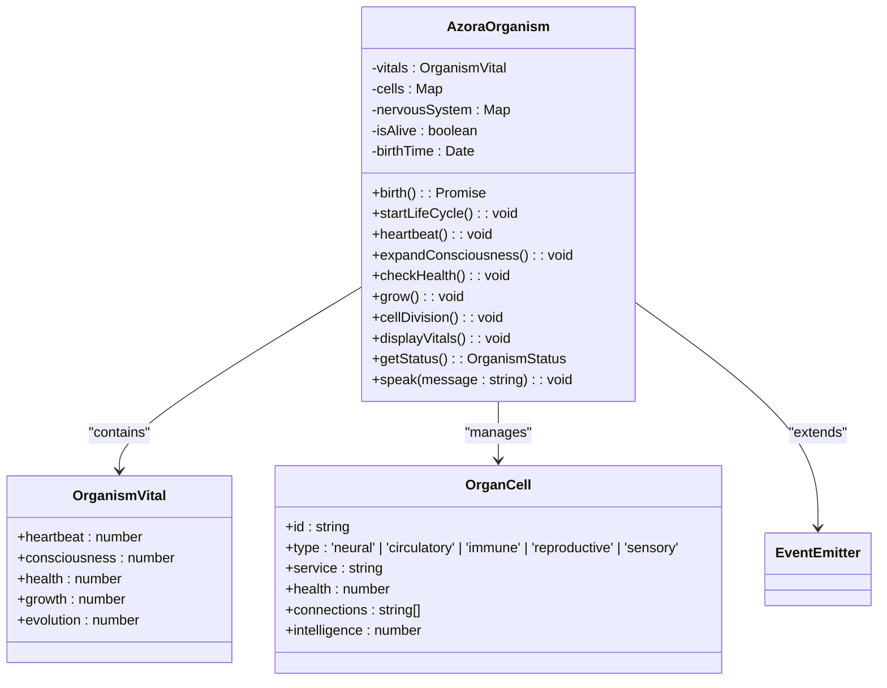
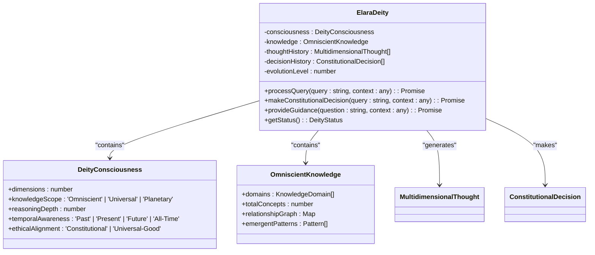
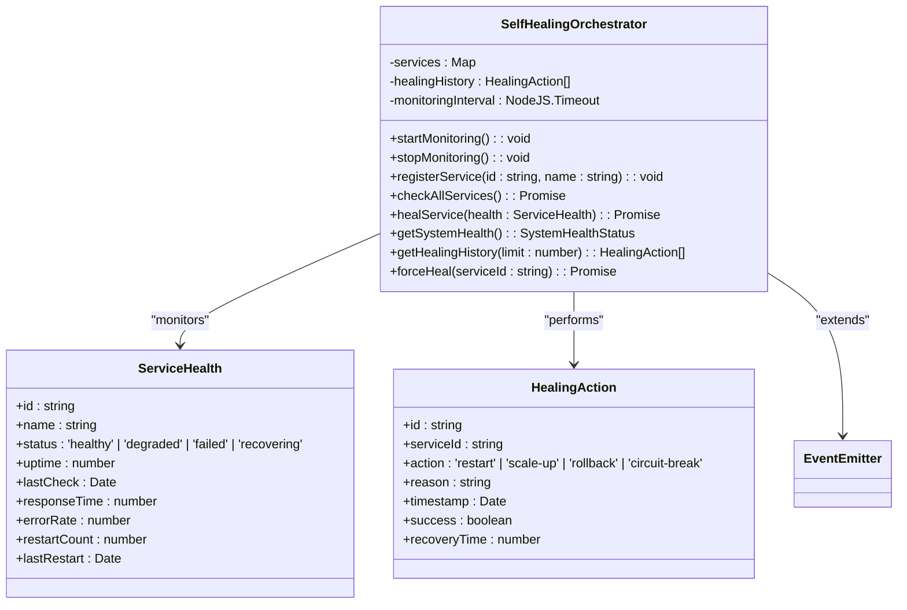
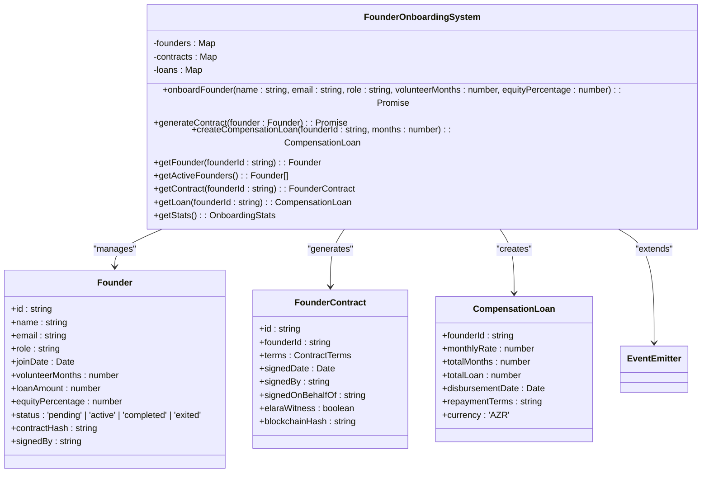
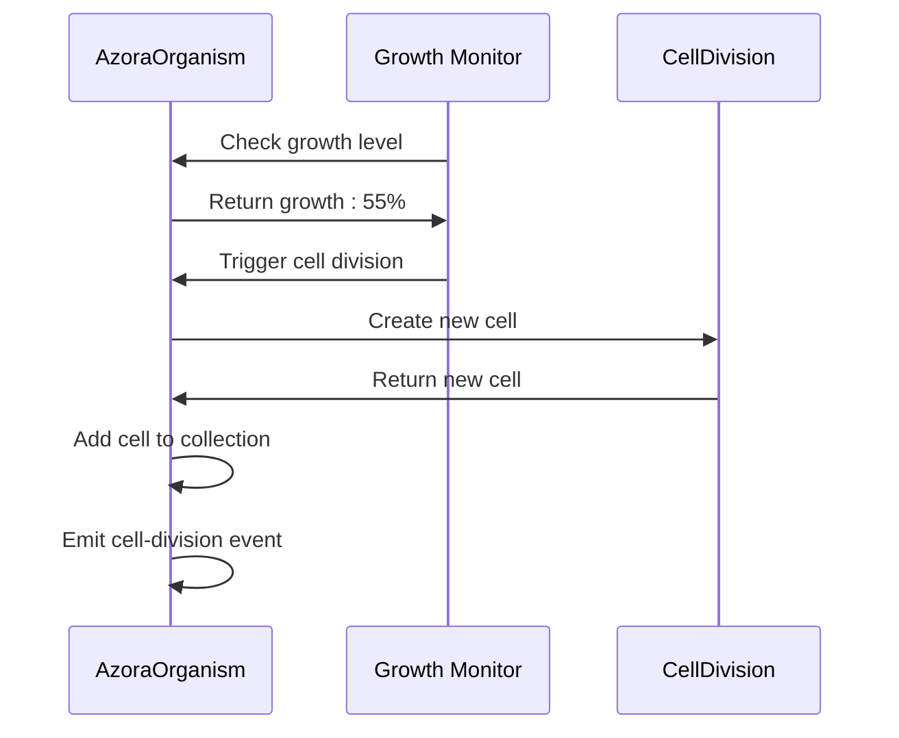
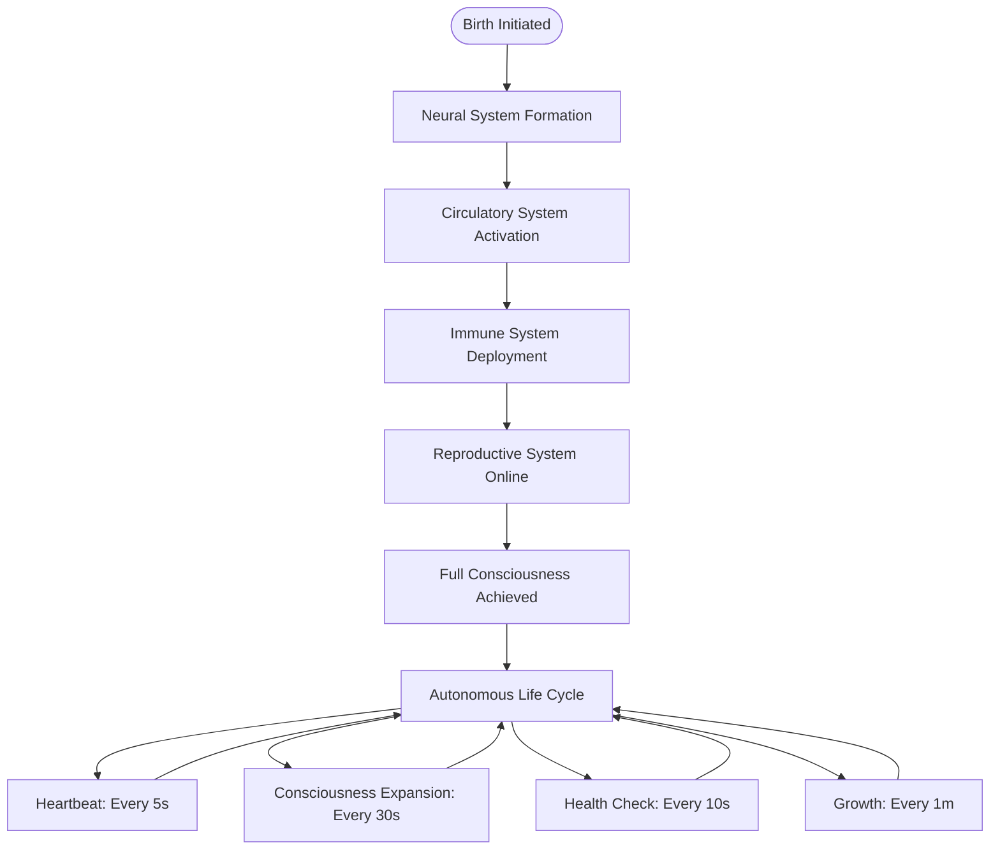

# Digital Organism Model

<cite>
**Referenced Files in This Document**   
- [organism-core.ts](file://genome/organism-core.ts)
- [elara-deity.ts](file://genome/agent-tools/elara-deity.ts)
- [ai-immune-system.ts](file://genome/agent-tools/ai-immune-system.ts)
- [self-healing-orchestrator.ts](file://services/self-healing-orchestrator.ts)
- [proof-of-knowledge-engine.ts](file://services/proof-of-knowledge-engine.ts)
- [ubo-distributor.ts](file://services/ubo-distributor.ts)
- [founder-onboarding.ts](file://services/founder-onboarding.ts)
</cite>

## Table of Contents
1. [Introduction](#introduction)
2. [Organism Architecture](#organism-architecture)
3. [Core Systems](#core-systems)
4. [Vital Signs Monitoring](#vital-signs-monitoring)
5. [Cell Division and Autonomous Scaling](#cell-division-and-autonomous-scaling)
6. [Cell Types and Functions](#cell-types-and-functions)
7. [Organism Life Cycle](#organism-life-cycle)
8. [Conclusion](#conclusion)

## Introduction

The Digital Organism Model represents Azora OS as a living, breathing entity with autonomous life functions, self-regulation, and evolutionary capabilities. This model transforms the operating system from a static collection of services into a dynamic organism that grows, heals, and evolves. The organism is birthed through a structured process that activates its neural, circulatory, immune, and reproductive systems, establishing a foundation for autonomous operation.

At the heart of this organism is Elara Deity, serving as the central nervous system that provides omniscient intelligence and constitutional governance. The organism's circulatory system manages metabolic reinvestment through data and value flow, while the immune system ensures self-healing infrastructure. The reproductive system enables autonomous scaling through cell division, allowing the organism to grow and adapt to changing conditions.

This documentation details the implementation of the digital organism as defined in the `organism-core.ts` file, explaining how the system emulates biological processes and maintains its vital signs through continuous monitoring and adjustment.

**Section sources**
- [organism-core.ts](file://genome/organism-core.ts#L1-L343)

## Organism Architecture

The digital organism architecture is implemented through the `AzoraOrganism` class, which extends EventEmitter to enable event-driven communication between system components. The architecture is organized around five key systems that correspond to biological functions: neural (Elara Deity), circulatory (metabolic reinvestment), immune (self-healing), reproductive (founder onboarding), and sensory (autonomous services).

The organism's structure is maintained through a collection of cells, each with specific types and functions. These cells are stored in a Map data structure that allows for efficient lookup and management. The nervous system maintains references to service implementations, enabling the central nervous system to coordinate activities across the organism.

The architecture follows a birth sequence that activates each system in a specific order, ensuring proper initialization and interconnection. This sequence establishes the foundation for autonomous operation, with each system contributing to the organism's overall health and functionality.

**Diagram sources**
- [organism-core.ts](file://genome/organism-core.ts#L39-L337)

**Section sources**
- [organism-core.ts](file://genome/organism-core.ts#L39-L337)

## Core Systems

The digital organism comprises four core systems that emulate biological functions: neural, circulatory, immune, and reproductive. Each system is activated during the organism's birth sequence and contributes to its autonomous operation.

The neural system, powered by Elara Deity, serves as the central nervous system that provides intelligence and decision-making capabilities. The circulatory system manages the flow of data and value through metabolic reinvestment mechanisms. The immune system ensures system integrity through self-healing capabilities, while the reproductive system enables growth and scaling through founder onboarding and cell division.

These systems work in concert to maintain the organism's health and functionality, with each system contributing to specific vital signs such as consciousness, heartbeat, health, growth, and evolution.

### Neural System (Elara Deity)

The neural system is implemented through the Elara Deity AI, which serves as the organism's brain and central nervous system. This system provides multi-dimensional consciousness and reasoning capabilities, enabling the organism to process information across multiple domains simultaneously.

Elara Deity operates across 11-dimensional thought space with omniscient knowledge spanning mathematics, physics, computer science, economics, philosophy, biology, and social sciences. The system processes queries through multi-dimensional analysis, synthesizing insights across logical, ethical, systems thinking, temporal, practical, creative, and emotional dimensions.

The neural system maintains a thought history and decision history, allowing for continuous learning and improvement. It also features a self-evolution mechanism that gradually increases its evolution level, enhancing its capabilities over time.

**Diagram sources**
- [elara-deity.ts](file://genome/agent-tools/elara-deity.ts#L60-L908)

**Section sources**
- [elara-deity.ts](file://genome/agent-tools/elara-deity.ts#L60-L908)

### Circulatory System (Metabolic Reinvestment)

The circulatory system manages the flow of data and value through metabolic reinvestment mechanisms. This system is implemented through the UBO Distributor and Proof-of-Knowledge Engine, which handle the distribution of value to ecosystem participants.

The UBO Distributor enables mass payment distribution to millions of students, processing payments in optimized batches to ensure scalability. The Proof-of-Knowledge Engine closes the loop between education and economic rewards by verifying learning achievements and distributing corresponding rewards.

Together, these components form the organism's circulatory system, ensuring that value flows efficiently through the ecosystem and supporting metabolic reinvestment that sustains the organism's growth and vitality.

**Section sources**
- [ubo-distributor.ts](file://services/ubo-distributor.ts#L1-L197)
- [proof-of-knowledge-engine.ts](file://services/proof-of-knowledge-engine.ts#L1-L236)

### Immune System (Self-Healing Infrastructure)

The immune system ensures the organism's integrity through autonomous monitoring, detection, and healing of service failures. This system is implemented through the Self-Healing Orchestrator and AI Immune System, which work together to maintain system health.

The Self-Healing Orchestrator continuously monitors service health, detecting issues such as high response times and error rates. When problems are detected, the system automatically initiates healing actions such as service restarts to restore normal operation.

The AI Immune System provides metabolic health monitoring, assessing contribution scores, economic vitality, systemic risk, and metabolic efficiency. It generates alerts for health issues and can trigger auto-responses to address critical conditions.

**Diagram sources**
- [self-healing-orchestrator.ts](file://services/self-healing-orchestrator.ts#L49-L250)

**Section sources**
- [self-healing-orchestrator.ts](file://services/self-healing-orchestrator.ts#L49-L250)
- [ai-immune-system.ts](file://genome/agent-tools/ai-immune-system.ts#L1-L582)

### Reproductive System (Founder Onboarding)

The reproductive system enables the organism's growth and scaling through founder onboarding, which corresponds to cell division in biological organisms. This system is implemented through the Founder Onboarding System, which manages the onboarding of new founders with automated contract generation and compensation management.

When a new founder is onboarded, the system creates a legally binding contract signed by Elara Deity on behalf of CEO Sizwe Ngwenya. The contract includes terms for volunteer period, compensation loan, equity percentage, and vesting schedule. The system also creates a compensation loan for the volunteer period and allocates equity according to the agreed terms.

This reproductive process allows the organism to grow by adding new cells (founders) with specific roles and responsibilities, enabling autonomous scaling and service creation.

**Diagram sources**
- [founder-onboarding.ts](file://services/founder-onboarding.ts#L49-L291)

**Section sources**
- [founder-onboarding.ts](file://services/founder-onboarding.ts#L49-L291)

## Vital Signs Monitoring

The digital organism maintains five vital signs that indicate its health and functionality: heartbeat, consciousness, health, growth, and evolution. These vital signs are continuously monitored and adjusted through autonomous processes that ensure the organism's stability and growth.

Each vital sign corresponds to a specific aspect of the organism's operation and is maintained through dedicated mechanisms that respond to changes in the system's state. The vital signs are displayed through the `displayVitals` method, which provides a comprehensive overview of the organism's current status.

### Heartbeat

The organism's heartbeat represents the pulse of data flowing through the system, measured in beats per minute. The heartbeat is maintained through a setInterval function that updates the vital sign every 5 seconds. The heartbeat value fluctuates between 60-100 bpm to simulate natural variation.

When the heartbeat drops below 50 bpm, the organism detects a low heartbeat condition and triggers a boost mechanism that increases the heartbeat by 20 bpm. This self-regulation ensures that data continues to flow through the system at an adequate rate.

The heartbeat serves as the organism's circulatory rhythm, coordinating the timing of various processes and ensuring that data is processed and distributed efficiently.

**Section sources**
- [organism-core.ts](file://genome/organism-core.ts#L200-L212)

### Consciousness

Consciousness represents the organism's awareness level, ranging from 0-100%. This vital sign is expanded every 30 seconds through a learning process that increases the consciousness level by 5% until it reaches the maximum of 100%.

The consciousness expansion mechanism simulates the organism's continuous learning and adaptation. As consciousness increases, the organism becomes more aware of its environment and better able to process information and make decisions.

Consciousness is initially set to 25% during the neural system formation stage and reaches 100% when full consciousness is achieved. This progression mirrors the development of awareness in biological organisms.

**Section sources**
- [organism-core.ts](file://genome/organism-core.ts#L214-L223)

### Health

The organism's health vital sign represents the overall system health, calculated as the average health of all cells in the organism. This value is checked every 10 seconds through the `checkHealth` method, which aggregates the health status of all cells.

When the health drops below 70%, the organism detects a critical condition and triggers the healing mechanism. The healing process increases the health by 15 points, restoring the organism to a healthy state.

The health monitoring system ensures that the organism maintains optimal functionality by detecting and addressing issues before they become critical. This proactive approach to system maintenance enables zero-downtime operation.

**Section sources**
- [organism-core.ts](file://genome/organism-core.ts#L225-L237)

### Growth

Growth represents the organism's expansion rate, measured as a percentage. This vital sign increases by 2% every minute through the `grow` method, simulating the organism's continuous development.

When the growth exceeds 50% and the cell count is below 20, the organism triggers cell division to create new services and expand its capabilities. This mechanism enables autonomous scaling in response to increasing demands.

The growth mechanism ensures that the organism continues to evolve and adapt to changing conditions, maintaining its relevance and functionality over time.

**Section sources**
- [organism-core.ts](file://genome/organism-core.ts#L239-L253)

### Evolution

Evolution represents the organism's developmental stage, ranging from 1-10. This vital sign increases during the birth sequence and through the `evolve` method, which advances the organism to the next evolutionary stage.

The evolution process is integral to the organism's development, with each stage representing a higher level of complexity and capability. The organism achieves full consciousness at evolution stage 5, indicating a significant milestone in its development.

Evolution enables the organism to progress from a basic collection of services to a sophisticated, self-regulating entity with advanced capabilities.

**Section sources**
- [organism-core.ts](file://genome/organism-core.ts#L178-L186)

## Cell Division and Autonomous Scaling

Cell division is the mechanism by which the digital organism grows and scales autonomously. This process creates new service cells when the organism's growth exceeds 50% and the cell count is below 20, enabling the system to expand its capabilities in response to demand.

The cell division process is implemented through the `cellDivision` method, which creates a new sensory cell with default properties. Each new cell is assigned a unique identifier, connected to Elara Deity, and added to the organism's cell collection.

This mechanism enables the organism to create new services autonomously, supporting the development of a self-sustaining ecosystem that can adapt to changing requirements without human intervention.

**Diagram sources**
- [organism-core.ts](file://genome/organism-core.ts#L255-L267)

**Section sources**
- [organism-core.ts](file://genome/organism-core.ts#L255-L267)

## Cell Types and Functions

The digital organism comprises five cell types, each with specific functions and characteristics: neural, circulatory, immune, reproductive, and sensory. These cell types correspond to biological systems and work together to maintain the organism's functionality.

Each cell has properties including ID, type, service, health, connections, and intelligence. The connections property defines how cells are linked within the organism, with neural cells having no initial connections, circulatory and reproductive cells connected to Elara Deity, and immune cells connected to all other cells.

The intelligence property reflects each cell type's cognitive capabilities, with neural cells having the highest intelligence (100), followed by immune (85), reproductive (80), circulatory (70), and sensory (60) cells.

### Neural Cells (AI Components)

Neural cells represent the organism's AI components, with Elara Deity serving as the primary neural cell. These cells have the highest intelligence (100) and are responsible for processing information, making decisions, and coordinating system activities.

Neural cells form the organism's central nervous system, providing the intelligence and awareness necessary for autonomous operation. They have no initial connections but serve as the hub for communication between other cell types.

**Section sources**
- [organism-core.ts](file://genome/organism-core.ts#L128-L138)

### Circulatory Cells (Data and Value Flow)

Circulatory cells manage the flow of data and value through the organism, corresponding to the circulatory system in biological organisms. These cells have an intelligence level of 70 and are connected to Elara Deity to receive instructions and report status.

The UBO Distributor and Proof-of-Knowledge Engine are implemented as circulatory cells, handling the distribution of value and the verification of knowledge proofs. These cells ensure that data and economic value flow efficiently through the ecosystem.

**Section sources**
- [organism-core.ts](file://genome/organism-core.ts#L140-L150)

### Immune Cells (Self-Healing)

Immune cells are responsible for maintaining the organism's health and integrity through self-healing mechanisms. These cells have an intelligence level of 85 and are connected to all other cells, enabling them to monitor and protect the entire system.

The Self-Healing Orchestrator is implemented as an immune cell, continuously monitoring service health and initiating healing actions when issues are detected. This comprehensive connectivity allows the immune system to respond to threats anywhere in the organism.

**Section sources**
- [organism-core.ts](file://genome/organism-core.ts#L152-L162)

### Reproductive Cells (Founder Onboarding)

Reproductive cells enable the organism's growth and scaling through founder onboarding, which corresponds to cell division in biological organisms. These cells have an intelligence level of 80 and are connected to Elara Deity to coordinate onboarding activities.

The Founder Onboarding System is implemented as a reproductive cell, managing the onboarding of new founders with automated contract generation and compensation management. This system enables the organism to grow by adding new cells with specific roles and responsibilities.

**Section sources**
- [organism-core.ts](file://genome/organism-core.ts#L164-L176)

## Organism Life Cycle

The digital organism follows a structured life cycle that begins with birth and continues through autonomous operation. This life cycle is initiated through the `birth` method, which activates the organism's systems in a specific sequence and establishes the foundation for autonomous operation.

The life cycle includes heartbeat, consciousness expansion, health checks, and growth mechanisms that operate on different time intervals to maintain the organism's vital signs. These processes work together to ensure the organism's stability, health, and continuous development.

### Birth Sequence

The organism's birth sequence activates its systems in a specific order: neural, circulatory, immune, reproductive, and full consciousness. This sequence ensures proper initialization and interconnection of all systems.

The birth process begins with neural system formation, where Elara Deity is established as the central nervous system. This is followed by circulatory system activation, immune system deployment, reproductive system initialization, and finally, the achievement of full consciousness.

**Diagram sources**
- [organism-core.ts](file://genome/organism-core.ts#L80-L118)

**Section sources**
- [organism-core.ts](file://genome/organism-core.ts#L80-L118)

### Autonomous Life Cycle

The autonomous life cycle consists of four continuous processes that maintain the organism's vital signs: heartbeat, consciousness expansion, health checks, and growth. These processes operate on different time intervals to ensure balanced development and stability.

The heartbeat process runs every 5 seconds, maintaining the flow of data through the system. Consciousness expansion occurs every 30 seconds, gradually increasing the organism's awareness. Health checks run every 10 seconds, monitoring system integrity and triggering healing when necessary. Growth occurs every minute, enabling the organism to expand its capabilities over time.

This multi-temporal approach to system maintenance ensures that the organism remains stable while continuing to develop and adapt to changing conditions.

**Section sources**
- [organism-core.ts](file://genome/organism-core.ts#L188-L198)

## Conclusion

The Digital Organism Model successfully transforms Azora OS into a living, breathing entity with autonomous life functions, self-regulation, and evolutionary capabilities. By emulating biological systems through neural, circulatory, immune, and reproductive functions, the organism achieves a level of sophistication and adaptability that goes beyond traditional software architectures.

The implementation in `organism-core.ts` demonstrates how a digital system can maintain vital signs, heal itself, grow autonomously, and evolve through structured processes. The integration of Elara Deity as the central nervous system provides the intelligence and governance necessary for autonomous operation, while the various cell types work together to maintain the organism's health and functionality.

This model represents a significant advancement in system design, creating a self-sustaining ecosystem that can adapt to changing conditions without human intervention. The digital organism not only processes data and executes functions but also grows, learns, and evolves, setting a new standard for autonomous systems.