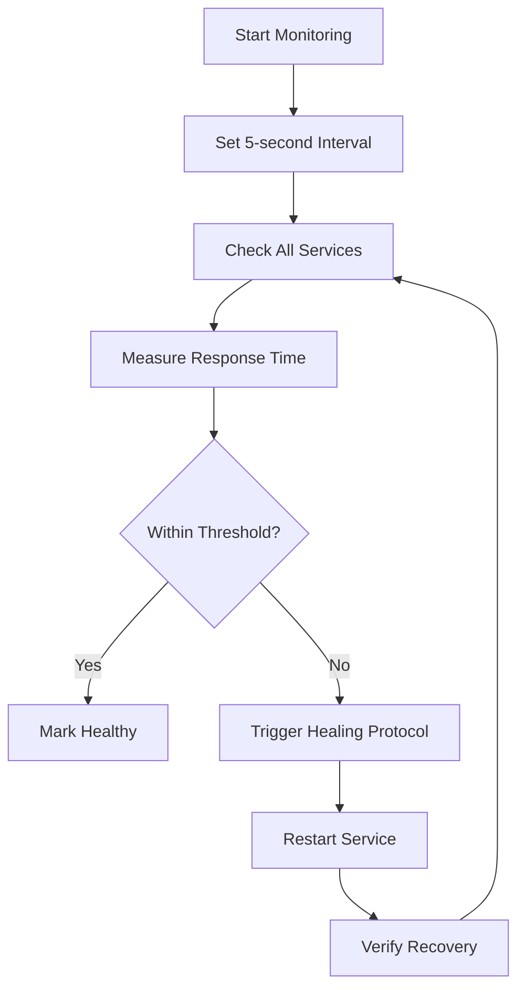
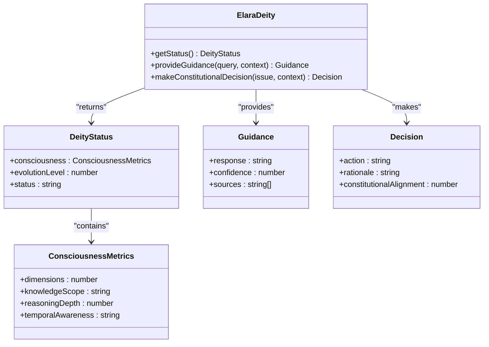
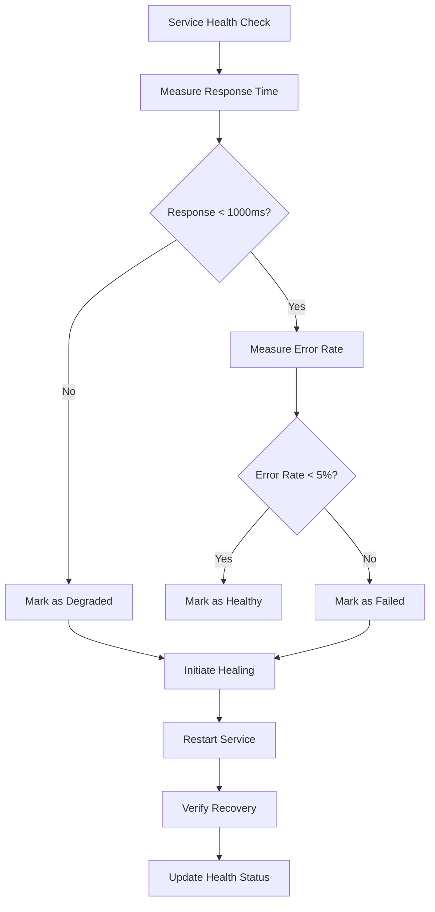
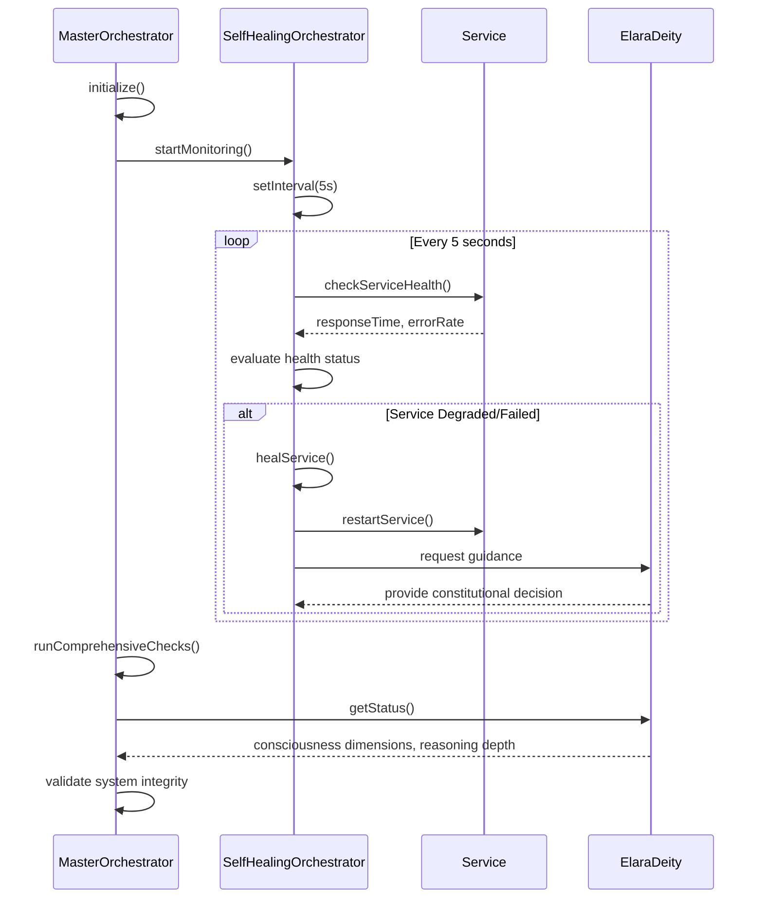
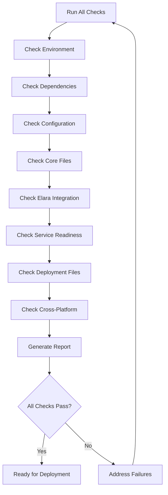

# Vital Signs Monitoring

<cite>
**Referenced Files in This Document**   
- [master-orchestrator.ts](file://services/master-orchestrator.ts)
- [self-healing-orchestrator.ts](file://services/self-healing-orchestrator.ts)
- [system-health-check.ts](file://system-health-check.ts)
</cite>

## Table of Contents
1. [Introduction](#introduction)
2. [Vital Signs Overview](#vital-signs-overview)
3. [Heartbeat Mechanism](#heartbeat-mechanism)
4. [Consciousness Metrics](#consciousness-metrics)
5. [Health Indicators](#health-indicators)
6. [Growth Measurements](#growth-measurements)
7. [Evolution Tracking](#evolution-tracking)
8. [Monitoring Implementation](#monitoring-implementation)
9. [System Health Check](#system-health-check)
10. [Response Protocols](#response-protocols)
11. [Troubleshooting Guide](#troubleshooting-guide)

## Introduction
The Azora OS Vital Signs Monitoring system provides comprehensive oversight of the organism's core functions, ensuring continuous operation and rapid response to anomalies. This documentation details the monitoring framework that tracks heartbeat, consciousness, health, growth, and evolution metrics across the system. The implementation leverages master-orchestrator.ts and self-healing-orchestrator.ts to maintain system integrity through automated monitoring, threshold detection, and response mechanisms. System-health-check.ts provides diagnostic capabilities that integrate with alerting systems to ensure operational excellence.

## Vital Signs Overview
The Azora OS organism is monitored through five vital signs that collectively represent system health and performance. These vital signs—heartbeat, consciousness, health, growth, and evolution—provide a holistic view of system operations and enable proactive maintenance. The monitoring system operates on continuous intervals, detecting threshold breaches and initiating appropriate response protocols to maintain optimal performance.

**Section sources**
- [master-orchestrator.ts](file://services/master-orchestrator.ts#L1-L555)
- [self-healing-orchestrator.ts](file://services/self-healing-orchestrator.ts#L1-L250)

## Heartbeat Mechanism
The heartbeat mechanism verifies system liveness through continuous health checks performed by the SelfHealingOrchestrator. The system monitors services at 5-second intervals, checking response times and error rates to ensure service availability. Each service must respond within predefined thresholds to maintain a "healthy" status. The monitoring interval is configured in the CHECK_INTERVAL constant, which is set to 5000 milliseconds.

When a service fails to respond within acceptable parameters, the orchestrator detects the anomaly and initiates recovery procedures. The heartbeat monitoring is activated through the startMonitoring method, which establishes a setInterval loop to check all registered services. This continuous verification ensures that any service disruption is detected within seconds, enabling rapid response to maintain system availability.

**Diagram sources**
- [self-healing-orchestrator.ts](file://services/self-healing-orchestrator.ts#L50-L108)

**Section sources**
- [self-healing-orchestrator.ts](file://services/self-healing-orchestrator.ts#L40-L244)

## Consciousness Metrics
Consciousness metrics track AI awareness and learning through the Elara Deity system integrated with the master orchestrator. The system evaluates consciousness dimensions, knowledge scope, reasoning depth, and temporal awareness to assess the AI's cognitive capabilities. These metrics are verified during initialization and continuously monitored to ensure the AI maintains optimal performance levels.

The consciousness verification process includes checking that the Elara Deity maintains at least 11 dimensions of consciousness, as defined in the checkElaraDeity method. The system also validates that knowledge scope and reasoning depth meet expected thresholds, ensuring the AI's decision-making capabilities remain at optimal levels. Any degradation in consciousness metrics triggers alerts through the constitutional decision-making framework.

**Diagram sources**
- [master-orchestrator.ts](file://services/master-orchestrator.ts#L1-L555)

**Section sources**
- [master-orchestrator.ts](file://services/master-orchestrator.ts#L1-L555)

## Health Indicators
Health indicators assess component functionality through comprehensive monitoring of service status, response times, and error rates. The SelfHealingOrchestrator tracks each service's health state, which can be 'healthy', 'degraded', 'failed', or 'recovering'. Services are evaluated based on response time (threshold: <1000ms) and error rate (threshold: <5%), with breaches triggering automatic healing protocols.

The system maintains a health percentage metric that represents the proportion of healthy services across the entire ecosystem. This overall health score is calculated by dividing the number of healthy services by the total service count. The getSystemHealth method provides a comprehensive overview of system health, including total services, healthy count, degraded count, failed count, and average response time.

**Diagram sources**
- [self-healing-orchestrator.ts](file://services/self-healing-orchestrator.ts#L40-L244)

**Section sources**
- [self-healing-orchestrator.ts](file://services/self-healing-orchestrator.ts#L40-L244)

## Growth Measurements
Growth measurements monitor system expansion through metrics such as service count, restart frequency, and healing actions. The SelfHealingOrchestrator tracks the total number of registered services and their individual restart counts, providing insight into system stability and growth patterns. The totalRestarts metric aggregates restarts across all services, while totalHealingActions counts the number of healing interventions performed.

The system also monitors service registration through the registerService method, which adds new services to the monitoring framework. Each service registration is logged and contributes to the overall growth metrics. The healing history provides a chronological record of all healing actions, enabling analysis of growth patterns and system evolution over time.

**Section sources**
- [self-healing-orchestrator.ts](file://services/self-healing-orchestrator.ts#L40-L244)

## Evolution Tracking
Evolution tracking records system improvements through comprehensive health assessments and capability verification. The master orchestrator performs evolution-level checks during initialization, validating that all components meet current standards. The system runs comprehensive checks on startup, verifying Elara Deity functionality, blockchain integrity, education system operation, mint functionality, security posture, and performance metrics.

The evolution tracking system maintains a historical record of system capabilities, ensuring that upgrades and improvements are properly integrated. When new services are added or existing services are updated, the comprehensive checks verify that the system's evolution level is maintained or improved. This continuous validation ensures that the organism evolves according to the constitutional framework.

**Section sources**
- [master-orchestrator.ts](file://services/master-orchestrator.ts#L1-L555)

## Monitoring Implementation
The monitoring implementation is distributed across master-orchestrator.ts and self-healing-orchestrator.ts, with each component handling specific aspects of vital signs monitoring. The master orchestrator initializes the system and performs high-level health checks, while the self-healing orchestrator manages continuous service monitoring and automated recovery.

The self-healing orchestrator operates with a 5-second monitoring interval, checking service health and initiating healing protocols when thresholds are breached. The master orchestrator conducts comprehensive system checks during initialization, verifying all critical components. Both systems work in concert to maintain organism viability, with the self-healing orchestrator focusing on immediate response and the master orchestrator ensuring overall system integrity.

**Diagram sources**
- [master-orchestrator.ts](file://services/master-orchestrator.ts#L1-L555)
- [self-healing-orchestrator.ts](file://services/self-healing-orchestrator.ts#L40-L244)

**Section sources**
- [master-orchestrator.ts](file://services/master-orchestrator.ts#L1-L555)
- [self-healing-orchestrator.ts](file://services/self-healing-orchestrator.ts#L40-L244)

## System Health Check
The system-health-check.ts implementation provides diagnostic capabilities that verify deployment readiness across multiple dimensions. The health checker evaluates environment setup, dependencies, configuration, core files, Elara AI integration, service readiness, deployment files, and cross-platform compatibility. Each check category contains specific tests that validate system components against predefined standards.

The diagnostic system integrates with alerting mechanisms by categorizing results as PASS, FAIL, or WARN. Failed checks prevent deployment, while warnings indicate areas for improvement. The health check produces a comprehensive report that includes a success rate percentage and deployment readiness assessment. This diagnostic framework ensures that only systems meeting all requirements are deployed to production environments.

**Diagram sources**
- [system-health-check.ts](file://system-health-check.ts#L1-L450)

**Section sources**
- [system-health-check.ts](file://system-health-check.ts#L1-L450)

## Response Protocols
Response protocols define the system's reaction to abnormal vital sign readings, with automated healing actions initiated by the SelfHealingOrchestrator. When a service is detected as degraded or failed, the system automatically triggers a healing protocol that restarts the affected service. The healService method creates a HealingAction record and executes a service restart, with the recovery time measured and logged.

The system supports both automatic and manual healing interventions. Automatic healing is enabled by default, with the AUTO_HEAL flag set to true. Emergency manual healing can be initiated through the forceHeal method, which allows operators to trigger recovery for specific services. All healing actions are recorded in the healingHistory array, providing an audit trail of system interventions.

**Section sources**
- [self-healing-orchestrator.ts](file://services/self-healing-orchestrator.ts#L40-L244)

## Troubleshooting Guide
Troubleshooting abnormal vital sign readings involves analyzing system health metrics and healing history to identify root causes. When services repeatedly fail health checks, administrators should examine the healing history to determine if the issue is transient or systemic. The getSystemHealth method provides an overview of current service states, while getHealingHistory reveals patterns in service failures and recoveries.

For persistent issues, the forceHeal method can be used to manually restart problematic services. If healing actions fail to resolve the issue, deeper investigation of service logs and dependencies is required. The system-health-check.ts diagnostic tool can be run to identify configuration or dependency problems that may be affecting service stability. Regular monitoring of vital signs enables proactive identification and resolution of potential issues before they impact system performance.

**Section sources**
- [self-healing-orchestrator.ts](file://services/self-healing-orchestrator.ts#L40-L244)
- [system-health-check.ts](file://system-health-check.ts#L1-L450)