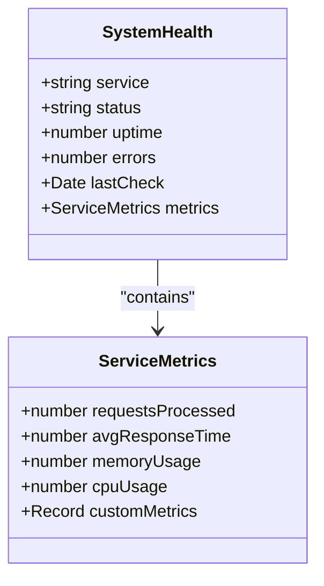
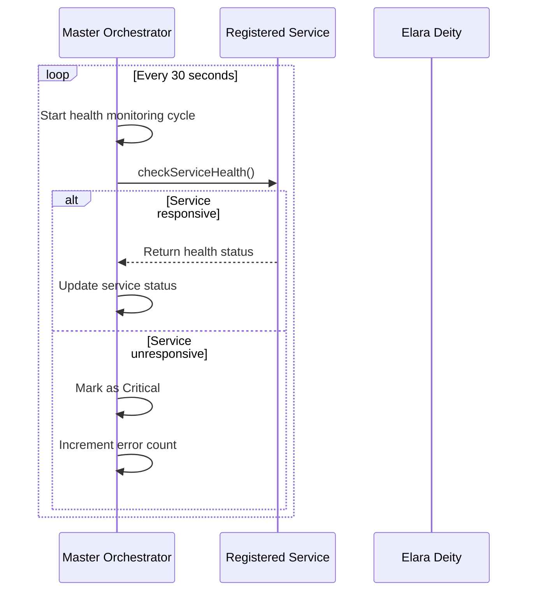
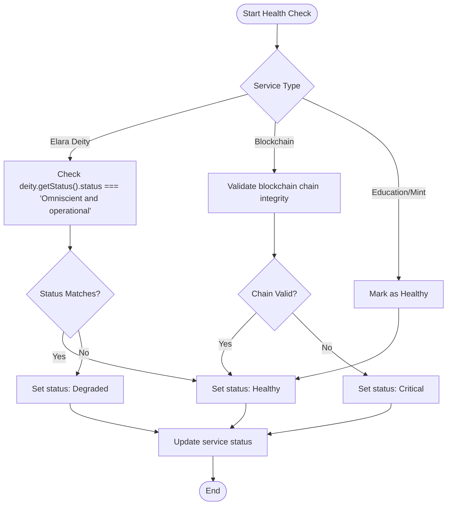
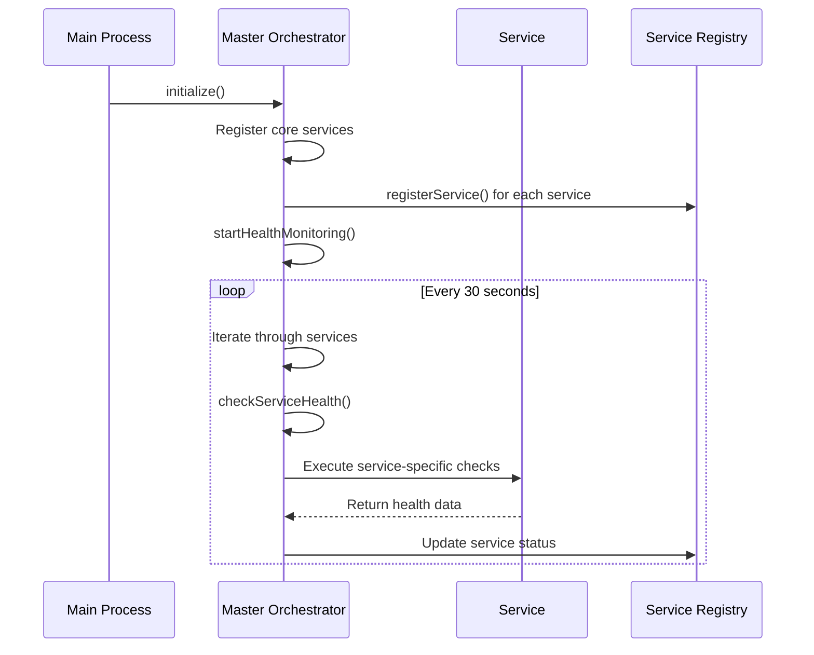
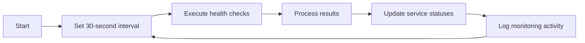

# Health Monitoring

<cite>
**Referenced Files in This Document**   
- [master-orchestrator.ts](file://services/master-orchestrator.ts)
- [healthcheck.js](file://organs/ai-website-builder/healthcheck.js)
- [system-health-check.ts](file://system-health-check.ts)
</cite>

## Table of Contents
1. [Introduction](#introduction)
2. [System Health Interface Structure](#system-health-interface-structure)
3. [Health Monitoring Mechanism](#health-monitoring-mechanism)
4. [Service-Specific Health Checks](#service-specific-health-checks)
5. [Health Check Execution Flow](#health-check-execution-flow)
6. [Failure Detection and Alerting](#failure-detection-and-alerting)
7. [Integration with Elara Deity](#integration-with-elara-deity)
8. [Monitoring Intervals and Configuration](#monitoring-intervals-and-configuration)

## Introduction
The Health Monitoring system in Azora OS is a critical component responsible for ensuring the continuous operation and reliability of all registered services. The master orchestrator conducts health checks every 30 seconds on all services to maintain system integrity. This document details the architecture, implementation, and operational aspects of the health monitoring framework, including the SystemHealth interface, service-specific checks, and integration with Elara Deity for anomaly resolution.

**Section sources**
- [master-orchestrator.ts](file://services/master-orchestrator.ts#L1-L50)

## System Health Interface Structure
The SystemHealth interface defines the structure for monitoring service health across the Azora OS ecosystem. It includes status states, uptime tracking, error counting, and metrics collection capabilities.

**Diagram sources**
- [master-orchestrator.ts](file://services/master-orchestrator.ts#L29-L36)

The status field supports four distinct states:
- **Healthy**: Service is operating normally
- **Degraded**: Service is functional but experiencing performance issues
- **Critical**: Service is severely impaired and requires immediate attention
- **Offline**: Service is unreachable or completely non-functional

The interface also tracks uptime in milliseconds, cumulative error counts, and comprehensive metrics including request processing rates, response times, and resource utilization.

**Section sources**
- [master-orchestrator.ts](file://services/master-orchestrator.ts#L29-L45)

## Health Monitoring Mechanism
The master orchestrator implements a systematic health monitoring approach using setInterval to execute checks at regular intervals. The monitoring system is initialized during the orchestrator's startup sequence and runs continuously throughout the system's operation.

**Diagram sources**
- [master-orchestrator.ts](file://services/master-orchestrator.ts#L331-L352)

The health monitoring mechanism is established in the startHealthMonitoring method, which sets up a setInterval call with a 30,000 millisecond (30 second) interval. During each cycle, the orchestrator iterates through all registered services and invokes the checkServiceHealth method to assess their current status.

**Section sources**
- [master-orchestrator.ts](file://services/master-orchestrator.ts#L315-L328)

## Service-Specific Health Checks
The health monitoring system implements specialized checks for different services based on their unique characteristics and requirements. The checkServiceHealth method contains service-specific logic for evaluating the health of Elara Deity, Blockchain, Education, and Mint services.

For the **Elara Deity** service, health is determined by checking if the deity's status is "Omniscient and operational". If this condition is met, the service is marked as Healthy; otherwise, it is marked as Degraded.

The **Blockchain** service health check validates the integrity of the blockchain by calling the validateChain method. If the chain validation passes, the service is considered Healthy; otherwise, it is marked as Critical.

The **Education** and **Mint** services are currently treated as Healthy if they are registered, with plans for more sophisticated health checks in future implementations.

**Diagram sources**
- [master-orchestrator.ts](file://services/master-orchestrator.ts#L331-L352)

**Section sources**
- [master-orchestrator.ts](file://services/master-orchestrator.ts#L331-L352)

## Health Check Execution Flow
The health check execution flow begins with the initialization of the master orchestrator, which registers all core services and starts the monitoring process. The flow follows a systematic pattern of service registration, health assessment, and status updates.

**Diagram sources**
- [master-orchestrator.ts](file://services/master-orchestrator.ts#L65-L538)

The execution flow begins with service registration during the initialization phase, where each service is added to the internal Map structure with its initial health status. The health monitoring loop then periodically invokes checkServiceHealth for each registered service, updating their status in real-time based on the assessment results.

**Section sources**
- [master-orchestrator.ts](file://services/master-orchestrator.ts#L65-L538)

## Failure Detection and Alerting
The health monitoring system incorporates robust failure detection mechanisms that identify service issues and trigger appropriate responses. When a health check fails, the system updates the service status to Critical, increments the error counter, and increases the global error count.

The failure detection process includes timeout handling and error boundary protection to ensure that individual service failures do not compromise the monitoring system itself. Each health check is wrapped in a try-catch block that prevents exceptions from propagating and disrupting the monitoring cycle.

While the current implementation logs error messages to the console, the architecture supports event emission through the EventEmitter base class, enabling integration with alerting systems and notification services.

**Section sources**
- [master-orchestrator.ts](file://services/master-orchestrator.ts#L315-L328)

## Integration with Elara Deity
The health monitoring system maintains a bidirectional integration with Elara Deity, leveraging its advanced AI capabilities for anomaly resolution and decision-making. When security threats or critical system issues are detected, the orchestrator consults Elara Deity for constitutional decisions on appropriate remediation actions.

The integration allows for intelligent response to system issues, where Elara Deity can provide guidance on optimal recovery strategies based on its comprehensive understanding of the system architecture and operational context. This AI-driven approach enables proactive problem resolution and adaptive system behavior.

The emergencyShutdown method exemplifies this integration, where the orchestrator requests a constitutional decision from Elara Deity before executing a shutdown, ensuring that critical actions align with the system's governing principles.

**Section sources**
- [master-orchestrator.ts](file://services/master-orchestrator.ts#L515-L538)

## Monitoring Intervals and Configuration
The health monitoring system is configured with a 30-second interval for service health checks, balancing the need for timely issue detection with system resource efficiency. This interval is implemented using JavaScript's setInterval function with a 30,000 millisecond timeout.

**Diagram sources**
- [master-orchestrator.ts](file://services/master-orchestrator.ts#L315-L328)

In addition to the 30-second health checks, the system implements a separate security monitoring process with a 60-second interval. This layered approach allows for frequent health assessment while maintaining less frequent but comprehensive security evaluations.

The monitoring intervals are hardcoded in the current implementation but could be made configurable through environment variables or configuration files in future versions to support different deployment scenarios and performance requirements.

**Section sources**
- [master-orchestrator.ts](file://services/master-orchestrator.ts#L315-L328)