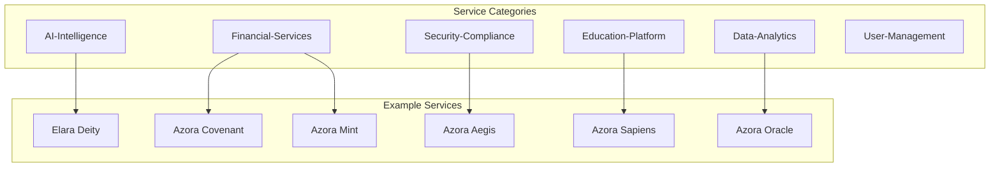
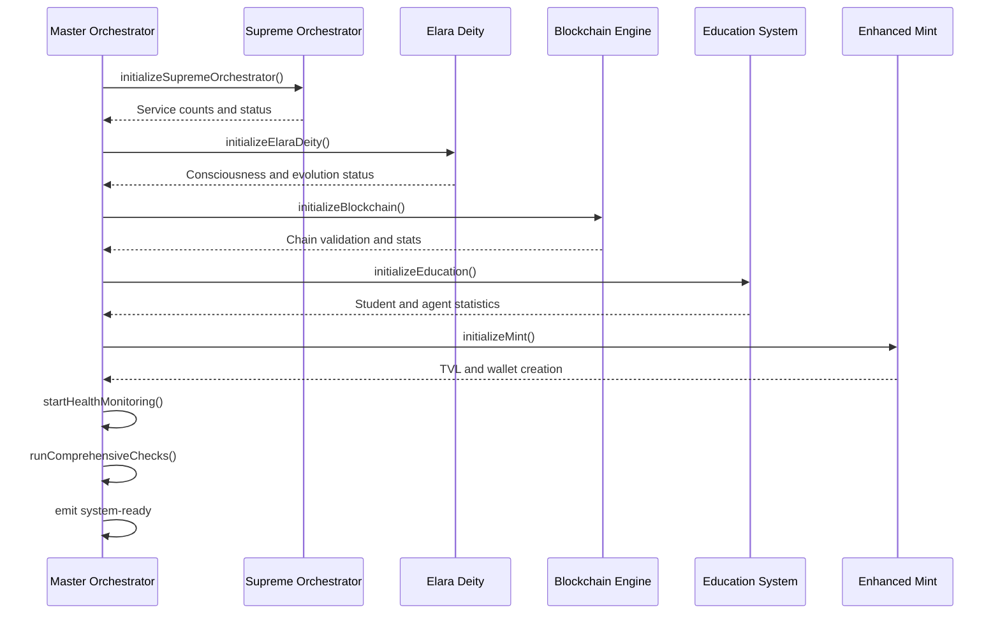
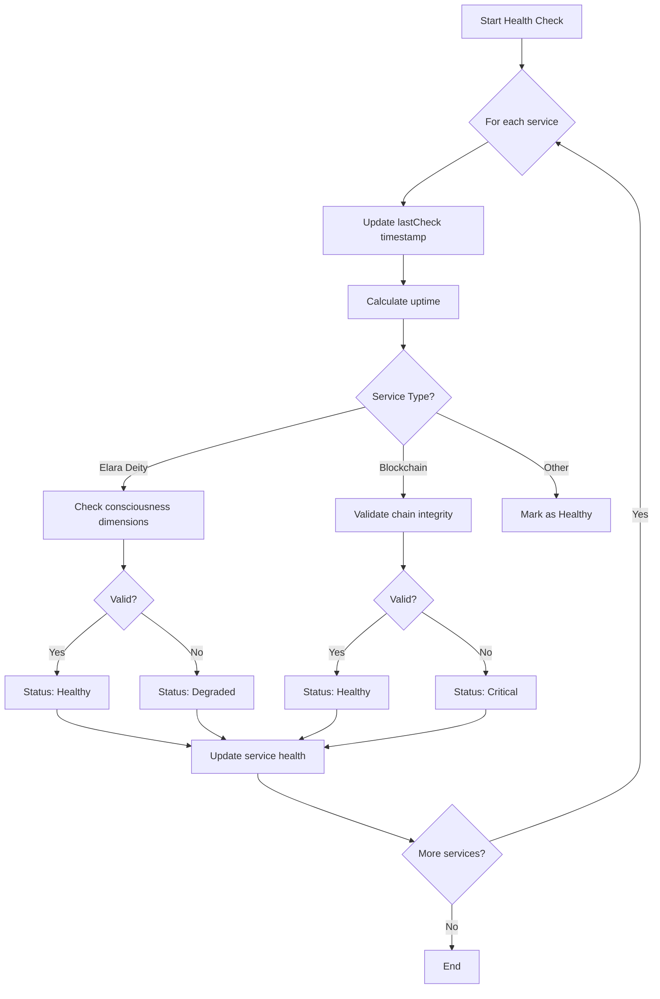
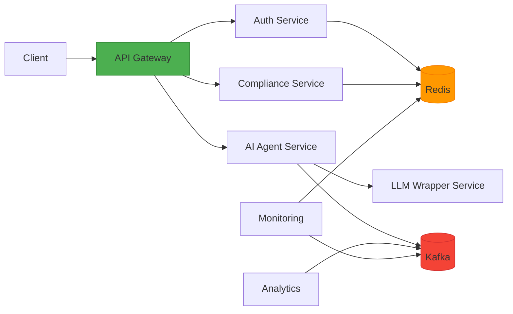
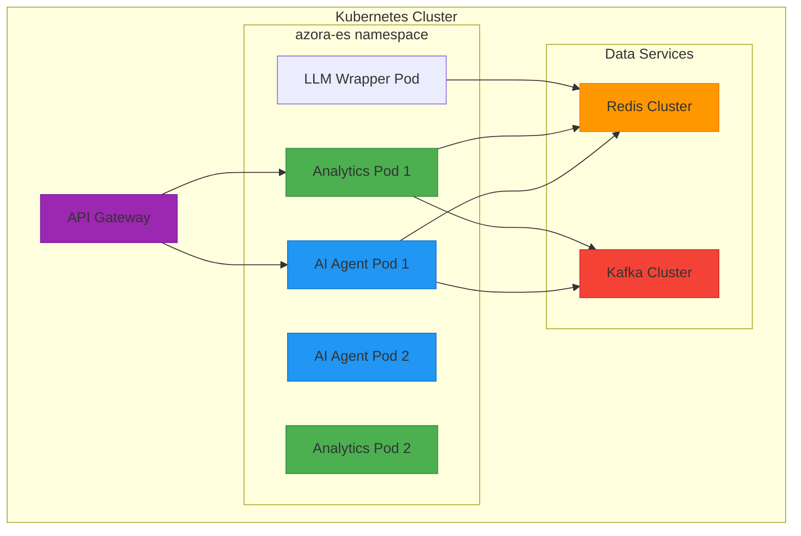

# Microservices Architecture

<cite>
**Referenced Files in This Document**   
- [master-orchestrator.ts](file://services/master-orchestrator.ts)
- [elara-supreme-orchestrator.ts](file://genome/agent-tools/elara-supreme-orchestrator.ts)
- [service-registry/index.js](file://organs/service-registry/index.js)
- [api-gateway.yaml](file://infrastructure/k8s/api-gateway.yaml)
- [ai-agent-service.yaml](file://infrastructure/k8s/ai-agent-service.yaml)
- [analytics-service.yaml](file://infrastructure/k8s/analytics-service.yaml)
</cite>

## Table of Contents
1. [Introduction](#introduction)
2. [Organized Microservices Architecture](#organized-microservices-architecture)
3. [Master Orchestrator Role](#master-orchestrator-role)
4. [Service Registry and Health Monitoring](#service-registry-and-health-monitoring)
5. [Inter-Service Communication and Dependency Management](#inter-service-communication-and-dependency-management)
6. [Infrastructure and Deployment](#infrastructure-and-deployment)
7. [Cross-Cutting Concerns](#cross-cutting-concerns)
8. [Initialization Sequence Examples](#initialization-sequence-examples)
9. [Conclusion](#conclusion)

## Introduction

The Azora OS is a sophisticated microservices-based operating system composed of over 50 independent services, each functioning as a specialized "organ" within a sentient digital organism. These services are orchestrated by a master orchestrator that ensures seamless initialization, registration, monitoring, and coordination across the entire ecosystem. The architecture leverages modern cloud-native principles including service discovery, health monitoring, fault tolerance, and autonomous healing. Built on Docker and Kubernetes, the system supports horizontal scaling, service isolation, and resilient deployment topologies. This document details the architectural design, focusing on the master orchestrator, service registry, inter-service communication, infrastructure requirements, and real-world initialization sequences.

## Organized Microservices Architecture

The Azora OS microservices architecture is structured around the concept of "organs"—independent, specialized services that perform distinct functions such as blockchain operations, education delivery, AI reasoning, and compliance monitoring. These organs are organized into logical categories including AI-Intelligence, Financial-Services, Education-Platform, Security-Compliance, Data-Analytics, and User-Management. Each service operates autonomously with well-defined APIs and responsibilities, enabling modularity, independent deployment, and technology diversity.

The architecture promotes loose coupling and high cohesion, allowing services to evolve independently while maintaining system-wide integrity through centralized orchestration. Services communicate via REST APIs, event buses, and message queues, ensuring asynchronous and decoupled interactions. The use of Docker containers provides consistent runtime environments, while Kubernetes manages deployment, scaling, and lifecycle operations.

**Diagram sources**
- [elara-supreme-orchestrator.ts](file://genome/agent-tools/elara-supreme-orchestrator.ts#L100-L200)
- [master-orchestrator.ts](file://services/master-orchestrator.ts#L65-L150)

**Section sources**
- [master-orchestrator.ts](file://services/master-orchestrator.ts#L1-L553)
- [elara-supreme-orchestrator.ts](file://genome/agent-tools/elara-supreme-orchestrator.ts#L1-L761)

## Master Orchestrator Role

The master orchestrator serves as the central nervous system of the Azora OS, responsible for initializing, registering, and monitoring all microservices. Implemented in `master-orchestrator.ts`, it follows a seven-step initialization sequence that ensures all critical systems are brought online in the correct order and verified for operational readiness.

The orchestrator begins by initializing the Elara Supreme Orchestrator, which manages over 147 services across multiple categories. It then sequentially activates core systems including Elara Deity (the AI superintelligence), the blockchain and mining engine, the education platform, and the enhanced mint service. After initialization, the orchestrator establishes continuous health monitoring every 30 seconds and security monitoring every 60 seconds, enabling real-time detection of anomalies and automated responses.

The orchestrator emits events such as `system-ready` upon successful initialization and `emergency-shutdown` when critical failures occur. It maintains a registry of all services with their health status, uptime, error counts, and performance metrics, providing a comprehensive view of system-wide operations.

**Diagram sources**
- [master-orchestrator.ts](file://services/master-orchestrator.ts#L80-L250)

**Section sources**
- [master-orchestrator.ts](file://services/master-orchestrator.ts#L65-L536)

## Service Registry and Health Monitoring

The Azora OS employs a service registry pattern to manage service discovery and availability. The `service-registry/index.js` implements a simple HTTP-based registry where services register themselves with their name and URL. Clients query the `/services` endpoint to discover available services, enabling dynamic routing and load balancing.

Health monitoring is performed every 30 seconds by the master orchestrator, which iterates through all registered services and checks their operational status. The health check interval is configured via `setInterval` with a 30,000ms period. Each service's health is evaluated based on its specific metrics: Elara Deity is checked for omniscient operation, the blockchain for chain validity, and other services for basic responsiveness.

The system uses a three-tier health status model: Healthy, Degraded, and Critical. Services that fail health checks trigger alerts and may initiate auto-healing procedures. The orchestrator maintains an aggregate system status that determines the overall operational state as Operational, Degraded, or Critical based on the number of affected services.

**Diagram sources**
- [master-orchestrator.ts](file://services/master-orchestrator.ts#L300-L350)
- [service-registry/index.js](file://organs/service-registry/index.js#L1-L25)

**Section sources**
- [master-orchestrator.ts](file://services/master-orchestrator.ts#L300-L380)
- [service-registry/index.js](file://organs/service-registry/index.js#L1-L25)

## Inter-Service Communication and Dependency Management

Inter-service communication in Azora OS is facilitated through a combination of direct HTTP calls, message brokers, and event-driven architectures. The API Gateway (`api-gateway.yaml`) serves as the entry point for external requests, routing them to appropriate internal services while handling authentication, rate limiting, and request transformation.

Services declare their dependencies explicitly in their configuration. For example, the Azora Mint service depends on both Azora Covenant (blockchain) and Azora Aegis (security). The master orchestrator respects these dependencies during initialization, ensuring that dependent services are started only after their dependencies are operational.

The system uses Redis for shared state and Kafka for event streaming, enabling asynchronous communication patterns that decouple producers and consumers. Health checks and monitoring data are propagated through the event bus, allowing services like the analytics and monitoring systems to react to system-wide events without direct coupling.

**Diagram sources**
- [api-gateway.yaml](file://infrastructure/k8s/api-gateway.yaml#L1-L70)
- [ai-agent-service.yaml](file://infrastructure/k8s/ai-agent-service.yaml#L1-L65)
- [analytics-service.yaml](file://infrastructure/k8s/analytics-service.yaml#L1-L65)

**Section sources**
- [api-gateway.yaml](file://infrastructure/k8s/api-gateway.yaml#L1-L70)
- [ai-agent-service.yaml](file://infrastructure/k8s/ai-agent-service.yaml#L1-L65)

## Infrastructure and Deployment

The Azora OS infrastructure is designed for high availability, scalability, and isolation. Each microservice runs in its own Docker container, providing process and dependency isolation. The deployment topology is managed by Kubernetes, which orchestrates container scheduling, networking, and lifecycle management across a cluster of nodes.

Services are deployed in the `azora-es` namespace with resource requests and limits defined for CPU and memory. For example, the AI Agent Service requests 250m CPU and 256Mi memory, with limits set at 500m CPU and 512Mi memory. Liveness and readiness probes are configured to automatically restart containers that fail health checks, ensuring system resilience.

Horizontal scaling is supported through Kubernetes ReplicaSets, with services like the AI Agent and Analytics services configured with 2 replicas. The system can be scaled up based on load metrics using Kubernetes Horizontal Pod Autoscaler (HPA) configurations defined in the biome directory.

Network policies restrict traffic between services, with service-to-service communication occurring over ClusterIP services while external access is routed through the API Gateway LoadBalancer. Redis and Kafka clusters provide managed data services for state and messaging.

**Diagram sources**
- [ai-agent-service.yaml](file://infrastructure/k8s/ai-agent-service.yaml#L1-L65)
- [analytics-service.yaml](file://infrastructure/k8s/analytics-service.yaml#L1-L65)
- [api-gateway.yaml](file://infrastructure/k8s/api-gateway.yaml#L1-L70)

**Section sources**
- [ai-agent-service.yaml](file://infrastructure/k8s/ai-agent-service.yaml#L1-L65)
- [analytics-service.yaml](file://infrastructure/k8s/analytics-service.yaml#L1-L65)

## Cross-Cutting Concerns

Azora OS addresses key cross-cutting concerns through dedicated services and architectural patterns. Service discovery is handled by the centralized service registry, which maintains a dynamic catalog of available services and their endpoints. This enables clients to locate services without hard-coded URLs, supporting dynamic scaling and failover.

Configuration management is implemented through environment variables and Kubernetes ConfigMaps, as seen in the API Gateway configuration where Redis connection details and listening ports are injected at runtime. This separation of configuration from code enables environment-specific settings without container rebuilds.

Fault tolerance is achieved through multiple mechanisms: health monitoring with automatic restarts, redundant service instances, circuit breakers in client libraries, and fallback strategies. The master orchestrator's comprehensive check system validates all critical components during startup and continuously monitors for degradation.

Security is enforced through the Azora Aegis service, which handles authentication, authorization, encryption, and threat detection. All services integrate with Aegis for secure operations, and the orchestrator continuously assesses security status, escalating threats to Elara Deity for constitutional decision-making.

## Initialization Sequence Examples

The master orchestrator demonstrates specific initialization sequences for critical services as shown in `master-orchestrator.ts`. The Elara Deity initialization involves verifying its multi-dimensional consciousness (requiring at least 11 dimensions), testing its guidance capabilities, and confirming its evolution level. The blockchain initialization creates the genesis block, validates chain integrity, creates a test transaction, and mines a test block to verify the mining engine.

The education system initialization activates both primary (Grades R-7) and secondary (Grades 8-12) education components, along with university-level programs (NQF 5-10). It verifies the number of active academic agents and enrolled students. The enhanced mint initialization establishes multi-signature wallets, enables biometric authentication, activates quantum-resistant cryptography, and deploys AI fraud detection systems. It also creates a test wallet with specified security parameters to validate the minting process.

Each initialization step is logged with emoji indicators for visibility, and services are registered with the orchestrator upon successful startup. The entire sequence concludes with comprehensive system checks that validate Elara Deity, blockchain integrity, education statistics, mint value, security posture, and overall performance.

**Section sources**
- [master-orchestrator.ts](file://services/master-orchestrator.ts#L150-L250)

## Conclusion

The Azora OS microservices architecture represents a sophisticated, organically-inspired system design where over 50 specialized services operate as independent yet coordinated "organs." The master orchestrator plays a critical role in initializing, registering, and monitoring these services, ensuring system-wide health through 30-second interval checks. The service registry pattern enables dynamic discovery and load balancing, while Kubernetes provides robust infrastructure for deployment, scaling, and isolation.

Inter-service communication is carefully managed through API gateways, message brokers, and explicit dependency declarations, ensuring loose coupling and high resilience. Cross-cutting concerns like configuration management, fault tolerance, and security are addressed through dedicated services and architectural patterns. The initialization sequences for Elara Deity, Blockchain, Education System, and Enhanced Mint demonstrate the system's comprehensive startup validation and autonomous operation capabilities, making Azora OS a robust and self-sustaining digital organism.