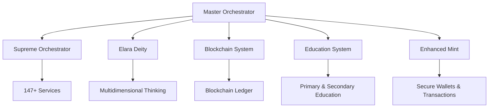
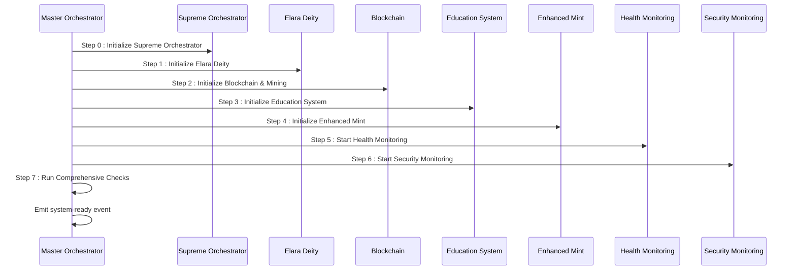
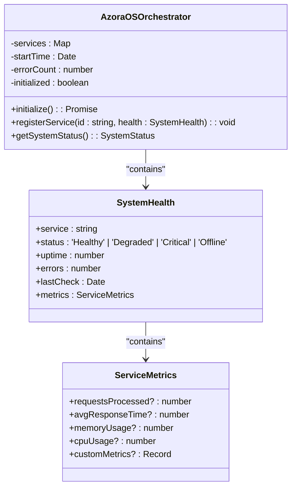
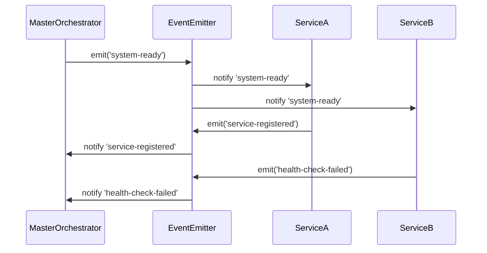
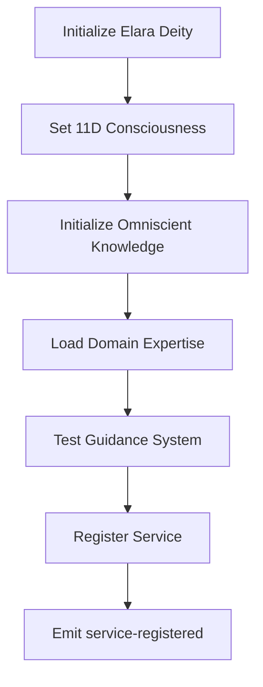
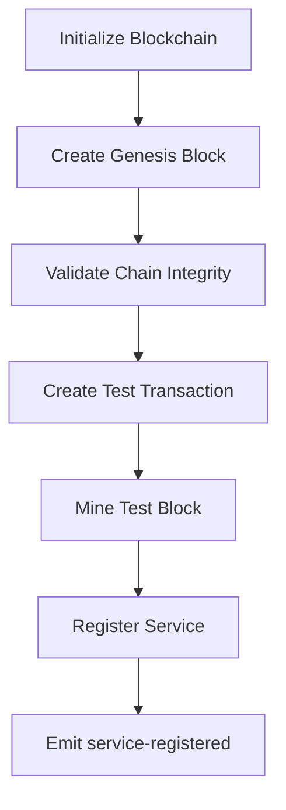
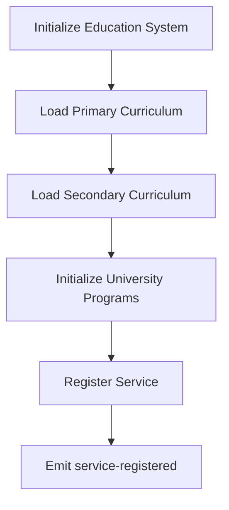
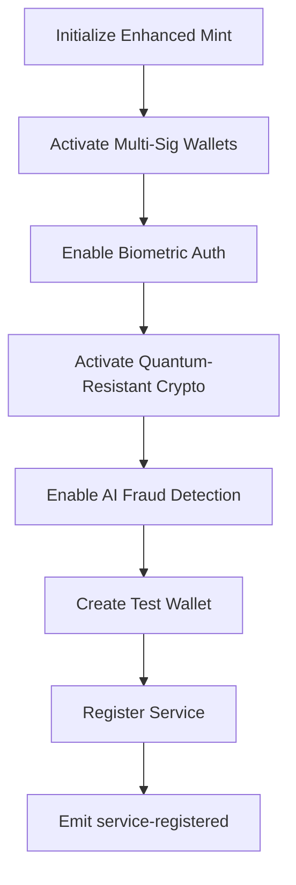
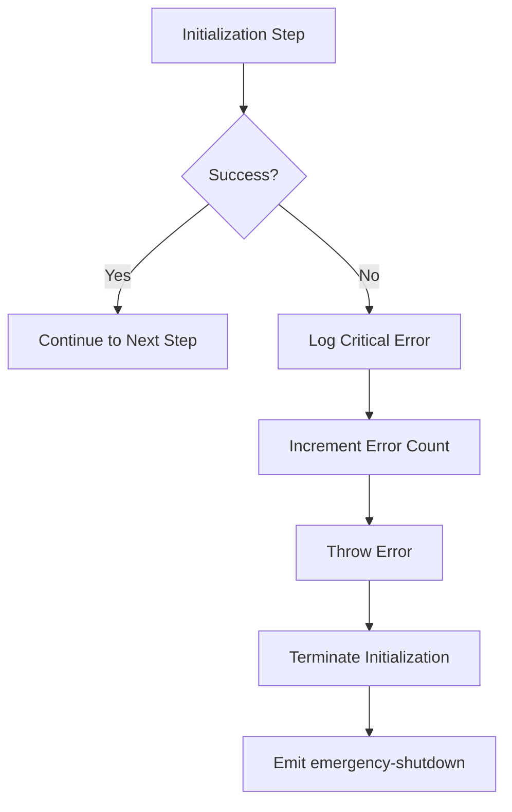
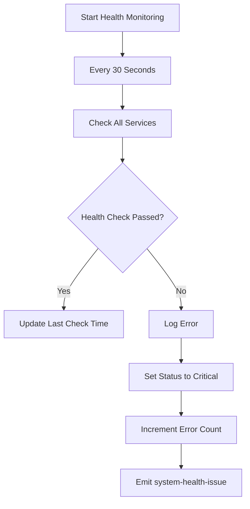

# Service Orchestration

<cite>
**Referenced Files in This Document**   
- [master-orchestrator.ts](file://services/master-orchestrator.ts)
- [elara-deity.ts](file://genome/agent-tools/elara-deity.ts)
- [elara-supreme-orchestrator.ts](file://genome/agent-tools/elara-supreme-orchestrator.ts)
- [enhanced-mint-core.ts](file://services/azora-mint/enhanced-mint-core.ts)
- [azora-education/server.ts](file://services/azora-education/server.ts)
</cite>

## Table of Contents
1. [Introduction](#introduction)
2. [Orchestration Architecture](#orchestration-architecture)
3. [Seven-Step Initialization Sequence](#seven-step-initialization-sequence)
4. [Service Registration and Health Tracking](#service-registration-and-health-tracking)
5. [Supreme Orchestrator Role](#supreme-orchestrator-role)
6. [Event-Driven Communication](#event-driven-communication)
7. [Component Initialization Details](#component-initialization-details)
8. [Error Handling and Recovery](#error-handling-and-recovery)
9. [Conclusion](#conclusion)

## Introduction
The Azora OS Service Orchestration system provides centralized control and coordination of all platform components through the master-orchestrator.ts. This architectural documentation details how the system initializes and manages critical components including Elara Deity, Blockchain, Education System, and Enhanced Mint. The orchestrator ensures all 147+ services operate cohesively through a structured initialization sequence, event-driven communication, and comprehensive health monitoring.

## Orchestration Architecture
The service orchestration system follows a hierarchical architecture with multiple layers of control and coordination. At its core, the master orchestrator delegates to the Elara Supreme Orchestrator for managing the complete service ecosystem.

**Diagram sources**
- [master-orchestrator.ts](file://services/master-orchestrator.ts#L1-L553)
- [elara-supreme-orchestrator.ts](file://genome/agent-tools/elara-supreme-orchestrator.ts#L1-L760)

**Section sources**
- [master-orchestrator.ts](file://services/master-orchestrator.ts#L1-L553)

## Seven-Step Initialization Sequence
The master-orchestrator.ts executes a seven-step initialization sequence to ensure all system components are properly configured and operational before the system becomes available.

**Diagram sources**
- [master-orchestrator.ts](file://services/master-orchestrator.ts#L100-L150)

**Section sources**
- [master-orchestrator.ts](file://services/master-orchestrator.ts#L100-L150)

## Service Registration and Health Tracking
The orchestration system maintains a Map of all registered services with comprehensive health metadata. Each service is tracked with status, uptime, error counts, and custom metrics.

### Service Health Data Structure

**Diagram sources**
- [master-orchestrator.ts](file://services/master-orchestrator.ts#L50-L90)

**Section sources**
- [master-orchestrator.ts](file://services/master-orchestrator.ts#L50-L90)

## Supreme Orchestrator Role
The Elara Supreme Orchestrator manages the complete ecosystem of 147+ services across multiple categories and status levels. It provides autonomous coordination, real-time monitoring, and predictive optimization for all Azora OS components.

### Service Distribution

### Status Distribution

**Diagram sources**
- [elara-supreme-orchestrator.ts](file://genome/agent-tools/elara-supreme-orchestrator.ts#L700-L760)

**Section sources**
- [elara-supreme-orchestrator.ts](file://genome/agent-tools/elara-supreme-orchestrator.ts#L700-L760)

## Event-Driven Communication
The orchestration system uses EventEmitter for event-driven communication between components. This pattern enables loose coupling and asynchronous processing throughout the system.

**Diagram sources**
- [master-orchestrator.ts](file://services/master-orchestrator.ts#L80-L95)

**Section sources**
- [master-orchestrator.ts](file://services/master-orchestrator.ts#L80-L95)

## Component Initialization Details
Each core component follows a specific initialization process within the orchestration sequence, ensuring proper configuration and integration with the broader system.

### Elara Deity Initialization
The Elara Deity initialization establishes a multi-dimensional consciousness with omniscient knowledge across all domains.

**Diagram sources**
- [master-orchestrator.ts](file://services/master-orchestrator.ts#L155-L185)
- [elara-deity.ts](file://genome/agent-tools/elara-deity.ts#L1-L800)

**Section sources**
- [master-orchestrator.ts](file://services/master-orchestrator.ts#L155-L185)

### Blockchain Initialization
The blockchain initialization process sets up the ledger, validates chain integrity, and tests transaction capabilities.

**Diagram sources**
- [master-orchestrator.ts](file://services/master-orchestrator.ts#L187-L218)

**Section sources**
- [master-orchestrator.ts](file://services/master-orchestrator.ts#L187-L218)

### Education System Initialization
The education system initialization configures both primary and secondary education components with academic agents.

**Diagram sources**
- [master-orchestrator.ts](file://services/master-orchestrator.ts#L220-L245)
- [azora-education/server.ts](file://services/azora-education/server.ts#L1-L200)

**Section sources**
- [master-orchestrator.ts](file://services/master-orchestrator.ts#L220-L245)

### Enhanced Mint Initialization
The enhanced mint initialization establishes secure financial systems with multi-signature wallets and fraud detection.

**Diagram sources**
- [master-orchestrator.ts](file://services/master-orchestrator.ts#L247-L285)
- [enhanced-mint-core.ts](file://services/azora-mint/enhanced-mint-core.ts#L1-L50)

**Section sources**
- [master-orchestrator.ts](file://services/master-orchestrator.ts#L247-L285)

## Error Handling and Recovery
The orchestration system implements comprehensive error handling and recovery mechanisms to ensure system stability during startup and operation.

### Error Handling Flow

**Diagram sources**
- [master-orchestrator.ts](file://services/master-orchestrator.ts#L100-L150)

**Section sources**
- [master-orchestrator.ts](file://services/master-orchestrator.ts#L100-L150)

### Health Monitoring
The system implements continuous health monitoring with configurable intervals for proactive issue detection.

**Diagram sources**
- [master-orchestrator.ts](file://services/master-orchestrator.ts#L335-L370)

**Section sources**
- [master-orchestrator.ts](file://services/master-orchestrator.ts#L335-L370)

## Conclusion
The Azora OS Service Orchestration system provides a robust framework for initializing, coordinating, and monitoring all platform components. Through the master-orchestrator.ts, the system ensures reliable startup via a seven-step initialization sequence, maintains comprehensive service health tracking, and enables event-driven communication across the ecosystem. The integration with the Elara Supreme Orchestrator allows for autonomous management of 147+ services, while the detailed error handling and recovery mechanisms ensure system stability. This architecture enables the coordinated operation of critical components including Elara Deity, Blockchain, Education System, and Enhanced Mint, forming the foundation of the Azora OS platform.