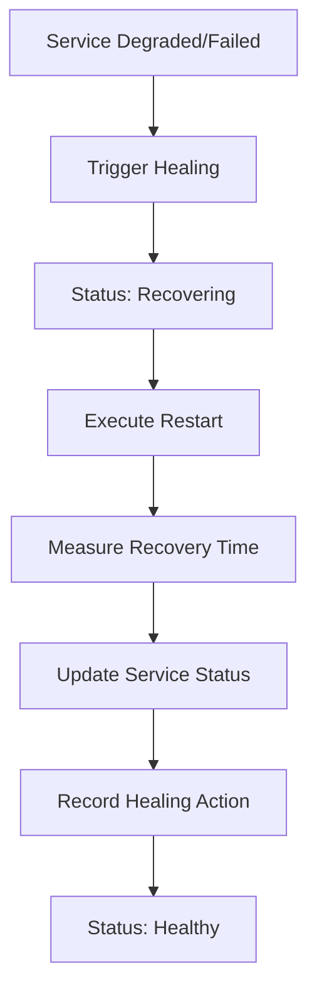
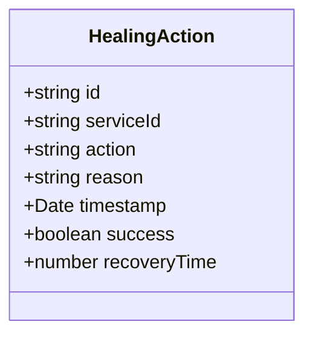
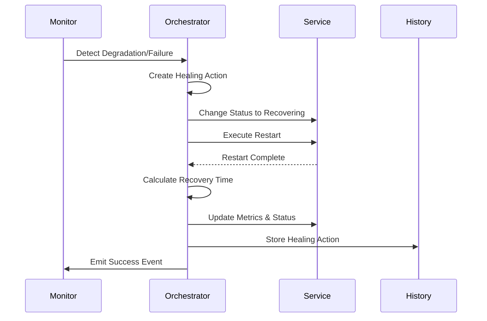

# Healing Actions

<cite>
**Referenced Files in This Document**   
- [self-healing-orchestrator.ts](file://services/self-healing-orchestrator.ts)
</cite>

## Table of Contents
1. [Introduction](#introduction)
2. [Healing Actions Overview](#healing-actions-overview)
3. [Healing Action Interface Structure](#healing-action-interface-structure)
4. [Automatic Healing Process](#automatic-healing-process)
5. [Healing History Tracking](#healing-history-tracking)
6. [Potential Extensions for Other Healing Actions](#potential-extensions-for-other-healing-actions)

## Introduction
The Self-Healing Infrastructure is designed to maintain system stability by automatically detecting and resolving service issues. This document focuses on the Healing Actions component, which implements autonomous recovery mechanisms for degraded or failed services. The current implementation centers on the 'restart' action, with a framework designed to support additional healing strategies including scale-up, rollback, and circuit-break.

**Section sources**
- [self-healing-orchestrator.ts](file://services/self-healing-orchestrator.ts#L1-L50)

## Healing Actions Overview
The Healing Actions component provides four primary recovery strategies: restart, scale-up, rollback, and circuit-break. Currently, the 'restart' action is fully implemented in the `healService` method of the SelfHealingOrchestrator class. This action is triggered when services experience performance degradation or complete failure.

The restart healing action follows a systematic process:
1. Service status changes to 'recovering'
2. Service restart is simulated (or executed in production)
3. Recovery time is measured from start to completion
4. Success is confirmed and recorded in healing history

**Diagram sources**
- [self-healing-orchestrator.ts](file://services/self-healing-orchestrator.ts#L143-L180)

**Section sources**
- [self-healing-orchestrator.ts](file://services/self-healing-orchestrator.ts#L143-L180)

## Healing Action Interface Structure
The HealingAction interface defines the structure for all healing operations within the system. Each healing action contains the following properties:

- **id**: Unique identifier for the healing action
- **serviceId**: Identifier of the affected service
- **action**: Type of healing action ('restart', 'scale-up', 'rollback', 'circuit-break')
- **reason**: Explanation for the healing action
- **timestamp**: When the healing was initiated
- **success**: Boolean flag indicating success status
- **recoveryTime**: Duration of the healing process in milliseconds (optional)

**Diagram sources**
- [self-healing-orchestrator.ts](file://services/self-healing-orchestrator.ts#L30-L38)

**Section sources**
- [self-healing-orchestrator.ts](file://services/self-healing-orchestrator.ts#L30-L38)

## Automatic Healing Process
The automatic healing process is initiated when the system detects service issues through continuous monitoring. Two primary conditions trigger healing:
- **Performance degradation**: Response time exceeds threshold or error rate increases
- **Service failure**: Complete unresponsiveness or critical errors

When a service is detected as degraded or failed, the healing sequence executes as follows:

1. The service status is updated to 'recovering'
2. The healing action is created with appropriate metadata
3. The restart operation is performed
4. Recovery time is calculated
5. Service metrics are updated post-recovery
6. Healing action is recorded in history
7. Success event is emitted

**Diagram sources**
- [self-healing-orchestrator.ts](file://services/self-healing-orchestrator.ts#L143-L180)

**Section sources**
- [self-healing-orchestrator.ts](file://services/self-healing-orchestrator.ts#L143-L180)

## Healing History Tracking
The Self-Healing Orchestrator maintains a comprehensive history of all healing actions through the `healingHistory` array. This history enables auditing, performance analysis, and system improvement.

Key features of the healing history tracking:
- Stores completed healing actions in chronological order
- Provides retrieval with configurable limits
- Returns results in reverse chronological order (most recent first)
- Supports emergency manual healing through the `forceHeal` method

The `getHealingHistory` method allows retrieval of healing records with a specified limit, returning the most recent actions first. This enables monitoring tools and administrators to track system resilience over time.

**Section sources**
- [self-healing-orchestrator.ts](file://services/self-healing-orchestrator.ts#L225-L248)

## Potential Extensions for Other Healing Actions
While the current implementation focuses on the 'restart' action, the framework is designed to support additional healing strategies:

**Scale-up**: Automatically increase service instances or resources when under heavy load
**Rollback**: Revert to a previous stable version when issues are detected in current deployment
**Circuit-break**: Temporarily halt requests to a failing service to prevent cascading failures

The HealingAction interface already includes these action types in its union type definition, indicating planned support. Implementation would follow the same pattern as the restart action, with specific logic for each strategy:

- Scale-up would integrate with orchestration platforms (Kubernetes, Docker Swarm)
- Rollback would coordinate with deployment systems and version control
- Circuit-break would work with service mesh components and API gateways

The modular design allows new healing actions to be added without disrupting existing functionality, maintaining the system's self-healing capabilities while expanding its recovery options.

**Section sources**
- [self-healing-orchestrator.ts](file://services/self-healing-orchestrator.ts#L30-L38)