# Monitoring System

<cite>
**Referenced Files in This Document**   
- [self-healing-orchestrator.ts](file://services/self-healing-orchestrator.ts)
- [MONITORING.md](file://codex/MONITORING.md)
</cite>

## Table of Contents
1. [Introduction](#introduction)
2. [Monitoring Architecture](#monitoring-architecture)
3. [Core Components](#core-components)
4. [Health Check Implementation](#health-check-implementation)
5. [Service Status Transitions](#service-status-transitions)
6. [Event Emission and Integration](#event-emission-and-integration)
7. [System Observability](#system-observability)
8. [Threshold Tuning and Optimization](#threshold-tuning-and-optimization)
9. [Troubleshooting Guide](#troubleshooting-guide)

## Introduction

The Monitoring System component of the Self-Healing Infrastructure is responsible for continuously assessing the health of all services within the Azora OS ecosystem. This system operates as an autonomous orchestrator that performs regular health checks, detects service degradation or failures, and initiates automatic recovery procedures when necessary. The monitoring system is implemented in the SelfHealingOrchestrator class, which extends EventEmitter to facilitate event-driven communication with other components of the system.

The primary objective of this monitoring system is to ensure high availability and reliability of services by detecting issues before they impact end users and automatically resolving them through healing actions. This document provides a comprehensive analysis of the monitoring system's implementation, focusing on its health check frequency, metrics collection, detection logic, and integration with the broader orchestration framework.

**Section sources**
- [self-healing-orchestrator.ts](file://services/self-healing-orchestrator.ts#L40-L244)

## Monitoring Architecture

The monitoring system follows a centralized architecture where the SelfHealingOrchestrator acts as the central monitoring entity that coordinates health checks across all registered services. The architecture is designed to be lightweight and efficient, with minimal overhead on the monitored services.

The system integrates with the broader observability stack of Azora OS, which includes Prometheus for metrics collection, Grafana for visualization, and AlertManager for alerting. While the SelfHealingOrchestrator performs active health checks and automatic healing, it also exposes metrics that can be scraped by Prometheus for long-term monitoring and analysis.


**Diagram sources**
- [self-healing-orchestrator.ts](file://services/self-healing-orchestrator.ts#L40-L244)
- [MONITORING.md](file://codex/MONITORING.md#L1-L241)

## Core Components

The monitoring system consists of several key components that work together to provide comprehensive service monitoring and automatic healing capabilities. The primary component is the SelfHealingOrchestrator class, which manages the monitoring lifecycle and coordinates healing actions.

The system maintains a Map of ServiceHealth objects, each representing a monitored service with its current status, performance metrics, and historical data. The HealingAction interface defines the structure of healing operations, including metadata about the action taken, the reason for healing, and the outcome.

The orchestrator also maintains a healing history that records all healing actions taken, providing valuable insights for post-incident analysis and system optimization. This history can be queried to understand the frequency and effectiveness of healing operations across the system.

**Section sources**
- [self-healing-orchestrator.ts](file://services/self-healing-orchestrator.ts#L1-L50)

## Health Check Implementation

The monitoring system performs health checks every 5 seconds using the CHECK_INTERVAL constant defined in the SelfHealingOrchestrator class. This interval is set to 5000 milliseconds and is used to schedule periodic execution of the checkAllServices method through JavaScript's setInterval function.

During each health check cycle, the system collects several key metrics for each monitored service:
- **Response time**: The time taken for the service to respond to a health check request
- **Error rate**: The percentage of requests that result in errors
- **Uptime**: The percentage of time the service has been available
- **Service status**: The current health state of the service (healthy, degraded, failed, or recovering)

The checkAllServices method iterates through all registered services and invokes the checkService method for each one. In the current implementation, health checks are simulated using random values, but in production, these would involve actual API calls to the services' health endpoints.


**Diagram sources**
- [self-healing-orchestrator.ts](file://services/self-healing-orchestrator.ts#L100-L104)
- [self-healing-orchestrator.ts](file://services/self-healing-orchestrator.ts#L109-L138)

**Section sources**
- [self-healing-orchestrator.ts](file://services/self-healing-orchestrator.ts#L70-L75)

## Service Status Transitions

The monitoring system implements a state machine for service health with four distinct states: healthy, degraded, failed, and recovering. The detection logic determines when a service transitions between these states based on the collected metrics.

A service is considered to be in a 'healthy' state when both of the following conditions are met:
- Response time is less than 1000ms
- Error rate is less than 5%

When a service in the 'healthy' state exceeds either of these thresholds, it transitions to the 'degraded' state. This indicates performance issues that may affect user experience but do not completely prevent service functionality.

If the error rate exceeds 10%, the service transitions directly to the 'failed' state, regardless of its previous state. This represents a critical failure that requires immediate intervention.

The system also detects recovery events. When a service that was previously degraded or failed returns to acceptable performance levels, it transitions back to the 'healthy' state, and this recovery is logged accordingly.

```mermaid
stateDiagram-v2
[*] --> Healthy
Healthy --> Degraded : responseTime > 1000ms<br/>or errorRate ≥ 5%
Healthy --> Failed : errorRate > 10%
Degraded --> Failed : errorRate > 10%
Failed --> Recovering : healService() called
Recovering --> Healthy : restart complete
Degraded --> Healthy : responseTime ≤ 1000ms<br/>and errorRate < 5%
Healthy --> Recovering : forceHeal() called
```



**Diagram sources**
- [self-healing-orchestrator.ts](file://services/self-healing-orchestrator.ts#L109-L138)

**Section sources**
- [self-healing-orchestrator.ts](file://services/self-healing-orchestrator.ts#L115-L135)

## Event Emission and Integration

The SelfHealingOrchestrator integrates with the broader system through event emission, leveraging its inheritance from EventEmitter. This event-driven architecture allows other components to subscribe to monitoring events and react accordingly.

The system emits several key events:
- 'monitoring-started': Emitted when monitoring begins
- 'service-healed': Emitted after a successful healing action, with details of the action

These events enable loose coupling between the monitoring system and other components, allowing for flexible integration patterns. For example, an alerting service could subscribe to 'service-healed' events to notify operations teams of automatic recovery actions, while a metrics aggregation service could use these events to update dashboards in real-time.

The event emission pattern also supports extensibility, as new events can be added to communicate additional monitoring information without modifying the core monitoring logic.

**Section sources**
- [self-healing-orchestrator.ts](file://services/self-healing-orchestrator.ts#L65-L68)
- [self-healing-orchestrator.ts](file://services/self-healing-orchestrator.ts#L178-L180)

## System Observability

The monitoring system enhances system observability through comprehensive console logging that provides real-time visibility into service health and healing operations. The console output uses emoji indicators to quickly convey the status of services and actions:

- ✅ for successful operations and healthy services
- ⚠️ for warnings and degraded services
- ❌ for failures and critical issues
- 🔧 for healing operations
- 🔄 for restarts

Example console output during monitoring:
```
🔮 SELF-HEALING ORCHESTRATOR ACTIVATED
   Auto-healing: ENABLED
   Check interval: 5 seconds
   Divine oversight: ACTIVE

✅ Registered: API Gateway (api-gateway)
⚠️  Email Service DEGRADED (response: 1250ms, errors: 6.2%)
🔧 HEALING: Email Service...
   🔄 Restarting Email Service...
   ✅ Email Service healed in 1042ms
❌ Messaging Service FAILED (error rate: 12.5%)
```

This logging approach provides immediate feedback on system status and allows operators to quickly identify and respond to issues. The logs also serve as an audit trail for all monitoring and healing activities.

**Section sources**
- [self-healing-orchestrator.ts](file://services/self-healing-orchestrator.ts#L55-L63)
- [self-healing-orchestrator.ts](file://services/self-healing-orchestrator.ts#L120-L135)

## Threshold Tuning and Optimization

While the current implementation uses fixed thresholds for health detection, the system is designed to support threshold tuning based on production workloads and service characteristics. The primary thresholds that may require adjustment are:

- Response time threshold (currently 1000ms)
- Error rate warning threshold (currently 5%)
- Error rate failure threshold (currently 10%)

Potential strategies for tuning these thresholds include:

1. **Service-specific thresholds**: Different services may have different performance characteristics and requirements. The system could be extended to allow per-service threshold configuration.

2. **Adaptive thresholds**: Thresholds could be adjusted dynamically based on historical performance data and seasonal patterns.

3. **Machine learning-based detection**: Instead of fixed thresholds, anomaly detection algorithms could identify abnormal behavior based on learned patterns.

4. **Business impact weighting**: Critical services could have more aggressive thresholds, while less critical services could tolerate higher error rates.

Common issues that may arise with the current threshold configuration include false positives in health detection, particularly during legitimate traffic spikes or maintenance windows. To mitigate these issues, the system could implement hysteresis (requiring multiple consecutive failures before triggering healing) or cooldown periods between healing actions.

**Section sources**
- [self-healing-orchestrator.ts](file://services/self-healing-orchestrator.ts#L115-L135)

## Troubleshooting Guide

When diagnosing issues with the monitoring system, consider the following common scenarios:

1. **Services not being monitored**: Verify that services are properly registered using the registerService method and that startMonitoring has been called.

2. **Excessive healing actions**: If services are being restarted too frequently, consider adjusting the thresholds or implementing a cooldown period between healing actions.

3. **Delayed detection**: If issues are not being detected promptly, verify that the CHECK_INTERVAL is appropriate for your use case and that health checks are actually reaching the services.

4. **Event listeners not firing**: Ensure that event listeners are properly attached before monitoring starts, as events emitted before listeners are registered will be missed.

5. **Memory leaks**: Monitor the healing history size and implement appropriate retention policies to prevent unbounded growth.

The system provides several methods for troubleshooting and manual intervention:
- getSystemHealth(): Returns a comprehensive overview of all services
- getHealingHistory(): Returns recent healing actions for analysis
- forceHeal(): Allows manual triggering of healing for specific services

**Section sources**
- [self-healing-orchestrator.ts](file://services/self-healing-orchestrator.ts#L190-L244)