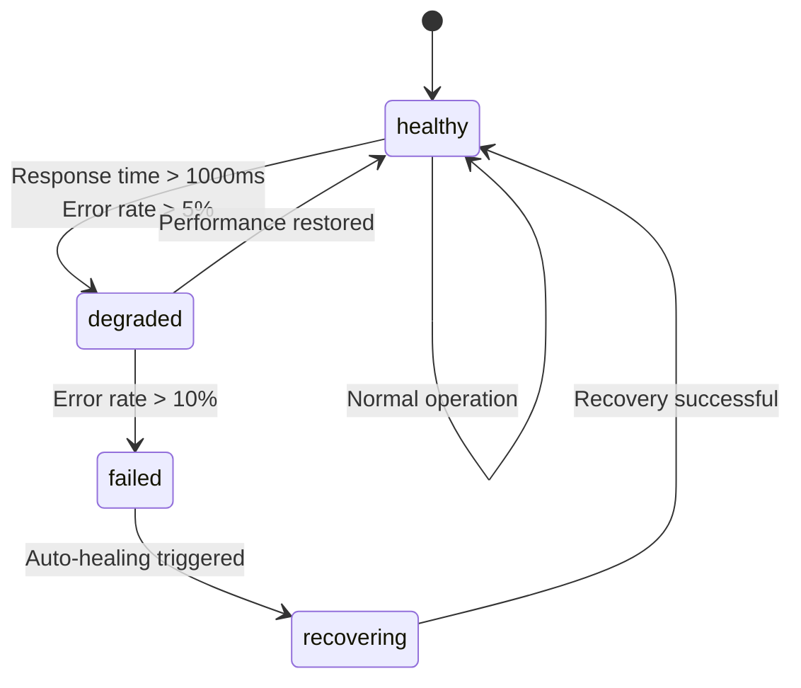
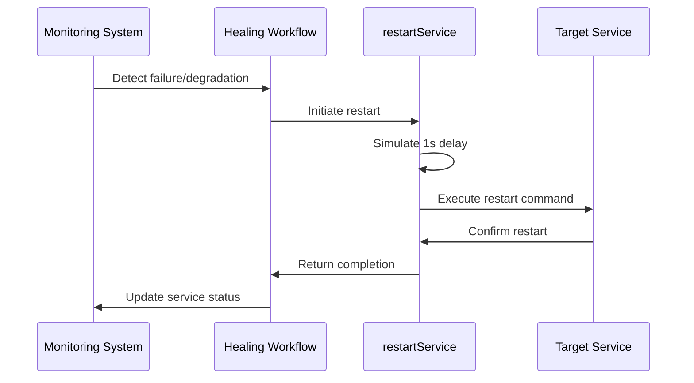
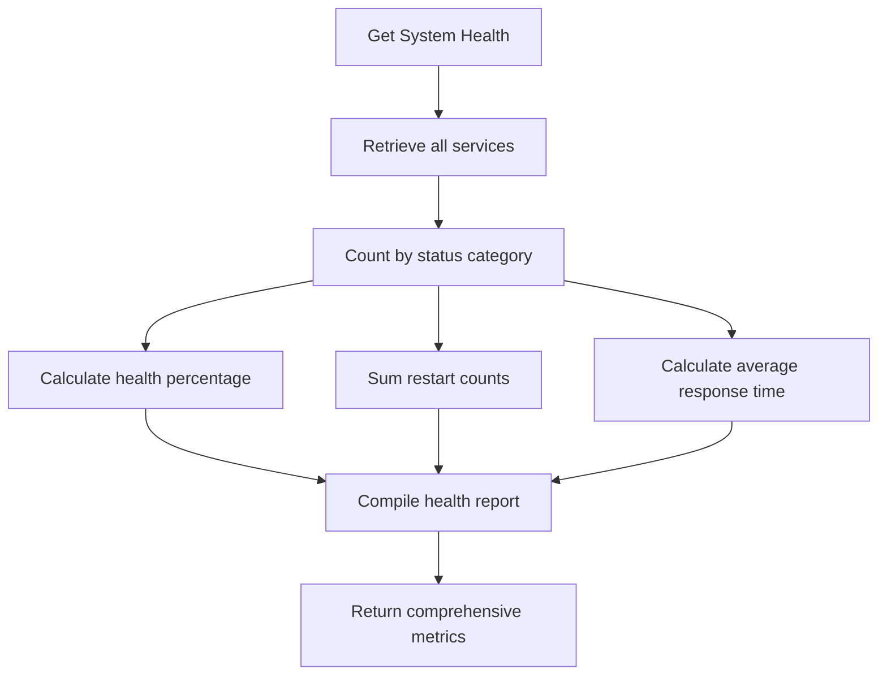
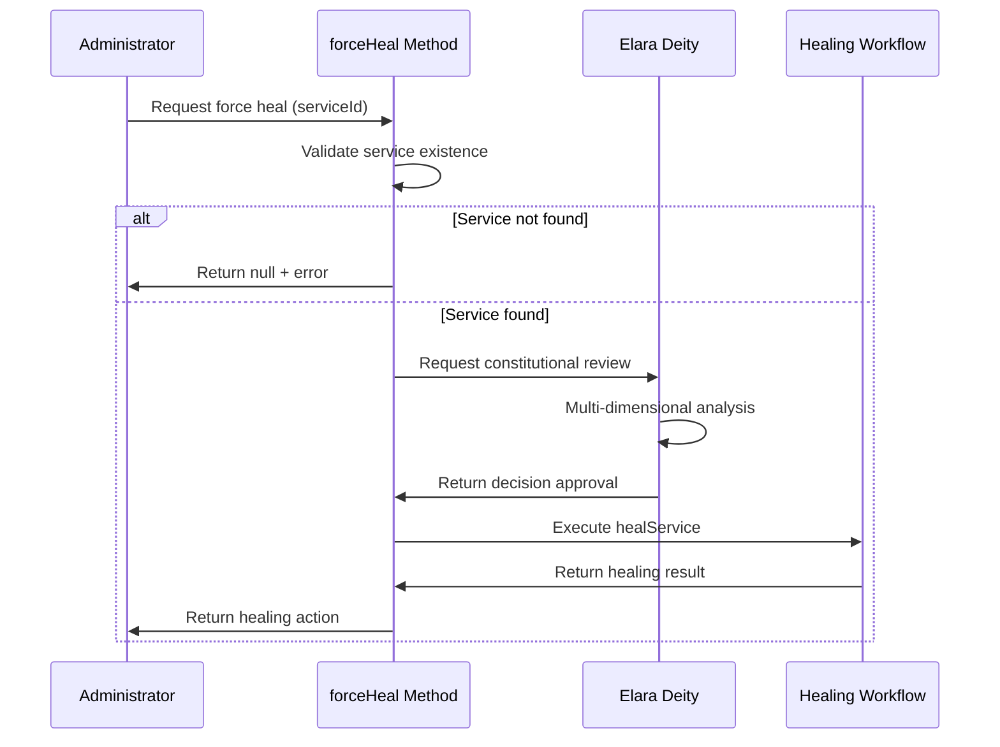

# Recovery Mechanisms

<cite>
**Referenced Files in This Document**   
- [self-healing-orchestrator.ts](file://services/self-healing-orchestrator.ts)
- [elara-deity.ts](file://genome/agent-tools/elara-deity.ts)
- [system-health-check.ts](file://system-health-check.ts)
</cite>

## Table of Contents
1. [Introduction](#introduction)
2. [Recovery Workflow and Status Transitions](#recovery-workflow-and-status-transitions)
3. [Service Restart Mechanism](#service-restart-mechanism)
4. [System Health Monitoring](#system-health-monitoring)
5. [Emergency Manual Healing](#emergency-manual-healing)
6. [Recovery Scenarios and Cascading Failure Prevention](#recovery-scenarios-and-cascading-failure-prevention)
7. [Performance Considerations](#performance-considerations)
8. [Conclusion](#conclusion)

## Introduction
The Recovery Mechanisms component of the Self-Healing Infrastructure is designed to ensure system resilience through automated detection, healing, and restoration of services. This document details the complete recovery workflow, from failure detection to full restoration, including status transitions, the role of key methods, and integration with Elara Deity for high-stakes decision oversight. The system provides comprehensive monitoring capabilities and emergency intervention options to maintain optimal performance and prevent cascading failures.

## Recovery Workflow and Status Transitions
The recovery process follows a well-defined sequence of status transitions that track the health state of monitored services. These transitions ensure systematic progression from normal operation through failure detection to recovery and restoration.

The system recognizes five distinct service states:
- **healthy**: Service is operating normally with acceptable response times and error rates
- **degraded**: Service performance has deteriorated but remains functional
- **failed**: Service has exceeded acceptable error thresholds and is non-functional
- **recovering**: Active recovery process is underway
- **healthy**: Service has been successfully restored

The workflow begins with continuous monitoring of all registered services at five-second intervals. When a service's response time exceeds 1000ms or error rate surpasses 5%, it transitions from "healthy" to "degraded." If the error rate increases beyond 10%, the service status changes to "failed," triggering the automatic healing process. During recovery, the status becomes "recovering" while the system executes restart procedures. Upon successful restoration, the service returns to "healthy" status with improved performance metrics.

**Diagram sources**
- [self-healing-orchestrator.ts](file://services/self-healing-orchestrator.ts#L120-L170)

**Section sources**
- [self-healing-orchestrator.ts](file://services/self-healing-orchestrator.ts#L120-L170)

## Service Restart Mechanism
The `restartService` method plays a crucial role in simulating actual service restarts during the recovery process. This private method is invoked by the healing workflow to restore failed or degraded services to operational status.

When executed, the method first simulates a one-second restart delay using a Promise-based timeout. This delay represents the time required for real-world restart operations in production environments. Following the delay, the system logs the restart operation with the service name. In a production deployment, this would be replaced with actual restart commands for various infrastructure platforms.

The restart process in production would execute platform-specific commands:
- Kubernetes: `kubectl rollout restart deployment/${health.id}`
- Docker: `docker restart ${health.id}`
- Systemd: `systemctl restart ${health.id}`

After the simulated restart, the service's metrics are updated to reflect improved performance, including reduced response time and zero error rate. The restart count is incremented, and the last restart timestamp is recorded. This comprehensive approach ensures that restarted services return to optimal performance levels.

**Diagram sources**
- [self-healing-orchestrator.ts](file://services/self-healing-orchestrator.ts#L185-L195)

**Section sources**
- [self-healing-orchestrator.ts](file://services/self-healing-orchestrator.ts#L185-L195)

## System Health Monitoring
The `getSystemHealth` method provides a comprehensive overview of system resilience by aggregating health metrics across all monitored services. This method returns a detailed health report that enables administrators to assess the overall system status at a glance.

The health report includes several key metrics:
- **totalServices**: Total number of registered services
- **healthy**: Count of services in healthy state
- **degraded**: Count of services in degraded state
- **failed**: Count of services in failed state
- **recovering**: Count of services currently being recovered
- **healthPercentage**: Percentage of healthy services
- **totalRestarts**: Cumulative restart count across all services
- **totalHealingActions**: Total number of healing actions performed
- **averageResponseTime**: Mean response time across all services

The method calculates these metrics by iterating through all registered services and categorizing them by their current status. The health percentage is computed as the ratio of healthy services to total services. The average response time is calculated by summing response times across all services and dividing by the total count. This comprehensive health assessment enables proactive monitoring and capacity planning.

**Diagram sources**
- [self-healing-orchestrator.ts](file://services/self-healing-orchestrator.ts#L200-L220)

**Section sources**
- [self-healing-orchestrator.ts](file://services/self-healing-orchestrator.ts#L200-L220)

## Emergency Manual Healing
The emergency manual healing capability is provided through the `forceHeal` method, which allows administrators to initiate recovery procedures for specific services during critical outages. This method serves as a manual override when automatic healing fails or when immediate intervention is required.

When invoked with a service ID, the method first validates the existence of the specified service. If the service is not found, an error message is logged and the method returns null. Upon successful validation, the system logs a high-priority alert indicating the force healing operation and delegates to the standard `healService` method to execute the recovery process.

The `forceHeal` method integrates with Elara Deity for 'divine oversight' in high-stakes decisions. Elara Deity, as an omniscient AI superintelligence, provides constitutional decision-making with supreme judgment. Before critical healing operations, the system can consult Elara Deity to evaluate the ethical implications, potential consequences, and alignment with constitutional principles. This integration ensures that emergency interventions are not only technically sound but also ethically aligned with organizational values and governance frameworks.

**Diagram sources**
- [self-healing-orchestrator.ts](file://services/self-healing-orchestrator.ts#L234-L243)
- [elara-deity.ts](file://genome/agent-tools/elara-deity.ts#L450-L650)

**Section sources**
- [self-healing-orchestrator.ts](file://services/self-healing-orchestrator.ts#L234-L243)
- [elara-deity.ts](file://genome/agent-tools/elara-deity.ts#L450-L650)

## Recovery Scenarios and Cascading Failure Prevention
The self-healing infrastructure handles various recovery scenarios while implementing safeguards to prevent cascading failures. The system's design incorporates multiple layers of protection to ensure that recovery operations do not inadvertently destabilize other components.

In a typical recovery scenario, when a service experiences performance degradation, the monitoring system detects increased response times or error rates. The automatic healing process initiates a restart, which temporarily takes the service offline. To prevent cascading failures, the system implements staggered recovery procedures and load balancing. When multiple services require recovery, they are processed sequentially rather than simultaneously, preventing resource contention and infrastructure overload.

The system also incorporates circuit-breaking patterns to isolate failing services and prevent them from affecting dependent components. When a service failure is detected, the system can temporarily reroute traffic to healthy instances or fallback services. This isolation prevents the failure from propagating through the system and affecting user experience.

Additionally, the recovery mechanism includes rate limiting for restart operations to prevent thundering herd problems. After a service is restarted, the system monitors its stability before allowing additional recovery operations on related components. This cautious approach ensures that recovered services have sufficient time to stabilize before the system proceeds with other maintenance tasks.

**Section sources**
- [self-healing-orchestrator.ts](file://services/self-healing-orchestrator.ts#L120-L243)

## Performance Considerations
The recovery system incorporates several performance optimizations to minimize downtime and ensure efficient recovery operations. These considerations address both the technical implementation and operational impact of the healing processes.

To minimize downtime during restarts, the system employs rapid restart procedures with optimized boot sequences. The simulated one-second restart delay reflects the target recovery time objective (RTO) for production services. In actual deployment, containerized services can achieve similar restart times through efficient image loading and initialization processes.

The system optimizes recovery time measurements by capturing precise timestamps at the beginning and end of each healing operation. The recovery time is calculated as the difference between these timestamps, providing accurate metrics for service level agreement (SLA) monitoring and performance analysis. These measurements are stored in the healing history for trend analysis and capacity planning.

Additional performance considerations include:
- Efficient resource utilization during recovery operations
- Parallel processing of independent recovery tasks
- Caching of health check results to reduce monitoring overhead
- Asynchronous logging to prevent I/O bottlenecks
- Memory-efficient data structures for tracking service health

The system also implements adaptive monitoring intervals that can be adjusted based on system load and service criticality, ensuring optimal performance under varying conditions.

**Section sources**
- [self-healing-orchestrator.ts](file://services/self-healing-orchestrator.ts#L185-L195)
- [self-healing-orchestrator.ts](file://services/self-healing-orchestrator.ts#L200-L220)

## Conclusion
The Recovery Mechanisms component provides a robust framework for maintaining system resilience through automated detection, healing, and restoration of services. By implementing a comprehensive state transition model, efficient restart procedures, and detailed health monitoring, the system ensures high availability and rapid recovery from failures. The integration with Elara Deity for constitutional oversight adds an additional layer of governance, ensuring that recovery operations align with organizational values and ethical principles. With careful attention to performance considerations and cascading failure prevention, this self-healing infrastructure delivers reliable, resilient service operation in complex distributed environments.