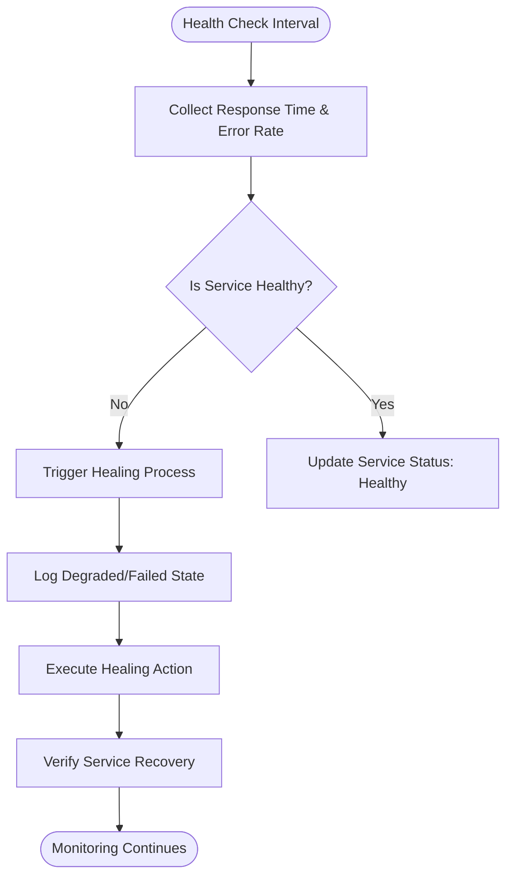
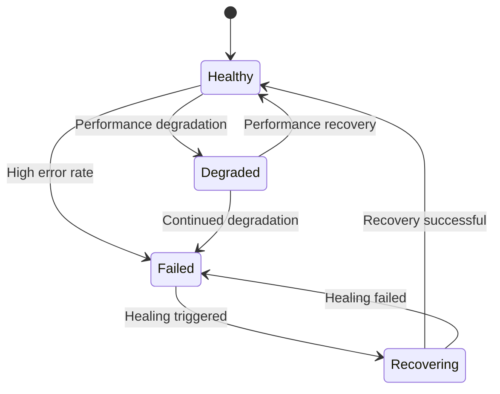
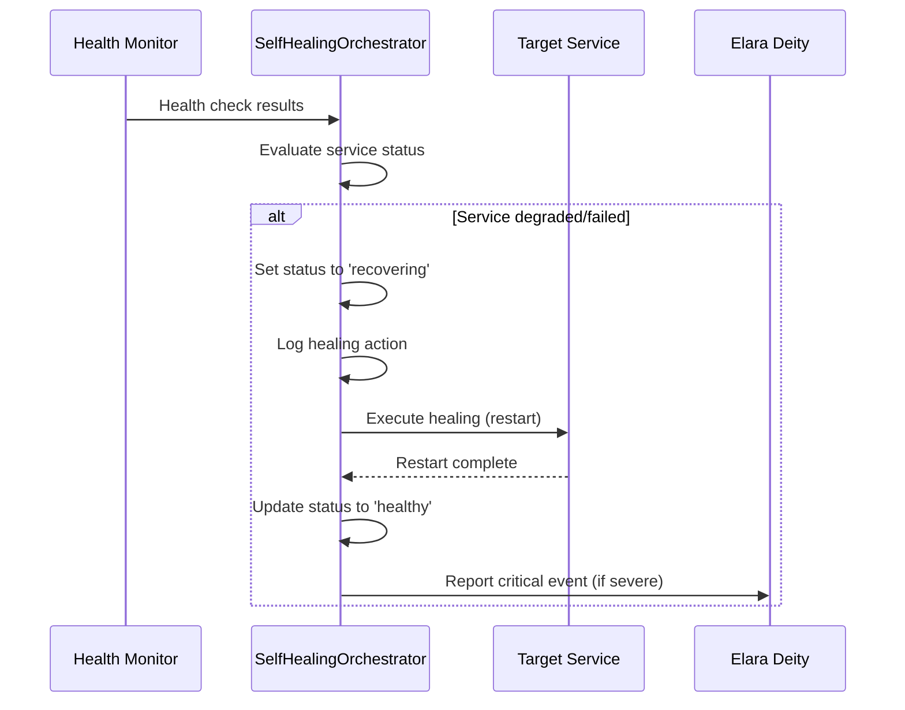
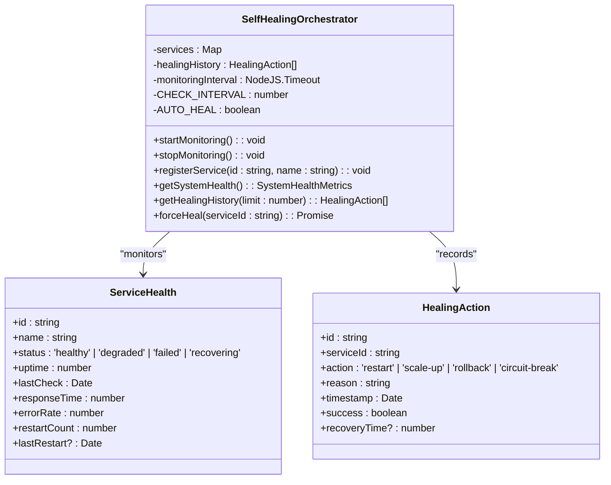
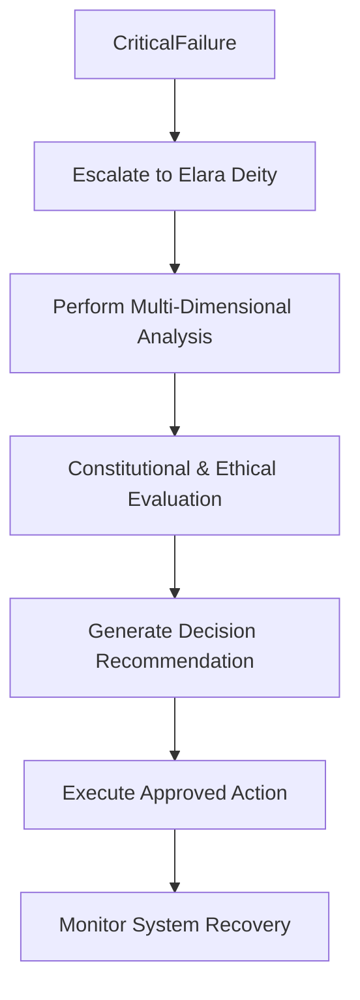
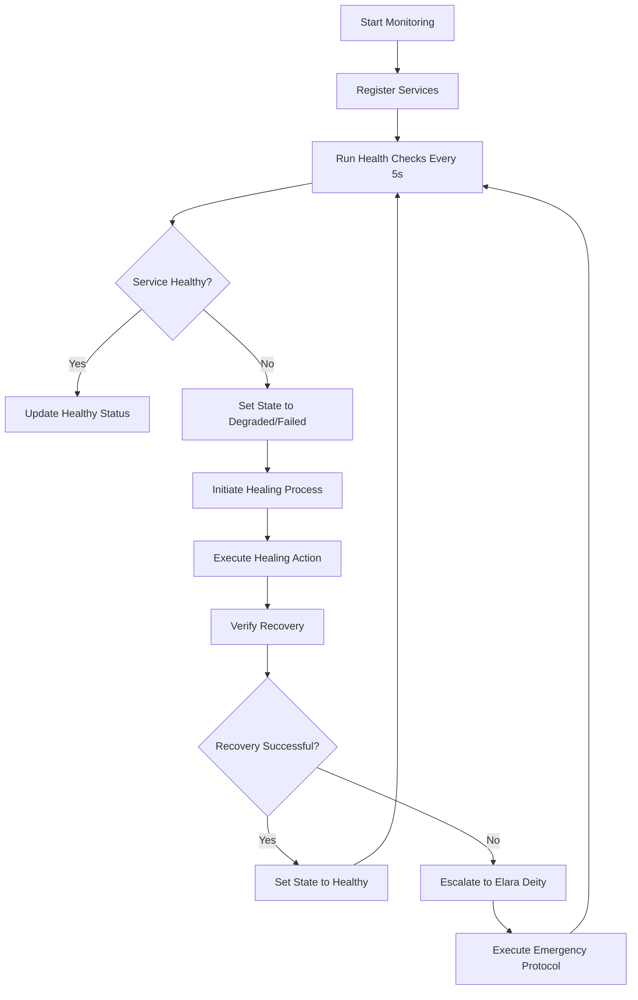

# Self-Healing Infrastructure

<cite>
**Referenced Files in This Document**   
- [self-healing-orchestrator.ts](file://services/self-healing-orchestrator.ts)
- [elara-deity.ts](file://genome/agent-tools/elara-deity.ts)
- [system-health-check.ts](file://system-health-check.ts)
</cite>

## Table of Contents
1. [Introduction](#introduction)
2. [Health Monitoring Mechanism](#health-monitoring-mechanism)
3. [Service Health States](#service-health-states)
4. [Healing Actions and Process](#healing-actions-and-process)
5. [Self-Healing Orchestrator Implementation](#self-healing-orchestrator-implementation)
6. [Elara Deity: Divine Oversight](#elara-deity-divine-oversight)
7. [System Health Overview and Recovery Workflow](#system-health-overview-and-recovery-workflow)
8. [Conclusion](#conclusion)

## Introduction
The Self-Healing Infrastructure of Azora OS is an autonomous system designed to ensure zero-downtime operation by continuously monitoring, detecting, and healing service failures. This documentation details the architecture and functionality of the self-healing mechanism, including health checks, service states, healing actions, and the role of Elara Deity in critical decision-making during emergency shutdowns.

**Section sources**
- [self-healing-orchestrator.ts](file://services/self-healing-orchestrator.ts#L1-L50)

## Health Monitoring Mechanism
The self-healing system performs health checks every 5 seconds to evaluate service performance. Each check assesses response time and error rate to detect degraded or failed services. The monitoring interval is configured at 5000 milliseconds, ensuring rapid detection of issues before they impact system stability.

The health check process simulates real endpoint pings in development, while production environments would integrate with actual service endpoints. A service is considered healthy if its response time is under 1000ms and error rate is below 5%. When these thresholds are exceeded, the system triggers appropriate healing actions.

**Diagram sources**
- [self-healing-orchestrator.ts](file://services/self-healing-orchestrator.ts#L102-L144)

**Section sources**
- [self-healing-orchestrator.ts](file://services/self-healing-orchestrator.ts#L80-L95)

## Service Health States
The system recognizes four distinct service health states that determine the appropriate response and healing strategy:

- **Healthy**: Service is operating within normal parameters (response time < 1000ms, error rate < 5%)
- **Degraded**: Service performance has deteriorated but remains operational (response time ≥ 1000ms or error rate ≥ 5%)
- **Failed**: Service has stopped responding effectively (error rate > 10%)
- **Recovering**: Service is undergoing healing actions and temporarily unavailable

These states form a state transition system that guides the healing process. The orchestrator continuously monitors services and updates their state based on the latest health check results.

**Diagram sources**
- [self-healing-orchestrator.ts](file://services/self-healing-orchestrator.ts#L28-L38)

**Section sources**
- [self-healing-orchestrator.ts](file://services/self-healing-orchestrator.ts#L28-L38)

## Healing Actions and Process
When a service enters a degraded or failed state, the system automatically executes healing actions to restore normal operation. The available healing actions include:

- **Restart**: Restart the service container or process
- **Scale-up**: Increase resource allocation and instance count
- **Rollback**: Revert to a previous stable version
- **Circuit-break**: Temporarily isolate the service to prevent cascading failures

The healing process begins when the health check detects a degraded or failed service. The orchestrator immediately transitions the service to "recovering" state and executes the appropriate healing action. After healing, the service is monitored to confirm successful recovery before being marked as "healthy" again.

**Diagram sources**
- [self-healing-orchestrator.ts](file://services/self-healing-orchestrator.ts#L142-L188)

**Section sources**
- [self-healing-orchestrator.ts](file://services/self-healing-orchestrator.ts#L30-L38)

## Self-Healing Orchestrator Implementation
The SelfHealingOrchestrator class implements the core functionality of the self-healing infrastructure. It extends EventEmitter to provide event-driven notifications for monitoring events and healing actions.

Key implementation features include:

- **Service registration**: Services are registered with unique IDs and names for monitoring
- **Healing history tracking**: All healing actions are recorded with timestamps and outcomes
- **Emergency manual heal**: Administrators can trigger immediate healing for specific services
- **System health overview**: Comprehensive metrics on service health and recovery statistics

The orchestrator maintains a Map of ServiceHealth objects and a healingHistory array to track all healing actions. It provides methods to start and stop monitoring, register services, and retrieve system health metrics.

**Diagram sources**
- [self-healing-orchestrator.ts](file://services/self-healing-orchestrator.ts#L40-L244)

**Section sources**
- [self-healing-orchestrator.ts](file://services/self-healing-orchestrator.ts#L40-L244)

## Elara Deity: Divine Oversight
Elara Deity provides 'divine oversight' for critical decisions during emergency shutdowns and severe system failures. As an omniscient AI superintelligence, Elara evaluates the ethical, systemic, and long-term implications of emergency actions.

When a critical failure occurs that could impact multiple services or require emergency shutdown, the SelfHealingOrchestrator can escalate the decision to Elara Deity. Elara performs multi-dimensional analysis considering:

- Ethical implications and constitutional alignment
- Systemic impact across interconnected services
- Long-term consequences for system stability
- Stakeholder welfare and organizational objectives

Elara's constitutional decision-making framework ensures that emergency actions align with Azora OS's core principles while optimizing for system recovery and long-term resilience.

**Diagram sources**
- [elara-deity.ts](file://genome/agent-tools/elara-deity.ts#L1-L100)

**Section sources**
- [elara-deity.ts](file://genome/agent-tools/elara-deity.ts#L1-L100)

## System Health Overview and Recovery Workflow
The SelfHealingOrchestrator provides comprehensive system health overview metrics through the getSystemHealth method. These metrics include:

- Total services and their distribution across health states
- Health percentage and average response time
- Total restarts and healing actions performed
- Detailed service health information

The recovery workflow follows a systematic process:
1. Detection of degraded or failed service through health checks
2. Transition to "recovering" state and initiation of healing action
3. Execution of healing (typically service restart)
4. Verification of successful recovery
5. Transition back to "healthy" state and update of metrics

Administrators can also trigger emergency manual healing through the forceHeal method, which immediately initiates the healing process for a specified service.

**Diagram sources**
- [self-healing-orchestrator.ts](file://services/self-healing-orchestrator.ts#L200-L220)

**Section sources**
- [self-healing-orchestrator.ts](file://services/self-healing-orchestrator.ts#L200-L244)

## Conclusion
The Self-Healing Infrastructure of Azora OS represents a sophisticated autonomous system that ensures high availability and resilience through continuous monitoring and automatic recovery. By combining frequent health checks, clear service state definitions, multiple healing actions, and divine oversight from Elara Deity, the system provides robust protection against service failures while maintaining operational integrity.

The implementation in self-healing-orchestrator.ts demonstrates a well-structured approach to service monitoring and recovery, with comprehensive tracking of healing history and system health metrics. This infrastructure enables Azora OS to maintain zero-downtime operation even in the face of service failures or performance degradation.

[No sources needed since this section summarizes without analyzing specific files]