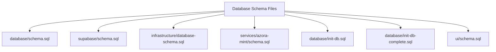
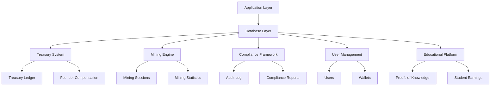
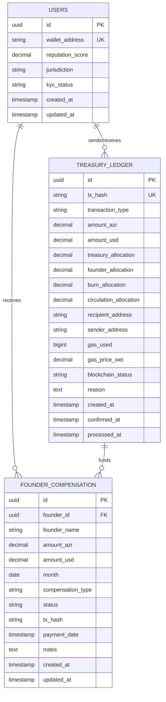
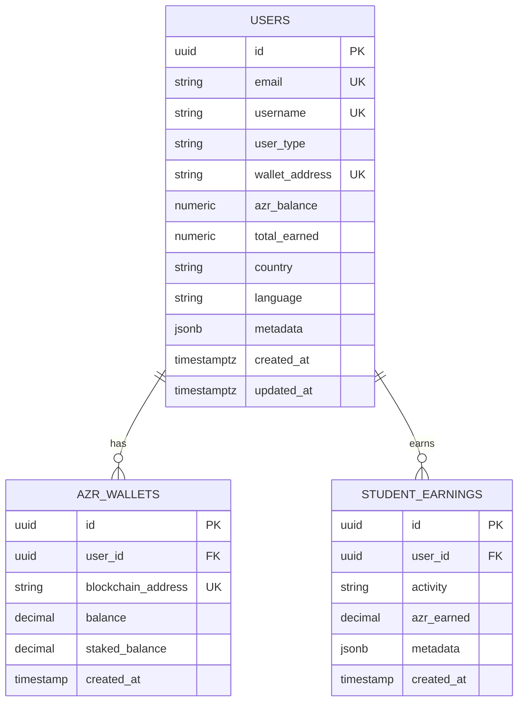
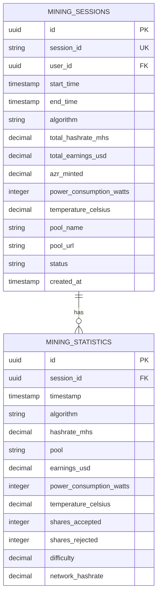
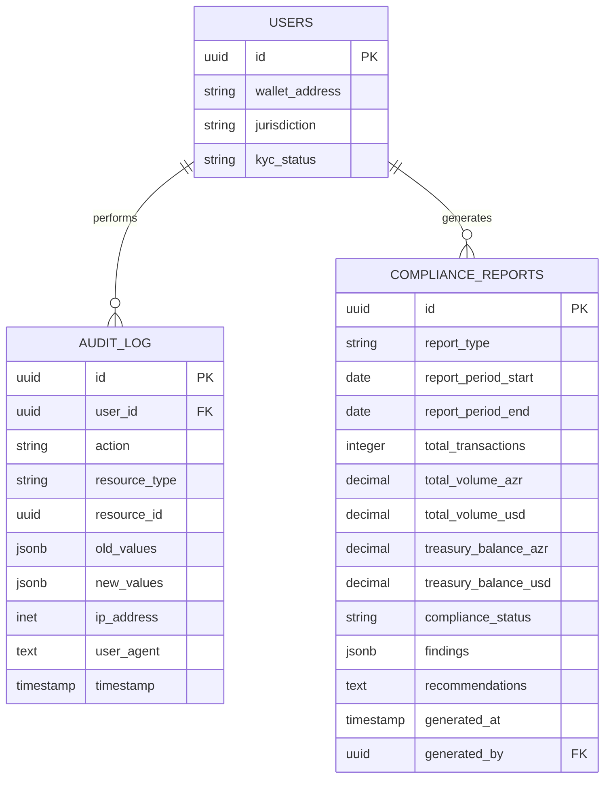
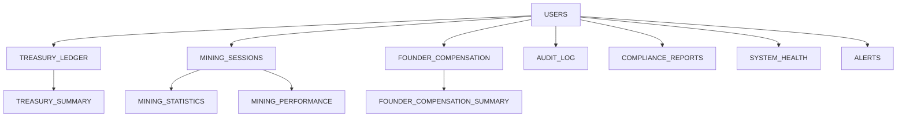

# Database Schema Design

<cite>
**Referenced Files in This Document**   
- [database/schema.sql](file://database/schema.sql)
- [supabase/schema.sql](file://supabase/schema.sql)
- [infrastructure/database-schema.sql](file://infrastructure/database-schema.sql)
- [services/azora-mint/schema.sql](file://services/azora-mint/schema.sql)
- [database/init-db.sql](file://database/init-db.sql)
- [database/init-db-complete.sql](file://database/init-db-complete.sql)
- [ui/schema.sql](file://ui/schema.sql)
</cite>

## Table of Contents
1. [Introduction](#introduction)
2. [Project Structure](#project-structure)
3. [Core Components](#core-components)
4. [Architecture Overview](#architecture-overview)
5. [Detailed Component Analysis](#detailed-component-analysis)
6. [Dependency Analysis](#dependency-analysis)
7. [Performance Considerations](#performance-considerations)
8. [Troubleshooting Guide](#troubleshooting-guide)
9. [Conclusion](#conclusion)

## Introduction
The Azora OS database schema is a multi-layered, constitutional-compliant system designed to support a sovereign economic framework with 1:1 AZR/USD valuation. The architecture spans multiple database instances across different subsystems including treasury management, mining operations, compliance reporting, and educational platforms. This documentation provides a comprehensive overview of the data models, entity relationships, and business rules implemented across the various schema files in the repository.

## Project Structure
The Azora OS project contains multiple database schema definitions located in different directories, each serving a specific subsystem or deployment environment. The primary schema files are organized as follows:
- `database/`: Core schema for treasury, mining, and ceremonial ledger operations
- `supabase/`: Supabase-specific schema with RLS policies for user management and proof-of-knowledge systems
- `infrastructure/`: Complete database schema supporting global operations and distributed tracing
- `services/azora-mint/`: Schema for AI treasury and enterprise tokenomics
- `ui/`: Simplified schema for frontend integration with earnings and allocation tracking

**Diagram sources**
- [database/schema.sql](file://database/schema.sql)
- [supabase/schema.sql](file://supabase/schema.sql)
- [infrastructure/database-schema.sql](file://infrastructure/database-schema.sql)

**Section sources**
- [database/schema.sql](file://database/schema.sql)
- [supabase/schema.sql](file://supabase/schema.sql)

## Core Components
The Azora OS database schema consists of several core components that work together to maintain constitutional compliance, track economic activity, and ensure system integrity. These include user management, treasury operations, mining sessions, founder compensation, ceremonial events, and comprehensive audit logging. Each component enforces specific business rules through constraints, triggers, and views to maintain the integrity of the 1:1 AZR/USD valuation model.

**Section sources**
- [database/schema.sql](file://database/schema.sql#L1-L444)
- [services/azora-mint/schema.sql](file://services/azora-mint/schema.sql#L1-L178)

## Architecture Overview
The Azora OS database architecture follows a multi-schema approach where different subsystems maintain their own specialized schemas while sharing common principles of constitutional compliance and data sovereignty. The core architecture is built around PostgreSQL with UUID primary keys, JSONB for flexible metadata storage, and Row Level Security (RLS) for data access control. The system implements a 70% treasury, 11% founder, 5% burn, and 23.9% circulation allocation model enforced through database constraints.

**Diagram sources**
- [database/schema.sql](file://database/schema.sql#L1-L444)
- [supabase/schema.sql](file://supabase/schema.sql#L1-L203)

## Detailed Component Analysis

### Treasury and Economic Model
The treasury system enforces the constitutional 1:1 AZR/USD valuation through database constraints and maintains a complete audit trail of all transactions. The treasury_ledger table tracks all mint, burn, withdrawal, deposit, and transfer operations with detailed allocation percentages.

**Diagram sources**
- [database/schema.sql](file://database/schema.sql#L1-L444)

**Section sources**
- [database/schema.sql](file://database/schema.sql#L1-L444)

### User Management and Identity
The user management system spans multiple schemas with different levels of complexity. The core users table maintains wallet addresses, reputation scores, and jurisdictional information, while the Supabase schema extends this with email-based authentication and role-based access control for different user types including students, teachers, founders, and partners.

**Diagram sources**
- [infrastructure/database-schema.sql](file://infrastructure/database-schema.sql#L1-L122)
- [supabase/schema.sql](file://supabase/schema.sql#L1-L203)

**Section sources**
- [infrastructure/database-schema.sql](file://infrastructure/database-schema.sql#L1-L122)
- [supabase/schema.sql](file://supabase/schema.sql#L1-L203)

### Mining and Minting Engine
The mining system tracks both mining sessions and minting transactions with detailed performance metrics. The schema captures hashrate, power consumption, temperature, and earnings data to ensure accurate compensation for computational contributions to the network.

**Diagram sources**
- [database/schema.sql](file://database/schema.sql#L1-L444)

**Section sources**
- [database/schema.sql](file://database/schema.sql#L1-L444)

### Compliance and Audit Framework
The compliance system implements comprehensive audit logging and regulatory reporting capabilities. The audit_log table maintains a complete record of all system actions with old and new values, while compliance_reports stores regulatory findings and recommendations.

**Diagram sources**
- [database/schema.sql](file://database/schema.sql#L1-L444)

**Section sources**
- [database/schema.sql](file://database/schema.sql#L1-L444)

## Dependency Analysis
The Azora OS database schemas show a clear pattern of dependencies between core entities. The users table serves as the central identity provider, with foreign key relationships to nearly all other major entities including treasury_ledger, mining_sessions, founder_compensation, and audit_log. The system implements referential integrity through foreign key constraints and maintains data consistency through triggers that automatically update timestamps.

**Diagram sources**
- [database/schema.sql](file://database/schema.sql#L1-L444)

**Section sources**
- [database/schema.sql](file://database/schema.sql#L1-L444)

## Performance Considerations
The Azora OS database schemas include comprehensive indexing strategies to ensure high-performance queries at scale. Each major table has multiple indexes on frequently queried columns such as user_id, status, and created_at timestamps. The system also implements materialized views for reporting purposes, such as the treasury_summary and mining_performance views, to optimize read-heavy operations.

**Section sources**
- [database/schema.sql](file://database/schema.sql#L1-L444)
- [supabase/schema.sql](file://supabase/schema.sql#L1-L203)

## Troubleshooting Guide
Common database issues in the Azora OS system typically relate to constraint violations, particularly around the constitutional valuation check that enforces 1:1 AZR/USD parity. Issues may also arise from RLS policies preventing data access, or from missing indexes causing performance degradation. The system health and alerts tables provide monitoring capabilities to detect and resolve issues proactively.

**Section sources**
- [database/schema.sql](file://database/schema.sql#L1-L444)
- [infrastructure/database-schema.sql](file://infrastructure/database-schema.sql#L1-L122)

## Conclusion
The Azora OS database schema represents a sophisticated, multi-layered approach to managing a sovereign economic system. By implementing constitutional compliance at the database level through constraints and triggers, the system ensures the integrity of its 1:1 AZR/USD valuation model. The architecture balances comprehensive audit capabilities with performance optimization through strategic indexing and view-based reporting. The presence of multiple schema variants across different directories suggests a microservices architecture where each subsystem maintains its own specialized data model while adhering to common principles of data sovereignty and transparency.