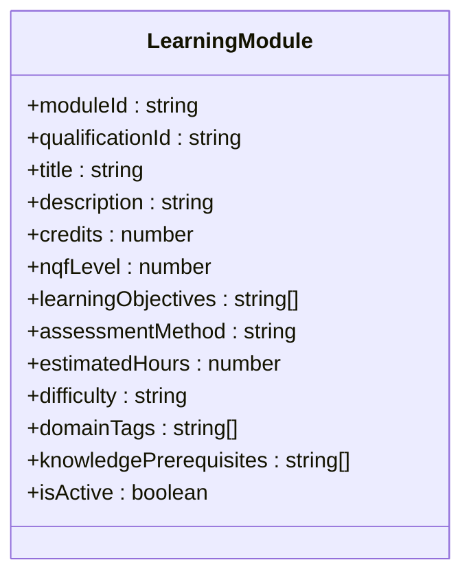
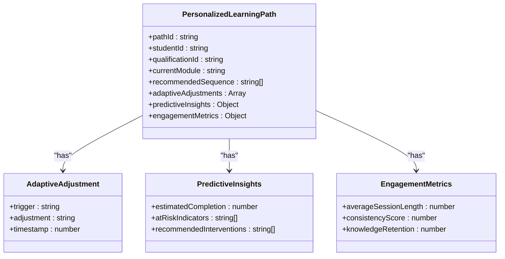
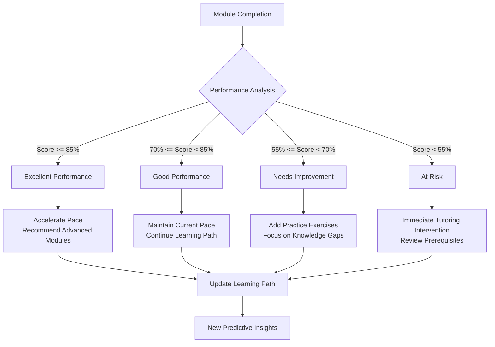
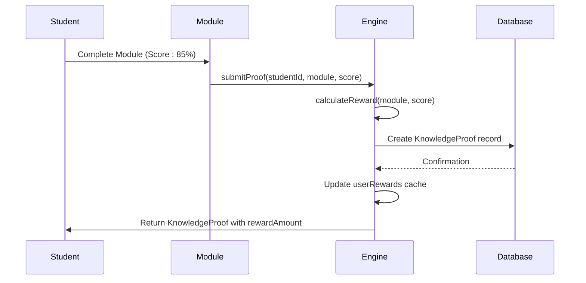
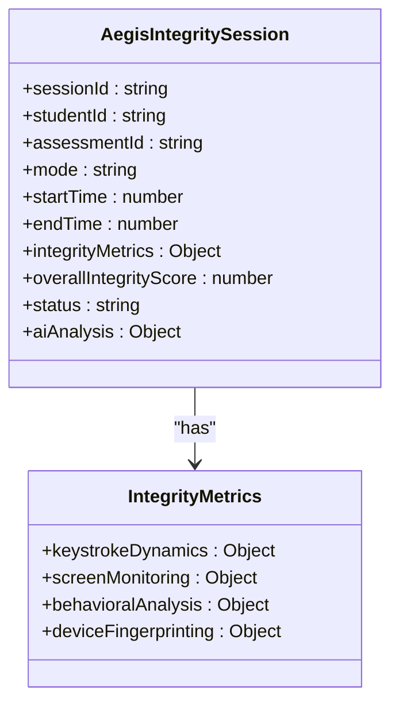
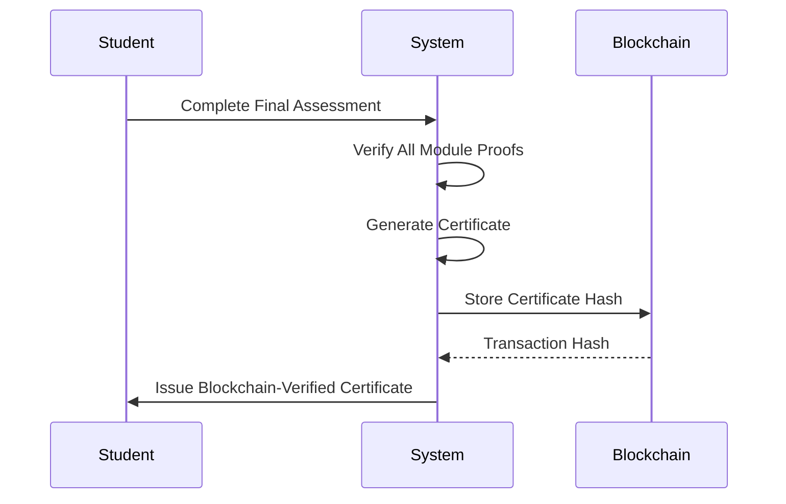
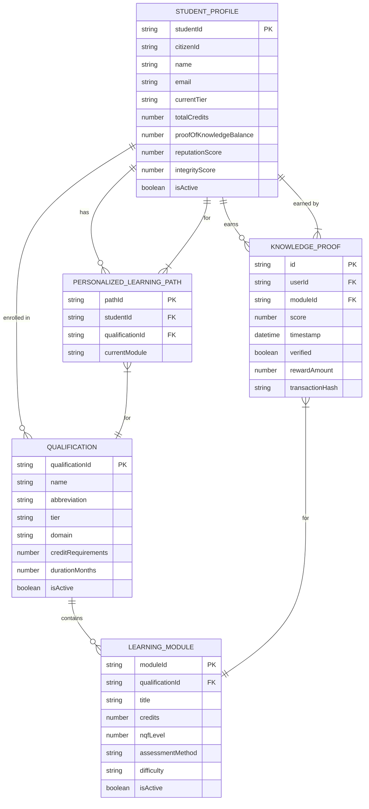
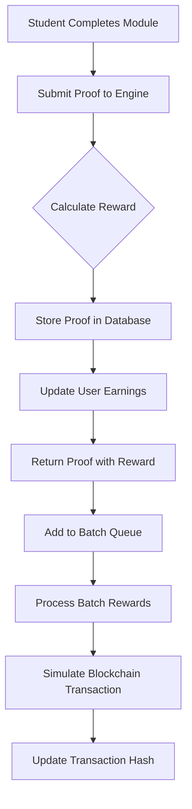

# Educational Achievements Schema

<cite>
**Referenced Files in This Document**   
- [azora-sapiens.ts](file://genome/agent-tools/azora-sapiens.ts)
- [proof-of-knowledge-engine.ts](file://services/proof-of-knowledge-engine.ts)
- [sapiens-service.js](file://services/azora-sapiens/sapiens-service.js)
- [schema.sql](file://database/schema.sql)
</cite>

## Table of Contents
1. [Introduction](#introduction)
2. [Core Entities](#core-entities)
3. [Qualifications Framework](#qualifications-framework)
4. [Learning Modules](#learning-modules)
5. [Personalized Learning Paths](#personalized-learning-paths)
6. [Proof-of-Knowledge Engine](#proof-of-knowledge-engine)
7. [Achievement Verification and Integrity](#achievement-verification-and-integrity)
8. [Blockchain Integration and Credentialing](#blockchain-integration-and-credentialing)
9. [Data Model Relationships](#data-model-relationships)
10. [Economic Rewards System](#economic-rewards-system)
11. [Conclusion](#conclusion)

## Introduction

The Educational Achievements system within the Azora OS ecosystem represents a revolutionary approach to learning, credentialing, and economic empowerment. This documentation provides a comprehensive schema for the data model that underpins the system, detailing how educational achievements are structured, tracked, verified, and rewarded. The system is built on four core pillars: a robust curriculum engine, an economic engine based on Proof-of-Knowledge, an integrity engine for trust and verification, and a direct qualification model where Azora offers all credentials directly.

The data model is designed to support a seamless journey from enrollment to certification, integrating user progress tracking, adaptive learning paths, automated reward distribution, and blockchain-verified credentials. This document details the key entities, their relationships, and the processes that govern achievement validation and economic integration.

## Core Entities

The Educational Achievements system is built around several core entities that represent the fundamental building blocks of the learning experience.

### Student Profile

The `StudentProfile` entity serves as the central record for each learner within the system. It contains personal information, enrollment details, and tracks the learner's progress and achievements.

**Key Attributes:**
- `studentId`: Unique identifier for the student.
- `citizenId`: National identification number.
- `personalInfo`: Structured data including name, email, phone, location, date of birth, and education level.
- `enrollmentDate`: Timestamp of initial enrollment.
- `currentTier`: The current level of study, either 'ckq' (Core Knowledge Qualification) or 'degree'.
- `enrolledQualifications`: Array of qualification IDs the student is currently pursuing.
- `completedModules`: Array of module IDs the student has successfully completed.
- `currentModules`: Array of module IDs the student is currently studying.
- `totalCredits`: Cumulative credits earned.
- `proofOfKnowledgeBalance`: The amount of AZR (Azora's native currency) earned through learning activities.
- `reputationScore`: A community trust and performance metric.
- `integrityScore`: A rating based on assessment integrity and adherence to academic honesty.
- `lastActivity`: Timestamp of the last interaction with the system.
- `isActive`: Boolean indicating the student's active status.
- `graduationDate`: Optional timestamp for when the student completed a qualification.

**Section sources**
- [azora-sapiens.ts](file://genome/agent-tools/azora-sapiens.ts#L27-L66)

### Qualification

The `Qualification` entity defines the formal programs of study offered by Azora Sapiens. These range from accelerated CKQ programs to full bachelor's degrees.

**Key Attributes:**
- `qualificationId`: Unique identifier for the qualification.
- `name`: Full name of the qualification.
- `abbreviation`: Short form (e.g., ADCS for Azora Decentralized Computer Science).
- `tier`: Level of the qualification ('ckq' or 'degree').
- `domain`: Academic or professional field (e.g., Computer Science, Finance).
- `description`: Detailed overview of the program.
- `creditRequirements`: Total credits needed for completion.
- `durationMonths`: Expected duration in months.
- `partnerUniversity`: Optional field for partnered degrees (not used in the current direct model).
- `modules`: Array of module IDs that constitute the qualification.
- `prerequisites`: Array of qualification IDs required before enrollment.
- `isActive`: Boolean indicating if the qualification is currently offered.
- `createdAt`: Timestamp of when the qualification was created.

**Section sources**
- [azora-sapiens.ts](file://genome/agent-tools/azora-sapiens.ts#L44-L66)

## Qualifications Framework

The qualifications framework is a comprehensive catalog of programs designed to meet high-demand skills in technology, business, engineering, and other fields. The framework is divided into two tiers: CKQs and full degrees.

### CKQ Qualifications

CKQs (Core Knowledge Qualifications) are accelerated, practical programs designed to be completed in 6-9 months. They are equivalent to NQF Level 6 and focus on immediate employability.

**Examples:**
- **ADCS**: Azora Decentralized Computer Science Qualification
- **ADDS**: Azora Decentralized Data Science Qualification
- **ADCYBER**: Azora Decentralized Cybersecurity Qualification
- **ADACC**: Azora Decentralized Accounting Qualification
- **ADFIN**: Azora Decentralized Finance Qualification

Each CKQ requires 120 credits and is structured around a core set of modules that emphasize decentralized principles, blockchain technology, and AI integration.

### Degree Programs

Degree programs are full bachelor's degrees equivalent to NQF Level 7 or 8. These are more comprehensive and typically take 3.5 to 4 years to complete.

**Examples:**
- **BSc(AI)**: Bachelor of Science in Applied Artificial Intelligence
- **BSc(CyberSec)**: Bachelor of Science in Cybersecurity and Cloud Computing
- **BCom(DigitalFinance)**: Bachelor of Commerce in Digital Finance and Data Analytics
- **BEng(SustainableEnergy)**: Bachelor of Engineering in Sustainable Energy Systems

Degree programs have higher credit requirements (360-480) and often have CKQs as prerequisites, creating a stackable credential pathway.

**Section sources**
- [azora-sapiens.ts](file://genome/agent-tools/azora-sapiens.ts#L304-L392)

## Learning Modules

Learning modules are the atomic units of content within a qualification. Each module is designed to teach specific skills and knowledge, with a clear assessment method and credit value.

### Module Structure

**Diagram sources**
- [azora-sapiens.ts](file://genome/agent-tools/azora-sapiens.ts#L70-L92)

### Assessment Methods

Modules employ various assessment methods to evaluate student understanding:
- **Socratic Dialogue**: AI-facilitated discussions to test critical thinking.
- **Project-Based**: Practical projects that demonstrate applied skills.
- **Peer Review**: Evaluation by fellow students.
- **AI Evaluation**: Automated assessment by AI systems.
- **Proof-of-Knowledge**: Direct assessment of knowledge mastery.

### Example Module: First Principles Thinking

- **Title**: First Principles Thinking
- **Description**: Deconstruct complex systems to their axiomatic foundations, integrating decentralized principles for innovative problem-solving.
- **Credits**: 15
- **NQF Level**: 5
- **Learning Objectives**: Apply Socratic method, identify fundamental axioms, synthesize cross-disciplinary solutions.
- **Assessment Method**: Socratic Dialogue
- **Estimated Hours**: 60
- **Difficulty**: Intermediate

**Section sources**
- [azora-sapiens.ts](file://genome/agent-tools/azora-sapiens.ts#L106-L151)

## Personalized Learning Paths

The system generates personalized learning paths for each student, adapting in real-time based on performance and engagement.

### Learning Path Structure

**Diagram sources**
- [azora-sapiens.ts](file://genome/agent-tools/azora-sapiens.ts#L156-L191)

### Adaptive Learning Algorithm

The system uses an adaptive algorithm to modify the learning path based on real-time performance data. When a student completes a module, the system analyzes their score, time spent, engagement level, and identified challenges.

**Diagram sources**
- [azora-sapiens.ts](file://genome/agent-tools/azora-sapiens.ts#L4003-L4079)

**Section sources**
- [azora-sapiens.ts](file://genome/agent-tools/azora-sapiens.ts#L3657-L3701)

## Proof-of-Knowledge Engine

The Proof-of-Knowledge Engine is the core economic mechanism that rewards students for their learning achievements.

### Reward Calculation

The engine calculates rewards based on three primary factors:
1. **Base Reward**: Determined by the module's difficulty.
2. **Difficulty Multiplier**: Scales the reward based on the module's NQF level.
3. **Performance Modifier**: Adjusts the reward based on the student's score.

**Diagram sources**
- [proof-of-knowledge-engine.ts](file://services/proof-of-knowledge-engine.ts#L50-L150)

### Knowledge Proof

A `KnowledgeProof` is generated for every completed module, serving as a verifiable record of achievement.

**Key Attributes:**
- `id`: Unique proof identifier.
- `userId`: Identifier of the student.
- `moduleId`: Identifier of the completed module.
- `score`: Numerical score achieved (0-100).
- `timestamp`: When the proof was created.
- `verified`: Boolean indicating verification status.
- `rewardAmount`: Amount of AZR awarded.
- `rewardCurrency`: Always 'AZR'.
- `transactionHash`: Blockchain transaction hash for the reward.

**Section sources**
- [proof-of-knowledge-engine.ts](file://services/proof-of-knowledge-engine.ts#L20-L35)

## Achievement Verification and Integrity

The system employs a multi-layered approach to ensure the integrity of all achievements.

### Aegis Integrity System

The Aegis system provides real-time monitoring during assessments to prevent cheating. It uses device fingerprinting, screen monitoring, and behavioral analysis to maintain academic integrity.

**Diagram sources**
- [azora-sapiens.ts](file://genome/agent-tools/azora-sapiens.ts#L191-L215)

### Verification Process

When a student completes an assessment, the Aegis system:
1. Collects device and behavioral data.
2. Analyzes the data for anomalies.
3. Generates an overall integrity score.
4. Flags sessions with low integrity scores for human review.
5. Only issues a `KnowledgeProof` if the integrity score meets the threshold.

**Section sources**
- [sapiens-service.js](file://services/azora-sapiens/sapiens-service.js#L1180-L1220)

## Blockchain Integration and Credentialing

All educational achievements are integrated with blockchain technology to ensure immutability, verifiability, and user sovereignty.

### Certificate Generation

Upon completion of a qualification, a digital certificate is generated and its hash is stored on the blockchain.

**Diagram sources**
- [sapiens-service.js](file://services/azora-sapiens/sapiens-service.js#L1180-L1220)

### Certificate Attributes

- `id`: Unique certificate identifier.
- `type`: Type of qualification (e.g., 'CKQ').
- `program`: Name of the completed program.
- `recipient`: Student identifier.
- `issueDate`: Date of issuance.
- `expiryDate`: Null for CKQs (never expires).
- `verificationUrl`: Public URL for verification.
- `blockchainHash`: SHA-256 hash of the certificate data.

**Section sources**
- [sapiens-service.js](file://services/azora-sapiens/sapiens-service.js#L1180-L1220)

## Data Model Relationships

The entities within the Educational Achievements system are interconnected through a series of relationships that define the learning journey.

**Diagram sources**
- [azora-sapiens.ts](file://genome/agent-tools/azora-sapiens.ts)
- [proof-of-knowledge-engine.ts](file://services/proof-of-knowledge-engine.ts)

## Economic Rewards System

The economic rewards system is designed to make learning a financially rewarding activity, closing the loop between education and economic empowerment.

### Reward Types

The system awards points for various achievements, which are converted into AZR:

| Achievement Type | Points Awarded | Description |
|------------------|----------------|-------------|
| Course Completion | 500 | Completing an entire course |
| Assessment Passed | 150 | Passing a module assessment |
| Perfect Score | 250 | Achieving 100% on an assessment |
| Learning Streak | 10 per day | Daily login streak bonus |
| General Achievement | 50 | Other accomplishments |

**Section sources**
- [sapiens-service.js](file://services/azora-sapiens/sapiens-service.js#L812-L847)

### Reward Distribution

Rewards are distributed through a batch processing system that simulates blockchain transactions. The `ProofOfKnowledgeEngine` processes batch rewards and updates the student's `proofOfKnowledgeBalance`.

**Diagram sources**
- [proof-of-knowledge-engine.ts](file://services/proof-of-knowledge-engine.ts#L200-L235)

## Conclusion

The Educational Achievements system in Azora OS represents a paradigm shift in how education is delivered, verified, and rewarded. By integrating a comprehensive data model with blockchain technology and an economic engine, the system creates a self-sustaining ecosystem where learning directly translates into tangible value. The schema detailed in this document provides the foundation for a transparent, verifiable, and economically empowering educational experience that is both scalable and secure.