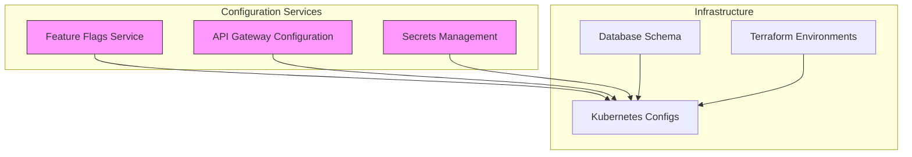
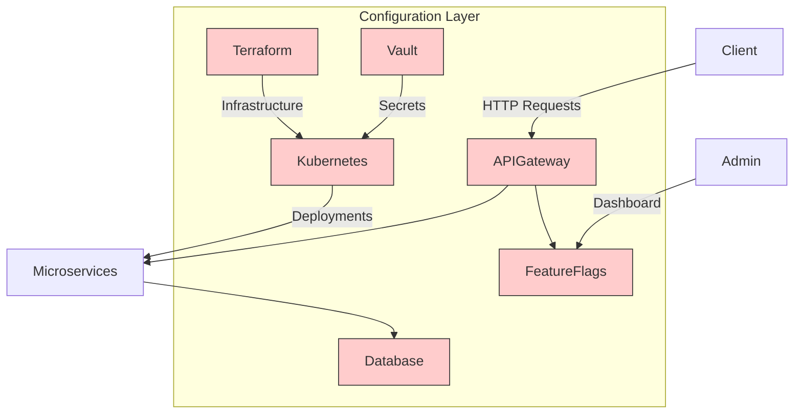
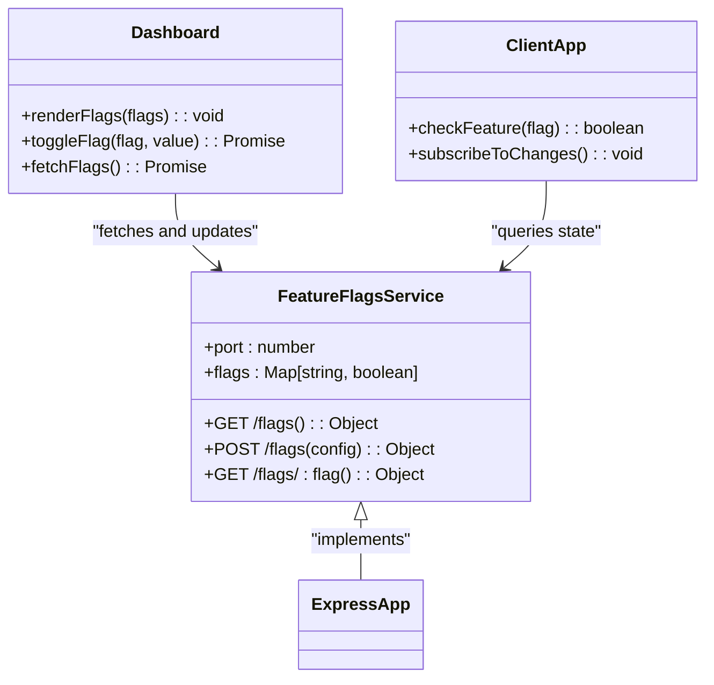
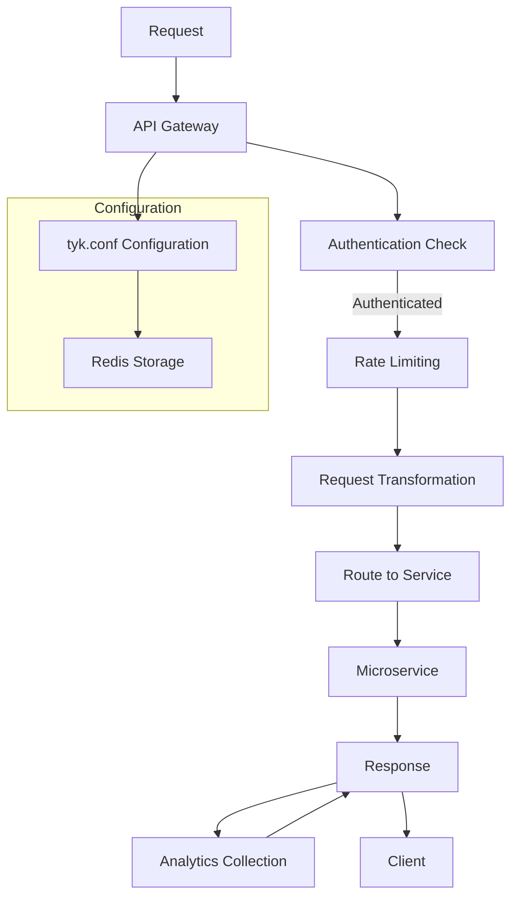
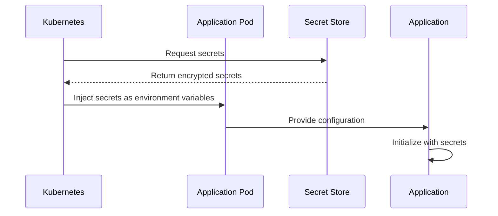
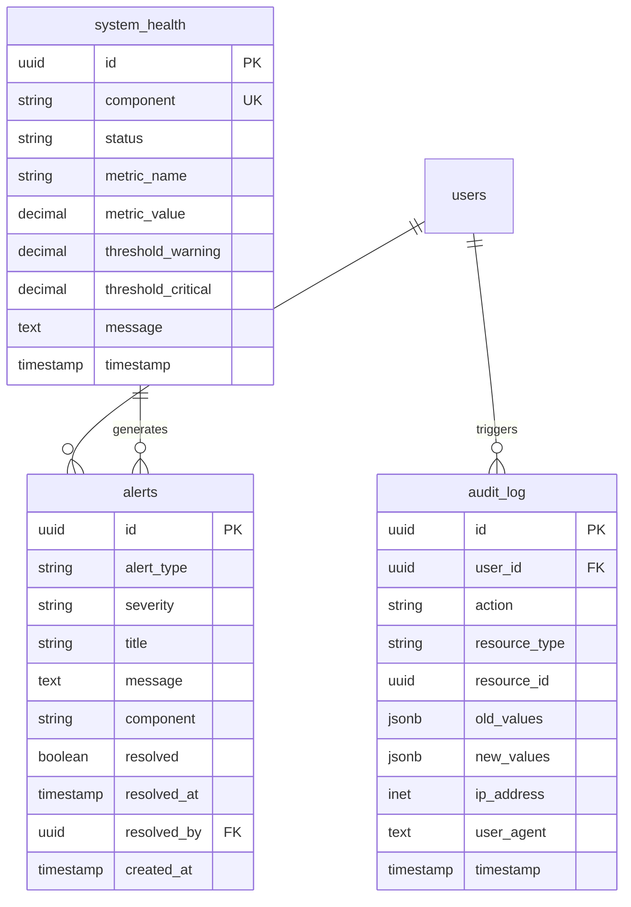
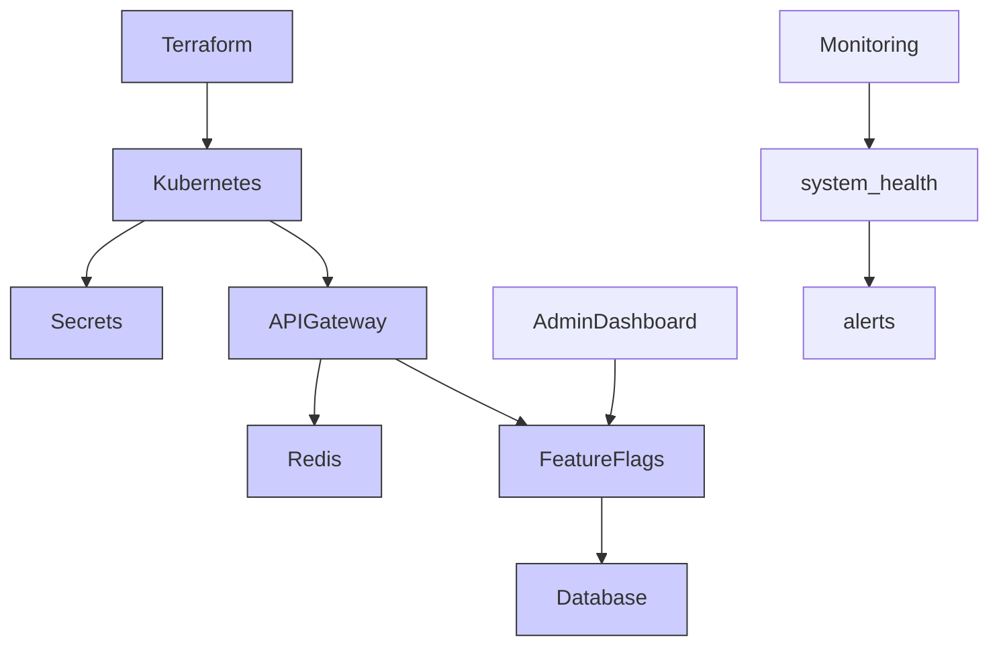

# System Configuration and Metadata

<cite>
**Referenced Files in This Document**   
- [featureflags/index.js](file://organs/featureflags/index.js)
- [featureflags/package.json](file://organs/featureflags/package.json)
- [featureflags/dashboard.html](file://organs/featureflags/dashboard.html)
- [biome/app-secrets.yaml](file://biome/app-secrets.yaml)
- [biome/main-app-deployment.yaml](file://biome/main-app-deployment.yaml)
- [infrastructure/k8s/api-gateway.yaml](file://infrastructure/k8s/api-gateway.yaml)
- [database/schema.sql](file://database/schema.sql)
- [infrastructure/terraform/environments/prod/README.md](file://infrastructure/terraform/environments/prod/README.md)
- [infrastructure/terraform/environments/dev/README.md](file://infrastructure/terraform/environments/dev/README.md)
</cite>

## Table of Contents
1. [Introduction](#introduction)
2. [Project Structure](#project-structure)
3. [Core Components](#core-components)
4. [Architecture Overview](#architecture-overview)
5. [Detailed Component Analysis](#detailed-component-analysis)
6. [Dependency Analysis](#dependency-analysis)
7. [Performance Considerations](#performance-considerations)
8. [Troubleshooting Guide](#troubleshooting-guide)
9. [Conclusion](#conclusion)

## Introduction
This document provides comprehensive documentation for the system configuration and metadata storage architecture of the Azora OS. It details the entities responsible for storing network configurations, feature flags, service settings, and operational parameters. The system enables dynamic configuration management across a microservices architecture with support for environment-specific settings, data validation, versioning, and synchronization. Configuration data is accessed and modified through RESTful interfaces and Kubernetes-native mechanisms, ensuring consistency and reliability across distributed components.

## Project Structure
The configuration and metadata system spans multiple directories, with core components located in biome, infrastructure, organs, and database directories. The structure follows a microservices pattern with dedicated services for feature flags, API gateway configuration, secrets management, and database schema definitions.

**Diagram sources**
- [organs/featureflags](file://organs/featureflags)
- [infrastructure/k8s](file://infrastructure/k8s)
- [biome](file://biome)
- [database](file://database)
- [infrastructure/terraform](file://infrastructure/terraform)

**Section sources**
- [organs/featureflags](file://organs/featureflags)
- [infrastructure/k8s](file://infrastructure/k8s)
- [biome](file://biome)

## Core Components
The system configuration architecture consists of several key components: a feature flags service for runtime feature toggling, Kubernetes manifests for service deployment configuration, secrets management for sensitive data, and a comprehensive database schema for persistent configuration storage. The feature flags service provides a REST API for dynamic configuration changes, while Kubernetes deployments define environment-specific settings for all services. The database schema includes tables for system health monitoring, audit logging, and compliance reporting that serve as configuration metadata stores.

**Section sources**
- [organs/featureflags/index.js](file://organs/featureflags/index.js)
- [biome/main-app-deployment.yaml](file://biome/main-app-deployment.yaml)
- [infrastructure/k8s/api-gateway.yaml](file://infrastructure/k8s/api-gateway.yaml)
- [database/schema.sql](file://database/schema.sql)

## Architecture Overview
The configuration architecture follows a hybrid approach combining centralized and decentralized elements. Runtime configuration is managed through dedicated services like the feature flags service, while deployment-time configuration is handled via Kubernetes manifests and Terraform. Secrets are isolated in dedicated configuration files, and persistent configuration data is stored in the PostgreSQL database with comprehensive auditing. The API gateway serves as a central configuration point for routing and middleware settings.

**Diagram sources**
- [infrastructure/k8s/api-gateway.yaml](file://infrastructure/k8s/api-gateway.yaml)
- [organs/featureflags/index.js](file://organs/featureflags/index.js)
- [biome](file://biome)
- [database/schema.sql](file://database/schema.sql)

## Detailed Component Analysis

### Feature Flags Service Analysis
The feature flags service provides dynamic configuration capabilities for the system, allowing features to be toggled at runtime without requiring service restarts or redeployments. This enables gradual feature rollouts, A/B testing, and emergency feature disabling.

**Diagram sources**
- [organs/featureflags/index.js](file://organs/featureflags/index.js)
- [organs/featureflags/dashboard.html](file://organs/featureflags/dashboard.html)

**Section sources**
- [organs/featureflags/index.js](file://organs/featureflags/index.js)
- [organs/featureflags/package.json](file://organs/featureflags/package.json)
- [organs/featureflags/dashboard.html](file://organs/featureflags/dashboard.html)

### API Gateway Configuration Analysis
The API gateway configuration defines routing rules, authentication requirements, and analytics settings for all microservices. It acts as a central control point for cross-cutting concerns and service mesh functionality.

**Diagram sources**
- [infrastructure/k8s/api-gateway.yaml](file://infrastructure/k8s/api-gateway.yaml)

**Section sources**
- [infrastructure/k8s/api-gateway.yaml](file://infrastructure/k8s/api-gateway.yaml)

### Secrets Management Analysis
The secrets management system handles sensitive configuration data such as database credentials and API keys. Secrets are stored in Kubernetes Secret objects and injected into pods at runtime, ensuring they are not exposed in configuration files or environment variables.

**Diagram sources**
- [biome/app-secrets.yaml](file://biome/app-secrets.yaml)

**Section sources**
- [biome/app-secrets.yaml](file://biome/app-secrets.yaml)

### Database Schema Analysis
The database schema defines the structure for storing configuration metadata, system health information, and audit logs. It includes comprehensive constraints and triggers to ensure data integrity and constitutional compliance.

**Diagram sources**
- [database/schema.sql](file://database/schema.sql)

**Section sources**
- [database/schema.sql](file://database/schema.sql)

## Dependency Analysis
The configuration system has dependencies across multiple layers of the architecture. The feature flags service depends on the API gateway for exposure to clients, while the API gateway depends on Redis for configuration storage. Kubernetes deployments depend on secret configurations, and all services depend on the database schema for metadata storage. The Terraform configurations depend on environment-specific settings that define the infrastructure configuration.

**Diagram sources**
- [infrastructure/terraform](file://infrastructure/terraform)
- [biome](file://biome)
- [infrastructure/k8s](file://infrastructure/k8s)
- [organs/featureflags](file://organs/featureflags)
- [database/schema.sql](file://database/schema.sql)

**Section sources**
- [infrastructure/terraform/environments/prod/README.md](file://infrastructure/terraform/environments/prod/README.md)
- [infrastructure/terraform/environments/dev/README.md](file://infrastructure/terraform/environments/dev/README.md)

## Performance Considerations
The configuration system is designed for high availability and low latency. The feature flags service uses in-memory storage for fast access, while the API gateway caches configuration to minimize Redis lookups. Database queries are optimized with comprehensive indexing on all configuration-related tables. The system supports horizontal scaling of configuration services to handle increased load, and the API gateway can be scaled independently of backend services.

## Troubleshooting Guide
Common configuration issues include missing secrets, incorrect feature flag states, and API gateway routing errors. The system health table provides real-time monitoring of configuration components, and the audit log tracks all configuration changes. Alerts are generated when configuration components enter a degraded state, and the feature flags dashboard provides a visual interface for verifying flag states.

**Section sources**
- [database/schema.sql](file://database/schema.sql)
- [organs/featureflags/dashboard.html](file://organs/featureflags/dashboard.html)

## Conclusion
The Azora OS configuration and metadata system provides a robust, scalable architecture for managing system settings across a distributed microservices environment. By combining centralized configuration services with decentralized deployment configurations, the system achieves both consistency and flexibility. The comprehensive database schema ensures all configuration changes are auditable and compliant with constitutional requirements, while the feature flags service enables agile feature management. This architecture supports the system's requirements for data validation, versioning, and synchronization across distributed components.