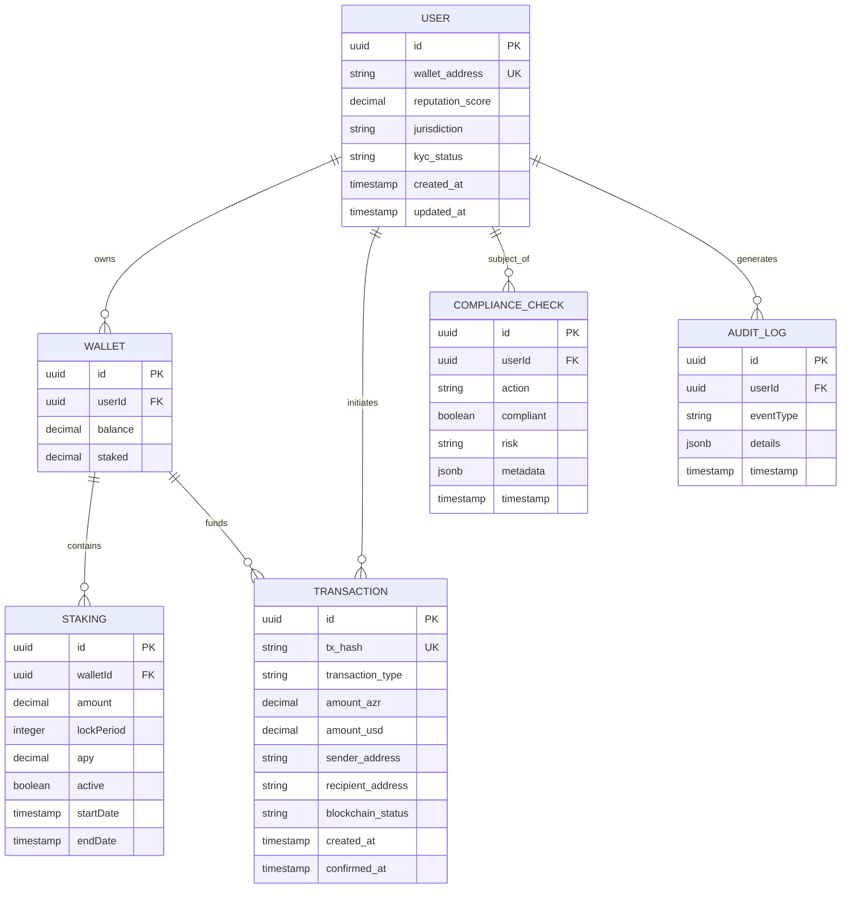
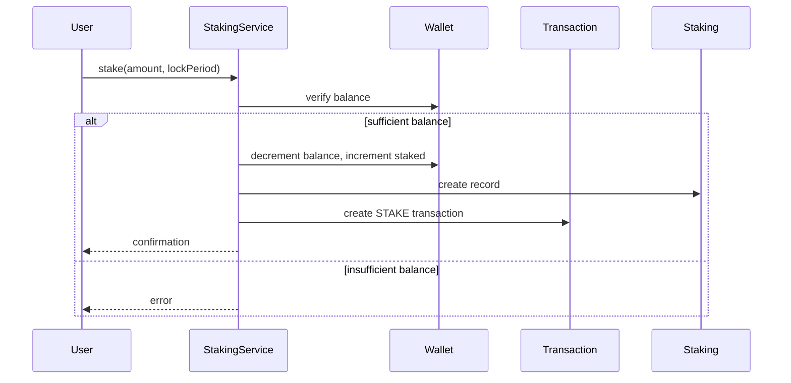
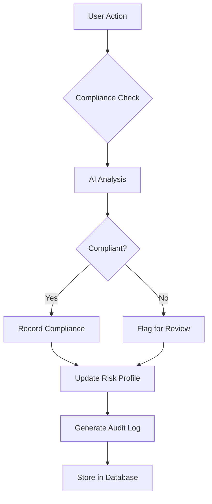

# Transaction and Compliance Records

<cite>
**Referenced Files in This Document**   
- [schema.sql](file://database/schema.sql)
- [complianceService.ts](file://organs/compliance/src/complianceService.ts)
- [complianceApi.ts](file://organs/compliance/src/complianceApi.ts)
- [stakingService.ts](file://services/azora-mint/stakingService.ts)
- [blockchain-ledger.ts](file://services/azora-mint/blockchain-ledger.ts)
- [earnings_ledger](file://services/azora-mint/schema.sql)
</cite>

## Table of Contents
1. [Introduction](#introduction)
2. [Data Model Overview](#data-model-overview)
3. [Transaction Records](#transaction-records)
4. [Staking Activities](#staking-activities)
5. [Compliance and Audit Records](#compliance-and-audit-records)
6. [Jurisdictional Compliance Frameworks](#jurisdictional-compliance-frameworks)
7. [Data Integrity and Audit Logging](#data-integrity-and-audit-logging)
8. [Retention Policies](#retention-policies)
9. [Conclusion](#conclusion)

## Introduction
This document provides comprehensive documentation of the transaction and compliance data models within Azora OS. It details the structure of financial transactions, token movements, staking activities, and compliance audits. The system is designed to maintain constitutional compliance, ensure data integrity, and support multi-jurisdictional regulatory requirements. The data model integrates blockchain-based transaction records with traditional relational database structures to provide both transparency and regulatory compliance.

## Data Model Overview
The Azora OS data model combines blockchain-based transaction records with relational database structures to ensure both decentralization and regulatory compliance. The system maintains transaction records across multiple tables and services, with strong referential integrity and audit capabilities. Key components include user accounts, transaction ledgers, staking records, and compliance audit trails.

**Diagram sources**
- [schema.sql](file://database/schema.sql)
- [stakingService.ts](file://services/azora-mint/stakingService.ts)
- [blockchain-ledger.ts](file://services/azora-mint/blockchain-ledger.ts)

**Section sources**
- [schema.sql](file://database/schema.sql)
- [complianceService.ts](file://organs/compliance/src/complianceService.ts)

## Transaction Records
The transaction records in Azora OS are stored in the treasury_ledger table, which maintains a complete audit trail of all AZR transactions and treasury movements. Each transaction record includes cryptographic verification through blockchain integration, with status tracking from pending to confirmed. The system enforces constitutional compliance by maintaining a 1:1 AZR/USD valuation through database constraints.

Transaction types include mint, burn, withdrawal, deposit, and transfer, each with specific allocation rules that distribute transaction value across treasury reserves (70%), founder compensation (11%), ceremonial burns (5%), and market circulation (23.9%). The treasury_ledger table is indexed for high-performance queries and includes comprehensive metadata such as gas usage, transaction hashes, and blockchain confirmation timestamps.

**Section sources**
- [schema.sql](file://database/schema.sql)
- [blockchain-ledger.ts](file://services/azora-mint/blockchain-ledger.ts)

## Staking Activities
Staking activities in Azora OS are managed through a dedicated staking service that tracks user staking positions, lock periods, and reward distributions. The staking model offers variable APY based on duration, with longer staking periods receiving higher returns. The system maintains staking records in both the staking table and transaction history, ensuring complete auditability of all staking operations.

The staking service implements a reward distribution mechanism that periodically allocates rewards from a staking pool wallet to active stakers based on their proportional contribution to the total staked amount. This ensures fair and transparent reward distribution while maintaining the integrity of the staking pool balance.

**Diagram sources**
- [stakingService.ts](file://services/azora-mint/stakingService.ts)
- [schema.sql](file://database/schema.sql)

**Section sources**
- [stakingService.ts](file://services/azora-mint/stakingService.ts)
- [schema.sql](file://database/schema.sql)

## Compliance and Audit Records
Compliance and audit records in Azora OS are managed through a dedicated compliance service that implements AI-powered compliance checks and risk prediction. The system maintains two primary tables: audit_log for tracking all system actions and compliance_reports for regulatory compliance documentation. The compliance service provides REST API endpoints for checking compliance, retrieving compliance records, and predicting risk based on historical patterns.

Each compliance check generates an audit trail entry and stores detailed metadata about the compliance assessment, including AI-generated insights. The system supports predictive risk assessment by analyzing a user's compliance history to determine their predicted risk level and recommend appropriate monitoring measures.

**Diagram sources**
- [complianceService.ts](file://organs/compliance/src/complianceService.ts)
- [complianceApi.ts](file://organs/compliance/src/complianceApi.ts)

**Section sources**
- [complianceService.ts](file://organs/compliance/src/complianceService.ts)
- [complianceApi.ts](file://organs/compliance/src/complianceApi.ts)

## Jurisdictional Compliance Frameworks
Azora OS supports multiple jurisdictional compliance frameworks through its flexible compliance architecture. The system can adapt to various regulatory requirements including GDPR, HIPAA, CCPA, LGPD, PIPEDA, and SOX through configurable compliance rules and AI-powered assessment. The jurisdiction field in the users table indicates the applicable regulatory framework for each user, enabling jurisdiction-specific compliance checks.

The compliance service architecture allows for the integration of jurisdiction-specific compliance modules, each implementing the relevant regulatory requirements. These modules can be dynamically loaded based on the user's jurisdiction, ensuring that all transactions and user actions are evaluated against the appropriate regulatory framework.

**Section sources**
- [complianceService.ts](file://organs/compliance/src/complianceService.ts)
- [schema.sql](file://database/schema.sql)

## Data Integrity and Audit Logging
Data integrity in Azora OS is maintained through multiple mechanisms including database constraints, row-level security, and comprehensive audit logging. The system enforces constitutional compliance through database constraints that ensure the 1:1 AZR/USD valuation and proper allocation of transaction values across treasury components.

The audit_log table maintains a complete record of all system actions, including the user ID, action type, resource affected, and before/after values in JSON format. This provides a complete audit trail for all data modifications. Row-level security policies ensure that users can only access their own data, enhancing privacy and compliance with data protection regulations.

**Section sources**
- [schema.sql](file://database/schema.sql)
- [complianceService.ts](file://organs/compliance/src/complianceService.ts)

## Retention Policies
Azora OS implements comprehensive data retention policies that balance regulatory requirements with storage efficiency. Transaction records, compliance reports, and audit logs are retained indefinitely to ensure complete auditability and regulatory compliance. System health data and temporary operational metrics are subject to automated purging after 365 days.

The system includes automated data lifecycle management that identifies and archives historical data while maintaining referential integrity. Compliance reports are generated on a regular basis and stored with appropriate metadata to support regulatory audits. The retention policies are designed to meet or exceed requirements for financial systems and blockchain applications.

**Section sources**
- [schema.sql](file://database/schema.sql)
- [complianceService.ts](file://organs/compliance/src/complianceService.ts)

## Conclusion
The transaction and compliance data model in Azora OS provides a robust foundation for financial operations with strong emphasis on regulatory compliance, data integrity, and auditability. By combining blockchain-based transaction records with traditional relational database structures, the system achieves both transparency and regulatory compliance. The AI-powered compliance service enables proactive risk management and adaptive regulatory adherence across multiple jurisdictions. The comprehensive audit logging and data retention policies ensure that all financial activities are fully traceable and compliant with constitutional requirements.