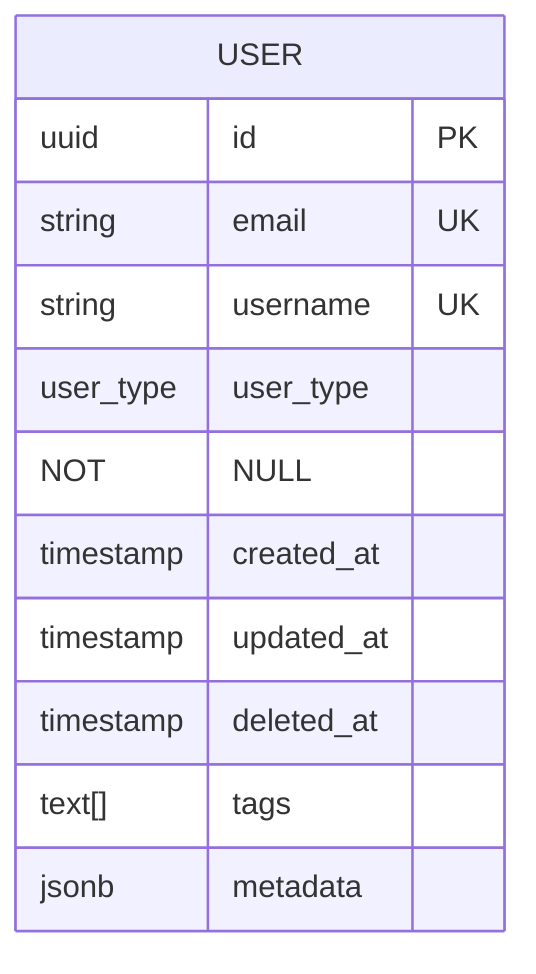
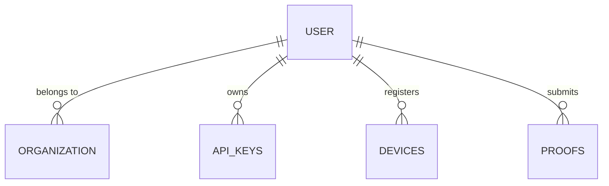
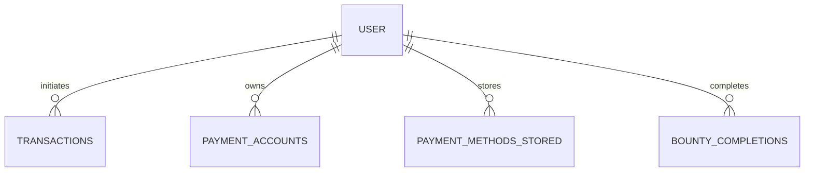

# User Data Model

<cite>
**Referenced Files in This Document**   
- [init-db-complete.sql](file://database/init-db-complete.sql)
- [supabase-client.ts](file://services/supabase-client.ts)
- [User.ts](file://services/azora-nexus/src/models/User.ts)
- [User.ts](file://services/azora-mint/src/models/User.ts)
</cite>

## Table of Contents
1. [Introduction](#introduction)
2. [Core User Fields](#core-user-fields)
3. [Authentication and Security](#authentication-and-security)
4. [Profile and Personal Information](#profile-and-personal-information)
5. [Role-Based Access Controls](#role-based-access-controls)
6. [Blockchain and Digital Identity](#blockchain-and-digital-identity)
7. [Financial and Educational Attributes](#financial-and-educational-attributes)
8. [Data Validation and Privacy](#data-validation-and-privacy)
9. [Relationships with Other Entities](#relationships-with-other-entities)
10. [Indexes and Performance Optimization](#indexes-and-performance-optimization)
11. [Common Queries and Data Access Patterns](#common-queries-and-data-access-patterns)

## Introduction
The User entity in Azora OS serves as the central identity model across government, enterprise, education, and global operations. It supports multiple user types including individuals, students, businesses, governments, and developers. The data model is designed for nation-state intelligence-grade security with comprehensive compliance, audit, and privacy controls. This document details the complete structure, constraints, relationships, and access patterns for the User entity.

**Section sources**
- [init-db-complete.sql](file://database/init-db-complete.sql#L44-L89)

## Core User Fields
The User entity contains foundational identity and metadata fields that support cross-domain operations within Azora OS.

- **id**: UUID primary key with auto-generation
- **email**: Unique, case-insensitive email with regex validation
- **username**: Optional unique identifier
- **user_type**: Enum field defining role (individual, student, business, enterprise, government, ngo, developer)
- **created_at/updated_at/deleted_at**: Timestamps for audit and soft deletion
- **tags**: Array of text tags for classification
- **metadata**: JSONB field for extensible attributes

The model enforces data integrity through a CHECK constraint on email format and uses UUIDs for global uniqueness.

**Diagram sources**
- [init-db-complete.sql](file://database/init-db-complete.sql#L44-L89)

**Section sources**
- [init-db-complete.sql](file://database/init-db-complete.sql#L44-L89)

## Authentication and Security
The User entity implements multi-layered security controls for authentication and access management.

- **password_hash**: Securely hashed password storage
- **two_factor_enabled**: Boolean flag for 2FA status
- **two_factor_method**: Method type (SMS, authenticator, biometric)
- **failed_login_attempts**: Counter for brute force protection
- **account_locked**: Boolean indicating lock status
- **last_login**: Timestamp of most recent successful login
- **login_count**: Total successful login attempts

Security clearance levels are enforced through the `security_clearance` enum (public, confidential, secret, top_secret, cosmic_top_secret), enabling granular access control based on sensitivity.

**Section sources**
- [init-db-complete.sql](file://database/init-db-complete.sql#L44-L89)

## Profile and Personal Information
Personal data is stored with privacy and compliance considerations, including encryption where appropriate.

- **first_name/last_name**: User's legal name components
- **date_of_birth**: Date field for age verification
- **nationality**: ISO country code (2-character)
- **language**: Language preference (5-character code)
- **timezone**: Timezone identifier
- **preferences**: JSONB storage for user preferences

The model supports KYC verification through:
- **kyc_status**: Enum (unverified, pending, verified, rejected, suspended)
- **kyc_level**: Integer representing verification tier
- **kyc_data**: JSONB containing verification documents
- **biometric_hash**: Cryptographic hash of biometric data

**Section sources**
- [init-db-complete.sql](file://database/init-db-complete.sql#L44-L89)

## Role-Based Access Controls
The User entity implements a comprehensive role-based access control system through multiple dimensions.

The `user_type` enum defines primary roles:
- individual
- student
- business
- enterprise
- government
- ngo
- developer

Each user is associated with an organization through `organization_id`, enabling organizational-level permissions. The `security_clearance` field provides a formal classification system for sensitive data access.

Additional access controls include:
- **role** field in authentication model (user, admin, moderator)
- **scopes** in API keys for granular endpoint access
- Row Level Security (RLS) policies for data isolation

**Diagram sources**
- [init-db-complete.sql](file://database/init-db-complete.sql#L44-L89)

**Section sources**
- [init-db-complete.sql](file://database/init-db-complete.sql#L44-L89)

## Blockchain and Digital Identity
The User entity integrates blockchain and decentralized identity technologies.

- **wallet_address**: Ethereum-compatible address (42 characters, unique)
- **did_identifier**: Decentralized Identifier (DID) for self-sovereign identity
- **public_key**: Cryptographic public key for signing operations
- **digital_identities**: Related table storing DID documents and verification methods

These fields enable cryptocurrency transactions, NFT ownership, and verifiable credentials across the Azora ecosystem.

**Section sources**
- [init-db-complete.sql](file://database/init-db-complete.sql#L44-L89)

## Financial and Educational Attributes
The model includes specialized fields for financial operations and educational tracking.

Financial attributes:
- **azr_balance**: Current AZR token balance (20,8 precision)
- **total_earned**: Lifetime earnings in AZR
- **total_spent**: Lifetime expenditures in AZR

Educational attributes (primarily for students):
- **student_id**: Institution-assigned identifier
- **institution**: Educational organization name
- **github_username**: GitHub handle for developer students
- **copilot_enrolled**: Boolean for AI assistant enrollment
- **learning_tier**: Educational progress level

**Diagram sources**
- [init-db-complete.sql](file://database/init-db-complete.sql#L44-L89)

**Section sources**
- [init-db-complete.sql](file://database/init-db-complete.sql#L44-L89)

## Data Validation and Privacy
The User entity implements comprehensive data validation and privacy protections.

Validation rules:
- Email format enforced via CHECK constraint
- Enum constraints for user_type, kyc_status, security_clearance
- Unique constraints on email, username, wallet_address, did_identifier
- Foreign key constraints on organization_id

Privacy considerations:
- Personal information fields are marked for encryption
- Soft deletion via deleted_at timestamp
- Row Level Security for data isolation
- Audit logging for all modifications
- GDPR/CCPA compliance features

The model supports data minimization through the extensible metadata field, avoiding schema bloat while maintaining flexibility.

**Section sources**
- [init-db-complete.sql](file://database/init-db-complete.sql#L44-L89)

## Relationships with Other Entities
The User entity serves as the central hub for multiple relationships across the Azora ecosystem.

Key relationships:
- **organizations**: One-to-many (users belong to organizations)
- **transactions**: One-to-many (users initiate transactions)
- **payment_accounts**: One-to-many (users own payment accounts)
- **bounty_completions**: One-to-many (users complete bounties)
- **enrollments**: One-to-many (users enroll in courses)
- **api_keys**: One-to-many (users own API keys)
- **user_activities**: One-to-many (users generate activities)
- **audit_logs**: One-to-many (users generate audit entries)

The model also supports complex educational relationships through proofs of knowledge, course enrollments, and certification tracking.

**Section sources**
- [init-db-complete.sql](file://database/init-db-complete.sql#L44-L89)

## Indexes and Performance Optimization
The User entity is optimized for high-performance queries through strategic indexing.

Primary indexes:
- **idx_users_email**: On email field for authentication
- **idx_users_username**: On username for lookup
- **idx_users_wallet**: On wallet_address for blockchain operations
- **idx_users_org**: On organization_id for organizational queries
- **idx_users_type**: On user_type for role-based queries

Additional performance features:
- Use of UUIDs for distributed systems
- JSONB for flexible metadata queries
- Partial indexes on active records
- Trigram indexes for fuzzy matching
- Composite indexes on common query patterns

The model also includes triggers for automatic updated_at timestamp management.

**Section sources**
- [init-db-complete.sql](file://database/init-db-complete.sql#L44-L89)

## Common Queries and Data Access Patterns
The User entity supports several common access patterns through the Supabase client and direct SQL.

Common queries:
- **Get user by email**: Authentication and lookup
- **Get user by ID**: Profile retrieval
- **Get users by type**: Role-based filtering
- **Update earnings**: Financial operations
- **Update metadata**: Preference changes

Access patterns implemented in supabase-client.ts:
- UserDB.create(): Create new user
- UserDB.getById(): Retrieve by UUID
- UserDB.getByEmail(): Retrieve by email
- UserDB.getByType(): Filter by user_type
- UserDB.updateEarnings(): Modify financial data
- UserDB.updateMetadata(): Update extensible attributes

The model also supports real-time updates through Supabase's realtime functionality for live user state tracking.

**Section sources**
- [supabase-client.ts](file://services/supabase-client.ts#L43-L107)