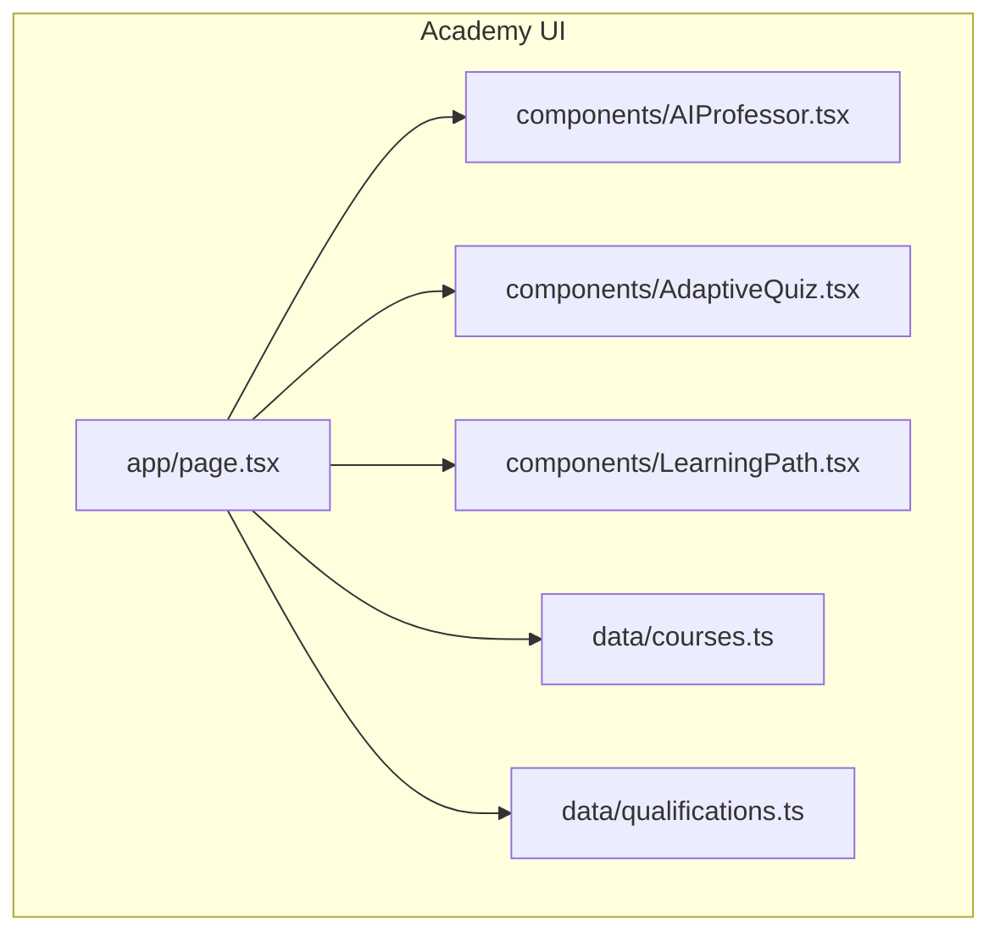
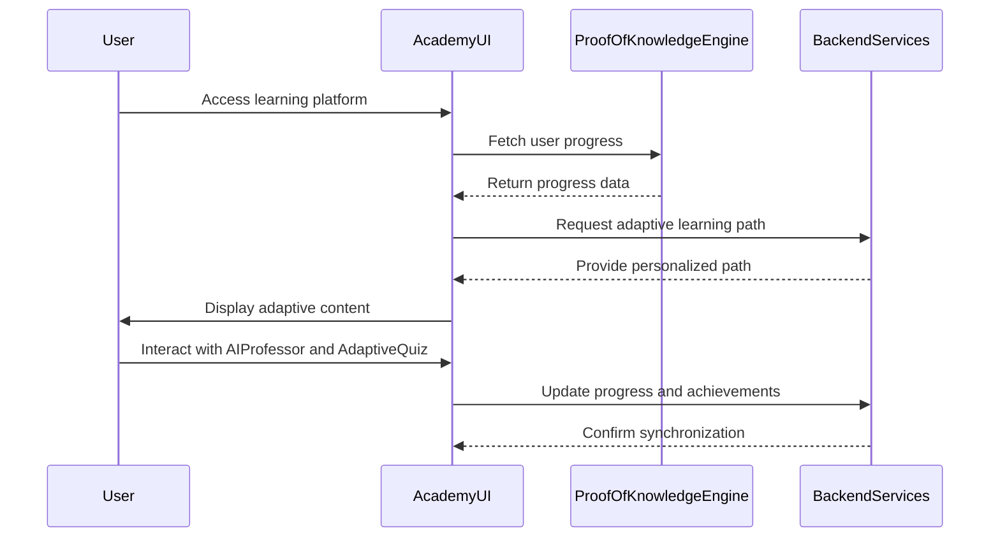
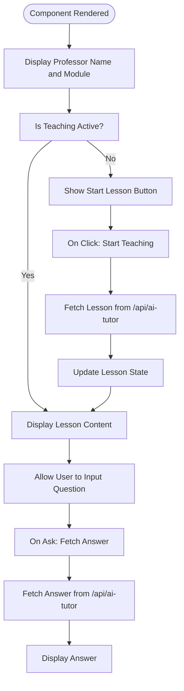
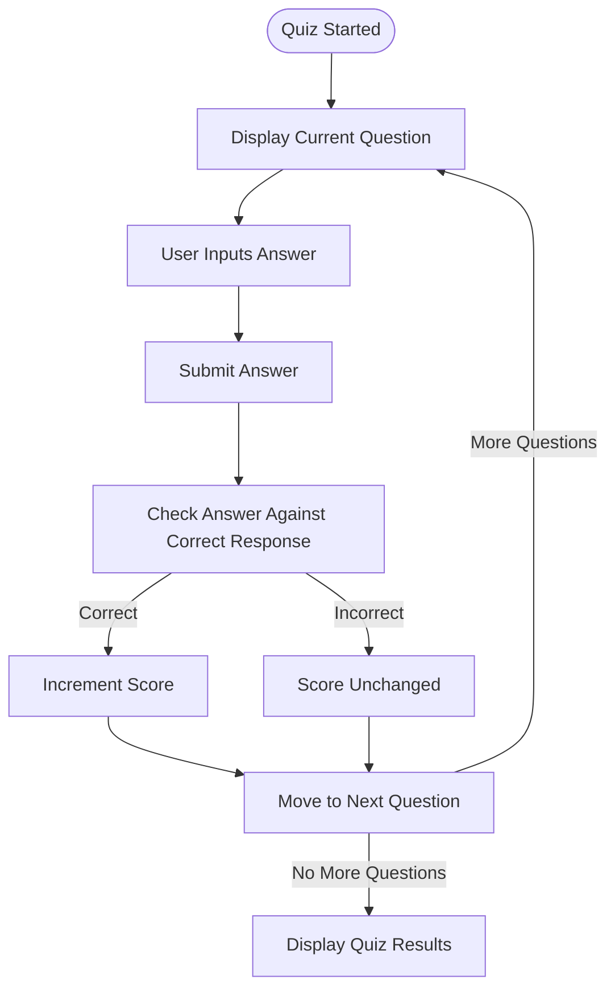
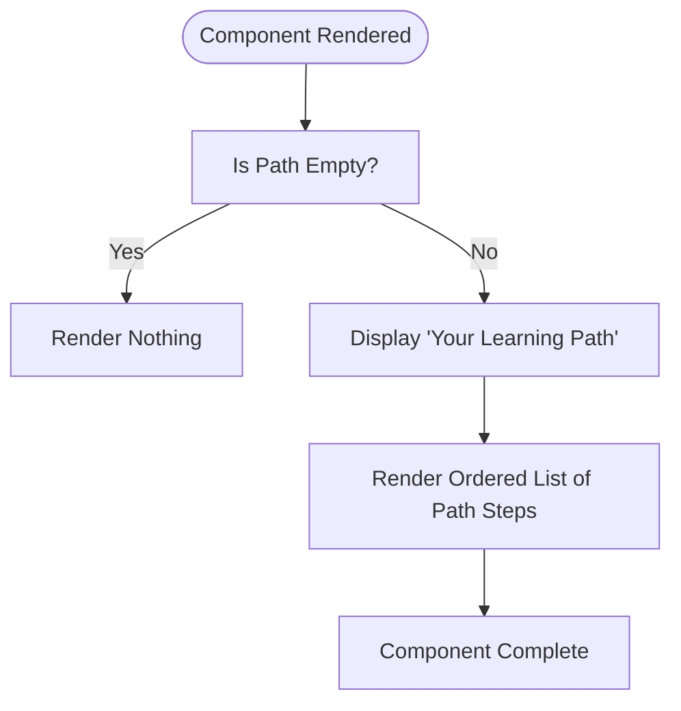
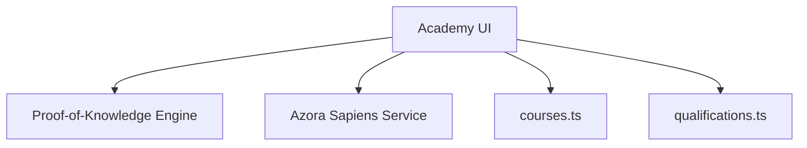

# Academy UI

<cite>
**Referenced Files in This Document**   
- [AIProfessor.tsx](file://synapse/academy-ui/components/AIProfessor.tsx)
- [AdaptiveQuiz.tsx](file://synapse/academy-ui/components/AdaptiveQuiz.tsx)
- [LearningPath.tsx](file://synapse/academy-ui/components/LearningPath.tsx)
- [page.tsx](file://synapse/academy-ui/app/page.tsx)
- [courses.ts](file://synapse/academy-ui/data/courses.ts)
- [qualifications.ts](file://synapse/academy-ui/data/qualifications.ts)
- [azora-sapiens.ts](file://genome/agent-tools/azora-sapiens.ts)
- [sapiens-service.js](file://services/azora-sapiens/sapiens-service.js)
</cite>

## Table of Contents
1. [Introduction](#introduction)
2. [Project Structure](#project-structure)
3. [Core Components](#core-components)
4. [Architecture Overview](#architecture-overview)
5. [Detailed Component Analysis](#detailed-component-analysis)
6. [Dependency Analysis](#dependency-analysis)
7. [Performance Considerations](#performance-considerations)
8. [Troubleshooting Guide](#troubleshooting-guide)
9. [Conclusion](#conclusion)

## Introduction
The Academy UI is an educational platform within Azora OS designed to deliver adaptive learning experiences and track user achievements. It leverages Next.js App Router with React Server Components for server-rendered content and client components for interactive elements such as quizzes and progress tracking. The UI integrates with backend educational services to implement adaptive learning pathways, synchronize user progress across devices, and support accessibility and responsive design patterns.

## Project Structure
The Academy UI resides in the `synapse/academy-ui` directory and follows a modular structure centered around the Next.js App Router. Key directories include:
- `app/`: Contains the main application layout and page components using React Server Components.
- `components/`: Houses reusable UI components such as AIProfessor, AdaptiveQuiz, and LearningPath.
- `data/`: Stores static data for courses and qualifications.
- `hooks/`: Includes custom hooks like `use-mobile.tsx` for responsive behavior.
- `styles/` and `ui/`: Manage styling and shared UI elements.

This structure supports server-side rendering for performance and SEO while enabling dynamic interactivity through client components.

**Diagram sources**
- [page.tsx](file://synapse/academy-ui/app/page.tsx)
- [AIProfessor.tsx](file://synapse/academy-ui/components/AIProfessor.tsx)
- [AdaptiveQuiz.tsx](file://synapse/academy-ui/components/AdaptiveQuiz.tsx)
- [LearningPath.tsx](file://synapse/academy-ui/components/LearningPath.tsx)
- [courses.ts](file://synapse/academy-ui/data/courses.ts)
- [qualifications.ts](file://synapse/academy-ui/data/qualifications.ts)

**Section sources**
- [page.tsx](file://synapse/academy-ui/app/page.tsx)
- [courses.ts](file://synapse/academy-ui/data/courses.ts)
- [qualifications.ts](file://synapse/academy-ui/data/qualifications.ts)

## Core Components
The Academy UI implements key components that facilitate interactive and adaptive learning:
- **AIProfessor**: Enables students to interact with an AI-driven professor for personalized instruction.
- **AdaptiveQuiz**: Provides dynamic quizzes that adapt based on user performance.
- **LearningPath**: Visualizes the user's personalized learning journey.

These components integrate with backend services to deliver real-time feedback and adaptive content.

**Section sources**
- [AIProfessor.tsx](file://synapse/academy-ui/components/AIProfessor.tsx)
- [AdaptiveQuiz.tsx](file://synapse/academy-ui/components/AdaptiveQuiz.tsx)
- [LearningPath.tsx](file://synapse/academy-ui/components/LearningPath.tsx)

## Architecture Overview
The Academy UI uses Next.js App Router to leverage React Server Components for server-rendered content, ensuring fast initial loads and SEO benefits. Interactive elements like quizzes and progress tracking are implemented as client components to maintain state and responsiveness. Data fetching occurs from the proof-of-knowledge engine, which tracks user progress and achievements.

User progress synchronization across devices is achieved through backend services that store and retrieve learning data in real time. The UI also incorporates accessibility features and responsive design to ensure usability across various devices and user needs.

**Diagram sources**
- [page.tsx](file://synapse/academy-ui/app/page.tsx)
- [sapiens-service.js](file://services/azora-sapiens/sapiens-service.js)
- [azora-sapiens.ts](file://genome/agent-tools/azora-sapiens.ts)

## Detailed Component Analysis

### AIProfessor Component
The AIProfessor component allows users to engage with an AI-driven professor for personalized instruction. It supports asking questions and initiating step-by-step lessons.

**Diagram sources**
- [AIProfessor.tsx](file://synapse/academy-ui/components/AIProfessor.tsx)

**Section sources**
- [AIProfessor.tsx](file://synapse/academy-ui/components/AIProfessor.tsx)

### AdaptiveQuiz Component
The AdaptiveQuiz component delivers quizzes that adapt based on user responses. It tracks scores and provides immediate feedback.

**Diagram sources**
- [AdaptiveQuiz.tsx](file://synapse/academy-ui/components/AdaptiveQuiz.tsx)

**Section sources**
- [AdaptiveQuiz.tsx](file://synapse/academy-ui/components/AdaptiveQuiz.tsx)

### LearningPath Component
The LearningPath component visualizes the user's personalized learning journey as an ordered list of modules.

**Diagram sources**
- [LearningPath.tsx](file://synapse/academy-ui/components/LearningPath.tsx)

**Section sources**
- [LearningPath.tsx](file://synapse/academy-ui/components/LearningPath.tsx)

## Dependency Analysis
The Academy UI depends on several backend services and data sources:
- **Proof-of-Knowledge Engine**: Tracks user achievements and rewards.
- **Azora Sapiens Service**: Provides adaptive learning algorithms and predictive analytics.
- **Course and Qualification Data**: Static data files that define available courses and qualifications.

These dependencies enable the UI to deliver personalized learning experiences and synchronize progress across devices.

**Diagram sources**
- [sapiens-service.js](file://services/azora-sapiens/sapiens-service.js)
- [azora-sapiens.ts](file://genome/agent-tools/azora-sapiens.ts)
- [courses.ts](file://synapse/academy-ui/data/courses.ts)
- [qualifications.ts](file://synapse/academy-ui/data/qualifications.ts)

**Section sources**
- [sapiens-service.js](file://services/azora-sapiens/sapiens-service.js)
- [azora-sapiens.ts](file://genome/agent-tools/azora-sapiens.ts)

## Performance Considerations
The Academy UI optimizes performance through server-side rendering of static content and efficient data fetching from backend services. Client components are kept lightweight to ensure responsiveness. Caching strategies and lazy loading can further enhance performance, especially for users with limited bandwidth.

## Troubleshooting Guide
Common issues in the Academy UI may include:
- **API Fetch Failures**: Ensure the `/api/ai-tutor` endpoint is accessible and correctly configured.
- **Progress Sync Issues**: Verify backend service connectivity and authentication.
- **Rendering Problems**: Check for missing or incorrect data in `courses.ts` and `qualifications.ts`.

Monitoring logs and user feedback can help identify and resolve these issues promptly.

**Section sources**
- [AIProfessor.tsx](file://synapse/academy-ui/components/AIProfessor.tsx)
- [sapiens-service.js](file://services/azora-sapiens/sapiens-service.js)

## Conclusion
The Academy UI in Azora OS provides a robust educational platform with adaptive learning pathways and achievement tracking. By leveraging Next.js App Router and React Server Components, it delivers high-performance, server-rendered content while maintaining interactivity through client components. Integration with backend services ensures real-time progress synchronization and personalized learning experiences. The implementation of accessibility and responsive design patterns makes the platform inclusive and user-friendly.