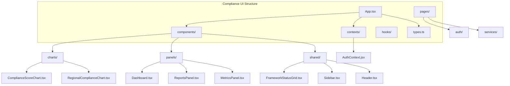
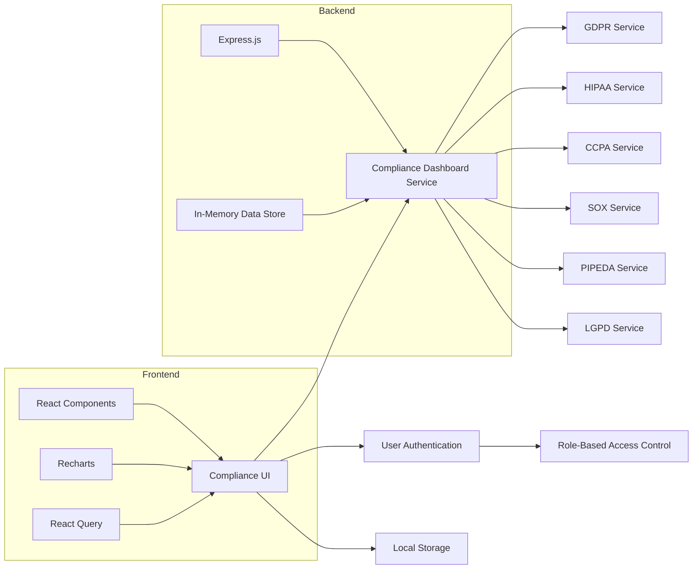
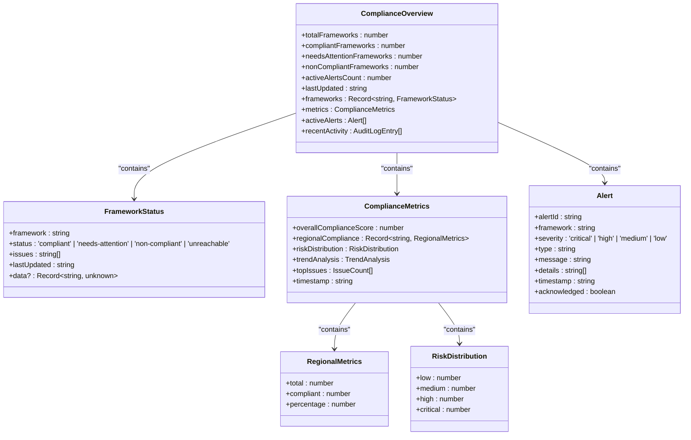
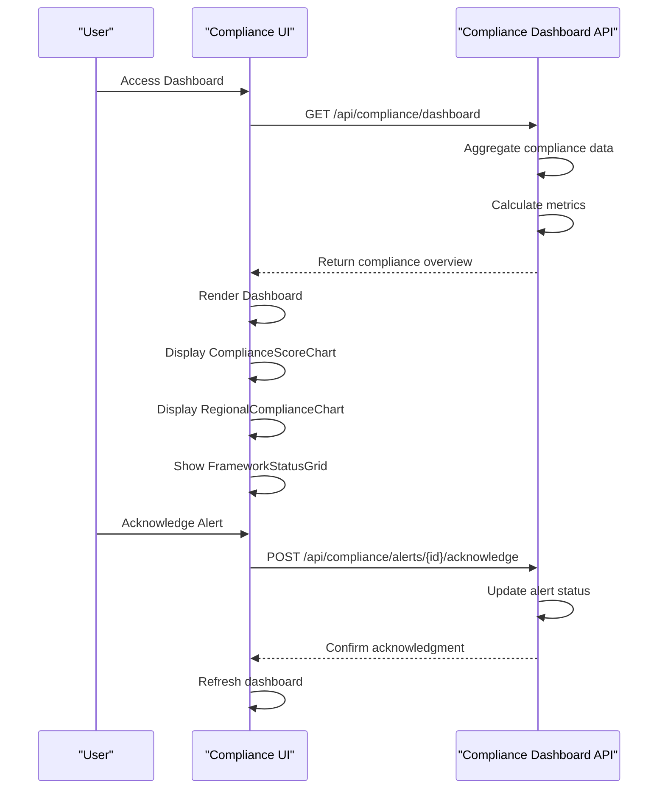
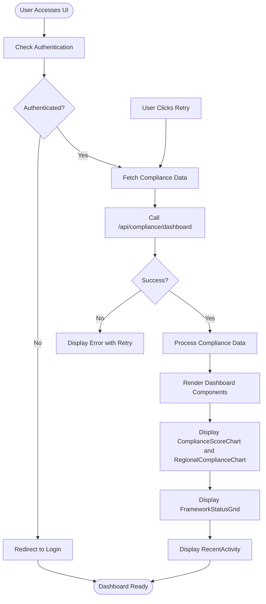
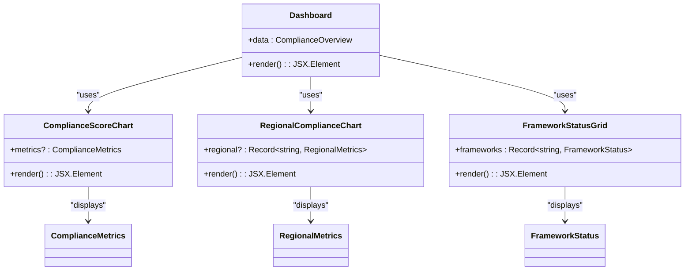
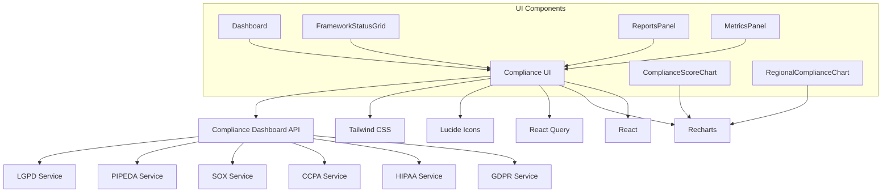

# Compliance UI

<cite>
**Referenced Files in This Document**   
- [ComplianceScoreChart.tsx](file://ui/compliance-ui/src/components/charts/ComplianceScoreChart.tsx)
- [RegionalComplianceChart.tsx](file://ui/compliance-ui/src/components/charts/RegionalComplianceChart.tsx)
- [Dashboard.tsx](file://ui/compliance-ui/src/components/panels/Dashboard.tsx)
- [FrameworkStatusGrid.tsx](file://ui/compliance-ui/src/components/shared/FrameworkStatusGrid.tsx)
- [ReportsPanel.tsx](file://ui/compliance-ui/src/components/panels/ReportsPanel.tsx)
- [MetricsPanel.tsx](file://ui/compliance-ui/src/components/panels/MetricsPanel.tsx)
- [App.tsx](file://ui/compliance-ui/src/App.tsx)
- [AuthContext.jsx](file://ui/compliance-ui/src/contexts/AuthContext.jsx)
- [Sidebar.tsx](file://ui/compliance-ui/src/components/shared/Sidebar.tsx)
- [Header.tsx](file://ui/compliance-ui/src/components/shared/Header.tsx)
- [types.ts](file://ui/compliance-ui/src/types.ts)
- [index.js](file://services/compliance-dashboard/index.js)
</cite>

## Table of Contents
1. [Introduction](#introduction)
2. [Project Structure](#project-structure)
3. [Core Components](#core-components)
4. [Architecture Overview](#architecture-overview)
5. [Detailed Component Analysis](#detailed-component-analysis)
6. [Dependency Analysis](#dependency-analysis)
7. [Performance Considerations](#performance-considerations)
8. [Troubleshooting Guide](#troubleshooting-guide)
9. [Conclusion](#conclusion)

## Introduction
The Compliance UI in Azora OS serves as a centralized dashboard for monitoring and managing compliance across multiple regulatory frameworks including GDPR, HIPAA, CCPA, SOX, PIPEDA, and LGPD. This interface provides real-time visualization of compliance status, risk distribution, and regional metrics, enabling organizations to maintain regulatory adherence across geographical regions. The UI integrates with backend compliance services to display audit logs, policy configurations, and violation reports, while supporting role-based access control and secure data handling.

## Project Structure
The Compliance UI is organized within the `ui/compliance-ui` directory, following a modular React component architecture with TypeScript. The structure separates concerns into components, contexts, hooks, and pages, enabling maintainability and scalability.

**Diagram sources**
- [ComplianceScoreChart.tsx](file://ui/compliance-ui/src/components/charts/ComplianceScoreChart.tsx)
- [RegionalComplianceChart.tsx](file://ui/compliance-ui/src/components/charts/RegionalComplianceChart.tsx)
- [Dashboard.tsx](file://ui/compliance-ui/src/components/panels/Dashboard.tsx)
- [FrameworkStatusGrid.tsx](file://ui/compliance-ui/src/components/shared/FrameworkStatusGrid.tsx)
- [ReportsPanel.tsx](file://ui/compliance-ui/src/components/panels/ReportsPanel.tsx)
- [MetricsPanel.tsx](file://ui/compliance-ui/src/components/panels/MetricsPanel.tsx)
- [AuthContext.jsx](file://ui/compliance-ui/src/contexts/AuthContext.jsx)
- [Sidebar.tsx](file://ui/compliance-ui/src/components/shared/Sidebar.tsx)
- [Header.tsx](file://ui/compliance-ui/src/components/shared/Header.tsx)

**Section sources**
- [ui/compliance-ui](file://ui/compliance-ui)

## Core Components
The Compliance UI features several core components that enable comprehensive compliance monitoring. The `ComplianceScoreChart` visualizes risk distribution across frameworks using a pie chart, while the `RegionalComplianceChart` displays compliance metrics by geographical region using bar charts. The `Dashboard` component integrates these visualizations with framework status grids and recent activity logs. The UI also includes specialized panels for alerts, reports, and metrics, all accessible through a navigation sidebar. Authentication is managed through `AuthContext`, providing role-based access control for sensitive compliance data.

**Section sources**
- [ComplianceScoreChart.tsx](file://ui/compliance-ui/src/components/charts/ComplianceScoreChart.tsx#L1-L85)
- [RegionalComplianceChart.tsx](file://ui/compliance-ui/src/components/charts/RegionalComplianceChart.tsx#L1-L60)
- [Dashboard.tsx](file://ui/compliance-ui/src/components/panels/Dashboard.tsx#L1-L98)
- [FrameworkStatusGrid.tsx](file://ui/compliance-ui/src/components/shared/FrameworkStatusGrid.tsx#L1-L87)
- [ReportsPanel.tsx](file://ui/compliance-ui/src/components/panels/ReportsPanel.tsx#L1-L137)
- [MetricsPanel.tsx](file://ui/compliance-ui/src/components/panels/MetricsPanel.tsx#L1-L237)
- [AuthContext.jsx](file://ui/compliance-ui/src/contexts/AuthContext.jsx#L1-L123)

## Architecture Overview
The Compliance UI follows a client-server architecture where the frontend React application communicates with a backend compliance dashboard service via REST APIs. The UI fetches compliance data at regular intervals and displays it through interactive visualizations. The architecture supports real-time updates, error handling with retry mechanisms, and lazy loading of panel components for optimal performance.

**Diagram sources**
- [App.tsx](file://ui/compliance-ui/src/App.tsx#L1-L112)
- [index.js](file://services/compliance-dashboard/index.js#L1-L267)

## Detailed Component Analysis

### Compliance Dashboard Analysis
The Compliance UI provides a comprehensive dashboard that visualizes compliance status across multiple dimensions. Users can monitor their compliance posture through various interactive components that update in real-time.

#### For Object-Oriented Components:

**Diagram sources**
- [types.ts](file://ui/compliance-ui/src/types.ts#L1-L115)

#### For API/Service Components:

**Diagram sources**
- [App.tsx](file://ui/compliance-ui/src/App.tsx#L1-L112)
- [index.js](file://services/compliance-dashboard/index.js#L1-L267)

#### For Complex Logic Components:

**Diagram sources**
- [App.tsx](file://ui/compliance-ui/src/App.tsx#L1-L112)
- [Dashboard.tsx](file://ui/compliance-ui/src/components/panels/Dashboard.tsx#L1-L98)

**Section sources**
- [App.tsx](file://ui/compliance-ui/src/App.tsx#L1-L112)
- [Dashboard.tsx](file://ui/compliance-ui/src/components/panels/Dashboard.tsx#L1-L98)
- [types.ts](file://ui/compliance-ui/src/types.ts#L1-L115)

### Compliance Visualization Components
The Compliance UI implements specialized visualization components to represent compliance data effectively. The `ComplianceScoreChart` uses a pie chart to show risk distribution across different compliance frameworks, while the `RegionalComplianceChart` employs a bar chart to display compliance percentages by geographical region.

#### For Object-Oriented Components:

**Diagram sources**
- [ComplianceScoreChart.tsx](file://ui/compliance-ui/src/components/charts/ComplianceScoreChart.tsx#L1-L85)
- [RegionalComplianceChart.tsx](file://ui/compliance-ui/src/components/charts/RegionalComplianceChart.tsx#L1-L60)
- [Dashboard.tsx](file://ui/compliance-ui/src/components/panels/Dashboard.tsx#L1-L98)
- [FrameworkStatusGrid.tsx](file://ui/compliance-ui/src/components/shared/FrameworkStatusGrid.tsx#L1-L87)

**Section sources**
- [ComplianceScoreChart.tsx](file://ui/compliance-ui/src/components/charts/ComplianceScoreChart.tsx#L1-L85)
- [RegionalComplianceChart.tsx](file://ui/compliance-ui/src/components/charts/RegionalComplianceChart.tsx#L1-L60)
- [Dashboard.tsx](file://ui/compliance-ui/src/components/panels/Dashboard.tsx#L1-L98)
- [FrameworkStatusGrid.tsx](file://ui/compliance-ui/src/components/shared/FrameworkStatusGrid.tsx#L1-L87)

## Dependency Analysis
The Compliance UI has well-defined dependencies between components and external services. The frontend relies on React, Recharts for visualizations, and React Query for data fetching. The UI communicates with the compliance dashboard backend service, which aggregates data from individual compliance framework services.

**Diagram sources**
- [package.json](file://ui/compliance-ui/package.json)
- [App.tsx](file://ui/compliance-ui/src/App.tsx#L1-L112)
- [index.js](file://services/compliance-dashboard/index.js#L1-L267)

**Section sources**
- [package.json](file://ui/compliance-ui/package.json)
- [App.tsx](file://ui/compliance-ui/src/App.tsx#L1-L112)
- [index.js](file://services/compliance-dashboard/index.js#L1-L267)

## Performance Considerations
The Compliance UI implements several performance optimizations to ensure responsive user experience. Data fetching is handled by React Query with automatic refetching every 30 seconds to maintain real-time accuracy without overwhelming the backend. The UI employs lazy loading for panel components to reduce initial load time. Error boundaries and loading states provide feedback during data retrieval. The dashboard efficiently processes and displays large datasets through optimized rendering and virtualization techniques.

**Section sources**
- [App.tsx](file://ui/compliance-ui/src/App.tsx#L1-L112)
- [ReportsPanel.tsx](file://ui/compliance-ui/src/components/panels/ReportsPanel.tsx#L1-L137)
- [MetricsPanel.tsx](file://ui/compliance-ui/src/components/panels/MetricsPanel.tsx#L1-L237)

## Troubleshooting Guide
When users encounter issues with the Compliance UI, several common problems may occur. If the dashboard fails to load, users should verify their internet connection and check if the compliance dashboard service is running on port 4000. Authentication issues can be resolved by clearing local storage and logging in again. For missing data, users should ensure that individual compliance services (GDPR, HIPAA, etc.) are operational. The UI provides error messages with retry options when API calls fail, and users can refresh the data manually using the refresh button in the header.

**Section sources**
- [App.tsx](file://ui/compliance-ui/src/App.tsx#L1-L112)
- [AuthContext.jsx](file://ui/compliance-ui/src/contexts/AuthContext.jsx#L1-L123)
- [Header.tsx](file://ui/compliance-ui/src/components/shared/Header.tsx#L1-L42)

## Conclusion
The Compliance UI in Azora OS provides a comprehensive solution for monitoring and managing regulatory compliance across multiple frameworks and geographical regions. Through its intuitive dashboard, real-time visualizations, and integration with backend compliance services, the UI enables organizations to maintain regulatory adherence efficiently. The implementation of role-based access control and secure data handling ensures that sensitive compliance information is protected. With components like ComplianceScoreChart and RegionalComplianceChart, users can gain immediate insights into their compliance posture and take corrective actions when necessary.