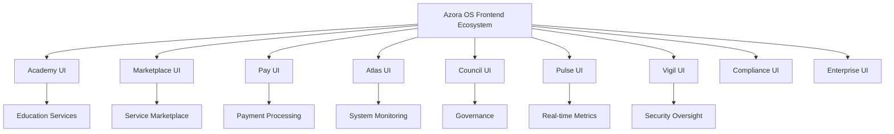
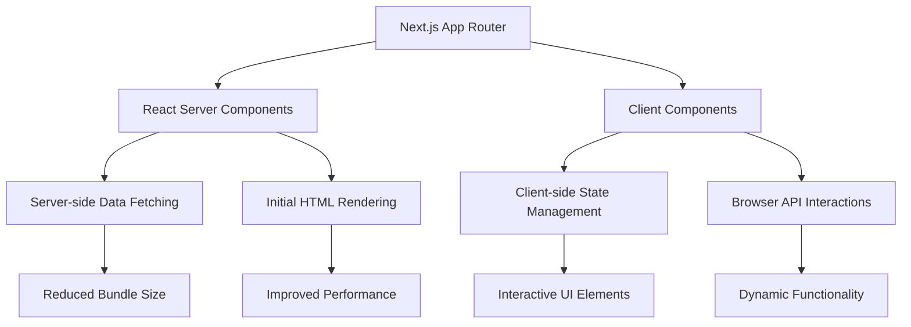
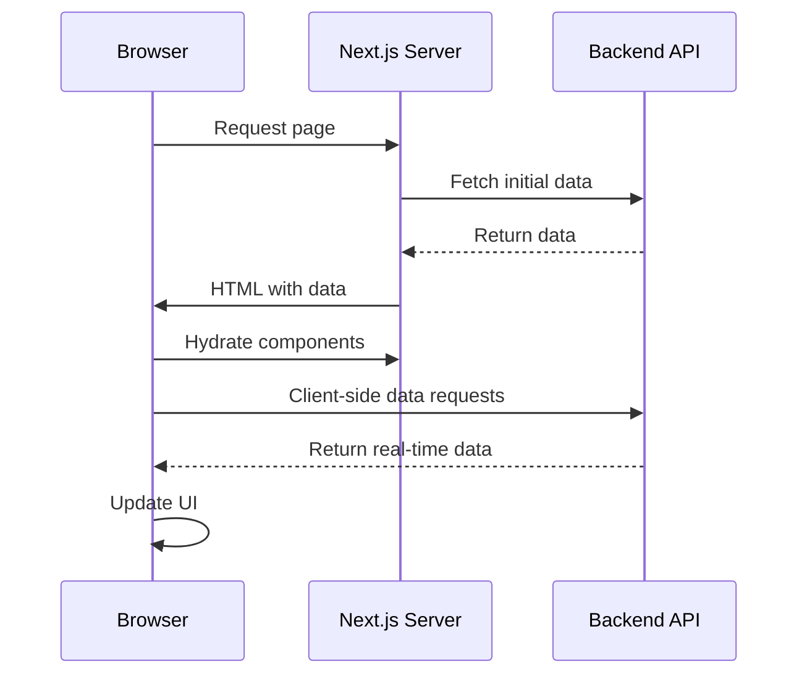
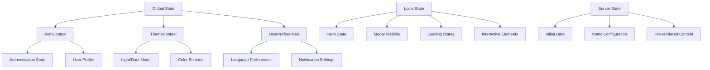
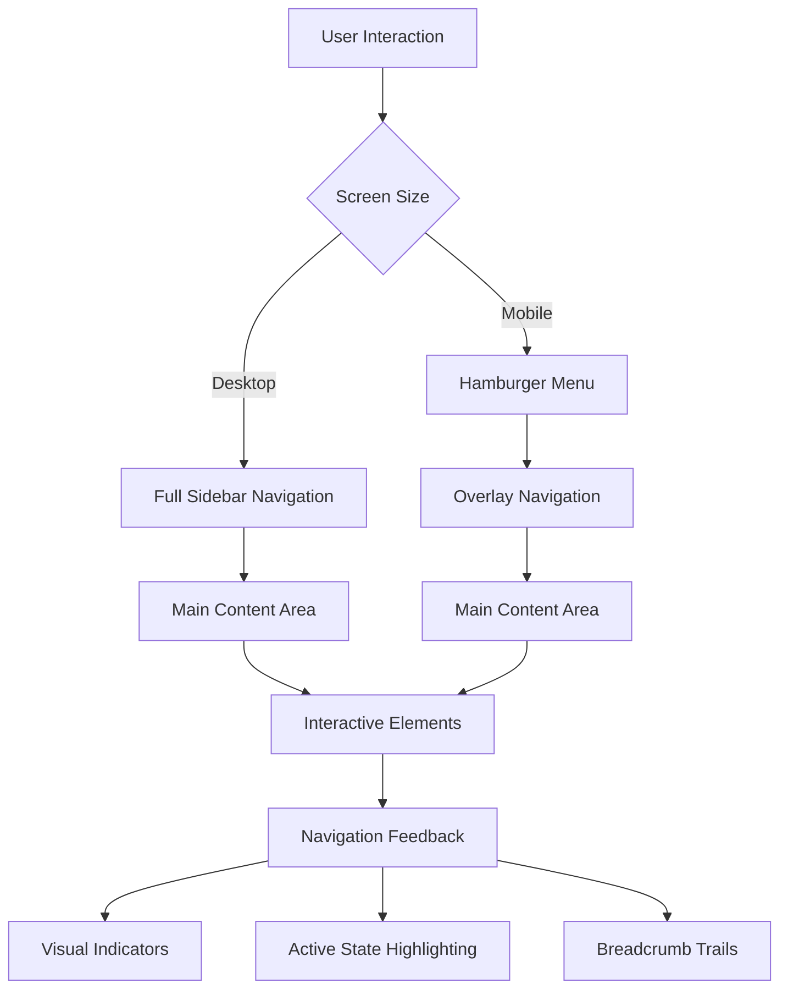
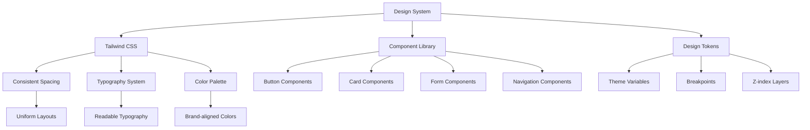
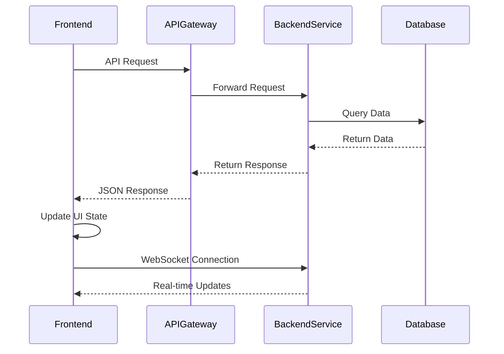

# Frontend Architecture

<cite>
**Referenced Files in This Document**   
- [academy-ui/app/page.tsx](file://synapse/academy-ui/app/page.tsx)
- [atlas-ui/app/page.tsx](file://synapse/atlas-ui/app/page.tsx)
- [council-ui/app/page.tsx](file://synapse/council-ui/app/page.tsx)
- [pulse-ui/app/page.tsx](file://synapse/pulse-ui/app/page.tsx)
- [vigil-ui/app/page.tsx](file://synapse/vigil-ui/app/page.tsx)
- [marketplace-ui/src/pages/Dashboard.jsx](file://marketplace-ui/src/pages/Dashboard.jsx)
- [pay-ui/src/pages/Dashboard.jsx](file://pay-ui/src/pages/Dashboard.jsx)
- [ui/app/page.tsx](file://ui/app/page.tsx)
- [synapse/frontend/src/main.tsx](file://synapse/frontend/src/main.tsx)
- [azora/azora-mint-mine-engine-next/src/app/page.tsx](file://azora/azora-mint-mine-engine-next/src/app/page.tsx)
</cite>

## Table of Contents
1. [Introduction](#introduction)
2. [Multi-Application Frontend Structure](#multi-application-frontend-structure)
3. [Shared Architectural Patterns](#shared-architectural-patterns)
4. [Routing Strategy](#routing-strategy)
5. [Data Fetching Approaches](#data-fetching-approaches)
6. [State Management](#state-management)
7. [Navigation Patterns](#navigation-patterns)
8. [UI Consistency Across Applications](#ui-consistency-across-applications)
9. [Integration with Backend APIs](#integration-with-backend-apis)
10. [Conclusion](#conclusion)

## Introduction
The Azora OS frontend architecture is designed as a multi-application ecosystem, where distinct UIs serve specialized system components such as academy, marketplace, compliance, and other services. This architecture leverages modern web development practices with Next.js App Router, React Server Components, and client-side interactivity to deliver high-performance, scalable user interfaces. The system maintains consistency across applications while allowing for domain-specific customization and functionality.

## Multi-Application Frontend Structure
Azora OS implements a decentralized frontend architecture with multiple independent applications serving different system components. Each application is purpose-built for its specific domain:

- **Academy UI**: Educational platform for African AI and blockchain courses
- **Marketplace UI**: Service marketplace with compliance and analytics panels
- **Pay UI**: Payment and financial services interface
- **Atlas UI**: System monitoring and operational dashboard
- **Council UI**: Governance and decision-making interface
- **Pulse UI**: Real-time system metrics and health monitoring
- **Vigil UI**: Security and compliance oversight

These applications are organized in the repository under dedicated directories within the `synapse` folder and other top-level directories like `marketplace-ui` and `pay-ui`. Each application maintains its own package.json, configuration files, and component structure while sharing common design principles and architectural patterns.



**Diagram sources**
- [synapse/academy-ui](file://synapse/academy-ui)
- [marketplace-ui](file://marketplace-ui)
- [pay-ui](file://pay-ui)
- [synapse/atlas-ui](file://synapse/atlas-ui)
- [synapse/council-ui](file://synapse/council-ui)
- [synapse/pulse-ui](file://synapse/pulse-ui)
- [synapse/vigil-ui](file://synapse/vigil-ui)

**Section sources**
- [synapse/academy-ui](file://synapse/academy-ui)
- [marketplace-ui](file://marketplace-ui)
- [pay-ui](file://pay-ui)

## Shared Architectural Patterns
All frontend applications in Azora OS share common architectural patterns centered around Next.js App Router and React Server Components. The applications leverage React Server Components for initial rendering, allowing for efficient server-side data fetching and reduced client-side JavaScript bundle sizes. Client-side interactivity is implemented through "use client" directives in specific components that require state management or browser APIs.

The shared architecture includes:
- Next.js App Router for file-based routing
- React Server Components for server-side rendering
- Tailwind CSS for utility-first styling
- Component libraries with shared UI patterns
- Environment-specific configuration
- Internationalization support

Applications consistently use layout.tsx files for shared layouts and implement error and loading states through dedicated components. The architecture supports both static site generation and server-side rendering based on the requirements of each application.



**Diagram sources**
- [synapse/academy-ui/app/layout.tsx](file://synapse/academy-ui/app/layout.tsx)
- [synapse/atlas-ui/app/layout.tsx](file://synapse/atlas-ui/app/layout.tsx)
- [marketplace-ui/src/App.jsx](file://marketplace-ui/src/App.jsx)

**Section sources**
- [synapse/academy-ui/app/layout.tsx](file://synapse/academy-ui/app/layout.tsx)
- [synapse/atlas-ui/app/layout.tsx](file://synapse/atlas-ui/app/layout.tsx)
- [marketplace-ui/src/App.jsx](file://marketplace-ui/src/App.jsx)

## Routing Strategy
The routing strategy across Azora OS frontend applications follows the Next.js App Router convention, with each application implementing its own routing structure based on its domain requirements. The Academy UI, for example, uses a dashboard-centric approach with the root page serving as the main dashboard, while specialized routes handle course content and user progress.

Marketplace and Pay UI applications implement authentication flows with dedicated routes for login, signup, and password recovery under `/auth` paths. Service-specific functionality is organized under `/services` with individual panels for different system components like AI Assistant, Compliance, and Analytics.

The Atlas, Council, Pulse, and Vigil UI applications follow a simpler routing pattern with a single main page that serves as the primary interface for their respective domains. These applications focus on real-time data visualization and system monitoring rather than complex navigation.

All applications support dynamic routing for user-specific content and implement proper error handling for non-existent routes.

```mermaid
graph TD
A[Root Route /] --> B[Academy Dashboard]
A --> C[Marketplace Dashboard]
A --> D[Pay Dashboard]
A --> E[Atlas Dashboard]
A --> F[Council Dashboard]
A --> G[Pulse Dashboard]
A --> H[Vigil Dashboard]
B --> I[/courses]
B --> J[/profile]
B --> K[/achievements]
C --> L[/auth/login]
C --> M[/auth/signup]
C --> N[/services/ai-assistant]
C --> O[/services/compliance]
C --> P[/services/analytics]
D --> Q[/auth/login]
D --> R[/auth/signup]
D --> S[/services/payment-processing]
D --> T[/services/liquidity]
```

**Diagram sources**
- [synapse/academy-ui/app/page.tsx](file://synapse/academy-ui/app/page.tsx)
- [marketplace-ui/src/pages/Dashboard.jsx](file://marketplace-ui/src/pages/Dashboard.jsx)
- [marketplace-ui/src/pages/auth/Login.jsx](file://marketplace-ui/src/pages/auth/Login.jsx)
- [marketplace-ui/src/pages/services/AIAssistantPanel.jsx](file://marketplace-ui/src/pages/services/AIAssistantPanel.jsx)

**Section sources**
- [synapse/academy-ui/app/page.tsx](file://synapse/academy-ui/app/page.tsx)
- [marketplace-ui/src/pages](file://marketplace-ui/src/pages)

## Data Fetching Approaches
Azora OS frontend applications implement various data fetching approaches depending on the nature of the data and performance requirements. React Server Components are used extensively for initial data loading, allowing applications to fetch data on the server and include it in the initial HTML response. This approach reduces client-side waterfalls and improves perceived performance.

The Academy UI demonstrates server-side data fetching for user statistics, course progress, and achievement data, which are rendered as part of the initial page load. Real-time community activity is handled through client-side data fetching using React's useEffect hook and WebSocket connections for live updates.

Marketplace and Pay UI applications use a combination of server-side and client-side data fetching. Static configuration data and initial user state are fetched server-side, while dynamic service status and real-time metrics are updated client-side through periodic polling or WebSocket connections.

All applications implement proper loading states and error handling for data fetching operations, with skeleton screens and fallback UIs to maintain usability during data loading.



**Diagram sources**
- [synapse/academy-ui/app/page.tsx](file://synapse/academy-ui/app/page.tsx)
- [marketplace-ui/src/pages/Dashboard.jsx](file://marketplace-ui/src/pages/Dashboard.jsx)
- [pay-ui/src/pages/Dashboard.jsx](file://pay-ui/src/pages/Dashboard.jsx)

**Section sources**
- [synapse/academy-ui/app/page.tsx](file://synapse/academy-ui/app/page.tsx)
- [marketplace-ui/src/pages/Dashboard.jsx](file://marketplace-ui/src/pages/Dashboard.jsx)

## State Management
State management in Azora OS frontend applications follows a hybrid approach, leveraging React Server Components for server-managed state and client-side state management for interactive components. The applications use React Context API for global state that needs to be accessed across multiple components, such as authentication state and theme preferences.

The Academy UI implements local component state for interactive elements like progress tracking and achievement displays, while maintaining user authentication state in a global context. The use of React Server Components reduces the need for complex client-side state management by allowing state to be managed on the server and passed to client components as props.

Marketplace and Pay UI applications use Context API for managing authentication state across the application, with dedicated AuthContext components that provide user information and authentication methods to all parts of the application. Theme preferences are managed through ThemeContext, allowing users to switch between light and dark modes.

For complex forms and multi-step processes, applications implement custom hooks that encapsulate state logic and provide a clean API to components.



**Diagram sources**
- [marketplace-ui/src/contexts/AuthContext.jsx](file://marketplace-ui/src/contexts/AuthContext.jsx)
- [marketplace-ui/src/contexts/ThemeContext.jsx](file://marketplace-ui/src/contexts/ThemeContext.jsx)
- [pay-ui/src/contexts/AuthContext.jsx](file://pay-ui/src/contexts/AuthContext.jsx)

**Section sources**
- [marketplace-ui/src/contexts](file://marketplace-ui/src/contexts)
- [pay-ui/src/contexts](file://pay-ui/src/contexts)

## Navigation Patterns
Navigation patterns in Azora OS frontend applications are designed to support both broad system exploration and focused task completion. The Academy UI implements a sidebar navigation pattern with a persistent sidebar that provides access to all major sections of the application, including courses, achievements, and community features.

Marketplace and Pay UI applications use a combination of top navigation bars and side navigation panels to organize access to different services. The top navigation includes global actions like user profile and notifications, while the side navigation organizes services into logical categories.

Atlas, Council, Pulse, and Vigil UI applications use minimal navigation patterns, focusing on single-page interfaces with tabbed sections or card-based layouts for different data views. These applications prioritize information density and real-time updates over complex navigation.

All applications implement responsive navigation patterns that adapt to different screen sizes, with mobile-friendly hamburger menus and touch-optimized controls.



**Diagram sources**
- [synapse/academy-ui/components/sidebar-layout.tsx](file://synapse/academy-ui/components/sidebar-layout.tsx)
- [marketplace-ui/src/components/layout/MainLayout.jsx](file://marketplace-ui/src/components/layout/MainLayout.jsx)
- [synapse/atlas-ui/components/app-sidebar.tsx](file://synapse/atlas-ui/components/app-sidebar.tsx)

**Section sources**
- [synapse/academy-ui/components/sidebar-layout.tsx](file://synapse/academy-ui/components/sidebar-layout.tsx)
- [marketplace-ui/src/components/layout/MainLayout.jsx](file://marketplace-ui/src/components/layout/MainLayout.jsx)

## UI Consistency Across Applications
Despite serving different system components, Azora OS frontend applications maintain a high degree of UI consistency through shared design principles and component libraries. All applications use Tailwind CSS for styling, ensuring consistent spacing, typography, and color schemes across the ecosystem.

The applications share common UI components such as cards, buttons, badges, and progress indicators, which are implemented with consistent visual properties and interaction patterns. Data visualization components like charts and grids follow similar design language across applications, making it easier for users to interpret information regardless of which application they are using.

The Academy UI, Marketplace UI, and Pay UI applications all use similar dashboard layouts with statistics cards, progress indicators, and activity feeds. Atlas, Council, Pulse, and Vigil UI applications share a common dashboard pattern with grid-based layouts and status indicators.

This consistency is achieved through both explicit design guidelines and shared code where appropriate, allowing for efficient development while maintaining a cohesive user experience across the Azora OS ecosystem.



**Diagram sources**
- [synapse/academy-ui/components/ui](file://synapse/academy-ui/components/ui)
- [marketplace-ui/src/components/shared](file://marketplace-ui/src/components/shared)
- [pay-ui/src/components/shared](file://pay-ui/src/components/shared)

**Section sources**
- [synapse/academy-ui/components/ui](file://synapse/academy-ui/components/ui)
- [marketplace-ui/src/components/shared](file://marketplace-ui/src/components/shared)

## Integration with Backend APIs
Frontend applications in Azora OS integrate with backend services through a combination of server-side API calls and client-side data fetching. React Server Components are used to fetch data from backend APIs during server-side rendering, reducing the need for client-side data fetching and improving performance.

The Academy UI integrates with course management, user progress tracking, and achievement systems through API endpoints that provide structured data for rendering. Authentication is handled through a centralized auth service that provides JWT tokens for secure API access.

Marketplace and Pay UI applications integrate with multiple backend services for different functionalities:
- Service status and availability
- User authentication and authorization
- Payment processing and transaction history
- Compliance and security monitoring
- Analytics and reporting

API integration follows a consistent pattern across applications, with dedicated service modules that encapsulate API calls and provide a clean interface to components. Error handling and retry logic are implemented at the service level to ensure robustness.



**Diagram sources**
- [synapse/academy-ui/app/page.tsx](file://synapse/academy-ui/app/page.tsx)
- [marketplace-ui/src/pages/Dashboard.jsx](file://marketplace-ui/src/pages/Dashboard.jsx)
- [services/ai-agent-service](file://services/ai-agent-service)
- [services/analytics-service](file://services/analytics-service)

**Section sources**
- [synapse/academy-ui/app/page.tsx](file://synapse/academy-ui/app/page.tsx)
- [marketplace-ui/src/pages/Dashboard.jsx](file://marketplace-ui/src/pages/Dashboard.jsx)
- [services](file://services)

## Conclusion
The frontend architecture of Azora OS represents a sophisticated multi-application ecosystem that balances specialization with consistency. By leveraging Next.js App Router and React Server Components, the system achieves high performance and maintainability across its diverse set of applications. The shared architectural patterns ensure that developers can work efficiently across different parts of the system while maintaining a cohesive user experience.

The separation of concerns between different UI applications allows each to focus on its specific domain while benefiting from shared infrastructure and design principles. This architecture supports the scalability and extensibility required for a complex system like Azora OS, enabling the addition of new applications and services without compromising the overall integrity of the frontend ecosystem.