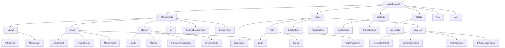
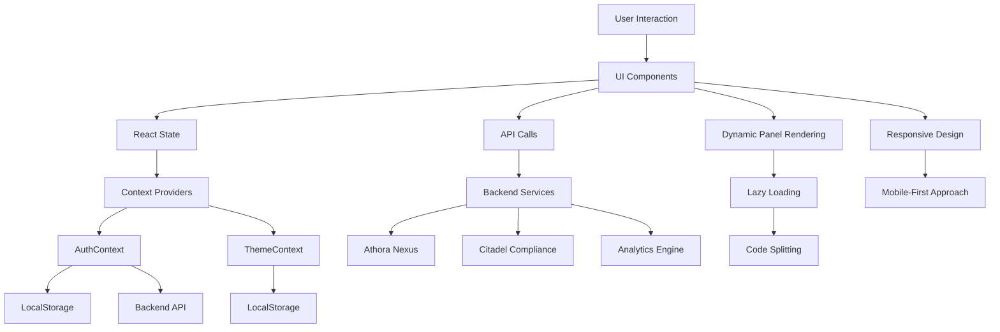
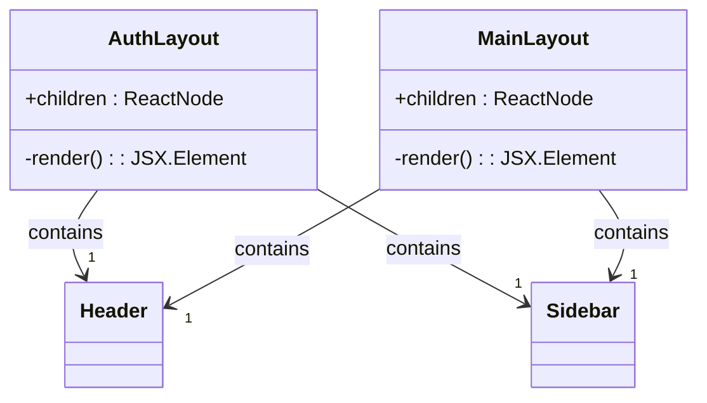
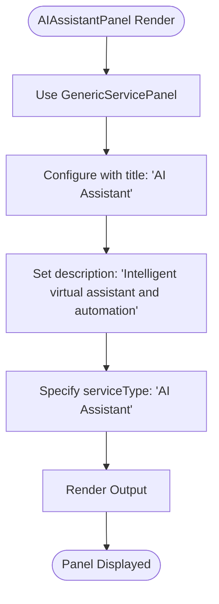
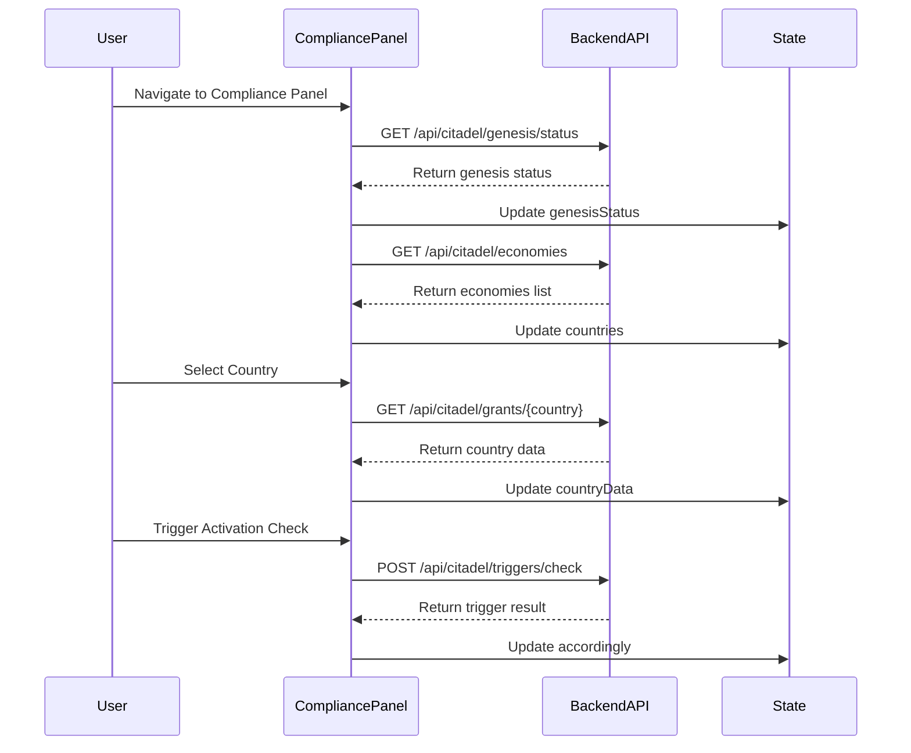
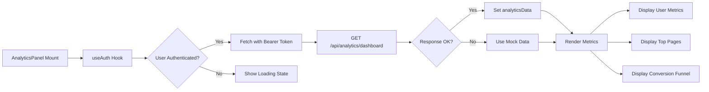
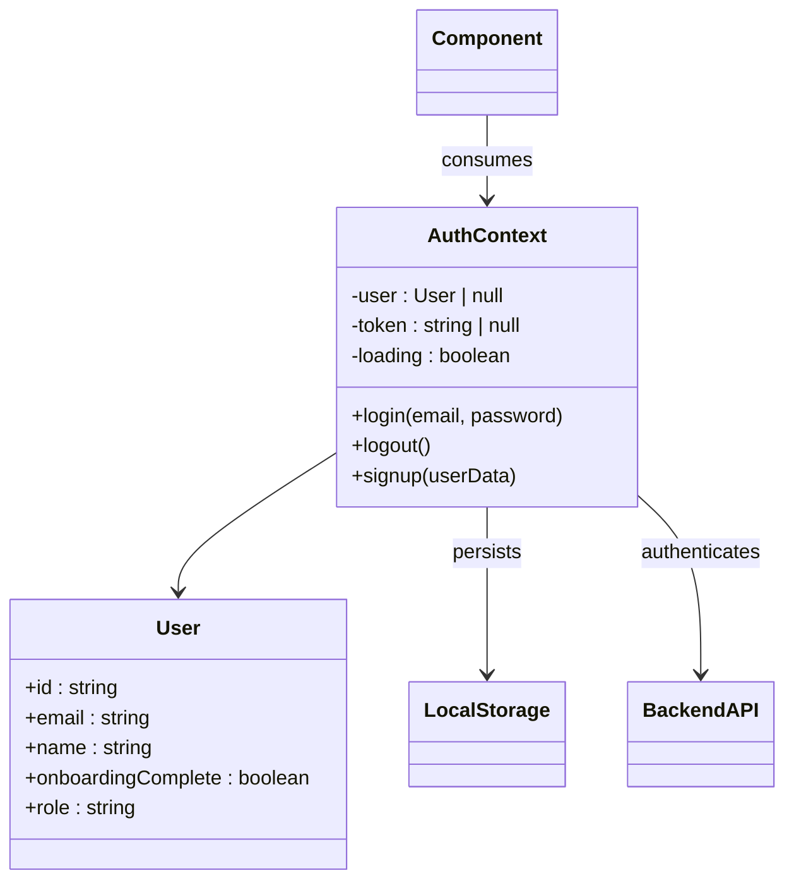
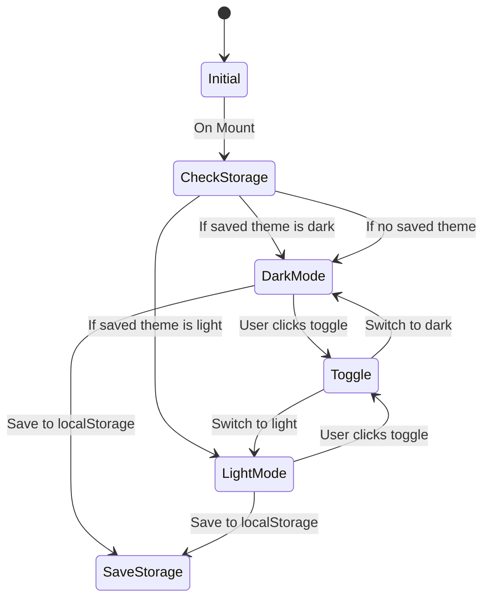
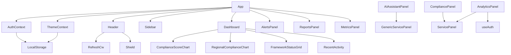

# Marketplace UI

<cite>
**Referenced Files in This Document**   
- [App.tsx](file://marketplace-ui/src/App.tsx)
- [AuthContext.jsx](file://marketplace-ui/src/contexts/AuthContext.jsx)
- [ThemeContext.jsx](file://marketplace-ui/src/contexts/ThemeContext.jsx)
- [AuthLayout.jsx](file://marketplace-ui/src/components/layout/AuthLayout.jsx)
- [MainLayout.jsx](file://marketplace-ui/src/components/layout/MainLayout.jsx)
- [AIAssistantPanel.jsx](file://marketplace-ui/src/pages/services/AIAssistantPanel.jsx)
- [CompliancePanel.jsx](file://marketplace-ui/src/pages/services/CompliancePanel.jsx)
- [AnalyticsPanel.jsx](file://marketplace-ui/src/pages/services/AnalyticsPanel.jsx)
- [Dashboard.tsx](file://marketplace-ui/src/components/panels/Dashboard.tsx)
- [Header.tsx](file://marketplace-ui/src/components/shared/Header.tsx)
</cite>

## Table of Contents
1. [Introduction](#introduction)
2. [Project Structure](#project-structure)
3. [Core Components](#core-components)
4. [Architecture Overview](#architecture-overview)
5. [Detailed Component Analysis](#detailed-component-analysis)
6. [Dependency Analysis](#dependency-analysis)
7. [Performance Considerations](#performance-considerations)
8. [Troubleshooting Guide](#troubleshooting-guide)
9. [Conclusion](#conclusion)

## Introduction
The Marketplace UI in Azora OS serves as a centralized service marketplace that provides access to specialized AI-driven and compliance-oriented services. This document details the implementation of the Marketplace UI, focusing on its modular architecture, state management, authentication flow, and responsive design principles. The UI enables users to interact with various service panels including AI Assistant, Compliance, Analytics, and other domain-specific modules through a unified interface.

## Project Structure

**Diagram sources**
- [App.tsx](file://marketplace-ui/src/App.tsx)
- [components/](file://marketplace-ui/src/components/)
- [pages/](file://marketplace-ui/src/pages/)
- [contexts/](file://marketplace-ui/src/contexts/)

**Section sources**
- [App.tsx](file://marketplace-ui/src/App.tsx)
- [components/](file://marketplace-ui/src/components/)
- [pages/](file://marketplace-ui/src/pages/)

## Core Components

The Marketplace UI is built around several core components that enable modularity, reusability, and consistent user experience across different service domains. These include layout wrappers (AuthLayout, MainLayout), shared UI elements (Header, Sidebar), service-specific panels (AIAssistantPanel, CompliancePanel), and state management contexts (AuthContext, ThemeContext). The component architecture supports dynamic rendering of service panels based on user navigation and authentication state.

**Section sources**
- [App.tsx](file://marketplace-ui/src/App.tsx)
- [components/layout/AuthLayout.jsx](file://marketplace-ui/src/components/layout/AuthLayout.jsx)
- [components/layout/MainLayout.jsx](file://marketplace-ui/src/components/layout/MainLayout.jsx)
- [contexts/AuthContext.jsx](file://marketplace-ui/src/contexts/AuthContext.jsx)

## Architecture Overview

**Diagram sources**
- [App.tsx](file://marketplace-ui/src/App.tsx)
- [contexts/AuthContext.jsx](file://marketplace-ui/src/contexts/AuthContext.jsx)
- [components/panels/Dashboard.tsx](file://marketplace-ui/src/components/panels/Dashboard.tsx)

## Detailed Component Analysis

### Layout Components

#### AuthLayout and MainLayout
The Marketplace UI utilizes two primary layout components: AuthLayout for authentication screens and MainLayout for authenticated views. AuthLayout provides a centered, modal-like presentation with animation effects using Framer Motion, while MainLayout implements a sidebar navigation pattern with responsive spacing.

**Diagram sources**
- [components/layout/AuthLayout.jsx](file://marketplace-ui/src/components/layout/AuthLayout.jsx)
- [components/layout/MainLayout.jsx](file://marketplace-ui/src/components/layout/MainLayout.jsx)

**Section sources**
- [components/layout/AuthLayout.jsx](file://marketplace-ui/src/components/layout/AuthLayout.jsx)
- [components/layout/MainLayout.jsx](file://marketplace-ui/src/components/layout/MainLayout.jsx)

### Service Panels

#### AI Assistant Panel Implementation
The AIAssistantPanel demonstrates a lightweight service panel implementation that leverages the GenericServicePanel component for consistent styling and layout. It represents one of many specialized service interfaces available in the marketplace.

**Diagram sources**
- [pages/services/AIAssistantPanel.jsx](file://marketplace-ui/src/pages/services/AIAssistantPanel.jsx)

**Section sources**
- [pages/services/AIAssistantPanel.jsx](file://marketplace-ui/src/pages/services/AIAssistantPanel.jsx)

#### Compliance Panel Architecture
The CompliancePanel represents a complex service panel with comprehensive state management, API integration, and interactive controls for managing global economic instantiation protocols. It fetches data from the Citadel compliance backend and enables country-level activation workflows.

**Diagram sources**
- [pages/services/CompliancePanel.jsx](file://marketplace-ui/src/pages/services/CompliancePanel.jsx)

**Section sources**
- [pages/services/CompliancePanel.jsx](file://marketplace-ui/src/pages/services/CompliancePanel.jsx)

#### Analytics Panel Data Flow
The AnalyticsPanel demonstrates integration with the Azora Nexus analytics backend, showing user metrics, conversion funnels, and top-performing pages. It uses the AuthContext to access user authentication tokens for authorized API requests.

**Diagram sources**
- [pages/services/AnalyticsPanel.jsx](file://marketplace-ui/src/pages/services/AnalyticsPanel.jsx)
- [contexts/AuthContext.jsx](file://marketplace-ui/src/contexts/AuthContext.jsx)

**Section sources**
- [pages/services/AnalyticsPanel.jsx](file://marketplace-ui/src/pages/services/AnalyticsPanel.jsx)

### State Management System

#### Authentication Context Implementation
The AuthContext provides centralized authentication state management using React Context API, enabling persistent user sessions through localStorage persistence.

**Diagram sources**
- [contexts/AuthContext.jsx](file://marketplace-ui/src/contexts/AuthContext.jsx)

**Section sources**
- [contexts/AuthContext.jsx](file://marketplace-ui/src/contexts/AuthContext.jsx)

#### Theme Context Management
The ThemeContext manages UI theme preferences with automatic persistence to localStorage, supporting dark/light mode toggling across the application.

**Diagram sources**
- [contexts/ThemeContext.jsx](file://marketplace-ui/src/contexts/ThemeContext.jsx)

**Section sources**
- [contexts/ThemeContext.jsx](file://marketplace-ui/src/contexts/ThemeContext.jsx)

## Dependency Analysis

**Diagram sources**
- [App.tsx](file://marketplace-ui/src/App.tsx)
- [contexts/](file://marketplace-ui/src/contexts/)
- [components/](file://marketplace-ui/src/components/)

**Section sources**
- [App.tsx](file://marketplace-ui/src/App.tsx)
- [contexts/](file://marketplace-ui/src/contexts/)

## Performance Considerations
The Marketplace UI implements several performance optimizations including code splitting through React.lazy for panel components, Suspense for loading states, and efficient state management to minimize re-renders. API data is automatically refreshed at configured intervals (e.g., every 30 seconds for compliance data) to ensure up-to-date information without excessive server requests.

## Troubleshooting Guide
Common issues in the Marketplace UI typically relate to authentication state persistence, API connectivity, and component loading. Ensure localStorage items 'azora-user' and 'azora-token' are properly set after login. Verify backend service availability at configured endpoints (e.g., http://localhost:4000/api/compliance/dashboard). Check network connectivity and CORS configuration if API calls fail. For lazy-loaded components, ensure proper code splitting configuration in the build process.

**Section sources**
- [contexts/AuthContext.jsx](file://marketplace-ui/src/contexts/AuthContext.jsx)
- [App.tsx](file://marketplace-ui/src/App.tsx)

## Conclusion
The Marketplace UI in Azora OS provides a robust, scalable interface for accessing specialized services through a unified dashboard. Its component-based architecture, combined with React Context for state management and responsive design principles, creates an extensible foundation for service integration. The implementation demonstrates effective patterns for authentication persistence, API integration, and dynamic content rendering that can be leveraged across the Azora ecosystem.