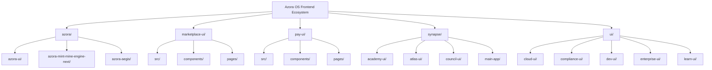
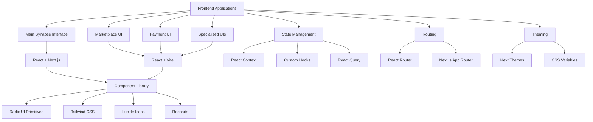
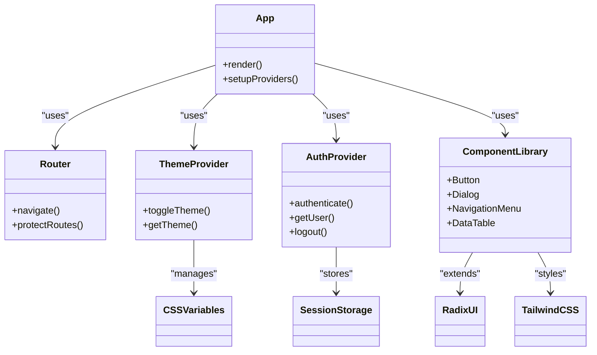
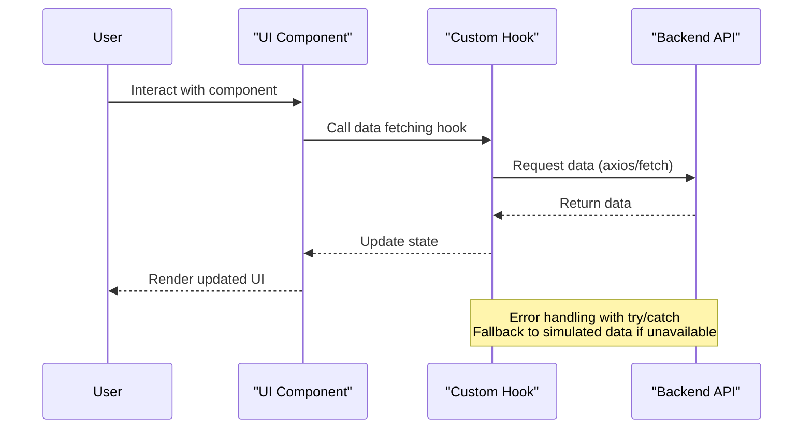
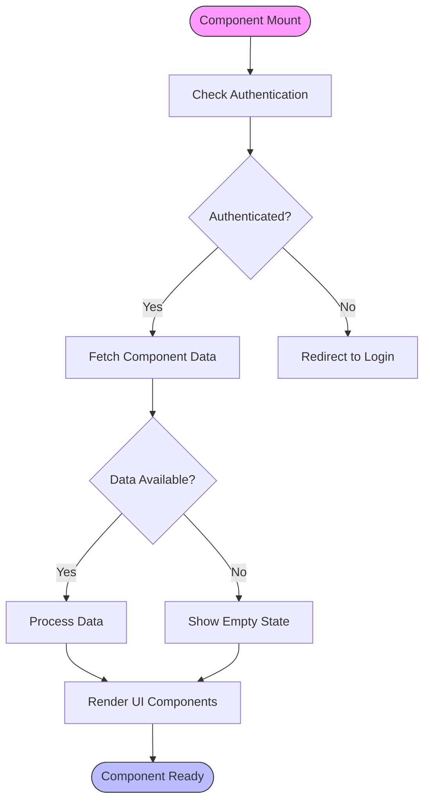

# Frontend Development

<cite>
**Referenced Files in This Document**   
- [App.tsx](file://synapse/src/App.tsx)
- [package.json](file://azora/azora-ui/package.json)
- [package.json](file://marketplace-ui/package.json)
- [package.json](file://pay-ui/package.json)
- [package.json](file://synapse/package.json)
- [package.json](file://ui/package.json)
- [synapse-agent.ts](file://genome/ai-hierarchy/specialized-agents/synapse-agent.ts)
- [AccessibilityPanel.jsx](file://marketplace-ui/src/pages/services/AccessibilityPanel.jsx)
- [KlippPanel.jsx](file://marketplace-ui/src/pages/services/KlippPanel.jsx)
- [theme.js](file://services/azora-synapse/tokens/theme.js)
- [useData.js](file://genome/hooks/useData.js)
</cite>

## Table of Contents
1. [Introduction](#introduction)
2. [Project Structure](#project-structure)
3. [Core Components](#core-components)
4. [Architecture Overview](#architecture-overview)
5. [Detailed Component Analysis](#detailed-component-analysis)
6. [Dependency Analysis](#dependency-analysis)
7. [Performance Considerations](#performance-considerations)
8. [Troubleshooting Guide](#troubleshooting-guide)
9. [Conclusion](#conclusion)

## Introduction
The Azora OS frontend ecosystem is built on React and Next.js, featuring a modular architecture across multiple applications including the main synapse interface, marketplace UI, and payment UI. The system implements a comprehensive design system with shared components, standardized state management, and consistent routing patterns. This documentation provides a comprehensive overview of the frontend development practices, component architecture, and implementation details across the Azora OS platform.

## Project Structure



**Diagram sources**
- [synapse/](file://synapse/)
- [marketplace-ui/](file://marketplace-ui/)
- [pay-ui/](file://pay-ui/)
- [azora/](file://azora/)

**Section sources**
- [synapse/](file://synapse/)
- [marketplace-ui/](file://marketplace-ui/)
- [pay-ui/](file://pay-ui/)
- [azora/](file://azora/)

## Core Components

The frontend architecture is built around reusable components that are shared across multiple applications. The design system is implemented through the azora-ui package, which provides a comprehensive set of UI components based on Radix UI and Tailwind CSS. These components include buttons, dialogs, navigation menus, and data display elements that maintain visual consistency across all Azora OS applications.

State management is handled through React Context API and custom hooks, with global state for authentication and theme preferences. The applications use React Router for navigation, with protected routes for authenticated areas. Each application follows a similar structure with components, pages, and contexts directories, enabling consistent development patterns across the ecosystem.

**Section sources**
- [azora/azora-ui/](file://azora/azora-ui/)
- [marketplace-ui/src/](file://marketplace-ui/src/)
- [pay-ui/src/](file://pay-ui/src/)

## Architecture Overview



**Diagram sources**
- [App.tsx](file://synapse/src/App.tsx)
- [package.json](file://azora/azora-ui/package.json)
- [package.json](file://marketplace-ui/package.json)

## Detailed Component Analysis

### Component Architecture Analysis



**Diagram sources**
- [App.tsx](file://synapse/src/App.tsx)
- [theme.js](file://services/azora-synapse/tokens/theme.js)

#### For API/Service Components:



**Diagram sources**
- [KlippPanel.jsx](file://marketplace-ui/src/pages/services/KlippPanel.jsx)
- [useData.js](file://genome/hooks/useData.js)

#### For Complex Logic Components:



**Diagram sources**
- [AccessibilityPanel.jsx](file://marketplace-ui/src/pages/services/AccessibilityPanel.jsx)
- [KlippPanel.jsx](file://marketplace-ui/src/pages/services/KlippPanel.jsx)

**Section sources**
- [marketplace-ui/src/pages/services/](file://marketplace-ui/src/pages/services/)
- [pay-ui/src/pages/services/](file://pay-ui/src/pages/services/)

## Dependency Analysis

```mermaid
graph TD
A[Frontend Applications] --> B[@radix-ui/react-*]
A --> C[lucide-react]
A --> D[recharts]
A --> E[class-variance-authority]
A --> F[clsx]
A --> G[tailwind-merge]
A --> H[next-themes]
A --> I[@tanstack/react-query]
A --> J[axios]
A --> K[framer-motion]
B --> L[Radix UI Primitives]
C --> M[Lucide Icons]
D --> N[Recharts Visualization]
E --> O[Component Variants]
F --> P[Conditional Classes]
G --> Q[Class Merging]
H --> R[Theme Management]
I --> S[Data Fetching]
J --> T[HTTP Client]
K --> U[Animations]
style A fill:#4B9CD3,stroke:#333
style B fill:#4B9CD3,stroke:#333
style C fill:#4B9CD3,stroke:#333
style D fill:#4B9CD3,stroke:#333
style E fill:#4B9CD3,stroke:#333
style F fill:#4B9CD3,stroke:#333
style G fill:#4B9CD3,stroke:#333
style H fill:#4B9CD3,stroke:#333
style I fill:#4B9CD3,stroke:#333
style J fill:#4B9CD3,stroke:#333
style K fill:#4B9CD3,stroke:#333
```

**Diagram sources**
- [package.json](file://azora/azora-ui/package.json)
- [package.json](file://marketplace-ui/package.json)
- [package.json](file://pay-ui/package.json)
- [package.json](file://synapse/package.json)

**Section sources**
- [package.json](file://azora/azora-ui/package.json)
- [package.json](file://marketplace-ui/package.json)
- [package.json](file://pay-ui/package.json)

## Performance Considerations

The frontend applications implement several performance optimization strategies including code splitting, lazy loading, and efficient state management. The applications use React's built-in optimization features such as memoization and useCallback to prevent unnecessary re-renders. Data fetching is optimized through React Query's caching mechanisms, reducing redundant API calls and improving response times.

Image optimization is achieved through the use of WebP format with appropriate fallbacks, significantly reducing payload sizes. The applications also implement service workers for offline functionality and faster repeat visits, following Progressive Web App patterns. Bundle size is managed through route-based code splitting and dynamic imports for non-critical components.

**Section sources**
- [synapse-agent.ts](file://genome/ai-hierarchy/specialized-agents/synapse-agent.ts)

## Troubleshooting Guide

Common frontend development challenges in the Azora OS ecosystem include state synchronization across components, API integration issues, and responsive design inconsistencies. When encountering state management issues, verify that context providers are properly wrapped around components requiring access to shared state. For API integration problems, check network requests in browser developer tools and ensure proper error handling is implemented.

Responsive design issues can be addressed by using the provided design system components that are built with mobile-first principles. Accessibility compliance can be verified using the accessibility audit tools provided in the system. When adding new components, ensure they follow the established patterns for theming and responsiveness to maintain consistency across the platform.

**Section sources**
- [synapse-agent.ts](file://genome/ai-hierarchy/specialized-agents/synapse-agent.ts)
- [organs/accessibility/index.js](file://organs/accessibility/index.js)

## Conclusion

The Azora OS frontend architecture demonstrates a well-structured approach to building multiple React applications with consistent design and functionality. By leveraging a shared component library, standardized state management patterns, and a unified design system, the platform ensures a cohesive user experience across all interfaces. The modular architecture allows for independent development of specialized applications while maintaining brand consistency and technical standards.