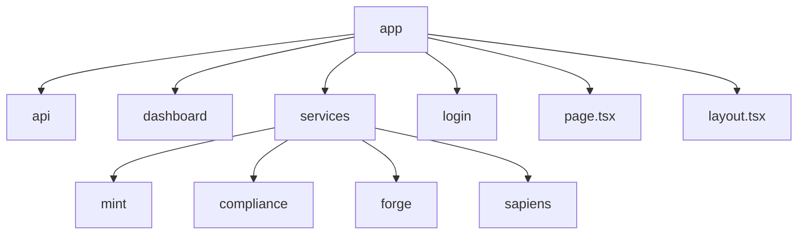
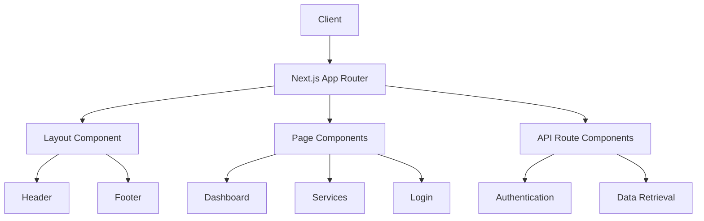
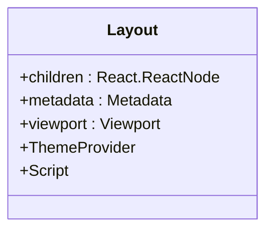
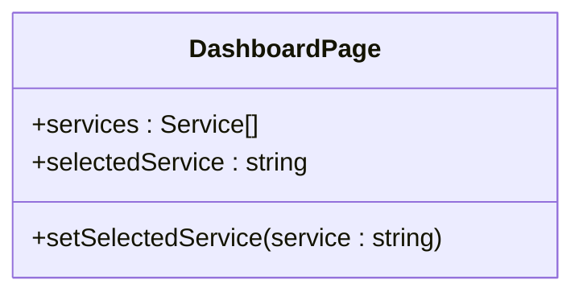
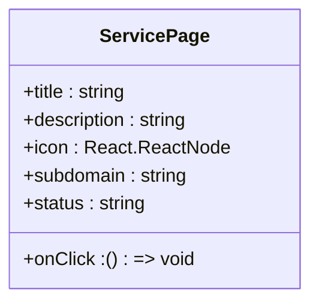
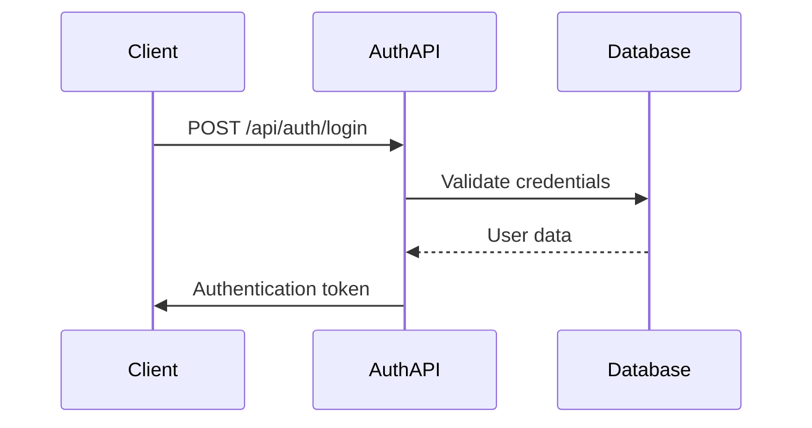
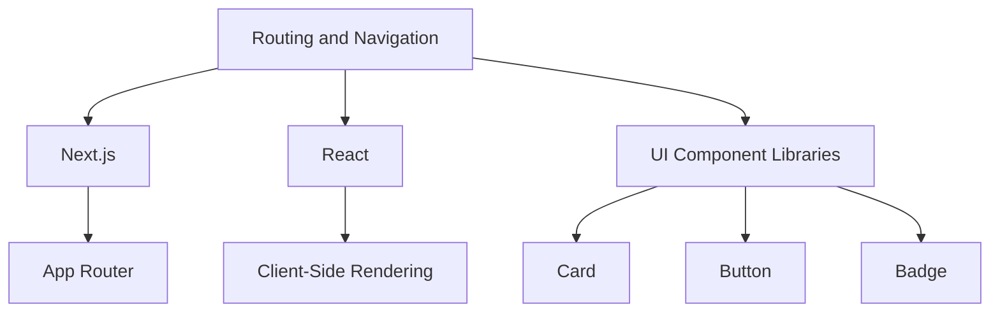

# Routing and Navigation

<cite>
**Referenced Files in This Document**   
- [layout.tsx](file://ui/app/layout.tsx)
- [page.tsx](file://ui/app/page.tsx)
- [dashboard/page.tsx](file://ui/app/dashboard/page.tsx)
- [services/mint/page.jsx](file://ui/app/services/mint/page.jsx)
- [services/compliance/page.jsx](file://ui/app/services/compliance/page.jsx)
- [services/forge/page.jsx](file://ui/app/services/forge/page.jsx)
- [services/sapiens/page.jsx](file://ui/app/services/sapiens/page.jsx)
- [login/page.tsx](file://azora/azora-mint-mine-engine-next/src/app/login/page.tsx)
- [azora-mint-mine-engine-next/src/app/page.tsx](file://azora/azora-mint-mine-engine-next/src/app/page.tsx)
- [api/auth/[...nextauth]/route.ts](file://azora/azora-mint-mine-engine-next/src/app/api/auth/[...nextauth]/route.ts)
</cite>

## Table of Contents
1. [Introduction](#introduction)
2. [Project Structure](#project-structure)
3. [Core Components](#core-components)
4. [Architecture Overview](#architecture-overview)
5. [Detailed Component Analysis](#detailed-component-analysis)
6. [Dependency Analysis](#dependency-analysis)
7. [Performance Considerations](#performance-considerations)
8. [Troubleshooting Guide](#troubleshooting-guide)
9. [Conclusion](#conclusion)

## Introduction
This document provides a comprehensive overview of the routing and navigation system in Azora OS frontend applications. It details the implementation of the Next.js App Router across various frontend applications, including route organization, dynamic routing, and nested layouts. The document explains navigation patterns between different sections of the application and how routing integrates with authentication and authorization. Practical examples of implementing new routes, handling route parameters, and creating navigation menus are included. Additionally, SEO considerations, client-side navigation performance, and error handling for non-existent routes are addressed.

## Project Structure
The Azora OS frontend applications utilize the Next.js App Router for routing and navigation. The project structure is organized into multiple directories, each representing a different frontend application or service. The main routing configuration is located in the `app` directory, which contains the layout and page components for each route.

**Diagram sources**
- [layout.tsx](file://ui/app/layout.tsx)
- [page.tsx](file://ui/app/page.tsx)
- [dashboard/page.tsx](file://ui/app/dashboard/page.tsx)
- [services/mint/page.jsx](file://ui/app/services/mint/page.jsx)
- [services/compliance/page.jsx](file://ui/app/services/compliance/page.jsx)
- [services/forge/page.jsx](file://ui/app/services/forge/page.jsx)
- [services/sapiens/page.jsx](file://ui/app/services/sapiens/page.jsx)

**Section sources**
- [layout.tsx](file://ui/app/layout.tsx)
- [page.tsx](file://ui/app/page.tsx)

## Core Components
The core components of the routing and navigation system in Azora OS frontend applications include the layout, page, and API route components. The layout component defines the overall structure of the application, while the page components define the content for each route. API route components handle server-side logic for authentication and data retrieval.

**Section sources**
- [layout.tsx](file://ui/app/layout.tsx)
- [page.tsx](file://ui/app/page.tsx)
- [api/auth/[...nextauth]/route.ts](file://azora/azora-mint-mine-engine-next/src/app/api/auth/[...nextauth]/route.ts)

## Architecture Overview
The routing and navigation architecture in Azora OS frontend applications is based on the Next.js App Router. The App Router provides a file-based routing system that maps the file structure to the URL structure. This allows for a clean and intuitive organization of routes and components.

**Diagram sources**
- [layout.tsx](file://ui/app/layout.tsx)
- [page.tsx](file://ui/app/page.tsx)
- [api/auth/[...nextauth]/route.ts](file://azora/azora-mint-mine-engine-next/src/app/api/auth/[...nextauth]/route.ts)

## Detailed Component Analysis

### Layout Component Analysis
The layout component is responsible for defining the overall structure of the application. It includes the header, footer, and any other shared UI elements. The layout component is rendered for every route in the application.

**Diagram sources**
- [layout.tsx](file://ui/app/layout.tsx)

**Section sources**
- [layout.tsx](file://ui/app/layout.tsx)

### Page Component Analysis
The page component is responsible for defining the content for each route. Each page component corresponds to a specific URL in the application. The page component can include client-side logic for data fetching and user interaction.

#### Dashboard Page Analysis
The dashboard page provides an overview of the user's activity and key metrics. It includes components for displaying statistics, recent transactions, and quick access to services.

**Diagram sources**
- [dashboard/page.tsx](file://ui/app/dashboard/page.tsx)

**Section sources**
- [dashboard/page.tsx](file://ui/app/dashboard/page.tsx)

#### Service Pages Analysis
The service pages provide detailed information and functionality for each service in the Azora OS ecosystem. Each service page includes components for displaying service-specific data and user interactions.

**Diagram sources**
- [services/mint/page.jsx](file://ui/app/services/mint/page.jsx)
- [services/compliance/page.jsx](file://ui/app/services/compliance/page.jsx)
- [services/forge/page.jsx](file://ui/app/services/forge/page.jsx)
- [services/sapiens/page.jsx](file://ui/app/services/sapiens/page.jsx)

**Section sources**
- [services/mint/page.jsx](file://ui/app/services/mint/page.jsx)
- [services/compliance/page.jsx](file://ui/app/services/compliance/page.jsx)
- [services/forge/page.jsx](file://ui/app/services/forge/page.jsx)
- [services/sapiens/page.jsx](file://ui/app/services/sapiens/page.jsx)

### API Route Component Analysis
The API route components handle server-side logic for authentication and data retrieval. These components are responsible for processing requests and returning responses to the client.

#### Authentication API Route Analysis
The authentication API route handles user authentication and session management. It processes login requests and returns authentication tokens.

**Diagram sources**
- [api/auth/[...nextauth]/route.ts](file://azora/azora-mint-mine-engine-next/src/app/api/auth/[...nextauth]/route.ts)

**Section sources**
- [api/auth/[...nextauth]/route.ts](file://azora/azora-mint-mine-engine-next/src/app/api/auth/[...nextauth]/route.ts)

## Dependency Analysis
The routing and navigation system in Azora OS frontend applications has dependencies on several external libraries and services. These dependencies include Next.js, React, and various UI component libraries.

**Diagram sources**
- [package.json](file://package.json)

**Section sources**
- [package.json](file://package.json)

## Performance Considerations
The routing and navigation system in Azora OS frontend applications is designed to provide a fast and responsive user experience. Client-side navigation is used to minimize page reloads and improve performance. Data fetching is optimized to reduce latency and improve load times.

**Section sources**
- [page.tsx](file://ui/app/page.tsx)
- [dashboard/page.tsx](file://ui/app/dashboard/page.tsx)

## Troubleshooting Guide
Common issues with the routing and navigation system in Azora OS frontend applications include broken links, missing pages, and authentication errors. These issues can be resolved by checking the file structure, ensuring correct route configuration, and verifying authentication tokens.

**Section sources**
- [layout.tsx](file://ui/app/layout.tsx)
- [page.tsx](file://ui/app/page.tsx)
- [api/auth/[...nextauth]/route.ts](file://azora/azora-mint-mine-engine-next/src/app/api/auth/[...nextauth]/route.ts)

## Conclusion
The routing and navigation system in Azora OS frontend applications is built on the Next.js App Router, providing a clean and intuitive organization of routes and components. The system includes layout, page, and API route components that work together to provide a seamless user experience. The integration of authentication and authorization ensures secure access to application features. Performance optimizations and error handling contribute to a reliable and efficient navigation system.